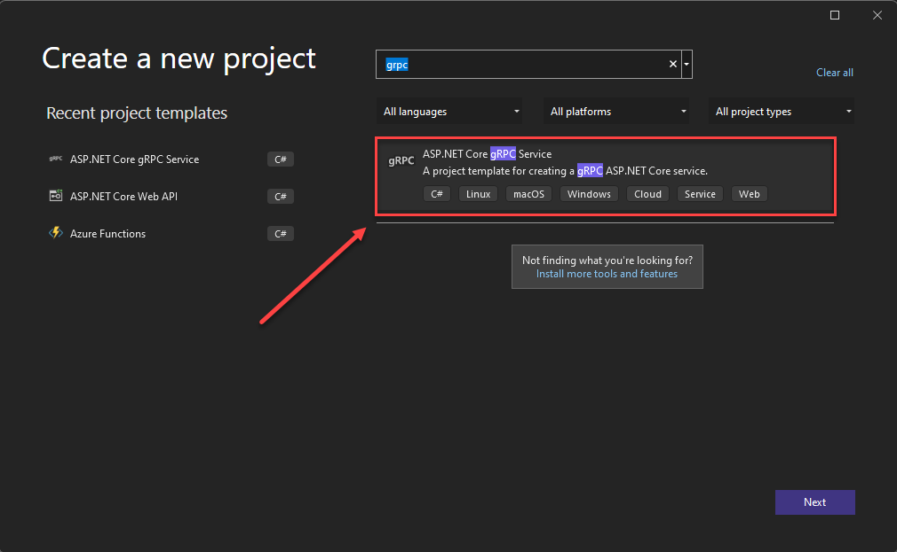
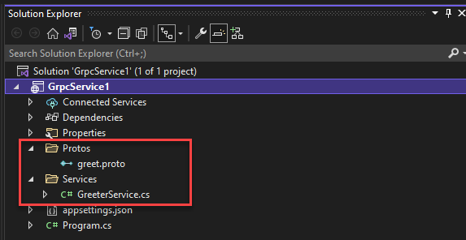

# gRPC

[!INCLUDE [download-alert](../includes/download-alert.md)]

So far in this book, we've focused on [REST-based](/azure/architecture/best-practices/api-design) communication. We've seen that REST is a flexible architectural style that defines CRUD-based operations against entity resources. Clients interact with resources across HTTP with a request/response communication model. While REST is widely implemented, a newer communication technology, gRPC, has gained tremendous momentum across the cloud-native community.

## What is gRPC?

gRPC is a modern, high-performance framework that evolves the age-old [remote procedure call (RPC)](https://en.wikipedia.org/wiki/Remote_procedure_call) protocol. At the application level, gRPC streamlines messaging between clients and back-end services. Originating from Google, gRPC is open source and part of the  [Cloud Native Computing Foundation (CNCF)](https://www.cncf.io/) ecosystem of cloud-native offerings. CNCF considers gRPC an [incubating project](https://github.com/cncf/toc/blob/main/process/graduation_criteria.md). Incubating means end users are using the technology in production applications, and the project has a healthy number of contributors.

A typical gRPC client app will expose a local, in-process function that implements a business operation. Under the covers, that local function invokes another function on a remote machine. What appears to be a local call essentially becomes a transparent out-of-process call to a remote service. The gRPC plumbing abstracts the point-to-point networking communication, serialization, and execution between computers.

In cloud-native applications, developers often work across programming languages, frameworks, and technologies. This *interoperability* complicates message contracts and the plumbing required for cross-platform communication.  gRPC provides a "uniform horizontal layer" that abstracts these concerns. Developers code in their native platform focused on business functionality, while gRPC handles communication plumbing.

gRPC offers comprehensive support across most popular development stacks, including Java, JavaScript, C#, Go, Swift, and NodeJS.

## gRPC Benefits

gRPC uses HTTP/2 for its transport protocol. While compatible with HTTP 1.1, HTTP/2 features many advanced capabilities:

- A binary framing protocol for data transport - unlike HTTP 1.1, which is text based.
- Multiplexing support for sending multiple parallel requests over the same connection - HTTP 1.1 limits processing to one request/response message at a time.
- Bidirectional full-duplex communication for sending both client requests and server responses simultaneously.
- Built-in streaming enabling requests and responses to asynchronously stream large data sets.
- Header compression that reduces network usage.

gRPC is lightweight and highly performant. It can be up to 8x faster than JSON serialization with messages 60-80% smaller. In Microsoft [Windows Communication Foundation (WCF)](../../framework/wcf/whats-wcf.md) parlance, gRPC performance exceeds the speed and efficiency of the highly optimized [NetTCP bindings](/dotnet/api/system.servicemodel.nettcpbinding?view=netframework-4.8&preserve-view=true). Unlike NetTCP, which favors the Microsoft stack, gRPC is cross-platform.

## Protocol Buffers

gRPC embraces an open-source technology called [Protocol Buffers](https://developers.google.com/protocol-buffers/docs/overview). They provide a highly efficient and platform-neutral serialization format for serializing structured messages that services send to each other. Using a cross-platform Interface Definition Language (IDL), developers define a service contract for each microservice. The contract, implemented as a text-based `.proto` file, describes the methods, inputs, and outputs for each service. The same contract file can be used for gRPC clients and services built on different development platforms.

Using the proto file, the Protobuf compiler, `protoc`, generates both client and service code for your target platform. The code includes the following components:

- Strongly typed objects, shared by the client and service, that represent the service operations and data elements for a message.
- A strongly typed base class with the required network plumbing that the remote gRPC service can inherit and extend.
- A client stub that contains the required plumbing to invoke the remote gRPC service.

At run time, each message is serialized as a standard Protobuf representation and exchanged between the client and remote service. Unlike JSON or XML, Protobuf messages are serialized as compiled binary bytes.

## gRPC support in .NET

gRPC is integrated into .NET Core 3.0 SDK and later. The following tools support it:

- Visual Studio 2022 with the ASP.NET and web development workload installed
- Visual Studio Code
- The `dotnet` CLI

The SDK includes tooling for endpoint routing, built-in IoC, and logging. The open-source Kestrel web server supports HTTP/2 connections. Figure 6-20 shows a Visual Studio 2022 template that scaffolds a skeleton project for a gRPC service. Note how .NET fully supports Windows, Linux, and macOS.



**Figure 6-18**. gRPC support in Visual Studio 2022
  
Figure 6-19 shows the skeleton gRPC service generated from the built-in scaffolding included in Visual Studio 2022.  



**Figure 6-19**. gRPC project in Visual Studio 2022

In the previous figure, note the proto description file and service code. As you'll see shortly, Visual Studio generates additional configuration in both the Startup class and underlying project file.

## gRPC usage

Favor gRPC for the following scenarios:

- Synchronous backend microservice-to-microservice communication where an immediate response is required to continue processing.
- Polyglot environments that need to support mixed programming platforms.
- Low latency and high throughput communication where performance is critical.
- Point-to-point real-time communication - gRPC can push messages in real time without polling and has excellent support for bi-directional streaming.
- Network constrained environments – binary gRPC messages are always smaller than an equivalent text-based JSON message.

At the time, of this writing, gRPC is primarily used with backend services. Modern browsers can't provide the level of HTTP/2 control required to support a front-end gRPC client. That said, there's support for [gRPC-Web with .NET](https://devblogs.microsoft.com/aspnet/grpc-web-for-net-now-available/) that enables gRPC communication from browser-based apps built with JavaScript or Blazor WebAssembly technologies. [gRPC-Web](https://github.com/grpc/grpc/blob/master/doc/PROTOCOL-WEB.md) enables an ASP.NET Core gRPC app to support gRPC features in browser apps:

- Strongly typed, code-generated clients
- Compact Protobuf messages
- Server streaming

## gRPC implementation

The microservice reference architecture, [eShop Reference Application](https://github.com/dotnet/eShop), from Microsoft, shows how to implement gRPC services in .NET applications.


**Figure 6-20**. Backend architecture for eShop application

The eShop App Workshop adds gRPC as a worked example in the [Add shopping basket capabilities to the web site lab](https://github.com/dotnet-presentations/eshop-app-workshop/tree/main/labs/4-Add-Shopping-Basket)

In the previous figure, note how eShop embraces the [Backend for Frontends pattern](https://learn.microsoft.com/azure/architecture/patterns/backends-for-frontends) (BFF) by exposing multiple API gateways.

gRPC communication requires both client and server components. The client makes synchronous gRPC calls to backend microservices, each of which implement a gRPC server. Both the client and server take advantage of the built-in gRPC plumbing from the .NET SDK. Client-side *stubs* provide the plumbing to invoke remote gRPC calls. Server-side components provide gRPC plumbing that custom service classes can inherit and consume.

Microservices that expose both a RESTful API and gRPC communication require multiple endpoints to manage traffic. You would open an endpoint that listens for HTTP traffic for the RESTful calls and another for gRPC calls. The gRPC endpoint must be configured for the HTTP/2 protocol that is required for gRPC communication.

While we strive to decouple microservices with asynchronous communication patterns, some operations require direct calls. gRPC should be the primary choice for direct synchronous communication between microservices. Its high-performance communication protocol, based on HTTP/2 and protocol buffers, make it a perfect choice.

## gRPC in .NET Aspire

If you have a gRPC server in a .NET Aspire solution and you want to call it from other microservices, you can use the `AddGrpcClient` extension method to create a gRPC client in the App Host and then pass it to the microservices that use it:

```csharp
builder.Services.AddGrpcClient<CatalogApiHttpClientProvider>(
    static client=> client.BaseAddress = new("https://catalogapi"))
    .ConfigurePrimaryHttpMessageHandler(
    () => new GrpcWebHandler(new HttpClientHandler()));
```

In the microservices, get the gRPC client from dependency injection and use it to send messages to the gRPC server microservice.

## Looking ahead

Looking ahead, gRPC will continue to gain traction for cloud-native systems. The performance benefits and ease of development are compelling. However, REST will likely be around for a long time. It excels for publicly exposed APIs and for backward compatibility reasons.

>[!div class="step-by-step"]
>[Previous](service-to-service-communication.md)
>[Next](service-mesh-communication-infrastructure.md)
