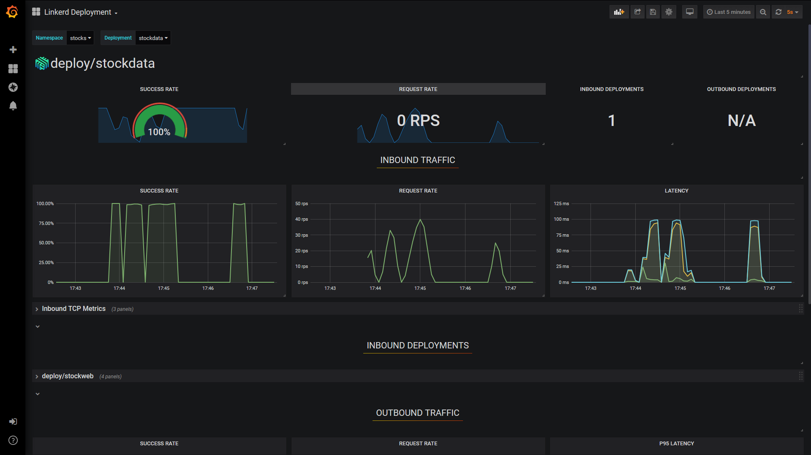

# Application Performance Management

In production environments like Kubernetes, it's important to monitor applications to ensure they're running optimally. Logging and metrics are important in particular. ASP.NET Core, including gRPC, provides built-in support for producing and managing log messages and metrics data, as well as *tracing* data.

## The difference between logging and metrics

*Logging* is concerned with text messages that record detailed information about things that have happened in the system. Log messages might include exception data, like stack traces, or structured data that provide context about the message. Logging output is commonly written to a searchable text store.

*Metrics* refers to numeric data designed to be aggregated and presented by using charts and graphs in a dashboard. The dashboard provides a view of the overall health and performance of an application. Metrics data can also be used to trigger automated alerts when a threshold is exceeded. Here are some examples of metrics data:

- Time taken to process requests.
- The number of requests per second being handled by an instance of a service.
- The number of failed requests on an instance.

## Logging in ASP.NET Core gRPC

ASP.NET Core provides built-in support for logging, in the form of [Microsoft.Extensions.Logging](https://www.nuget.org/packages/Microsoft.Extensions.Logging) NuGet package. The core parts of this library are included with the Web SDK, so there's no need to install it manually. By default, log messages are written to the standard output (the "console") and to any attached debugger. To write logs to persistent external data stores, you might need to import [optional logging sink packages](/aspnet/core/fundamentals/logging/?view=aspnetcore-3.0#third-party-logging-providers&preserve-view=false).

The ASP.NET Core gRPC framework writes detailed diagnostic logging messages to this logging framework, so they can be processed and stored along with your application's own messages.

### Produce log messages

The logging extension is automatically registered with ASP.NET Core's dependency injection system, so you can specify loggers as a constructor parameter on gRPC service types.

```csharp
public class StockData : Stocks.StocksBase
{
    private readonly ILogger<StockData> _logger;

    public StockData(ILogger<StockData> logger)
    {
        _logger = logger;
    }
}
```

Many log messages, such as requests and exceptions, are provided by the ASP.NET Core and gRPC framework components. Add your own log messages to provide detail and context about application logic, rather than lower-level concerns.

For more information about writing log messages and available logging sinks and targets, see  [Logging in .NET Core and ASP.NET Core](/aspnet/core/fundamentals/logging/).

## Metrics in ASP.NET Core gRPC

The .NET Core runtime provides a set of components for emitting and observing metrics. These include APIs such as the <xref:System.Diagnostics.Tracing.EventSource> and <xref:System.Diagnostics.Tracing.EventCounter> classes. These APIs can emit basic numeric data that can be consumed by external processes, like the [dotnet-counters global tool](../../core/diagnostics/dotnet-counters.md), or Event Tracing for Windows. For more information about using `EventCounter` in your own code, see [EventCounter introduction](https://github.com/dotnet/runtime/blob/main/src/libraries/System.Diagnostics.Tracing/documentation/EventCounterTutorial.md).

For more advanced metrics and for writing metric data to a wider range of data stores, you might try an open-source project called [App Metrics](https://www.app-metrics.io). This suite of libraries provides an extensive set of types to instrument your code. It also offers packages to write metrics to different kinds of targets that include time-series databases, such as Prometheus and InfluxDB, and [Application Insights](/azure/azure-monitor/app/app-insights-overview). The [App.Metrics.AspNetCore.Mvc](https://www.nuget.org/packages/App.Metrics.AspNetCore.Mvc/) NuGet package even adds a comprehensive set of basic metrics that are automatically generated via integration with the ASP.NET Core framework. The project website provides [templates](https://www.app-metrics.io/samples/grafana/) for displaying those metrics with the [Grafana](https://grafana.com/) visualization platform.

### Produce metrics

Most metrics platforms support the following types:

| Metric type | Description |
| ----------- | ----------- |
| Counter     | Tracks how often something happens, such as requests and errors. |
| Gauge       | Records a single value that changes over time, such as active connections. |
| Histogram   | Measures a distribution of values across arbitrary limits. For example, a histogram can track dataset size, counting how many contained <10 records, how many contained 11-100 records, how many contained 101-1000 records, and how many contained >1000 records. |
| Meter       | Measures the rate at which an event occurs in various time spans. |
| Timer       | Tracks the duration of events and the rate at which it occurs, stored as a histogram. |

By using *App Metrics*, an `IMetrics` interface can be obtained via dependency injection, and used to record any of these metrics for a gRPC service. The following example shows how to count the number of `Get` requests made over time:

```csharp
public class StockData : Stocks.StocksBase
{
    private static readonly CounterOptions GetRequestCounter = new CounterOptions
    {
        Name = "StockData_Get_Requests",
        MeasurementUnit = Unit.Calls
    };

    private readonly IStockRepository _repository;
    private readonly IMetrics _metrics;

    public StockData(IStockRepository repository, IMetrics metrics)
    {
        _repository = repository;
        _metrics = metrics;
    }

    public override async Task<GetResponse> Get(GetRequest request, ServerCallContext context)
    {
        _metrics.Measure.Counter.Increment(GetRequestCounter);

        // Serve request...
    }
}
```

### Store and visualize metrics data

The best way to store metrics data is in a *time-series database*, a specialized data store designed to record numerical data series marked with timestamps. The most popular of these databases are [Prometheus](https://prometheus.io/) and [InfluxDB](https://www.influxdata.com/products/influxdb-overview/). Microsoft Azure also provides dedicated metrics storage through the [Azure Monitor](/azure/azure-monitor/overview) service.

The current go-to solution for visualizing metrics data is [Grafana](https://grafana.com), which works with a wide range of storage providers. The following image shows an example Grafana dashboard that displays metrics from the Linkerd service mesh running the StockData sample:



### Metrics-based alerting

The numerical nature of metrics data means that it's ideally suited to drive alerting systems, notifying developers or support engineers when a value falls outside of some defined tolerance. The platforms already mentioned all provide support for alerting via a range of options, including emails, text messages, or in-dashboard visualizations.

## Distributed tracing

Distributed tracing is a relatively recent development in monitoring, which has arisen from the increasing use of microservices and distributed architectures. A single request from a client browser, application, or device can be broken down into many steps and sub-requests, and involve the use of many services across a network. This activity makes it difficult to correlate log messages and metrics with the specific request that triggered them. Distributed tracing applies identifiers to requests, and allows logs and metrics to be correlated with a particular operation. This tracing is similar to [WCF's end-to-end tracing](../../framework/wcf/diagnostics/tracing/end-to-end-tracing.md), but it's applied across multiple platforms.

Distributed tracing has grown quickly in popularity and is beginning to standardize. The Cloud Native Computing Foundation created the [Open Tracing standard](https://opentracing.io), attempting to provide vendor-neutral libraries for working with back ends like [Jaeger](https://www.jaegertracing.io/) and [Elastic APM](https://www.elastic.co/products/apm). At the same time, Google created the [OpenCensus project](https://opencensus.io/) to address the same set of problems. These two projects are merging into a new project, [OpenTelemetry](https://opentelemetry.io), which aims to be the industry standard of the future.

### How distributed tracing works

Distributed tracing is based on the concept of *spans*: named, timed operations that are part of a single *trace*, which can involve processing on multiple nodes of a system. When a new operation is initiated, a trace is created with a unique identifier. For each sub-operation, a span is created with its own identifier and trace identifier. As the request passes around the system, various components can create *child* spans that include the identifier of their *parent*. A span has a *context*, which contains the trace and span identifiers, as well as useful data in the form of key and value pairs (called *baggage*).

### Distributed tracing with `DiagnosticSource`

.NET has an internal module that maps well to distributed traces and spans: [DiagnosticSource](https://github.com/dotnet/runtime/blob/main/src/libraries/System.Diagnostics.DiagnosticSource/src/DiagnosticSourceUsersGuide.md#diagnosticsource-users-guide). As well as providing a simple way to produce and consume diagnostics within a process, the `DiagnosticSource` module has the concept of an *activity*. An activity is effectively an implementation of a distributed trace, or a span within a trace. The internals of the module take care of parent/child activities, including allocating identifiers. For more information about using the `Activity` type, see the [Activity User Guide on GitHub](https://github.com/dotnet/runtime/blob/main/src/libraries/System.Diagnostics.DiagnosticSource/src/ActivityUserGuide.md#activity-user-guide).

Because `DiagnosticSource` is a part of the core framework and later, it's supported by several core components. These include <xref:System.Net.Http.HttpClient>, Entity Framework Core, and ASP.NET Core, including explicit support in the gRPC framework. When ASP.NET Core receives a request, it checks for a pair of HTTP headers matching the [W3C Trace Context](https://www.w3.org/TR/trace-context) standard. If the headers are found, an activity is started by using the identity values and context from the headers. If no headers are found, an activity is started with generated identity values that match the standard format. Any diagnostics generated by the framework or by application code during the lifetime of this activity can be tagged with the trace and span identifiers. The `HttpClient` support extends this functionality further by checking for a current activity on every request, and automatically adding the trace headers to the outgoing request.

The ASP.NET Core gRPC client and server libraries include explicit support for `DiagnosticSource` and `Activity`, and create activities and apply and use header information automatically.

> [!NOTE]
> All of this happens only if a listener is consuming the diagnostic information. If there's no listener, no diagnostics are written and no activities are created.

### Add your own `DiagnosticSource` and `Activity`

To add your own diagnostics or create explicit spans within your application code, see the [DiagnosticSource User Guide](https://github.com/dotnet/runtime/blob/main/src/libraries/System.Diagnostics.DiagnosticSource/src/DiagnosticSourceUsersGuide.md#instrumenting-with-diagnosticsourcediagnosticlistener) and [Activity User Guide](https://github.com/dotnet/runtime/blob/main/src/libraries/System.Diagnostics.DiagnosticSource/src/ActivityUserGuide.md#activity-usage).

### Store distributed trace data

At the time of writing, the OpenTelemetry project is still in the early stages, and only alpha-quality packages are available for .NET applications. The OpenTracing project currently offers more mature libraries.

The OpenTracing API is described in the following section. If you want to use the OpenTelemetry API in your application instead, refer to the [OpenTelemetry .NET SDK repository](https://github.com/open-telemetry/opentelemetry-dotnet) on GitHub.

#### Use the OpenTracing package to store distributed trace data

The [OpenTracing NuGet package](https://www.nuget.org/packages/OpenTracing/) supports all OpenTracing-compliant back ends (which can be used independently of `DiagnosticSource`). There's an additional package from the OpenTracing API Contributions project, [OpenTracing.Contrib.NetCore](https://www.nuget.org/packages/OpenTracing.Contrib.NetCore/). This package adds a `DiagnosticSource` listener, and writes events and activities to a back end automatically. Enabling this package is as simple as installing it from NuGet and adding it as a service in your `Program` class.

```csharp
//

builder.Services.AddOpenTracing();

//
```

The OpenTracing package is an abstraction layer, and as such it requires implementation specific to the back end. OpenTracing API implementations are available for the following open source back ends.

| Name | Package | Website |
| ---- | ------- | -------- |
| Jaeger | [Jaeger](https://www.nuget.org/packages/Jaeger/) | [jaegertracing.io](https://jaegertracing.io) |
| Elastic APM | [Elastic.Apm.NetCoreAll](https://www.nuget.org/packages/Elastic.Apm.NetCoreAll/) | [elastic.co/products/apm](https://www.elastic.co/products/apm) |

For more information on the OpenTracing API for .NET, see the [OpenTracing for C#](https://github.com/opentracing/opentracing-csharp) and the [OpenTracing Contrib C#/.NET Core](https://github.com/opentracing-contrib/csharp-netcore) repositories on GitHub.

>[!div class="step-by-step"]
>[Previous](load-balancing.md)
>[Next](appendix.md)
