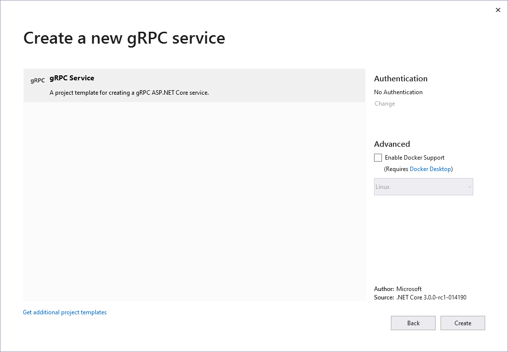

# Create a new ASP.NET Core gRPC project

.NET Core comes with a powerful CLI tool, `dotnet`, which enables you to create and manage projects and solutions from the command line. The tool is closely integrated with Visual Studio, so everything is also available through the familiar GUI interface. This chapter will show both ways to create a new ASP.NET Core gRPC project: first with Visual Studio, then with the .NET Core CLI.

## Create the project using Visual Studio

> [!IMPORTANT]
> To develop any ASP.NET Core 3.0 app, you need Visual Studio 2019.3 or later with the **ASP.NET and web development** workload installed.

Create an empty solution called **TraderSys** from the *Blank Solution* template. Add a Solution Folder called `src`, then right-click on the folder and choose **Add** > **New Project** from the context menu. Enter `grpc` in the template search box and you should see a project template called `gRPC Service`.


Click **Next** to continue to the **Configure project** dialog and name the project `TraderSys.Portfolios`, and add an `src` subdirectory to the **Location**.


Click **Next** to continue to the **New gRPC project** dialog.



At present, there are limited options for the service creation. Docker will be introduced later in the book, so leave that checkbox unchecked for now and just click **Create**. Your first ASP.NET Core 3.0 gRPC project is generated and added to the solution. If you don't want to know about working with the `dotnet CLI`, skip to the [Clean up the example code](#clean-up-the-example-code) section.

## Create the project using the .NET Core CLI

This section covers the creation of solutions and projects from the command line.

Create the solution as shown below. The `-o` (or `--output`) flag specifies the output directory, which will be created in the current directory if it does not exist. The solution will be given the same name as the directory, i.e. `TraderSys.sln`. You can provide a different name using the `-n` (or `--name`) flag.

```dotnetcli
dotnet new sln -o TraderSys
cd TraderSys
```

ASP.NET Core 3.0 comes with a CLI template for gRPC services. Create the new project using this template, putting it into an `src` subdirectory as is the convention for ASP.NET Core projects. The project will be named after the directory (i.e. `TraderSys.Portfolios.csproj`) unless you specify a different name with the `-n` flag.

```dotnetcli
dotnet new grpc -o src/TraderSys.Portfolios
```

Finally, add the project to the solution using the `dotnet sln` command.

```dotnetcli
dotnet sln add src/TraderSys.Portfolios
```

> [!TIP]
> Since the given directory only contains a single `.csproj` file, you can get away with specifying just the directory to save typing.

You can now open this solution in Visual Studio 2019, Visual Studio Code, or whatever editor you prefer.

## Clean up the example code

You've now created an example service using the gRPC template, which was reviewed earlier in the book. This isn't useful in our stock trading context, so we'll edit things for our first project.

### Rename and edit the proto file

Go ahead and rename the `Protos/greet.proto` file to `Protos/portfolios.proto` and open it in your editor. Delete everything after the `package` line, then change the `option csharp_namespace`, `package` and `service` names, and remove the default `SayHello` service, so the code looks like this.

```protobuf
syntax = "proto3";

option csharp_namespace = "TraderSys.Portfolios.Protos";

package PortfolioServer;

service Portfolios {
  // RPCs will go here
}
```

> [!TIP]
> The template doesn't add the `Protos` namespace part by default, but adding it makes it easier to keep gRPC-generated classes and your own classes clearly separated in your code.

If you rename the `greet.proto` file in an integrated development environment (IDE) like Visual Studio, a reference to this file is automatically updated in the `.csproj` file. But in some other editor, such as Visual Studio Code, this reference isn't updated automatically, so you need to edit the project file manually.

In the gRPC build targets, there's a `Protobuf` item element that lets you specify which `.proto` files should be compiled and which form of code generation is required (that is, "Server" or "Client").

```xml
<ItemGroup>
  <Protobuf Include="Protos\portfolios.proto" GrpcServices="Server" />
</ItemGroup>
```

### Rename the GreeterService class

The `GreeterService` class is in the `Services` folder and inherits from `Greeter.GreeterBase`. Rename it to `PortfolioService` and change the base class to `Portfolios.PortfoliosBase`. Delete the `override` methods.

```csharp
public class PortfolioService : Portfolios.PortfoliosBase
{
}
```

There was a reference to the `GreeterService` class in the `Configure` method in the `Startup` class. If you used refactoring to rename the class, this reference should have been updated automatically. However, if you didn't, you need to edit it manually.

```csharp
public void Configure(IApplicationBuilder app, IWebHostEnvironment env)
{
    if (env.IsDevelopment())
    {
        app.UseDeveloperExceptionPage();
    }

    app.UseRouting();

    app.UseEndpoints(endpoints =>
    {
        endpoints.MapGrpcService<PortfolioService>();
    });
}
```

In the next section, we'll add functionality to this new service.

>[!div class="step-by-step"]
>[Previous](migrate-wcf-to-grpc.md)
>[Next](migrate-request-reply.md)
