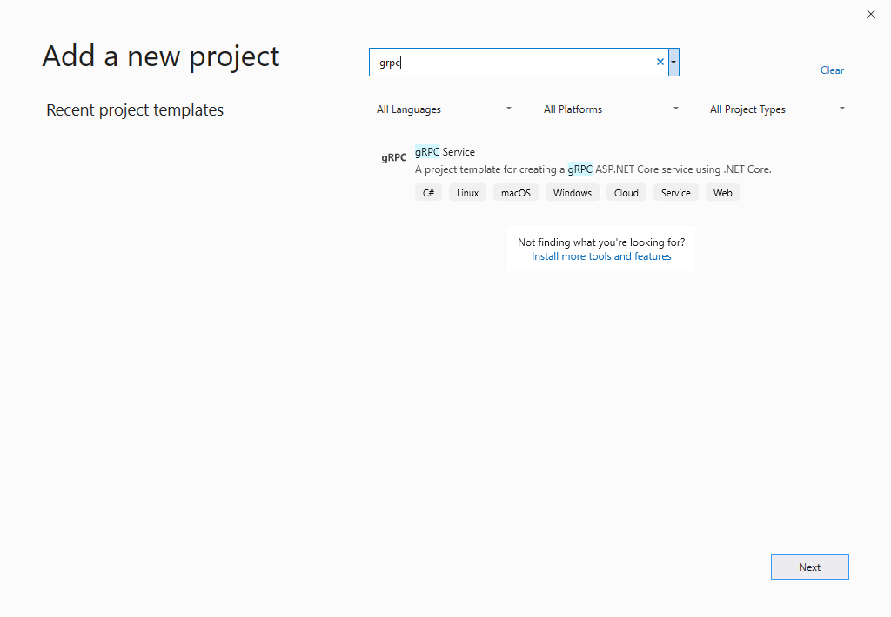
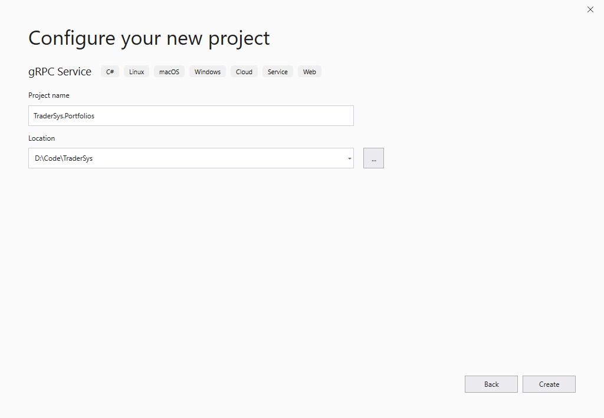
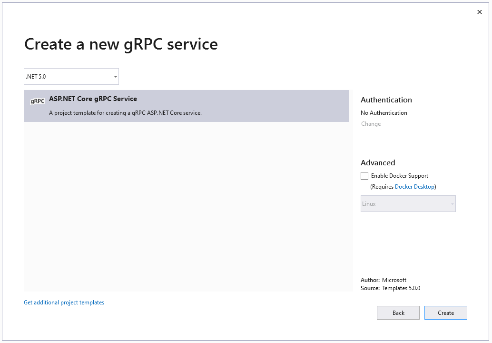

# Create a new ASP.NET Core gRPC project

The .NET SDK comes with a powerful CLI tool, `dotnet`, which enables you to create and manage projects and solutions from the command line. The SDK is closely integrated with Visual Studio, so everything is also available through the familiar graphical user interface. This chapter shows both ways to create a new ASP.NET Core gRPC project.

## Create the project by using Visual Studio

> [!IMPORTANT]
> To develop any ASP.NET Core 6.0 app, you need Visual Studio 2022, with the **ASP.NET and web development** workload installed.

Create an empty solution called **TraderSys** from the *Blank Solution* template. Add a solution folder called `src`. Then, right-click on the folder and choose **Add** > **New Project**. Enter `grpc` in the template search box, and you should see a project template called `gRPC Service`.



Select **Next** to continue to the **Configure your new project** dialog box. Name the project `TraderSys.Portfolios` and add an `src` subdirectory to the **Location**.



Select **Next** to continue to the **Create a new gRPC service** dialog box.



At present, you have limited options for the service creation. Docker will be introduced later, so for now, leave that option unselected. Just select **Create**. Your first ASP.NET Core 6.0 gRPC project is generated and added to the solution. If you don't want to know about working with the `dotnet CLI`, skip to the [Clean up the example code](#clean-up-the-example-code) section.

## Create the project by using the .NET CLI

This section covers the creation of solutions and projects from the command line.

Create the solution as shown in the following command. The `-o` (or `--output`) flag specifies the output directory, which is created in the current directory if it doesn't already exist. The solution has the same name as the directory: `TraderSys.sln`. You can provide a different name by using the `-n` (or `--name`) flag.

```dotnetcli
dotnet new sln -o TraderSys
cd TraderSys
```

ASP.NET Core 6.0 comes with a CLI template for gRPC services. Create the new project by using this template, putting it into an `src` subdirectory as is conventional for ASP.NET Core projects. The project is named after the directory (`TraderSys.Portfolios.csproj`), unless you specify a different name with the `-n` flag.

```dotnetcli
dotnet new grpc -o src/TraderSys.Portfolios
```

Finally, add the project to the solution by using the `dotnet sln` command:

```dotnetcli
dotnet sln add src/TraderSys.Portfolios
```

> [!TIP]
> Because the particular directory only contains a single `.csproj` file, you can specify just the directory, to save typing.

You can now open this solution in Visual Studio 2022, Visual Studio Code, or whatever editor you prefer.

## Clean up the example code

You've now created an example service by using the gRPC template, which was reviewed earlier in the book. This code isn't useful in our stock trading context, so we'll edit things for our first project.

### Rename and edit the proto file

Go ahead and rename the `Protos/greet.proto` file to `Protos/portfolios.proto`, and open it in your editor. Delete everything after the `package` line. Then change the `option csharp_namespace`, `package` and `service` names, and remove the default `SayHello` service. The code now looks like the following:

```protobuf
syntax = "proto3";

option csharp_namespace = "TraderSys.Portfolios.Protos";

package PortfolioServer;

service Portfolios {
  // RPCs will go here
}
```

> [!TIP]
> The template doesn't add the `Protos` namespace part by default, but adding it makes it easier to keep gRPC-generated classes and your own classes clearly separated in your code.

If you rename the `greet.proto` file in an integrated development environment (IDE) like Visual Studio, a reference to this file is automatically updated in the `.csproj` file. But in some other editor, such as Visual Studio Code, this reference isn't updated automatically, so you need to edit the project file manually.

In the gRPC build targets, there's a `Protobuf` item element that lets you specify which `.proto` files should be compiled, and which form of code generation is required (that is, "Server" or "Client").

```xml
<ItemGroup>
  <Protobuf Include="Protos\portfolios.proto" GrpcServices="Server" />
</ItemGroup>
```

### Rename the `GreeterService` class

The `GreeterService` class is in the `Services` folder and inherits from `Greeter.GreeterBase`. Rename it to `PortfolioService`, and change the base class to `Portfolios.PortfoliosBase`. Delete the `override` methods.

```csharp
public class PortfolioService : Protos.Portfolios.PortfoliosBase
{
}
```

There was a reference to the `GreeterService` class in the _Program.cs_. If you used refactoring to rename the class, this reference should have been updated automatically. However, if you didn't, you need to edit it manually.

```csharp
using TraderSys.Portfolios.Services;

var builder = WebApplication.CreateBuilder(args);

// Add services to the container.

builder.Services.AddGrpc();

var app = builder.Build();

// Configure the HTTP request pipeline.
app.MapGrpcService<PortfolioService>();
app.MapGet("/", () => "Communication with gRPC endpoints must be made through a gRPC client. To learn how to create a client, visit: https://go.microsoft.com/fwlink/?linkid=2086909");

app.Run();
```

In the next section, we'll add functionality to this new service.

>[!div class="step-by-step"]
>[Previous](migrate-wcf-to-grpc.md)
>[Next](migrate-request-reply.md)
