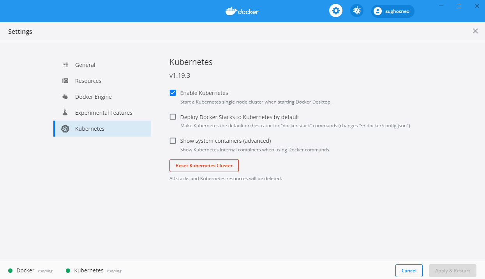
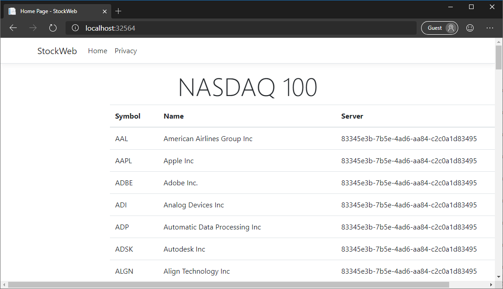

# Kubernetes

Although it's possible to run containers manually on Docker hosts, for reliable production systems it's better to use a container orchestration engine to manage multiple instances running across several servers in a cluster. There are various container orchestration engines available, including Kubernetes, Docker Swarm, and Apache Mesos. But of these engines, Kubernetes is far and away the most widely used, so it will be the focus of this chapter.

Kubernetes includes the following functionality:

- **Scheduling** runs containers on multiple nodes within a cluster, ensuring balanced usage of the available resource, keeping containers running if there are outages, and handling rolling updates to new versions of images or new configurations.
- **Health checks** monitor containers to ensure continued service.
- **DNS & service discovery** handles routing between services within a cluster.
- **Ingress** exposes selected services externally and generally provides load-balancing across instances of those services.
- **Resource management** attaches external resources like storage to containers.

This chapter will detail how to deploy an ASP.NET Core gRPC service and a website that consumes the service into a Kubernetes cluster. The sample application used is available in the [dotnet-architecture/grpc-for-wcf-developers](https://github.com/dotnet-architecture/grpc-for-wcf-developers/tree/main/KubernetesSample) repository on GitHub.

## Kubernetes terminology

Kubernetes uses *desired state configuration*: the API is used to describe objects like *Pods*, *Deployments*, and *Services*, and the *Control Plane* takes care of implementing the desired state across all the *nodes* in a *cluster*. A Kubernetes cluster has a *Master* node that runs the *Kubernetes API*, which you can communicate with programmatically or by using the `kubectl` command-line tool. `kubectl` can create and manage objects through command-line arguments, but it works best with YAML files that contain declaration data for Kubernetes objects.

### Kubernetes YAML files

Every Kubernetes YAML file will have at least three top-level properties:

```yaml
apiVersion: v1
kind: Namespace
metadata:
  # Object properties
```

The `apiVersion` property is used to specify which version (and which API) the file is intended for. The `kind` property specifies the kind of object the YAML represents. The `metadata` property contains object properties like `name`, `namespace`, and `labels`.

Most Kubernetes YAML files will also have a `spec` section that describes the resources and configuration necessary to create the object.

### Pods

Pods are the basic units of execution in Kubernetes. They can run multiple containers, but they're also used to run single containers. The pod also includes any storage resources required by the containers, and the network IP address.

### Services

Services are meta-objects that describe Pods (or sets of Pods) and provide a way to access them within the cluster, such as mapping a service name to a set of pod IP addresses by using the cluster DNS service.

### Deployments

Deployments are the *desired state* objects for Pods. If you create a pod manually, it won't be restarted when it terminates. Deployments are used to tell the cluster which Pods, and how many replicas of those Pods, should be running at the present time.

### Other objects

Pods, Services, and Deployments are just three of the most basic object types. There are dozens of other object types that are managed by Kubernetes clusters. For more information, see the [Kubernetes Concepts](https://kubernetes.io/docs/concepts/) documentation.

### Namespaces

Kubernetes clusters are designed to scale to hundreds or thousands of nodes and to run similar numbers of services. To avoid clashes between object names, namespaces are used to group objects together as part of larger applications. Kubernetes's own services run in a `default` namespace. All user objects should be created in their own namespaces to avoid potential clashes with default objects or other tenants in the cluster.

## Get started with Kubernetes

If you're running Docker Desktop for Windows or Docker Desktop for Mac, Kubernetes is already available. Just enable it in the **Kubernetes** section of the **Settings** window:



To run a local Kubernetes cluster on Linux, consider [minikube](https://github.com/kubernetes/minikube), or [MicroK8s](https://microk8s.io/) if your Linux distribution supports [snaps](https://snapcraft.io/).

To confirm that your cluster is running and accessible, run the `kubectl version` command:

```console
kubectl version
Client Version: version.Info{Major:"1", Minor:"19", GitVersion:"v1.19.3", GitCommit:"1e11e4a2108024935ecfcb2912226cedeafd99df", GitTreeState:"clean", BuildDate:"2020-10-14T12:50:19Z", GoVersion:"go1.15.2", Compiler:"gc", Platform:"windows/amd64"}
Server Version: version.Info{Major:"1", Minor:"19", GitVersion:"v1.19.3", GitCommit:"1e11e4a2108024935ecfcb2912226cedeafd99df", GitTreeState:"clean", BuildDate:"2020-10-14T12:41:49Z", GoVersion:"go1.15.2", Compiler:"gc", Platform:"linux/amd64"}
```

In this example, both the `kubectl` CLI and the Kubernetes server are running version 1.14.6. Each version of `kubectl` is supposed to support the previous and next version of the server, so `kubectl` 1.14 should work with server versions 1.13 and 1.15 as well.

## Run services on Kubernetes

The sample application has a `kube` directory that contains three YAML files. The `namespace.yml` file declares a custom namespace: `stocks`. The `stockdata.yml` file declares the Deployment and the Service for the gRPC application, and the `stockweb.yml` file declares the Deployment and Service for an ASP.NET Core 6.0 MVC web application that consumes the gRPC service.

To use a `YAML` file with `kubectl`, run the `apply -f` command:

```console
kubectl apply -f object.yml
```

The `apply` command will check the validity of the YAML file and display any errors received from the API, but doesn't wait until all the objects declared in the file have been created because this step can take some time. Use the `kubectl get` command with the relevant object types to check on object creation in the cluster.

### The namespace declaration

Namespace declaration is simple and requires only assigning a `name`:

```yaml
apiVersion: v1
kind: Namespace
metadata:
  name: stocks
```

Use `kubectl` to apply the `namespace.yml` file and to confirm the namespace is created successfully:

```console
> kubectl apply -f namespace.yml
namespace/stocks created

> kubectl get namespaces
NAME              STATUS   AGE
stocks            Active   2m53s
```

### The StockData application

The `stockdata.yml` file declares two objects: a Deployment and a Service.

#### The StockData Deployment

The Deployment part of the YAML file provides the `spec` for the deployment itself, including the number of replicas required, and a `template` for the Pod objects to be created and managed by the deployment. Note that Deployment objects are managed by the `apps` API, as specified in `apiVersion`, rather than the main Kubernetes API.

```yaml
apiVersion: apps/v1
kind: Deployment
metadata:
  name: stockdata
  namespace: stocks
spec:
  selector:
    matchLabels:
      run: stockdata
  replicas: 1
  template:
    metadata:
      labels:
        run: stockdata
    spec:
      containers:
      - name: stockdata
        image: stockdata:1.0.0
        imagePullPolicy: Never
        resources:
          limits:
            cpu: 100m
            memory: 100Mi
        ports:
        - containerPort: 80
```

The `spec.selector` property is used to match running Pods to the Deployment. The Pod's `metadata.labels` property must match the `matchLabels` property or the API call will fail.

The `template.spec` section declares the container to be run. When you're working with a local Kubernetes cluster, such as the one provided by Docker Desktop, you can specify images that were built locally as long as they have a version tag.

> [!IMPORTANT]
> By default, Kubernetes will always check for and try to pull a new image. If it can't find the image in any of its known repositories, the Pod creation will fail. To work with local images, set the `imagePullPolicy` to `Never`.

The `ports` property specifies which container ports should be published on the Pod. The `stockservice` image runs the service on the standard HTTP port, so port 80 is published.

The `resources` section applies resource limits to the container running within the Pod. This is a good practice because it prevents an individual Pod from consuming all the available CPU or memory on a node.

> [!NOTE]
> ASP.NET Core 6.0 has been optimized and tuned to run in resource-limited containers. The `dotnet/core/aspnet` Docker image sets an environment variable to tell the `dotnet` runtime that it's in a container.

#### The StockData Service

The Service part of the YAML file declares the service that provides access to the Pods within the cluster.

```yaml
apiVersion: v1
kind: Service
metadata:
  name: stockdata
  namespace: stocks
spec:
  ports:
  - port: 80
  selector:
    run: stockdata
```

The Service `spec` uses the `selector` property to match running `Pods`, in this case looking for Pods that have a label `run: stockdata`. The specified `port` on matching Pods is published by the named service. Other Pods running in the `stocks` namespace can access HTTP on this service by using `http://stockdata` as the address. Pods running in other namespaces can use the `http://stockdata.stocks` host name. You can control cross-namespace service access by using [Network Policies](https://kubernetes.io/docs/concepts/services-networking/network-policies/).

#### Deploy the StockData application

Use `kubectl` to apply the `stockdata.yml` file and confirm that the Deployment and Service were created:

```console
> kubectl apply -f .\stockdata.yml
deployment.apps/stockdata created
service/stockdata created

> kubectl get deployment stockdata --namespace stocks
NAME        READY   UP-TO-DATE   AVAILABLE   AGE
stockdata   1/1     1            1           17s

> kubectl get service stockdata --namespace stocks
NAME        TYPE        CLUSTER-IP      EXTERNAL-IP   PORT(S)   AGE
stockdata   ClusterIP   10.97.132.103   <none>        80/TCP    33s
```

### The StockWeb application

The `stockweb.yml` file declares the Deployment and Service for the MVC application.

```yaml
apiVersion: apps/v1
kind: Deployment
metadata:
  name: stockweb
  namespace: stocks
spec:
  selector:
    matchLabels:
      run: stockweb
  replicas: 1
  template:
    metadata:
      labels:
        run: stockweb
    spec:
      containers:
      - name: stockweb
        image: stockweb:1.0.0
        imagePullPolicy: Never
        resources:
          limits:
            cpu: 100m
            memory: 100Mi
        ports:
        - containerPort: 80
        env:
        - name: StockData__Address
          value: "http://stockdata"
        - name: DOTNET_SYSTEM_NET_HTTP_SOCKETSHTTPHANDLER_HTTP2UNENCRYPTEDSUPPORT
          value: "true"

---

apiVersion: v1
kind: Service
metadata:
  name: stockweb
  namespace: stocks
spec:
  type: NodePort
  ports:
  - port: 80
  selector:
    run: stockweb
```

#### Environment variables

The `env` section of the Deployment object specifies environment variables to be set in the container that's running the `stockweb:1.0.0` images.

The **`StockData__Address`** environment variable will map to the `StockData:Address` configuration setting thanks to the EnvironmentVariables configuration provider. This setting uses double underscores between names to separate sections. The address uses the service name of the `stockdata` Service, which is running in the same Kubernetes namespace.

The **`DOTNET_SYSTEM_NET_HTTP_SOCKETSHTTPHANDLER_HTTP2UNENCRYPTEDSUPPORT`** environment variable sets an <xref:System.AppContext> switch that enables unencrypted HTTP/2 connections for <xref:System.Net.Http.HttpClient>. This environment variable does the same thing as setting the switch in code, as shown here:

```csharp
AppContext.SetSwitch("System.Net.Http.SocketsHttpHandler.Http2UnencryptedSupport", true);
```

If you use an environment variable for the switch, you can easily change the context depending on the context in which the application is running.

#### Service types

The `type: NodePort` property is used to make the web application accessible from outside the cluster. This property type causes Kubernetes to publish port 80 on the Service to an arbitrary port on the cluster's external network sockets. You can find the assigned port by using the `kubectl get service` command.

The `stockdata` Service shouldn't be accessible from outside the cluster, so it uses the default type, `ClusterIP`.

Production systems will most likely use an integrated load balancer to expose public applications to external consumers. Services exposed in this way should use the `LoadBalancer` type.

For more information on Service types, see the [Kubernetes Publishing Services](https://kubernetes.io/docs/concepts/services-networking/service/#publishing-services-service-types) documentation.

#### Deploy the StockWeb application

Use `kubectl` to apply the `stockweb.yml` file and confirm that the Deployment and Service were created:

```console
> kubectl apply -f .\stockweb.yml
deployment.apps/stockweb created
service/stockweb created

> kubectl get deployment stockweb --namespace stocks
NAME       READY   UP-TO-DATE   AVAILABLE   AGE
stockweb   1/1     1            1           8s

> kubectl get service stockweb --namespace stocks
NAME       TYPE       CLUSTER-IP     EXTERNAL-IP   PORT(S)        AGE
stockweb   NodePort   10.106.141.5   <none>        80:32564/TCP   13s
```

The output of the `get service` command shows that the HTTP port has been published to port `32564` on the external network. For Docker Desktop, this IP address will be localhost. You can access the application by browsing to `http://localhost:32564`.

### Test the application

The StockWeb application displays a list of NASDAQ stocks that are retrieved from a simple request-reply service. For this demonstration, each line also shows the unique ID of the Service instance that returned it.



If the number of replicas of the `stockdata` Service were increased, you might expect the **Server** value to change from line to line, but in fact all 100 records are always returned from the same instance. If you refresh the page every few seconds, the server ID remains the same. Why does this happen? There are two factors at play here.

First, the Kubernetes Service discovery system uses round-robin load balancing by default. The first time the DNS server is queried, it will return the first matching IP address for the Service. The next time, it will return the next IP address in the list, and so on, until the end. At that point, it loops back to the start.

Second, the `HttpClient` used for the StockWeb application's gRPC client is created and managed by the [ASP.NET Core HttpClientFactory](../microservices/implement-resilient-applications/use-httpclientfactory-to-implement-resilient-http-requests.md), and a single instance of this client is used for every call to the page. The client only does one DNS lookup, so all requests are routed to the same IP address. And because the `HttpClientHandler` is cached for performance reasons, multiple requests in quick succession will *all* use the same IP address, until the cached DNS entry expires or the handler instance is disposed for some reason.

The result is that by default requests to a gRPC Service aren't balanced across all instances of that Service in the cluster. Different consumers will use different instances, but that doesn't guarantee a good distribution of requests or a balanced use of resources.

The next chapter, [Service meshes](service-mesh.md), will address this problem.

>[!div class="step-by-step"]
>[Previous](docker.md)
>[Next](service-mesh.md)
