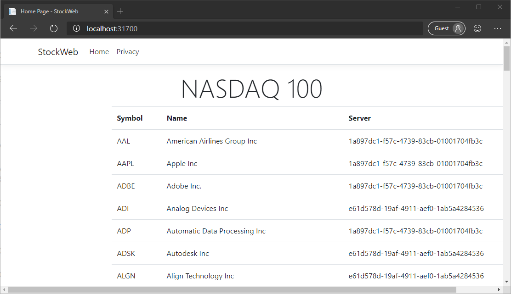
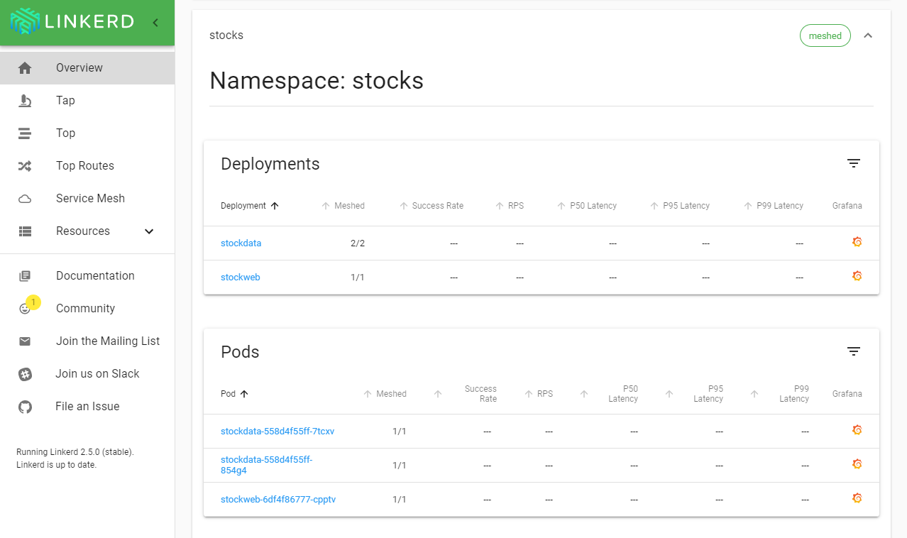

# Service meshes

A service mesh is an infrastructure component that takes control of routing service requests within a network. Service meshes can handle all kinds of network-level concerns within a Kubernetes cluster, including:

- Service discovery
- Load balancing
- Fault tolerance
- Encryption
- Monitoring

Kubernetes service meshes work by adding an extra container, called a *sidecar proxy*, to each pod included in the mesh. The proxy takes over handling all inbound and outbound network requests. You can then keep the configuration and management of networking matters separate from the application containers. In many cases, this separation doesn't require any changes to the application code.

In the [previous chapter's example](kubernetes.md#test-the-application), the gRPC requests from the web application were all routed to a single instance of the gRPC service. This happens because the service's host name is resolved to an IP address, and that IP address is cached for the lifetime of the `HttpClientHandler` instance. It might be possible to work around this behavior by handling DNS lookups manually or creating multiple clients. But this workaround would complicate the application code without adding any business or customer value.

When you use a service mesh, the requests from the application container are sent to the sidecar proxy. The sidecar proxy can then distribute them intelligently across all instances of the other service. The mesh can also:

- Respond seamlessly to failures of individual instances of a service.
- Handle retry semantics for failed calls or timeouts.
- Reroute failed requests to an alternate instance without returning to the client application.

The following screenshot shows the StockWeb application running with the Linkerd service mesh. There are no changes to the application code, and the Docker image isn't being used. The only change required was the addition of an annotation to the deployment in the YAML files for the `stockdata` and `stockweb` services.



You can see from the **Server** column that the requests from the StockWeb application have been routed to both replicas of the StockData service, despite originating from a single `HttpClient` instance in the application code. In fact, if you review the code, you'll see that all 100 requests to the StockData service are made simultaneously by using the same `HttpClient` instance. With the service mesh, those requests will be balanced across however many service instances are available.

Service meshes apply only to traffic within a cluster. For external clients, see the next chapter, [Load Balancing](load-balancing.md).

## Service mesh options

Three general-purpose service mesh implementations are currently available for use with Kubernetes: [Istio](https://istio.io), [Linkerd](https://linkerd.io), and [Consul Connect](https://consul.io/mesh.html). All three provide request routing/proxying, traffic encryption, resilience, host-to-host authentication, and traffic control.

Choosing a service mesh depends on multiple factors:

- The organization's specific requirements around costs, compliance, paid support plans, and so on.
- The nature of the cluster, its size, the number of services deployed, and the volume of traffic within the cluster network.
- Ease of deploying and managing the mesh and using it with services.

## Example: Add Linkerd to a deployment

In this example, you'll learn how to use the Linkerd service mesh with the *StockKube* application from [the previous section](kubernetes.md).
To follow this example, you'll need to [install the Linkerd CLI](https://linkerd.io/2/getting-started/#step-1-install-the-cli). You can download Windows binaries from the section that lists GitHub releases. Be sure to use the most recent *stable* release and not one of the edge releases.

With the Linkerd CLI installed, follow the [Getting Started](https://linkerd.io/2/getting-started/index.html) instructions to install the Linkerd components on your Kubernetes cluster. The instructions are straightforward, and the installation should take only a couple of minutes on a local Kubernetes instance.

### Add Linkerd to Kubernetes deployments

The Linkerd CLI provides an `inject` command to add the necessary sections and properties to Kubernetes files. You can run the command and write the output to a new file.

```console
linkerd inject stockdata.yml > stockdata-with-mesh.yml
linkerd inject stockweb.yml > stockweb-with-mesh.yml
```

You can inspect the new files to see what changes have been made. For deployment objects, a metadata annotation is added to tell Linkerd to inject a sidecar proxy container into the pod when it's created.

It's also possible to pipe the output of the `linkerd inject` command to `kubectl` directly. The following commands will work in PowerShell or any Linux shell.

```console
linkerd inject stockdata.yml | kubectl apply -f -
linkerd inject stockweb.yml | kubectl apply -f -
```

### Inspect services in the Linkerd dashboard

Open the Linkerd dashboard by using the `linkerd` CLI.

```console
linkerd dashboard
```

The dashboard provides detailed information about all services that are connected to the mesh.



If you increase the number of replicas of the StockData gRPC service as shown in the following example, and refresh the StockWeb page in the browser, you should see a mix of IDs in the **Server** column. This mix indicates that all the available instances are serving requests.

```yaml
apiVersion: apps/v1
kind: Deployment
metadata:
  name: stockdata
  namespace: stocks
spec:
  selector:
    matchLabels:
      run: stockdata
  replicas: 2 # Increase the target number of instances
  template:
    metadata:
      annotations:
        linkerd.io/inject: enabled
      creationTimestamp: null
      labels:
        run: stockdata
    spec:
      containers:
      - name: stockdata
        image: stockdata:1.0.0
        imagePullPolicy: Never
        resources:
          limits:
            cpu: 100m
            memory: 100Mi
        ports:
        - containerPort: 80
```

>[!div class="step-by-step"]
>[Previous](kubernetes.md)
>[Next](load-balancing.md)
