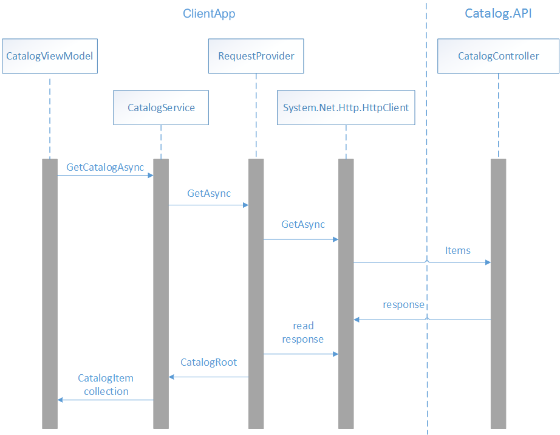
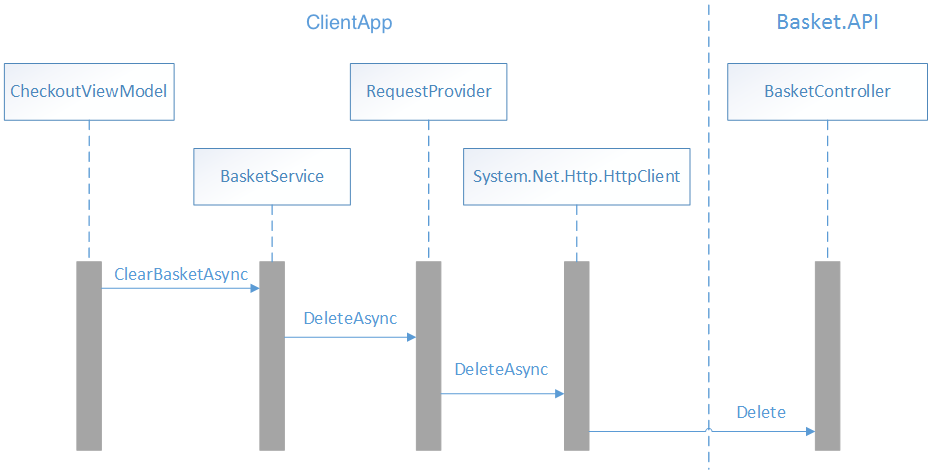

# Accessing remote data

[!INCLUDE [download-alert](includes/download-alert.md)]

Many modern web-based solutions make use of web services, hosted by web servers, to provide functionality for remote client applications. The operations that a web service exposes constitute a web API.

Client apps should be able to utilize the web API without knowing how the data or operations that the API exposes are implemented. This requires that the API abides by common standards that enable a client app and web service to agree on which data formats to use, and the structure of the data that is exchanged between client apps and the web service.

## Introduction to Representational State Transfer

Representational State Transfer (REST) is an architectural style for building distributed systems based on hypermedia. A primary advantage of the REST model is that it's based on open standards and doesn't bind the implementation of the model or the client apps that access it to any specific implementation. Therefore, a REST web service could be implemented using [Microsoft ASP.NET Core](/aspnet/core/introduction-to-aspnet-core), and client apps could be developing using any language and toolset that can generate HTTP requests and parse HTTP responses.

The REST model uses a navigational scheme to represent objects and services over a network, referred to as resources. Systems that implement REST typically use the HTTP protocol to transmit requests to access these resources. In such systems, a client app submits a request in the form of a URI that identifies a resource, and an HTTP method (such as GET, POST, PUT, or DELETE) that indicates the operation to be performed on that resource. The body of the HTTP request contains any data required to perform the operation.

> [!NOTE]
> REST defines a stateless request model. Therefore, HTTP requests must be independent and might occur in any order.

The response from a REST request makes use of standard HTTP status codes. For example, a request that returns valid data should include the HTTP response code 200 (`OK`), while a request that fails to find or delete a specified resource should return a response that includes the HTTP status code 404 (`Not Found`).

A RESTful web API exposes a set of connected resources, and provides the core operations that enable an app to manipulate those resources and easily navigate between them. For this reason, the URIs that constitute a typical RESTful web API are oriented towards the data that it exposes, and use the facilities provided by HTTP to operate on this data.

The data included by a client app in an HTTP request, and the corresponding response messages from the web server, could be presented in a variety of formats, known as media types. When a client app sends a request that returns data in the body of a message, it can specify the media types it can handle in the Accept header of the request. If the web server supports this media type, it can reply with a response that includes the Content-Type header that specifies the format of the data in the body of the message. It's then the responsibility of the client app to parse the response message and interpret the results in the message body appropriately.

For more information about REST, see [API design](/azure/architecture/best-practices/api-design) and [API implementation](/azure/architecture/best-practices/api-implementation) on Microsoft Docs.

## Consuming RESTful APIs

The eShop multi-platform app uses the Model-View-ViewModel (MVVM) pattern, and the model elements of the pattern represent the domain entities used in the app. The controller and repository classes in the eShop reference application accept and return many of these model objects. Therefore, they are used as data transfer objects (DTOs) that hold all the data that is passed between the app and the containerized microservices. The main benefit of using DTOs to pass data to and receive data from a web service is that by transmitting more data in a single remote call, the app can reduce the number of remote calls that need to be made.

## Making web requests

The eShop multi-platform app uses the `HttpClient` class to make requests over HTTP, with JSON being used as the media type. This class provides functionality for asynchronously sending HTTP requests and receiving HTTP responses from a URI identified resource. The HttpResponseMessage class represents an HTTP response message received from a REST API after an HTTP request has been made. It contains information about the response, including the status code, headers, and any body. The HttpContent class represents the HTTP body and content headers, such as Content-Type and Content-Encoding. The content can be read using any of the `ReadAs` methods, such as `ReadAsStringAsync` and `ReadAsByteArrayAsync`, depending on the format of the data.

## Making a GET request

The `CatalogService` class is used to manage the data retrieval process from the catalog microservice. In the `RegisterViewModels` method in the `MauiProgram` class, the `CatalogService` class is registered as a type mapping against the `ICatalogService` type with the dependency injection container. Then, when an instance of the `CatalogViewModel` class is created, its constructor accepts an `ICatalogService type`, which the dependency injection container resolves, returning an instance of the `CatalogService` class. For more information about dependency injection, see [Dependency Injection](dependency-injection.md).

The image below shows the interaction of classes that read catalog data from the catalog microservice for displaying by the CatalogView.



When the `CatalogView` is navigated to, the `OnInitialize` method in the CatalogViewModel class is called. This method retrieves catalog data from the catalog microservice, as demonstrated in the following code example:

```csharp
public override async Task InitializeAsync()
{
    Products = await _productsService.GetCatalogAsync();
} 
```

This method calls the `GetCatalogAsync` method of the `CatalogService` instance that was injected into the `CatalogViewModel` by the dependency injection container. The following code example shows the `GetCatalogAsync` method:

```csharp
public async Task<ObservableCollection<CatalogItem>> GetCatalogAsync()
{
    UriBuilder builder = new UriBuilder(GlobalSetting.Instance.CatalogEndpoint);
    builder.Path = "api/v1/catalog/items";
    string uri = builder.ToString();

    CatalogRoot? catalog = await _requestProvider.GetAsync<CatalogRoot>(uri);

    return catalog?.Data;          
} 
```

This method builds the URI that identifies the resource the request will be sent to, and uses the `RequestProvider` class to invoke the GET HTTP method on the resource, before returning the results to the `CatalogViewModel`. The `RequestProvider` class contains functionality that submits a request in the form of a URI that identifies a resource, an HTTP method that indicates the operation to be performed on that resource, and a body that contains any data required to perform the operation. For information about how the `RequestProvider` class is injected into the `CatalogService` class, see [Dependency Injection](dependency-injection.md).

The following code example shows the `GetAsync` method in the `RequestProvider` class:

```csharp
public async Task<TResult> GetAsync<TResult>(string uri, string token = "")
{
    HttpClient httpClient = GetOrCreateHttpClient(token);
    HttpResponseMessage response = await httpClient.GetAsync(uri);

    await HandleResponse(response);
    TResult result = await response.Content.ReadFromJsonAsync<TResult>();

    return result;
}
```

This method calls the `GetOrCreateHttpClient` method, which returns an instance of the `HttpClient` class with the appropriate headers set. It then submits an asynchronous `GET` request to the resource identified by the URI, with the response being stored in the `HttpResponseMessage` instance. The `HandleResponse` method is then invoked, which throws an exception if the response doesn't include a success HTTP status code. Then the response is read as a string, converted from JSON to a `CatalogRoot` object, and returned to the `CatalogService`.

The `GetOrCreateHttpClient` method is shown in the following code example:

```csharp
private readonly Lazy<HttpClient> _httpClient =
    new Lazy<HttpClient>(
        () =>
        {
            var httpClient = new HttpClient();
            httpClient.DefaultRequestHeaders.Accept.Add(new MediaTypeWithQualityHeaderValue("application/json"));
            return httpClient;
        },
        LazyThreadSafetyMode.ExecutionAndPublication);

private HttpClient GetOrCreateHttpClient(string token = "")
    {
        var httpClient = _httpClient.Value;

        if (!string.IsNullOrEmpty(token))
        {
            httpClient.DefaultRequestHeaders.Authorization = new AuthenticationHeaderValue("Bearer", token);
        }
        else
        {
            httpClient.DefaultRequestHeaders.Authorization = null;
        }

        return httpClient;
    }
```

This method uses creates a new instance or retrieves a cached instance of the `HttpClient` class, and sets the Accept header of any requests made by the `HttpClient` instance to `application/json`, which indicates that it expects the content of any response to be formatted using JSON. Then, if an access token was passed as an argument to the `GetOrCreateHttpClient` method, it's added to the `Authorization` header of any requests made by the `HttpClient` instance, prefixed with the string `Bearer`. For more information about authorization, see [Authorization](authentication-and-authorization.md).

> [!TIP]
> It is highly recommended to cache and reuse instances of the `HttpClient` for better application performance. Creating a new `HttpClient` for each operation can lead to issue with socket exhaustion. For more information, see [HttpClient Instancing](/dotnet/api/system.net.http.httpclient#instancing) on the Microsoft Developer Center.

When the `GetAsync` method in the `RequestProvider` class calls `HttpClient.GetAsync`, the `Items` method in the `CatalogController` class in the `Catalog.API` project is invoked, which is shown in the following code example:

```csharp
[HttpGet]
[Route("[action]")]
public async Task<IActionResult> Items(
    [FromQuery]int pageSize = 10, [FromQuery]int pageIndex = 0)
{
    var totalItems = await _catalogContext.CatalogItems
        .LongCountAsync();

    var itemsOnPage = await _catalogContext.CatalogItems
        .OrderBy(c => c.Name)
        .Skip(pageSize * pageIndex)
        .Take(pageSize)
        .ToListAsync();

    itemsOnPage = ComposePicUri(itemsOnPage);
    var model = new PaginatedItemsViewModel<CatalogItem>(
        pageIndex, pageSize, totalItems, itemsOnPage);           

    return Ok(model);
}
```

This method retrieves the catalog data from the SQL database using [EntityFramework](/ef/), and returns it as a response message that includes a success HTTP status code, and a collection of JSON formatted `CatalogItem` instances.

## Making a POST request

The `BasketService` class is used to manage the data retrieval and update process with the basket microservice. In the `RegisterAppServices` method in the `MauiProgram` class, the `BasketService` class is registered as a type mapping against the `IBasketService` type with the dependency injection container. Then, when an instance of the `BasketViewModel` class is created, its constructor accepts an `IBasketService` type, which the dependency injection container resolves, returning an instance of the `BasketService` class. For more information about dependency injection, see [Dependency Injection](dependency-injection.md).

The image below shows the interaction of classes that send the basket data displayed by the BasketView, to the basket microservice.


When an item is added to the shopping basket, the `ReCalculateTotalAsync` method in the `BasketViewModel` class is called. This method updates the total value of items in the basket, and sends the basket data to the basket microservice, as demonstrated in the following code example:

```csharp
private async Task ReCalculateTotalAsync()
{
    // Omitted for brevity...

    await _basketService.UpdateBasketAsync(
        new CustomerBasket
        {
            BuyerId = userInfo.UserId, 
            Items = BasketItems.ToList()
        }, 
        authToken);
}
```

This method calls the `UpdateBasketAsync` method of the `BasketService` instance that was injected into the `BasketViewModel` by the dependency injection container. The following method shows the `UpdateBasketAsync` method:

```csharp
public async Task<CustomerBasket> UpdateBasketAsync(
    CustomerBasket customerBasket, string token)
{
    UriBuilder builder = new UriBuilder(GlobalSetting.Instance.BasketEndpoint);
    string uri = builder.ToString();
    var result = await _requestProvider.PostAsync(uri, customerBasket, token);
    return result;
}
```

This method builds the URI that identifies the resource the request will be sent to, and uses the `RequestProvider` class to invoke the POST HTTP method on the resource, before returning the results to the `BasketViewModel`. Note that an access token, obtained from `IdentityServer` during the authentication process, is required to authorize requests to the basket microservice. For more information about authorization, see [Authorization](authentication-and-authorization.md).

The following code example shows one of the `PostAsync` methods in the `RequestProvider` class:

```csharp
public async Task<TResult> PostAsync<TResult>(
    string uri, TResult data, string token = "", string header = "")
{
    HttpClient httpClient = GetOrCreateHttpClient(token);

    var content = new StringContent(JsonSerializer.Serialize(data));
    content.Headers.ContentType = new MediaTypeHeaderValue("application/json");
    HttpResponseMessage response = await httpClient.PostAsync(uri, content);

    await HandleResponse(response);
    TResult result = await response.Content.ReadFromJsonAsync<TResult>();
    
    return result;
}
```

This method calls the `GetOrCreateHttpClient` method, which returns an instance of the `HttpClient` class with the appropriate headers set. It then submits an asynchronous POST request to the resource identified by the URI, with the serialized basket data being sent in JSON format, and the response being stored in the `HttpResponseMessage` instance. The `HandleResponse` method is then invoked, which throws an exception if the response doesn't include a success HTTP status code. Then, the response is read as a string, converted from JSON to a `CustomerBasket` object, and returned to the BasketService. For more information about the `GetOrCreateHttpClient` method, see [Making a GET request](#making-a-get-request).

When the `PostAsync` method in the `RequestProvider` class calls `HttpClient.PostAsync`, the `Post` method in the `BasketController` class in the `Basket.API` project is invoked, which is shown in the following code example:

```csharp
[HttpPost]
public async Task<IActionResult> Post([FromBody] CustomerBasket value)
{
    var basket = await _repository.UpdateBasketAsync(value);
    return Ok(basket);
} 
```

This method uses an instance of the `RedisBasketRepository` class to persist the basket data to the Redis cache, and returns it as a response message that includes a success HTTP status code, and a JSON formatted `CustomerBasket` instance.

## Making a DELETE request

The image below shows the interactions of classes that delete basket data from the basket microservice, for the `CheckoutView`.



When the checkout process is invoked, the `CheckoutAsync` method in the `CheckoutViewModel` class is called. This method creates a new order, before clearing the shopping basket, as demonstrated in the following code example:

```csharp
private async Task CheckoutAsync()
{
    // Omitted for brevity...

    await _basketService.ClearBasketAsync(
        _shippingAddress.Id.ToString(), authToken);
}
```

This method calls the `ClearBasketAsync` method of the `BasketService` instance that was injected into the `CheckoutViewModel` by the dependency injection container. The following method shows the `ClearBasketAsync` method:

```csharp
public async Task ClearBasketAsync(string guidUser, string token)
{
    UriBuilder builder = new(GlobalSetting.Instance.BasketEndpoint);
    builder.Path = guidUser;
    string uri = builder.ToString();
    await _requestProvider.DeleteAsync(uri, token);
}
```

This method builds the URI that identifies the resource that the request will be sent to, and uses the `RequestProvider` class to invoke the `DELETE` HTTP method on the resource. Note that an access token, obtained from `IdentityServer` during the authentication process, is required to authorize requests to the basket microservice. For more information about authorization, see [Authorization](authentication-and-authorization.md).

The following code example shows the `DeleteAsync` method in the `RequestProvider` class:

```csharp
public async Task DeleteAsync(string uri, string token = "")
{
    HttpClient httpClient = GetOrCreateHttpClient(token);
    await httpClient.DeleteAsync(uri);
}
```

This method calls the `GetOrCreateHttpClient` method, which returns an instance of the `HttpClient` class with the appropriate headers set. It then submits an asynchronous `DELETE` request to the resource identified by the URI. For more information about the `GetOrCreateHttpClient` method, see [Making a GET request](#making-a-get-request).

When the `DeleteAsync` method in the `RequestProvider` class calls `HttpClient.DeleteAsync`, the `Delete` method in the `BasketController` class in the `Basket.API` project is invoked, which is shown in the following code example:

```csharp
[HttpDelete("{id}")]
public void Delete(string id) =>
    _repository.DeleteBasketAsync(id);
```

This method uses an instance of the `RedisBasketRepository` class to delete the basket data from the Redis cache.

## Caching data

The performance of an app can be improved by caching frequently accessed data to fast storage that's located close to the app. If the fast storage is located closer to the app than the original source, then caching can significantly improve response times when retrieving data.

The most common form of caching is read-through caching, where an app retrieves data by referencing the cache. If the data isn't in the cache, it's retrieved from the data store and added to the cache. Apps can implement read-through caching with the cache-aside pattern. This pattern determines whether the item is currently in the cache. If the item isn't in the cache, it's read from the data store and added to the cache. For more information, see the [Cache-Aside](/azure/architecture/patterns/cache-aside) pattern on Microsoft Docs.

> [!TIP]
> Cache data that's read frequently and changes infrequently.

This data can be added to the cache on demand the first time it is retrieved by an app. This means that the app needs to fetch the data only once from the data store, and that subsequent access can be satisfied by using the cache.

Distributed applications, such as the eShop reference application, should provide either or both of the following caches:

- A shared cache, which can be accessed by multiple processes or machines.
- A private cache, where data is held locally on the device running the app.

The eShop multi-platform app uses a private cache, where data is held locally on the device that's running an instance of the app.

> [!TIP]
> Think of the cache as a transient data store that could disappear at any time.

Ensure that data is maintained in the original data store as well as the cache. The chances of losing data are then minimized if the cache becomes unavailable.

## Managing data expiration

It's impractical to expect that cached data will always be consistent with the original data. Data in the original data store might change after it's been cached, causing the cached data to become stale. Therefore, apps should implement a strategy that helps to ensure that the data in the cache is as up-to-date as possible, but can also detect and handle situations that arise when the data in the cache has become stale. Most caching mechanisms enable the cache to be configured to expire data, and hence reduce the period for which data might be out of date.

> [!TIP]
> Set a default expiration time when configuring a cache.

Many caches implement expiration, which invalidates data and removes it from the cache if it's not accessed for a specified period. However, care must be taken when choosing the expiration period. If it's made too short, data will expire too quickly and the benefits of caching will be reduced. If it's made too long, the data risks becoming stale. Therefore, the expiration time should match the pattern of access for apps that use the data.

When cached data expires, it should be removed from the cache, and the app must retrieve the data from the original data store and place it back into the cache.

It's also possible that a cache might fill up if data is allowed to remain for too long a period. Therefore, requests to add new items to the cache might be required to remove some items in a process known as *eviction*. Caching services typically evict data on a least-recently-used basis. However, there are other eviction policies, including most-recently-used, and first-in-first-out. For more information, see [Caching Guidance](/azure/architecture/best-practices/caching) on Microsoft Docs.

## Caching images

The eShop multi-platform app consumes remote product images that benefit from being cached. These images are displayed by the Image control. The .NET MAUI Image control supports caching of downloaded images which has caching enabled by default, and will store the image locally for 24 hours. In addition, the expiration time can be configured with the CacheValidity property. For more information, see [Downloaded Image Caching](/dotnet/maui/user-interface/controls/image#image-caching) on the Microsoft Developer Center.

## Increasing resilience

All apps that communicate with remote services and resources must be sensitive to transient faults. Transient faults include the momentary loss of network connectivity to services, the temporary unavailability of a service, or timeouts that arise when a service is busy. These faults are often self-correcting, and if the action is repeated after a suitable delay it's likely to succeed.

Transient faults can have a huge impact on the perceived quality of an app, even if it has been thoroughly tested under all foreseeable circumstances. To ensure that an app that communicates with remote services operates reliably, it must be able to do all of the following:

- Detect faults when they occur, and determine if the faults are likely to be transient.
- Retry the operation if it determines that the fault is likely to be transient and keep track of the number of times the operation was retried.
- Use an appropriate retry strategy, which specifies the number of retries, the delay between each attempt, and the actions to take after a failed attempt.

This transient fault handling can be achieved by wrapping all attempts to access a remote service in code that implements the retry pattern.

## Retry pattern

If an app detects a failure when it tries to send a request to a remote service, it can handle the failure in any of the following ways:

- Retrying the operation. The app could retry the failing request immediately.
- Retrying the operation after a delay. The app should wait for a suitable amount of time before retrying the request.
- Cancelling the operation. The application should cancel the operation and report an exception.

The retry strategy should be tuned to match the business requirements of the app. For example, it's important to optimize the retry count and retry interval to the operation being attempted. If the operation is part of a user interaction, the retry interval should be short and only a few retries attempted to avoid making users wait for a response. If the operation is part of a long running workflow, where cancelling or restarting the workflow is expensive or time-consuming, it's appropriate to wait longer between attempts and to retry more times.

> [!NOTE]
> An aggressive retry strategy with minimal delay between attempts, and a large number of retries, could degrade a remote service that's running close to or at capacity. In addition, such a retry strategy could also affect the responsiveness of the app if it's continually trying to perform a failing operation.

If a request still fails after a number of retries, it's better for the app to prevent further requests going to the same resource and to report a failure. Then, after a set period, the app can make one or more requests to the resource to see if they're successful. For more information, see [Circuit breaker pattern](#circuit-breaker-pattern).

> [!TIP]
> Never implement an endless retry mechanism. Instead, prefer an exponential backoff.

Use a finite number of retries, or implement the [Circuit Breaker](/azure/architecture/patterns/circuit-breaker) pattern to allow a service to recover.

The eShop reference application does implement the retry pattern.

For more information about the retry pattern, see the [Retry](/azure/architecture/patterns/retry) pattern on Microsoft Docs.

## Circuit breaker pattern

In some situations, faults can occur due to anticipated events that take longer to fix. These faults can range from a partial loss of connectivity to the complete failure of a service. In these situations, it's pointless for an app to retry an operation that's unlikely to succeed, and instead should accept that the operation has failed and handle this failure accordingly.

The circuit breaker pattern can prevent an app from repeatedly trying to execute an operation that's likely to fail, while also enabling the app to detect whether the fault has been resolved.

> [!NOTE]
> The purpose of the circuit breaker pattern is different from the retry pattern. The retry pattern enables an app to retry an operation in the expectation that it'll succeed. The circuit breaker pattern prevents an app from performing an operation that's likely to fail.

A circuit breaker acts as a proxy for operations that might fail. The proxy should monitor the number of recent failures that have occurred, and use this information to decide whether to allow the operation to proceed, or to return an exception immediately.

The eShop multi-platform app does not currently implement the circuit breaker pattern. However, the eShop does.

> [!TIP]
> Combine the retry and circuit breaker patterns.

An app can combine the retry and circuit breaker patterns by using the retry pattern to invoke an operation through a circuit breaker. However, the retry logic should be sensitive to any exceptions returned by the circuit breaker and abandon retry attempts if the circuit breaker indicates that a fault is not transient.

For more information about the circuit breaker pattern, see the [Circuit Breaker](/azure/architecture/patterns/circuit-breaker) pattern on Microsoft Docs.

## Summary

Many modern web-based solutions make use of web services, hosted by web servers, to provide functionality for remote client applications. The operations that a web service exposes constitute a web API, and client apps should be able to utilize the web API without knowing how the data or operations that the API exposes are implemented.

The performance of an app can be improved by caching frequently accessed data to fast storage that's located close to the app. Apps can implement read-through caching with the cache-aside pattern. This pattern determines whether the item is currently in the cache. If the item isn't in the cache, it's read from the data store and added to the cache.

When communicating with web APIs, apps must be sensitive to transient faults. Transient faults include the momentary loss of network connectivity to services, the temporary unavailability of a service, or timeouts that arise when a service is busy. These faults are often self-correcting, and if the action is repeated after a suitable delay, then it's likely to succeed. Therefore, apps should wrap all attempts to access a web API in code that implements a transient fault handling mechanism.
