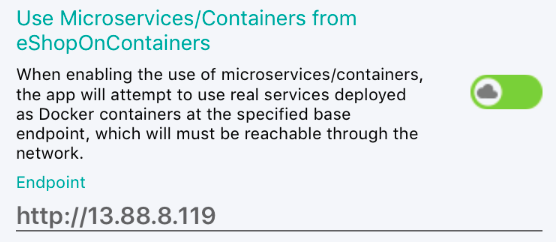

# Application settings management

[!INCLUDE [download-alert](includes/download-alert.md)]

Settings allow the separation of data that configures the behavior of an app from the code, allowing the behavior to be changed without rebuilding the app. There are two types of settings: app settings and user settings.

App settings are data that an app creates and manages. It can include data such as fixed web service endpoints, API keys, and runtime state. App settings are tied to core functionality and are only meaningful to that app.

User settings are the customizable settings of an app that affect the app's behavior and don't require frequent re-adjustment. For example, an app might let the user specify where to retrieve data and how to display it on the screen.

## Creating a Settings Interface

While the preferences manager can be used directly in your application, it does come with the drawback of making your application tightly coupled to the preferences manager implementation. This coupling means that creating unit tests or extending the functionality of preferences management will be limited since your application will not have a direct way to intercept the behavior. To address this concern, an interface can be created to work as a proxy for preferences management. The interface will allow us to supply an implementation that fits our needs. For example, when writing a unit test, we may want to set specific settings, and the interface will give us an easy way to consistently set this data for the test. The following code example shows the `ISettingsService` interface in the eShop multi-platform app:

```csharp
namespace eShop.Services.Settings;

public interface ISettingsService
{
    string AuthAccessToken { get; set; }
    string AuthIdToken { get; set; }
    bool UseMocks { get; set; }
    string IdentityEndpointBase { get; set; }
    string GatewayShoppingEndpointBase { get; set; }
    string GatewayMarketingEndpointBase { get; set; }
    bool UseFakeLocation { get; set; }
    string Latitude { get; set; }
    string Longitude { get; set; }
    bool AllowGpsLocation { get; set; }
}
```

## Adding Settings

.NET MAUI includes a preferences manager that provides a way to store runtime settings for a user. This feature can be accessed from anywhere within your application using the `Microsoft.Maui.Storage.Preferences` class. The preferences manager provides a consistent, type-safe, cross-platform approach for persisting and retrieving app and user settings, while using the native settings management provided by each platform. In addition, it's straightforward to use data binding to access settings data exposed by the library. For more information, see the [Preferences](/dotnet/maui/platform-integration/storage/preferences) on the Microsoft Developer Center.

> [!TIP]
> Preferences is meant for storing relatively small data. If you need to store larger or more complex data, consider using a local database or filesystem to store the data.

Our application will use the `Preferences` class need to implement the `ISettingsService` interface. The code below shows how the eShop multi-platform app's `SettingsService` implements the `AuthTokenAccess` and `UseMocks` properties:

```csharp
public sealed class SettingsService : ISettingsService
{
    private const string AccessToken = "access_token";
    private const string AccessTokenDefault = string.Empty;

    private const string IdUseMocks = "use_mocks";
    private const bool UseMocksDefault = true;

    public string AuthAccessToken
    {
        get => Preferences.Get(AccessToken, AccessTokenDefault);
        set => Preferences.Set(AccessToken, value);
    }

    public bool UseMocks
    {
        get => Preferences.Get(IdUseMocks, UseMocksDefault);
        set => Preferences.Set(IdUseMocks, value);
    }
}
```

Each setting consists of a private key, a private default value, and a public property. The key is always a const string that defines a unique name, with the default value for the setting being a static read-only or constant value of the required type. Providing a default value ensures that a valid value is available if an unset setting is retrieved. This service implementation can be provided via dependency injection to our application for use in view-models or other services throughout the application.

## Data binding to user settings

In the eShop multi-platform app, the `SettingsView` exposes multiple settings the user can configure at runtime. These settings include allowing configuration of whether the app should retrieve data from microservices deployed as Docker containers or whether the app should retrieve data from mock services that don't require an internet connection. When retrieving data from containerized microservices, a base endpoint URL for the microservices must be specified. The image below shows the SettingsView when the user has chosen to retrieve data from containerized microservices.



Data binding can be used to retrieve and set settings exposed by the `ISettingService` interface. This is achieved by controls on the view binding to view model properties that in turn access properties in the `ISettingService` interface and raising a property changed notification if the value has changed.

The following code example shows the `Entry` control from the `SettingsView` that allows the user to enter a base identity endpoint URL for the containerized microservices:

```xml
<Entry Text="{Binding IdentityEndpoint, Mode=TwoWay}" />
```

This `Entry` control binds to the `IdentityEndpoint` property of the `SettingsViewModel` class, using a two-way binding. The following code example shows the `IdentityEndpoint` property:

```csharp
private readonly ISettingsService _settingsService;

private string _identityEndpoint;

public SettingsViewModel(
    ILocationService locationService, IAppEnvironmentService appEnvironmentService,
    IDialogService dialogService, INavigationService navigationService, ISettingsService settingsService)
    : base(dialogService, navigationService, settingsService)
{
    _settingsService = settingsService;

    _identityEndpoint = _settingsService.IdentityEndpointBase;
}

public string IdentityEndpoint
{
    get => _identityEndpoint;
    set
    {
        SetProperty(ref _identityEndpoint, value);

        if (!string.IsNullOrWhiteSpace(value))
        {
            UpdateIdentityEndpoint();
        }
    }
}
```

When the `IdentityEndpoint` property is set, the `UpdateIdentityEndpoint` method is called, provided that the supplied value is valid. The following code example shows the `UpdateIdentityEndpoint` method:

```csharp
private void UpdateIdentityEndpoint()
{
    _settingsService.IdentityEndpointBase = _identityEndpoint;
}
```

This method updates the `IdentityEndpointBase` property in the `ISettingService` interface implementation with the base endpoint URL value entered by the user. If the `SettingsService` class is provided as the implementation for `_settingsService`, the value will persist to platform-specific storage.

## Summary

Settings allow the separation of data that configures the behavior of an app from the code, allowing the behavior to be changed without rebuilding the app. App settings are data that an app creates and manages, and user settings are the customizable settings of an app that affect the app's behavior and don't require frequent re-adjustment.

The `Microsoft.Maui.Storage.Preferences` class provides a consistent, type-safe, cross-platform approach for persisting and retrieving app and user settings.
