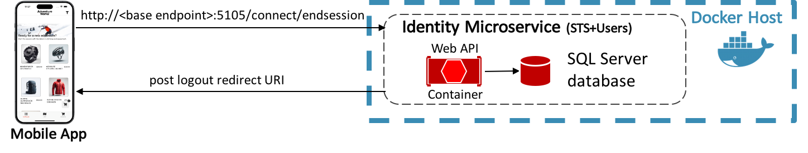
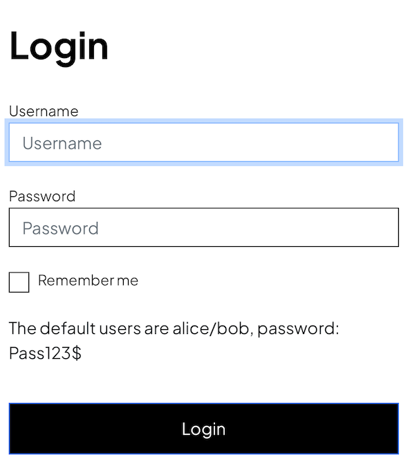

# Authentication and authorization

[!INCLUDE [download-alert](includes/download-alert.md)]

Authentication is the process of obtaining identification credentials such as name and password from a user and validating those credentials against an authority. The entity that submitted the credentials is considered an authenticated identity if the credentials are valid. Once an identity has been established, an authorization process determines whether that identity has access to a given resource.

There are many approaches to integrating authentication and authorization into a .NET MAUI app that communicates with an ASP.NET web application, including using ASP.NET Core Identity, external authentication providers such as Microsoft, Google, Facebook, or Twitter, and authentication middleware. The eShop multi-platform app performs authentication and authorization with a containerized identity microservice that uses IdentityServer. The app requests security tokens from IdentityServer to authenticate a user or access a resource. For IdentityServer to issue tokens on behalf of a user, the user must sign in to IdentityServer. However, IdentityServer doesn't provide a user interface or database for authentication. Therefore, in the eShop reference application, ASP.NET Core Identity is used for this purpose.

## Authentication

Authentication is required when an application needs to know the current user's identity. ASP.NET Core's primary mechanism for identifying users is the ASP.NET Core Identity membership system, which stores user information in a data store configured by the developer. Typically, this data store will be an EntityFramework store, though custom stores or third-party packages can be used to store identity information in Azure storage, DocumentDB, or other locations.

For authentication scenarios that use a local user datastore and persist identity information between requests via cookies (as is typical in ASP.NET web applications), ASP.NET Core Identity is a suitable solution. However, cookies are not always a natural means of persisting and transmitting data. For example, an ASP.NET Core web application that exposes RESTful endpoints that are accessed from an app will typically need to use bearer token authentication since cookies can't be used in this scenario. However, bearer tokens can easily be retrieved and included in the authorization header of web requests made from the app.

### Issuing bearer tokens using IdentityServer

[IdentityServer](https://github.com/DuendeSoftware/IdentityServer) is an open-source OpenID Connect and OAuth 2.0 framework for ASP.NET Core, which can be used for many authentication and authorization scenarios, including issuing security tokens for local ASP.NET Core Identity users.

> [!NOTE]
> OpenID Connect and OAuth 2.0 are very similar, while having different responsibilities.

OpenID Connect is an authentication layer on top of the OAuth 2.0 protocol. OAuth 2 is a protocol that allows applications to request access tokens from a security token service and use them to communicate with APIs. This delegation reduces complexity in both client applications and APIs since authentication and authorization can be centralized.

OpenID Connect and OAuth 2.0 combine the two fundamental security concerns of authentication and API access, and IdentityServer is an implementation of these protocols.

In applications that use direct client-to-microservice communication, such as the eShop reference application, a dedicated authentication microservice acting as a Security Token Service (STS) can be used to authenticate users, as shown in the following diagram. For more information about direct client-to-microservice communication, see [Microservices](micro-services.md).


The eShop multi-platform app communicates with the identity microservice, which uses IdentityServer to perform authentication, and access control for APIs. Therefore, the multi-platform app requests tokens from IdentityServer, either for authenticating a user or for accessing a resource:

- Authenticating users with IdentityServer is achieved by the multi-platform app requesting an _identity_ token, representing an authentication process's outcome. At a minimum, it contains an identifier for the user and information about how and when the user is authenticated. It can also include additional identity data.
- Accessing a resource with IdentityServer is achieved by the multi-platform app requesting an _access_ token, which allows access to an API resource. Clients request access tokens and forward them to the API. Access tokens contain information about the client and the user, if present. APIs then use that information to authorize access to their data.

> [!NOTE]
> A client must be registered with IdentityServer before it can successfully request tokens. For more information on adding clients, see [Defining Clients](https://docs.duendesoftware.com/identityserver/v7/quickstarts/1_client_credentials/#define-client).

### Adding IdentityServer to a web application

In order for an ASP.NET Core web application to use IdentityServer, it must be added to the web application's Visual Studio solution. For more information, see [Setup and Overview](https://docs.duendesoftware.com/identityserver/v7/quickstarts/) in the IdentityServer documentation.
Once IdentityServer is included in the web application's Visual Studio solution, it must be added to its HTTP request processing pipeline to serve requests to OpenID Connect and OAuth 2.0 endpoints. This is configured in the `Identity.API` project's _Program.cs_, as demonstrated in the following code example:

```csharp

...

app.UseIdentityServer();
```

Order matters in the web application's HTTP request processing pipeline. Therefore, IdentityServer must be added to the pipeline before the UI framework that implements the login screen.

### Configuring IdentityServer

IdentityServer is configured in the `Identity.API` project's _Program.cs_ by calling the `AddIdentityServer` method, as demonstrated in the following code example from the eShop reference application:

```csharp
builder.Services.AddIdentityServer(options =>
    {
        options.Authentication.CookieLifetime = TimeSpan.FromHours(2);
    
        options.Events.RaiseErrorEvents = true;
        options.Events.RaiseInformationEvents = true;
        options.Events.RaiseFailureEvents = true;
        options.Events.RaiseSuccessEvents = true;
    
        // TODO: Remove this line in production.
        options.KeyManagement.Enabled = false;
    })
    .AddInMemoryIdentityResources(Config.GetResources())
    .AddInMemoryApiScopes(Config.GetApiScopes())
    .AddInMemoryApiResources(Config.GetApis())
    .AddInMemoryClients(Config.GetClients(builder.Configuration))
    .AddAspNetIdentity<ApplicationUser>()
    // TODO: Not recommended for production - you need to store your key material somewhere secure
    .AddDeveloperSigningCredential();
```

After calling the `services.AddIdentityServer` method, additional fluent APIs are called to configure the following:

- Credentials used for signing.
- API and identity resources that users might request access to.
- Clients that will be connecting to request tokens.
- ASP.NET Core Identity.

> [!TIP]
> Dynamically load the IdentityServer configuration. IdentityServer's APIs allow for configuring IdentityServer from an in-memory list of configuration objects. In the eShop reference application, these in-memory collections are hard-coded into the application. However, in production scenarios they can be loaded dynamically from a configuration file or from a database.

For information about configuring IdentityServer to use ASP.NET Core Identity, see [Using ASP.NET Core Identity](https://docs.duendesoftware.com/identityserver/v7/quickstarts/5_aspnetid/) in the IdentityServer documentation.

### Configuring API resources

When configuring API resources, the `AddInMemoryApiResources` method expects an `IEnumerable<ApiResource>` collection. The following code example shows the `GetApis` method that provides this collection in the eShop reference application:

```csharp
public static IEnumerable<ApiResource> GetApis()
{
    return new List<ApiResource>
    {
        new ApiScope("orders", "Orders Service"),
        new ApiScope("basket", "Basket Service"),
        new ApiScope("webhooks", "Webhooks registration Service"),
    };
}
```

This method specifies that IdentityServer should protect the orders and basket APIs. Therefore, IdentityServer-managed access tokens will be required when making calls to these APIs. For more information about the `ApiResource` type, see [API Resource](https://docs.duendesoftware.com/identityserver/v7/fundamentals/resources/api_resources/) in the IdentityServer documentation.

### Configuring identity resources

When configuring identity resources, the `AddInMemoryIdentityResources` method expects an `IEnumerable<IdentityResource>` collection. Identity resources are data such as user ID, name, or email address. Each identity resource has a unique name, and arbitrary claim types can be assigned to it, which will be included in the identity token for the user. The following code example shows the `GetResources` method that provides this collection in the eShop reference application:

```csharp
public static IEnumerable<IdentityResource> GetResources()
{
    return new List<IdentityResource>
    {
        new IdentityResources.OpenId(),
        new IdentityResources.Profile()
    };
}
```

The OpenID Connect specification specifies some [standard identity resources](https://openid.net/specs/openid-connect-core-1_0.html#ScopeClaims). The minimum requirement is that support is provided for emitting a unique ID for users. This is achieved by exposing the `IdentityResources.OpenId` identity resource.

> [!NOTE]
> The IdentityResources class supports all of the scopes defined in the OpenID Connect specification (openid, email, profile, telephone, and address).

IdentityServer also supports defining custom identity resources. For more information, see [Defining custom identity resources](https://identityserver4.readthedocs.io/en/latest/topics/resources.html#defining-custom-identity-resources) in the IdentityServer documentation. For more information about the IdentityResource type, see [Identity Resource](https://docs.duendesoftware.com/identityserver/v7/fundamentals/resources/identity/) in the IdentityServer documentation.

### Configuring clients

Clients are applications that can request tokens from IdentityServer. Typically, the following settings must be defined for each client as a minimum:

- A unique client ID.
- The allowed interactions with the token service (known as the grant type).
- The location where identity and access tokens are sent to (known as a redirect URI).
- A list of resources that the client is allowed access to (known as scopes).

When configuring clients, the `AddInMemoryClients` method expects an `IEnumerable<Client>` collection. The following code example shows the configuration for the eShop multi-platform app in the `GetClients` method that provides this collection in the eShop reference application:

```csharp
public static IEnumerable<Client> GetClients(Dictionary<string,string> clientsUrl)
{
    return new List<Client>
    {
        // Omitted for brevity
        new Client
        {
            ClientId = "maui",
            ClientName = "eShop MAUI OpenId Client",
            AllowedGrantTypes = GrantTypes.Code,                    
            //Used to retrieve the access token on the back channel.
            ClientSecrets =
            {
                new Secret("secret".Sha256())
            },
            RedirectUris = { configuration["MauiCallback"] },
            RequireConsent = false,
            RequirePkce = true,
            PostLogoutRedirectUris = { $"{configuration["MauiCallback"]}/Account/Redirecting" },
            AllowedScopes = new List<string>
            {
                IdentityServerConstants.StandardScopes.OpenId,
                IdentityServerConstants.StandardScopes.Profile,
                IdentityServerConstants.StandardScopes.OfflineAccess,
                "orders",
                "basket",
                "mobileshoppingagg",
                "webhooks"
            },
            //Allow requesting refresh tokens for long lived API access
            AllowOfflineAccess = true,
            AllowAccessTokensViaBrowser = true,
            AlwaysIncludeUserClaimsInIdToken = true,
            AccessTokenLifetime = 60 * 60 * 2, // 2 hours
            IdentityTokenLifetime = 60 * 60 * 2 // 2 hours
        }
    };
}
```

This configuration specifies data for the following properties:

| Property | Description |
|---------|---------|
| `ClientId` | A unique ID for the client. |
| `ClientName` | The client display name, which is used for logging and the consent screen. |
| `AllowedGrantTypes` | Specifies how a client wants to interact with IdentityServer. For more information see [Configuring the authentication flow](#configuring-the-authentication-flow). |
| `ClientSecrets` | Specifies the client secret credentials that are used when requesting tokens from the token endpoint. |
| `RedirectUris` | Specifies the allowed URIs to which to return tokens or authorization codes. |
| `RequireConsent` | Specifies whether a consent screen is required. |
| `RequirePkce` | Specifies whether clients using an authorization code must send a proof key. |
| `PostLogoutRedirectUris` | Specifies the allowed URIs to redirect to after logout. |
| `AllowedCorsOrigins` | Specifies the origin of the client so that IdentityServer can allow cross-origin calls from the origin. |
| `AllowedScopes` | Specifies the resources the client has access to. By default, a client has no access to any resources. |
| `AllowOfflineAccess` | Specifies whether the client can request refresh tokens. |
| `AllowAccessTokensViaBrowser` | Specifies whether the client can receive access tokens from a browser window. |
| `AlwaysIncludeUserClaimsInIdToken` | Specifies that the user claims will always be added to the id token. By default, these would have to be retrieved using the `userinfo` endpoint. |
| `AccessTokenLifetime` | Specifies the lifetime of the access token in seconds. |
| `IdentityTokenLifetime` | Specifies the lifetime of the identity token in seconds. |

### Configuring the authentication flow

The authentication flow between a client and IdentityServer can be configured by specifying the grant types in the `Client.AllowedGrantTypes` property. The OpenID Connect and OAuth 2.0 specifications define several authentication flows, including:

| Authentication Flow | Description |
|---------|---------|
| Implicit | This flow is optimized for browser-based applications and should be used either for user authentication-only, or authentication and access token requests. All tokens are transmitted via the browser, and therefore advanced features like refresh tokens are not permitted. |
| Authorization code | This flow provides the ability to retrieve tokens on a back channel, as opposed to the browser front channel, while also supporting client authentication. |
| Hybrid | This flow is a combination of the implicit and authorization code grant types. The identity token is transmitted via the browser channel and contains the signed protocol response and other artifacts such as the authorization code. After successfully validating the response, the back channel should be used to retrieve the access and refresh token. |

> [!TIP]
> Consider using the hybrid authentication flow. The hybrid authentication flow mitigates a number of attacks that apply to the browser channel, and is the recommended flow for native applications that want to retrieve access tokens (and possibly refresh tokens).

For more information about authentication flows, see [Grant Types](https://docs.duendesoftware.com/identityserver/v7/data/operational/grants/) in the IdentityServer documentation.

### Performing authentication

For IdentityServer to issue tokens on behalf of a user, the user must sign in to IdentityServer. However, IdentityServer doesn't provide a user interface or database for authentication. Therefore, in the eShop reference application, ASP.NET Core Identity is used for this purpose.

The eShop multi-platform app authenticates with IdentityServer with the hybrid authentication flow, which is illustrated in the diagram below.


A sign in request is made to `<base endpoint>:5105/connect/authorize`. Following successful authentication, IdentityServer returns an authentication response containing an authorization code and an identity token. The authorization code is sent to `<base endpoint>:5105/connect/token`, which responds with access, identity, and refresh tokens.

The eShop multi-platform app signs out of IdentityServer by sending a request to `<base endpoint>:5105/connect/endsession` with additional parameters. After sign-out, IdentityServer responds by sending a post-logout redirecting URI back to the multi-platform app. The diagram below illustrates this process.



In the eShop multi-platform app, communication with IdentityServer is performed by the `IdentityService` class, which implements the `IIdentityService` interface. This interface specifies that the implementing class must provide `SignInAsync`, `SignOutAsync`, `GetUserInfoAsync` and `GetAuthTokenAsync` methods.

### Signing-in

When the user taps the `LOGIN` button on the `LoginView`, the `SignInCommand` in the `LoginViewModel` class is executed, which in turn executes the `SignInAsync` method. The following code example shows this method:

```csharp
[RelayCommand]
private async Task SignInAsync()
{
    await IsBusyFor(
        async () =>
        {
            var loginSuccess = await _appEnvironmentService.IdentityService.SignInAsync();

            if (loginSuccess)
            {
                await NavigationService.NavigateToAsync("//Main/Catalog");
            }
        });
}
```

This method invokes the `SignInAsync` method in the `IdentityService` class, as shown in the following code example:

```csharp
public async Task<bool> SignInAsync()
{
    var response = await GetClient().LoginAsync(new LoginRequest()).ConfigureAwait(false);

    if (response.IsError)
    {
        return false;
    }

    await _settingsService
        .SetUserTokenAsync(
            new UserToken
            {
                AccessToken = response.AccessToken,
                IdToken = response.IdentityToken,
                RefreshToken = response.RefreshToken,
                ExpiresAt = response.AccessTokenExpiration
            })
        .ConfigureAwait(false);

    return !response.IsError;
}
```

The `IdentityService` makes use of the `OidcClient` provided with the `IdentityModel.OidcClient` NuGet package. This client displays the authentication web view to the user in the application and captures the authentication result. The client connects to the URI for IdentityServer's [authorization endpoint](https://docs.duendesoftware.com/identityserver/v7/reference/endpoints/authorize/) with the required parameters. The authorization endpoint is at `/connect/authorize` on port 5105 of the base endpoint exposed as a user setting. For more information about user settings, see [Configuration Management](app-settings-management.md).

> [!NOTE]
> The attack surface of the eShop multi-platform app is reduced by implementing the Proof Key for Code Exchange (PKCE) extension to OAuth. PKCE protects the authorization code from being used if it's intercepted. This is achieved by the client generating a secret verifier, a hash of which is passed in the authorization request, and which is presented unhashed when redeeming the authorization code. For more information about PKCE, see [Proof Key for Code Exchange by OAuth Public Clients](https://tools.ietf.org/html/rfc7636) on the Internet Engineering Task Force web site.



If the token endpoint receives valid authentication information, authorization code, and PKCE secret verifier, it responds with an access token, identity token, and refresh token. The access token (which allows access to API resources) and identity token are stored as application settings, and page navigation is performed. Therefore, the overall effect in the eShop multi-platform app is this: provided that users are able to successfully authenticate with IdentityServer, they are navigated to the `//Main/Catalog` route, which is a `TabbedPage` that displays the `CatalogView` as its selected tab.

For information about page navigation, see [Navigation](navigation.md). For information about how WebView navigation causes a view model method to be executed, see [Invoking navigation using behaviors](navigation.md#invoking-navigation-using-behaviors). For information about application settings, see [Configuration management](app-settings-management.md).

> [!NOTE]
> The eShop also allows a mock sign in when the app is configured to use mock services in the `SettingsView`. In this mode, the app doesn't communicate with IdentityServer, instead allowing the user to sign in using any credentials.

### Signing-out

When the user taps the `LOG OUT` button in the `ProfileView`, the `LogoutCommand` in the `ProfileViewModel` class is executed, which executes the `LogoutAsync` method. This method performs page navigation to the `LoginView` page, passing a `Logout` query parameter set to `true`.

That parameter is evaluated in the `ApplyQueryAttributes` method. If the `Logout` parameter is present with a `true` value, the `PerformLogoutAsync` method of the `LoginViewModel` class is executed, which is shown in the following code example:

```csharp
private async Task PerformLogoutAsync()
{
    await _appEnvironmentService.IdentityService.SignOutAsync();

    _settingsService.UseFakeLocation = false;

    UserName.Value = string.Empty;
    Password.Value = string.Empty;
}
```

This method invokes the `SignOutAsync` method in the `IdentityService` class, which invokes the `OidcClient` to end the user's session and clears any saved user tokens. For more information about application settings, see [Configuration management](app-settings-management.md). The following code example shows the `SignOutAsync` method:

```csharp
public async Task<bool> SignOutAsync()
{
    var response = await GetClient().LogoutAsync(new LogoutRequest()).ConfigureAwait(false);

    if (response.IsError)
    {
        return false;
    }

    await _settingsService.SetUserTokenAsync(default);

    return !response.IsError;
}
```

This method uses the `OidcClient` to call the URI to IdentityServer's [end session endpoint](https://docs.duendesoftware.com/identityserver/v7/reference/endpoints/end_session/) with the required parameters. The end session endpoint is at `/connect/endsession` on port 5105 of the base endpoint exposed as a user setting. Once the user has successfully signed out, `LoginView` is presented to the user, and any saved user information will be cleared.

For information about page navigation, see [Navigation](navigation.md). For information about how `WebView` navigation causes a view model method to be executed, see [Invoking navigation using behaviors](navigation.md#invoking-navigation-using-behaviors). For information about application settings, see [Configuration management](app-settings-management.md).

> [!NOTE]
> The eShop also allows a mock sign-out when the app is configured to use mock services in the `SettingsView`. In this mode, the app doesn't communicate with IdentityServer, and instead clears any stored tokens from application settings.

## Authorization

After authentication, ASP.NET Core web APIs often need to authorize access, which allows a service to make APIs available to some authenticated users but not to all.

Restricting access to an ASP.NET Core route can be achieved by applying an Authorize attribute to a controller or action, which limits access to the controller or action to authenticated users, as shown in the following code example:

```csharp
[Authorize]
public sealed class BasketController : Controller
{
    // Omitted for brevity
}
```

If an unauthorized user attempts to access a controller or action marked with the Authorize attribute, the API framework returns a `401 (unauthorized)` HTTP status code.

> [!NOTE]
> Parameters can be specified on the Authorize attribute to restrict an API to specific users. For more information, see [ASP.NET Core Docs: Authorization](/aspnet/core/security/authorization/introduction).

IdentityServer can be integrated into the authorization workflow so that the access tokens provide control authorization. This approach is shown in the diagram below.


The eShop multi-platform app communicates with the identity microservice and requests an access token as part of the authentication process. The access token is then forwarded to the APIs exposed by the ordering and basket microservices as part of the access requests. Access tokens contain information about the client and the user. APIs then use that information to authorize access to their data. For information about how to configure IdentityServer to protect APIs, see [Configuring API resources](#configuring-api-resources).

## Configuring IdentityServer to perform authorization

To perform authorization with IdentityServer, its authorization middleware must be added to the web application's HTTP request pipeline. The middleware is added in the `AddDefaultAuthentication` extension method, which is invoked from the `AddApplicationServices` method in the `Program` class and is demonstrated in the following code example from the eShop reference application:

```csharp
public static IServiceCollection AddDefaultAuthentication(this IHostApplicationBuilder builder)
{
    var services = builder.Services;
    var configuration = builder.Configuration;

    var identitySection = configuration.GetSection("Identity");

    if (!identitySection.Exists())
    {
        // No identity section, so no authentication
        return services;
    }

    // prevent from mapping "sub" claim to nameidentifier.
    JsonWebTokenHandler.DefaultInboundClaimTypeMap.Remove("sub");

    services.AddAuthentication().AddJwtBearer(options =>
    {
        var identityUrl = identitySection.GetRequiredValue("Url");
        var audience = identitySection.GetRequiredValue("Audience");

        options.Authority = identityUrl;
        options.RequireHttpsMetadata = false;
        options.Audience = audience;
        options.TokenValidationParameters.ValidIssuers = [identityUrl];
        options.TokenValidationParameters.ValidateAudience = false;
    });

    services.AddAuthorization();

    return services;
}
```

This method ensures that the API can only be accessed with a valid access token. The middleware validates the incoming token to ensure that it's sent from a trusted issuer and validates that the token is valid to be used with the API that receives it. Therefore, browsing to the ordering or basket controller will return a `401 (unauthorized)` HTTP status code, indicating that an access token is required.

## Making access requests to APIs

When making requests to the ordering and basket microservices, the access token obtained from IdentityServer during the authentication process must be included in the request, as shown in the following code example:

```csharp
public async Task CreateOrderAsync(Models.Orders.Order newOrder)
{
    var authToken = await _identityService.GetAuthTokenAsync().ConfigureAwait(false);

    if (string.IsNullOrEmpty(authToken))
    {
        return;
    }

    var uri = $"{UriHelper.CombineUri(_settingsService.GatewayOrdersEndpointBase, ApiUrlBase)}?api-version=1.0";

    var success = await _requestProvider.PostAsync(uri, newOrder, authToken, "x-requestid").ConfigureAwait(false);
}
```

The access token is stored with the `IIdentityService` implementation and can be retrieved using the `GetAuthTokenAsync` method.

Similarly, the access token must be included when sending data to an IdentityServer protected API, as shown in the following code example:

```csharp
public async Task ClearBasketAsync()
{
    var authToken = await _identityService.GetAuthTokenAsync().ConfigureAwait(false);

    if (string.IsNullOrEmpty(authToken))
    {
        return;
    }

    await GetBasketClient().DeleteBasketAsync(new DeleteBasketRequest(), CreateAuthenticationHeaders(authToken))
        .ConfigureAwait(false);
}
```

The access token is retrieved from the `IIdentityService` and included in the call to the `ClearBasketAsync` method in the `BasketService` class.

The `RequestProvider` class in the eShop multi-platform app uses the `HttpClient` class to make requests to the RESTful APIs exposed by the eShop reference application. When making requests to the ordering and basket APIs, which require authorization, a valid access token must be included with the request. This is achieved by adding the access token to the headers of the HttpClient instance, as demonstrated in the following code example:

```csharp
httpClient.DefaultRequestHeaders.Authorization = new AuthenticationHeaderValue("Bearer", token);
```

The `DefaultRequestHeaders` property of the `HttpClient` class exposes the headers that are sent with each request, and the access token is added to the `Authorization` header prefixed with the string `Bearer`. When the request is sent to a RESTful API, the value of the `Authorization` header is extracted and validated to ensure that it's sent from a trusted issuer and used to determine whether the user has permission to invoke the API that receives it.

For more information about how the eShop multi-platform app makes web requests, see [Accessing remote data](accessing-remote-data.md).

## Summary

There are many approaches to integrating authentication and authorization into a .NET MAUI app that communicates with an ASP.NET web application. The eShop multi-platform app performs authentication and authorization with a containerized identity microservice that uses IdentityServer. IdentityServer is an open-source OpenID Connect and OAuth 2.0 framework for ASP.NET Core that integrates with ASP.NET Core Identity to perform bearer token authentication.

The multi-platform app requests security tokens from IdentityServer to authenticate a user or access a resource. When accessing a resource, an access token must be included in the request to APIs that require authorization. IdentityServer's middleware validates incoming access tokens to ensure that they are sent from a trusted issuer and that they are valid to be used with the API that receives them.
