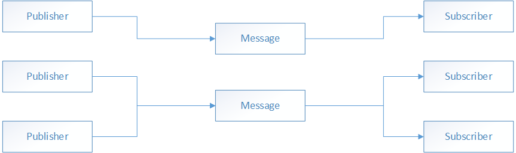

# Communicating between loosely coupled components

[!INCLUDE [download-alert](includes/download-alert.md)]

The publish-subscribe pattern is a messaging pattern in which publishers send messages without knowing any receivers, known as subscribers. Similarly, subscribers listen for specific messages, without knowing any publishers.

Events in .NET implement the publish-subscribe pattern and are the most simple approach for a communication layer between components if loose coupling is not required, such as a control and the page that contains it. However, the publisher and subscriber lifetimes are coupled by object references to each other, and the subscriber type must have a reference to the publisher type. This can create memory management issues, especially when there are short-lived objects that subscribe to an event of a static or long-lived object. If the event handler isn't removed, the subscriber will be kept alive by the reference to it in the publisher, and this will prevent or delay the garbage collection of the subscriber.

## Introduction to MVVM Toolkit Messenger

The MVVM Toolkit `IMessenger` interface describes the publish-subscribe pattern, allowing message-based communication between components that are inconvenient to link by object and type references. This mechanism allows publishers and subscribers to communicate without having a direct reference to each other, helping to reduce dependencies between components, while also allowing components to be independently developed and tested.

> [!NOTE]
> The MVVM Toolkit Messenger is part of the `CommunityToolkit.Mvvm` package. For information on how to add the package to your project, see [Introduction to the MVVM Toolkit](/dotnet/communitytoolkit/mvvm/) on the Microsoft Developer Center.

> [!WARNING]
> .NET MAUI contains a built-in `MessagingCenter` class which is no longer recommended for use and should be transitioned to the MVVM Toolkit Messenger.

The `IMessenger` interface allows for multicast publish-subscribe functionality. This means that there can be multiple publishers that publish a single message, and there can be multiple subscribers listening to the same message. The image below illustrates this relationship:



There are two implementations of the `IMessenger` interface that come with the `CommunityToolkit.Mvvm` package. The `WeakReferenceMessenger` uses weak references which can result in easier cleanup for message subscribers. This is a good option if your subscribers do not have a clearly defined lifecycle. The `StrongReferenceMessenger` uses strong references which can result in better performance and a more clearly controlled lifetime of the subscription. If you have a workflow with a very controlled lifetime (e.g. a subscription that is bound to a page's `OnAppearing` and `OnDisappearing` methods), the `StrongReferenceManager` may be a better option, if performance is a concern. Both of these implementations are available with default implementations ready to use by referencing either `WeakReferenceMessenger.Default` or `StrongReferenceMessenger.Default`.

> [!NOTE]
> While the `IMessenger` interface permits communication between loosely-coupled classes, it does not offer the only architectural solution to this issue. For example, communication between a view model and a view can also be achieved by the binding engine and through property change notifications. In addition, communication between two view models can also be achieved by passing data during navigation.

The eShopOnContainers multi-platform app uses the `WeakReferenceMessenger` class to communicate between loosely coupled components. The app defines a single message named `AddProductMessage`. The `AddProductMessage` is published by the `CatalogViewModel` class when an item is added to the shopping basket. In return, the `CatalogView` class subscribes to the message and uses this to highlight the product adds with animation in response.

In the eShopOnContainers multi-platform app, `WeakReferenceMessenger` is used to update the UI in response to an action occurring in another class. Therefore, messages are published from the thread that the class is executing on, with subscribers receiving the message on the same thread.

> [!TIP]
> Marshal to the UI or main thread when performing UI updates. If updates to user interfaces are not made on this thread, it can cause the application to crash or become unstable.

If a message that's sent from a background thread is required to update the UI, process the message on the UI thread in the subscriber by invoking the `MainThread.BeginInvokeOnMainThread` method.

For more information about `Messenger`, see [Messenger](/dotnet/communitytoolkit/mvvm/messenger) on the Microsoft Developer Center.

## Defining a message

`IMessenger` messages are custom objects that provide custom payloads. The following code example shows the `AddProductMessage` message defined within the eShopOnContainers multi-platform app:

```csharp
public class AddProductMessage : ValueChangedMessage<int>
{
    public AddProductMessage(int count) : base(count)
    {
    }
}
```

The base class is defined using `ValueChangedMessage<T>` where T can be of any type needed to pass data. Both message publishers and subscribers can expect messages of a specific type (i.e. `AddProductMessage`). This can help ensure that both parties have agreed to a messaging contract and that the data provided with that contract will be consistent. Additionally, this approach provides compile-time type safety and refactoring support.

## Publishing a message

To publish a message, we will need to use the `IMessenger.Send` method. This can be accessed most commonly through `WeakReferenceMessenger.Default.Send` or `StrongReferenceMessenger.Default.Send`. The message sent can be of any object type. The following code example demonstrates publishing the `AddProduct` message:

```csharp
WeakReferenceMessenger.Default.Send(new Messages.AddProductMessage(BadgeCount));
```

In this example, the `Send` method specifies provides a new instance of the `AddProductMessage` object for downstream subscribers to receive. An additional second token parameter can be added to use when multiple different subscribers need to receive messages of the same type without receiving the wrong message.

The `Send` method will publish the message, and its payload data, using a fire-and-forget approach. Therefore, the message is sent even if there are no subscribers registered to receive the message. In this situation, the sent message is ignored.

## Subscribing to a message

Subscribers can register to receive a message using one of the `IMessenger.Register<T>` overloads. The following code example demonstrates how the eShopOnContainers multi-platform app subscribes to, and processes, the `AddProductMessage` message:

```csharp
WeakReferenceMessenger.Default
    .Register<CatalogView, Messages.AddProductMessage>(
        this,
        async (recipient, message) =>
        {
            await recipient.Dispatcher.DispatchAsync(
                async () =>
                {
                    await recipient.badge.ScaleTo(1.2);
                    await recipient.badge.ScaleTo(1.0);
                });
        });
```

In the preceding example, the `Register` method subscribes to the `AddProductMessage` message and executes a callback delegate in response to receiving the message. This callback delegate, specified as a lambda expression, executes code that updates the UI.

> [!NOTE]
> Avoid the use of `this` within your callback delegate to avoid capturing that object within the delegate. This can help improve performance. Instead, use the `recipient` parameter.

If payload data is supplied, don't attempt to modify the payload data from within a callback delegate because several threads could be accessing the received data simultaneously. In this scenario, the payload data should be immutable to avoid concurrency errors.

## Unsubscribing from a message

Subscribers can unsubscribe from messages they no longer want to receive. This is achieved with one of the `IMessenger.Unregister` overloads, as demonstrated in the following code example:

```csharp
WeakReferenceMessenger.Default.Unregister<Messages.AddProductMessage>(this);
```

> [!NOTE]
> In this example, it is not fully necessary to call `Unregister` as the `WeakReferenceMessenger` will allow unused objects to be garbage collected. If the `StrongReferenceMessenger` were used, it would be advised to call `Unregister` for any subscriptions that are no longer in use.

In this example, the `Unsubscribe` method syntax specifies the type argument of the message and the recipient object that is listening for messages.

## Summary

The MVVM Toolkit `IMessenger` interface describes the publish-subscribe pattern, allowing message-based communication between components that are inconvenient to link by object and type references. This mechanism allows publishers and subscribers to communicate without having a reference to each other, helping to reduce dependencies between components, while also allowing components to be independently developed and tested.
