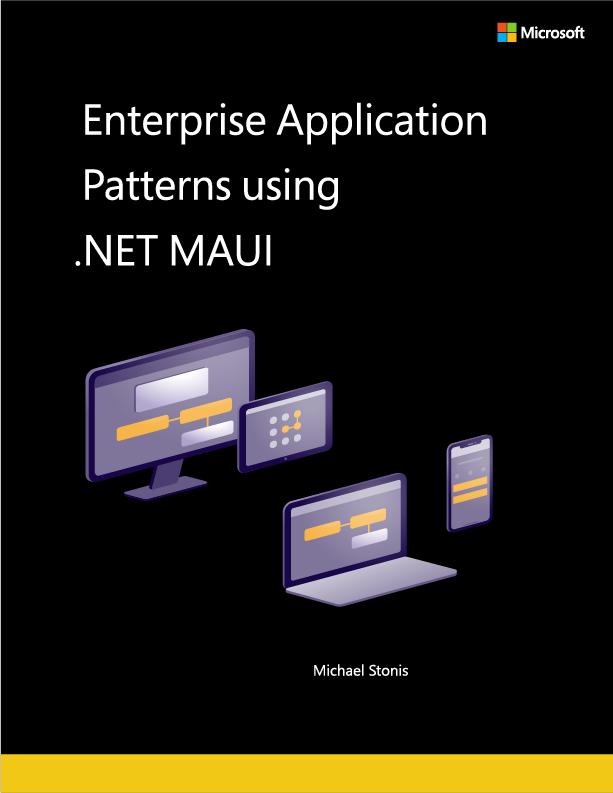

# Enterprise Application Patterns Using .NET MAUI

DOWNLOAD available at: <https://aka.ms/maui-ebook>

**EDITION v2.0**

PUBLISHED BY

Microsoft Developer Division, .NET, and Visual Studio product teams

A division of Microsoft Corporation

One Microsoft Way

Redmond, Washington 98052-6399

Copyright &copy; 2022 by Microsoft Corporation

All rights reserved. No part of the contents of this book may be reproduced or transmitted in any form or by any means without the written permission of the publisher.

This book is provided "as-is" and expresses the author's views and opinions. The views, opinions, and information expressed in this book, including URL and other Internet website references, may change without notice.

Some examples depicted herein are provided for illustration only and are fictitious. No real association or connection is intended or should be inferred.

Microsoft and the trademarks listed at <https://www.microsoft.com> on the "Trademarks" webpage are trademarks of the Microsoft group of companies.

Mac and macOS are trademarks of Apple Inc.

All other marks and logos are property of their respective owners.

Authors:

> **[Michael Stonis](https://github.com/michaelstonis)**, Mobile Software Architect, [Eight-Bot](https://eightbot.com)

Reviewers:

> **[James Montemagno](https://github.com/jamesmontemagno)**, Principal Lead Program Manager, Microsoft Corp.

> **[David Pine](https://github.com/IEvangelist)**, Developer Relations, Microsoft Corp.

## Acknowledgments

This book originated from the excellent Enterprise Application Patterns using Xamarin.Forms eBook by [David Britch](https://github.com/davidbritch) and [Javier Suarez Ruiz](https://github.com/jsuarezruiz). Without their hard work, detailed information, and excellent examples, this book would not be possible.

## Introduction

Enterprise applications face a number of difficult problems to solve including ever changing business requirements, the need for quick turn around time, support for multiple platforms, and integration with multiple systems. Due to the varying nature of these problems, it's important that our application's architecture allows it to be modular, modifiable and extensible over time.

This book takes provides real world solutions for addressing these issues when building an enterprise application using .NET MAUI. This book uses a pre-built .NET MAUI application that serves as the front-end of an online eCommerce application as a reference and a guide for common enterprise design patterns. This book covers topics such as the MVVM pattern, dependency injection, navigation, configuration, the loose-coupling of components and additional enterprise concerns. The content of this book is helpful for anyone looking to build a new application for this business or looking to solve the problems of applications that evolve over time.

## Who should use the book

This book is for .NET MAUI developers that are already familiar with the framework, but that are looking for guidance on architecture and implementation when building enterprise applications. This book can help developers solve common problems using tried and true patterns.

## How to use the book

This book focuses on building cross-platform enterprise apps using .NET MAUI. As such, it should be read in its entirety to provide a foundation of understanding such apps and their technical considerations. The book, along with its sample app, can also serve as a starting point or reference for creating a new enterprise app. Use the associated sample app as a template for the new app, or to see how to organize an app's component parts. Then, refer back to this guide for architectural guidance. You can find the sample app on [GitHub](https://github.com/dotnet/eshop).

## What this book doesn't cover

This book is aimed at readers who are already familiar with .NET MAUI. It does cover some concepts of .NET MAUI to help better illustrate the topic, but it does not cover most controls and concepts in any detail. For general guidance on building a new .NET MAUI app, please refer to the [Building your first app](/dotnet/maui/get-started/first-app) guide in the .NET MAUI documentation.

### Additional resources

For official .NET MAUI content, see [.NET MAUI docs](/dotnet/maui). .NET MAUI is developed as an open-source project and is available on GitHub at [dotnet/maui](https://github.com/dotnet/maui). For code samples developed with .NET MAUI, see the [dotnet/maui-samples](https://github.com/dotnet/maui-samples) repo.

[!INCLUDE [feedback](../includes/feedback.md)]

>[!div class="step-by-step"]
>[Next](introduction.md)
