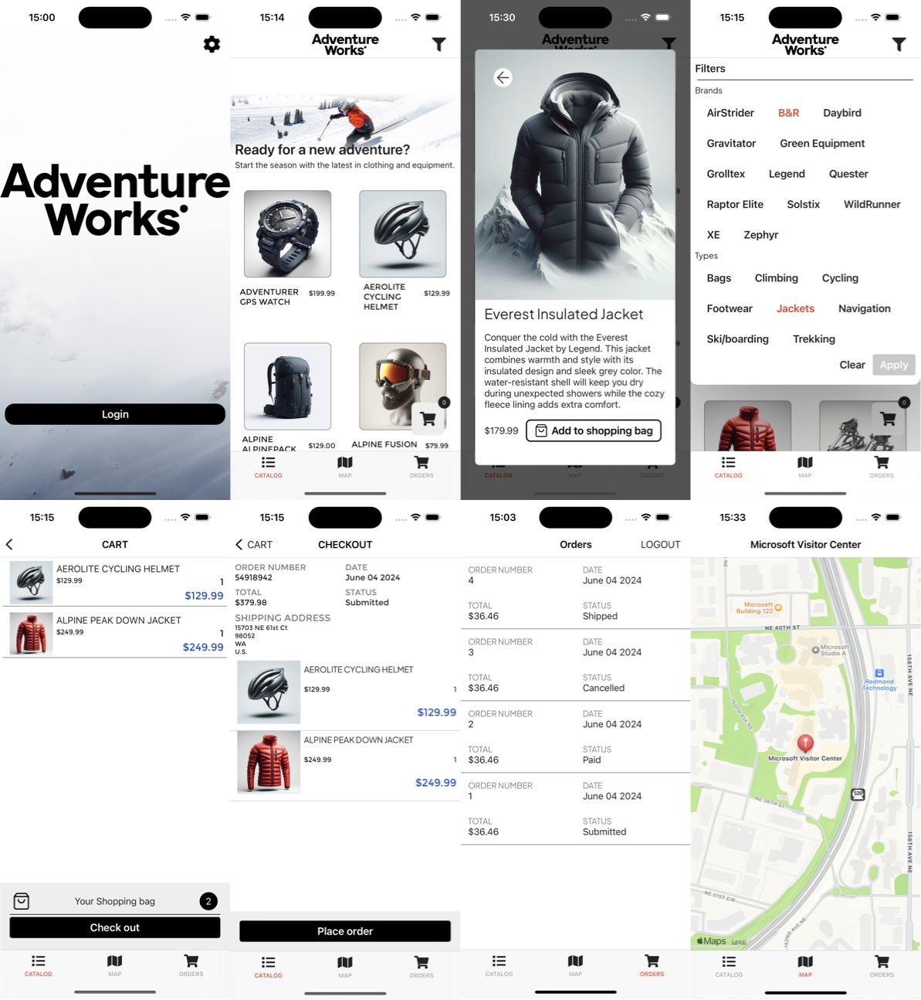

# Introduction to .NET MAUI

[!INCLUDE [download-alert](includes/download-alert.md)]

Regardless of platform, developers of enterprise apps face several challenges:

- App requirements that can change over time.
- New business opportunities and challenges.
- Ongoing feedback during development that can significantly affect the scope and requirements of the app.

With these in mind, it's important to build apps that can be easily modified or extended over time. Designing for such adaptability can be difficult as it requires an architecture that allows individual parts of the app to be independently developed and tested in isolation without affecting the rest of the app.

Many enterprise apps are sufficiently complex to require more than one developer. It can be a significant challenge to decide how to design an app so that multiple developers can work effectively on different pieces of the app independently, while ensuring that the pieces come together seamlessly when integrated into the app.

The traditional approach to designing and building an app results in what is referred to as a *monolithic* app, where components are tightly coupled with no clear separation between them. Typically, this monolithic approach leads to apps that are difficult and inefficient to maintain, because it can be difficult to resolve bugs without breaking other components in the app, and it can be difficult to add new features or to replace existing features.

An effective remedy for these challenges is to partition an app into discrete, loosely coupled components that can be easily integrated together into an app. Such an approach offers several benefits:

- It allows individual functionality to be developed, tested, extended, and maintained by different individuals or teams.
- It promotes reuse and a clean separation of concerns between the app's horizontal capabilities, such as authentication and data access, and the vertical capabilities, such as app specific business functionality. This allows the dependencies and interactions between app components to be more easily managed.
- It helps maintain a separation of roles by allowing different individuals, or teams, to focus on a specific task or piece of functionality according to their expertise. In particular, it provides a cleaner separation between the user interface and the app's business logic.

However, there are many issues that must be resolved when partitioning an app into discrete, loosely coupled components. These include:

- Deciding how to provide a clean separation of concerns between the user interface controls and their logic. One of the most important decisions when creating a .NET MAUI enterprise app is whether to place business logic in code-behind files, or whether to create a clean separation of concerns between the user interface controls and their logic, in order to make the app more maintainable and testable. For more information, see [Model-View-ViewModel](mvvm.md).
- Determining whether to use a dependency injection container. Dependency injection containers reduce the dependency coupling between objects by providing a facility to construct instances of classes with their dependencies injected, and manage their lifetime based on the configuration of the container. For more information, see [Dependency injection](dependency-injection.md).
- Choosing between platform provided eventing and loosely coupled message-based communication between components that are inconvenient to link by object and type references. For more information, see Introduction to [Communicating between loosely coupled components](communicating-between-components.md).
- Deciding how to navigate between pages, including how to invoke navigation, and where navigation logic should reside. For more information, see [Navigation](navigation.md).
- Determining how to validate user input for correctness. The decision must include how to validate user input, and how to notify the user about validation errors. For more information, see [Validation](validation.md).
- Deciding how to perform authentication, and how to protect resources with authorization. For more information, see [Authentication and authorization](authentication-and-authorization.md).
- Determining how to access remote data from web services, including how to reliably retrieve data, and how to cache data. For more information, see [Accessing remote data](accessing-remote-data.md).
- Deciding how to test the app. For more information, see [Unit testing](unit-testing.md).

This guide provides guidance on these issues, and focuses on the core patterns and architecture for building a cross-platform enterprise app using .NET MAUI. The guidance aims to help to produce adaptable, maintainable, and testable code, by addressing common .NET MAUI enterprise app development scenarios, and by separating the concerns of presentation, presentation logic, and entities through support for the Model-View-ViewModel (MVVM) pattern.

## Sample application

This guide includes a sample application, eShop, that's an online store that includes the following functionality:

- Authenticating and authorizing against a backend service.
- Browsing a catalog of items.
- Filtering the catalog.
- Ordering items from the catalog.
- Viewing the user's order history.
- Configuration of settings.

## Sample application architecture

Below is a high-level overview of the architecture of the sample application.

The sample application ships with:

- .NET Aspire App Hosting & Orchestration
- An Blazor web application developed with ASP.NET Core.
- A multi-platform app developed with .NET MAUI, which supports iOS, Android, macOS via Mac Catalyst, and Windows.

The sample application includes the following backend services:

- An identity microservice, which uses ASP.NET Core Identity and IdentityServer.
- A catalog microservice, which is a data-driven create, read, update, delete (CRUD) service that consumes an SQL Server database using EntityFramework Core.
- An ordering microservice, which is a domain-driven service that uses domain-driven design patterns.
- A basket microservice, which is a data-driven CRUD service that uses Redis Cache.

These backend services are implemented as microservices using ASP.NET Core, and are deployed as unique containers with .NET Aspire. Collectively, these backend services are referred to as the eShop reference application. Client apps communicate with the backend services through a Representational State Transfer (REST) web interface. For more information about microservices and containers, see [Containerized microservices](micro-services.md).

## Multi-Platform app

This guide focuses on building cross-platform enterprise apps using .NET MAUI, and uses the eShop multi-platform app as an example. The image below shows the pages from the eShop multi-platform app that provide the functionality outlined earlier.

The multi-platform app consumes the backend services provided by the eShop reference application. However, it can be configured to consume data from mock services for those who wish to avoid deploying the backend services.

The eShop multi-platform app exercises the following .NET MAUI functionality:

- XAML
- Controls
- Bindings
- Converters
- Styles
- Animations
- Commands
- Behaviors
- Triggers
- Effects
- Custom Controls

For more information about this functionality, see the [.NET MAUI documentation](/dotnet/maui).

In addition, unit tests are provided for some of the classes in the eShop multi-platform app.

## Multi-Platform app solution

The eShop multi-platform app solution organizes the source code and other resources into a multiple projects. All of the core mobile components are contained in a singular project named eShopContainers. This is a feature introduced with .NET 6 that allows a project to target multiple outputs which helps eliminate the need for multiple platform projects that we would have used in earlier .NET versions. An additional project is included for unit testing.

While this project has all of its components stored in a singular project, it is worth considering separating it into multiple projects based on your needs. For example, if you have multiple implementations of service providers based off of a service with their own dependencies, it may make sense to break those service provider implementations out into their own separate project. Good candidates for project separation include shared models, service implementations, api client components, database or caching layers. Any place where you feel that the business could re-use a component in another project is a potential candidate for separation. These projects can then be packaged via [NuGet](/nuget/) for easy distribution and versioning.

All of the projects use folders to organize the source code and other resources into categories. The classes from the eShop multi-platform app can be re-used in any .NET MAUI app with little or no modification.

## eShop project

The eShop project contains the following folders:

| Folder        | Description                                                                           |
|---------------|---------------------------------------------------------------------------------------|
| _Animations_  | Contains classes that enable animations to be consumed in XAML.                       |
| _Behaviors_   | Contains behaviors that are exposed to view classes.                                  |
| _Controls_    | Contains custom controls used by the app.                                             |
| _Converters_  | Contains value converters that apply custom logic to a binding.                       |
| _Exceptions_  | Contains the custom ServiceAuthenticationException.                                   |
| _Extensions_  | Contains extension methods for the `VisualElement` and `IEnumerable<T>` classes.          |
| _Helpers_     | Contains helper classes for the app.                                                  |
| _Models_      | Contains the model classes for the app.                                               |
| _Properties_  | Contains AssemblyInfo.cs, a .NET assembly metadata file.                              |
| _Services_    | Contains interfaces and classes that implement services that are provided to the app. |
| _Triggers_    | Contains the BeginAnimation trigger, which is used to invoke an animation in XAML.    |
| _Validations_ | Contains classes involved in validating data input.                                   |
| _ViewModels_  | Contains the application logic that's exposed to pages.                               |
| _Views_       | Contains the pages for the app.                                                       |

## Summary

Microsoft's cross-platform multi-platform app development tools and platforms provide a comprehensive solution for B2E, B2B, and B2C mobile client apps, providing the ability to share code across all target platforms (iOS, macOS, Android, and Windows) and helping to lower the total cost of ownership. Apps can share their user interface and app logic code, while retaining the native platform look and feel.

Developers of enterprise apps face several challenges that can alter the architecture of the app during development. Therefore, it's important to build an app so that it can be modified or extended over time. Designing for such adaptability can be difficult, but typically involves partitioning an app into discrete, loosely coupled components that can be easily integrated together into an app.
