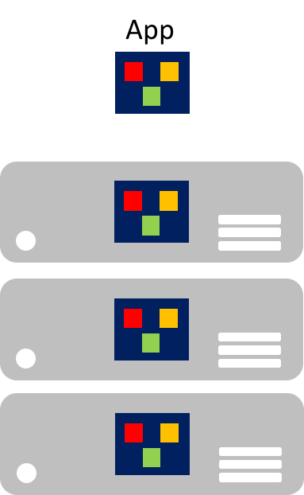
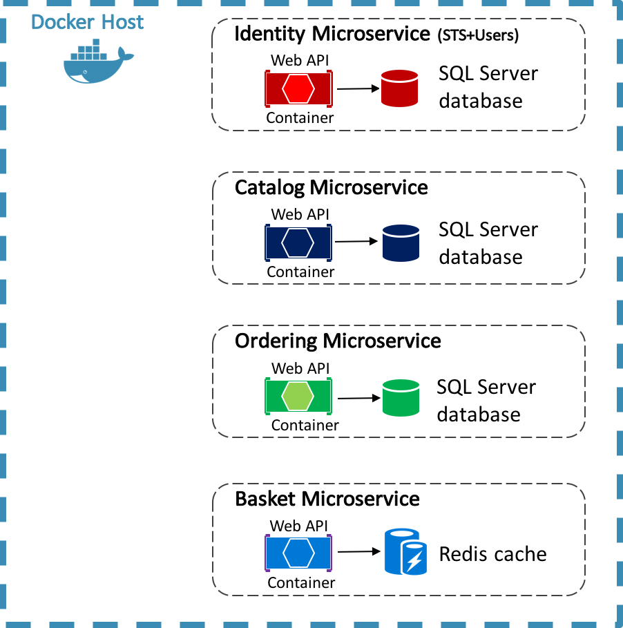
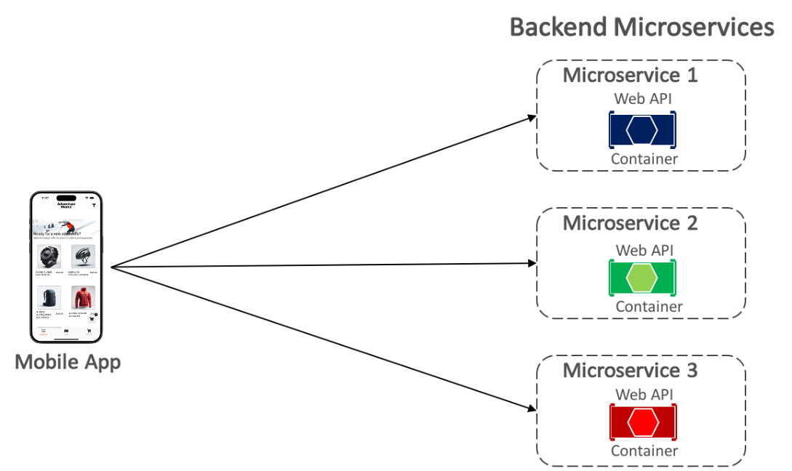
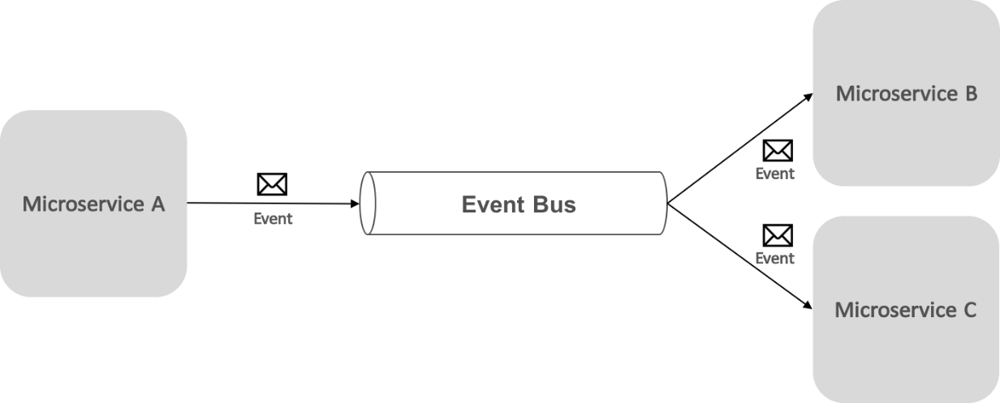
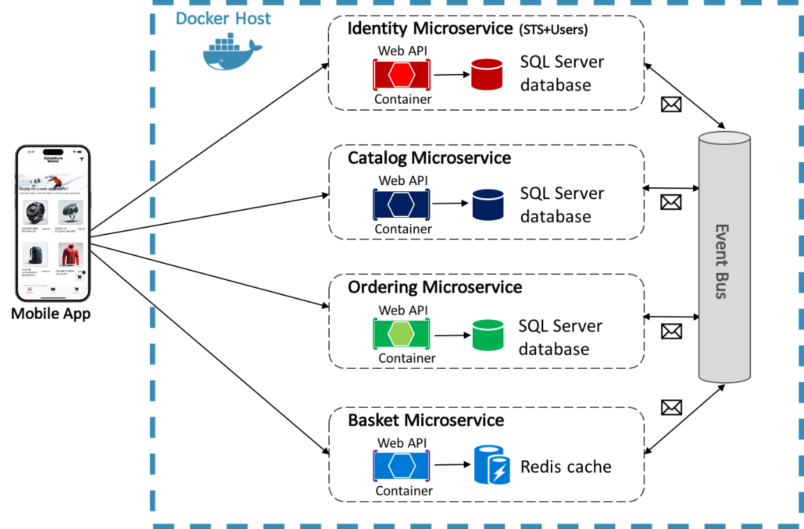

# Containerized microservices

[!INCLUDE [download-alert](includes/download-alert.md)]

Developing client-server applications has resulted in a focus on building tiered applications that use specific technologies in each tier. Such applications are often referred to as _monolithic_ and are packaged onto hardware pre-scaled for peak loads. The main drawbacks of this development approach are the tight coupling between components within each tier, that individual components can't be easily scaled, and the cost of testing. A simple update can have unforeseen effects on the rest of the tier, so a change to an application component requires its entire tier to be retested and redeployed.

Particularly concerning, in the age of the cloud, is that individual components can't be easily scaled. A monolithic application contains domain-specific functionality and is typically divided by functional layers such as front-end, business logic, and data storage. The image below illustrates that a monolithic application is scaled by cloning the entire application onto multiple machines.

## Microservices

Microservices offer a different approach to application development and deployment, an approach that's suited to the agility, scale, and reliability requirements of modern cloud applications. A microservices application is split into independent components that work together to deliver the application's overall functionality. The term microservice emphasizes that applications should be composed of services small enough to reflect particular concerns, so each microservice implements a single function. In addition, each microservice has well-defined contracts with which other microservices communicate and share data. Typical examples of microservices include shopping carts, inventory processing, purchase subsystems, and payment processing.

Microservices can scale independently compared to giant monolithic applications that scale together. This means that a specific functional area that requires more processing power or network bandwidth to support demand can be scaled rather than unnecessarily scaling out other application areas. The image below illustrates this approach, where microservices are deployed and scaled independently, creating instances of services across machines.

Microservice scale-out can be nearly instantaneous, allowing an application to adapt to changing loads. For example, a single microservice in the web-facing functionality of an application might be the only microservice that needs to scale out to handle additional incoming traffic.

The classic model for application scalability is to have a load-balanced, stateless tier with a shared external datastore to store persistent data. Stateful microservices manage their own persistent data, usually storing it locally on the servers on which they are placed, to avoid the overhead of network access and complexity of cross-service operations. This enables the fastest possible processing of data and can eliminate the need for caching systems. In addition, scalable stateful microservices usually partition data among their instances, in order to manage data size and transfer throughput beyond which a single server can support.

Microservices also support independent updates. This loose coupling between microservices provides a rapid and reliable application evolution. Their independent, distributed nature helps rolling updates, where only a subset of instances of a single microservice will update at any given time. Therefore, if a problem is detected, a buggy update can be rolled back, before all instances update with the faulty code or configuration. Similarly, microservices typically use schema versioning, so that clients see a consistent version when updates are being applied, regardless of which microservice instance is being communicated with.

Therefore, microservice applications have many benefits over monolithic applications:

- Each microservice is relatively small, easy to manage and evolve.
- Each microservice can be developed and deployed independently of other services.
- Each microservice can be scaled-out independently. For example, a catalog service or shopping basket service might need to be scaled-out more than an ordering service. Therefore, the resulting infrastructure will more efficiently consume resources when scaling out.
- Each microservice isolates any issues. For example, if there is an issue in a service it only impacts that service. The other services can continue to handle requests.
- Each microservice can use the latest technologies. Because microservices are autonomous and run side-by-side, the latest technologies and frameworks can be used, rather than being forced to use an older framework that might be used by a monolithic application.

However, a microservice-based solution also has potential drawbacks:

- Choosing how to partition an application into microservices can be challenging, as each microservice has to be completely autonomous, end-to-end, including responsibility for its data sources.
- Developers must implement inter-service communication, which adds complexity and latency to the application.
- Atomic transactions between multiple microservices usually aren't possible. Therefore, business requirements must embrace eventual consistency between microservices.
- In production, there is an operational complexity in deploying and managing a system compromised of many independent services.
- Direct client-to-microservice communication can make it difficult to refactor the contracts of microservices. For example, over time how the system is partitioned into services might need to change. A single service might split into two or more services, and two services might merge. When clients communicate directly with microservices, this refactoring work can break compatibility with client apps.

## Containerization

Containerization is an approach to software development in which an application and its versioned set of dependencies, plus its environment configuration abstracted as deployment manifest files, are packaged together as a container image, tested as a unit, and deployed to a host operating system.

A container is an isolated, resource controlled, and portable operating environment, where an application can run without touching the resources of other containers, or the host. Therefore, a container looks and acts like a newly installed physical computer or a virtual machine.

There are many similarities between containers and virtual machines, as illustrated below.

A container runs an operating system, has a file system, and can be accessed over a network as if it were a physical or virtual machine. However, the technology and concepts used by containers are very different from virtual machines. Virtual machines include the applications, the required dependencies, and a full guest operating system. Containers include the application and its dependencies, but share the operating system with other containers, running as isolated processes on the host operating system (aside from Hyper-V containers which run inside of a special virtual machine per container). Therefore, containers share resources and typically require fewer resources than virtual machines.

The advantage of a container-oriented development and deployment approach is that it eliminates most of the issues that arise from inconsistent environment setups and the problems that come with them. In addition, containers permit fast application scale-up functionality by instancing new containers as required.

The key concepts when creating and working with containers are:

| Concept | Description |
|---------|---------|
| Container Host | The physical or virtual machine configured to host containers. The container host will run one or more containers. |
| Container Image | An image consists of a union of layered filesystems stacked on top of each other, and is the basis of a container. An image does not have state and it never changes as it's deployed to different environments. |
| Container | A container is a runtime instance of an image. |
| Container OS Image | Containers are deployed from images. The container operating system image is the first layer in potentially many image layers that make up a container. A container operating system is immutable, and can't be modified. |
| Container Repository | Each time a container image is created, the image and its dependencies are stored in a local repository. These images can be reused many times on the container host. The container images can also be stored in a public or private registry, such as [Docker Hub](https://hub.docker.com/), so that they can be used across different container hosts. |

Enterprises are increasingly adopting containers when implementing microservice-based applications, and Docker has become the standard container implementation that has been adopted by most software platforms and cloud vendors.

The eShop reference application uses Docker to host four containerized back-end microservices, as illustrated in the diagram below.

The architecture of the back-end services in the reference application is decomposed into multiple autonomous sub-systems in the form of collaborating microservices and containers. Each microservice provides a single area of functionality: an identity service, a catalog service, an ordering service, and a basket service.

Each microservice has its own database, allowing it to be fully decoupled from the other microservices. Where necessary, consistency between databases from different microservices is achieved using application-level events. For more information, see [Communication between microservices](#communication-between-microservices).

## Communication between client and microservices

The eShop multi-platform app communicates with the containerized back-end microservices using _direct client-to-microservice_ communication, as shown below.

With direct client-to-microservice communication, the multi-platform app makes requests to each microservice directly through its public endpoint, with a different TCP port per microservice. In production, the endpoint would typically map to the microservice's load balancer, which distributes requests across the available instances.

> [!TIP]
> Consider using API gateway communication.

Direct client-to-microservice communication can have drawbacks when building a large and complex microservice-based application, but it's more than adequate for a small application. Consider using API gateway communication when designing a large microservice-based application with tens of microservices.

## Communication between microservices

A microservices-based application is a distributed system, potentially running on multiple machines. Each service instance is typically a process. Therefore, services must interact using an inter-process communication protocol, such as HTTP, TCP, Advanced Message Queuing Protocol (AMQP), or binary protocols, depending on the nature of each service.

The two common approaches for microservice-to-microservice communication are HTTP-based REST communication when querying for data, and lightweight asynchronous messaging when communicating updates across multiple microservices.

Asynchronous messaging-based event-driven communication is critical when propagating changes across multiple microservices. With this approach, a microservice publishes an event when something notable happens, for example, when it updates a business entity. Other microservices subscribe to these events. Then, when a microservice receives an event, it updates its own business entities, which might, in turn, lead to more events being published. This publish-subscribe functionality is usually achieved with an event bus.

An event bus allows publish-subscribe communication between microservices without requiring the components to be explicitly aware of each other, as shown below.

From an application perspective, the event bus is simply a publish-subscribe channel exposed via an interface. However, the way the event bus is implemented can vary. For example, an event bus implementation could use RabbitMQ, Azure Service Bus, or other service buses such as NServiceBus and MassTransit. The diagram below shows how an event bus is used in the eShop reference application.

The eShop event bus, implemented using RabbitMQ, provides one-to-many asynchronous publish-subscribe functionality. This means that after publishing an event, there can be multiple subscribers listening for the same event. The diagram below illustrates this relationship.

This one-to-many communication approach uses events to implement business transactions that span multiple services, ensuring eventual consistency between the services. An eventual-consistent transaction consists of a series of distributed steps. Therefore, when the user-profile microservice receives the UpdateUser command, it updates the user's details in its database and publishes the UserUpdated event to the event bus. Both the basket microservice and the ordering microservice have subscribed to receive this event, and in response, update their buyer information in their respective databases.

## Summary

Microservices offer an approach to application development and deployment that's suited to the agility, scale, and reliability requirements of modern cloud applications. One of the main advantages of microservices is that they can be scaled-out independently, which means that a specific functional area can be scaled that requires more processing power or network bandwidth to support demand without unnecessarily scaling areas of the application that are not experiencing increased demand.

A container is an isolated, resource-controlled, and portable operating environment where an application can run without touching the resources of other containers or the host. Enterprises are increasingly adopting containers when implementing microservice-based applications, and Docker has become the standard container implementation that most software platforms and cloud vendors have adopted.
