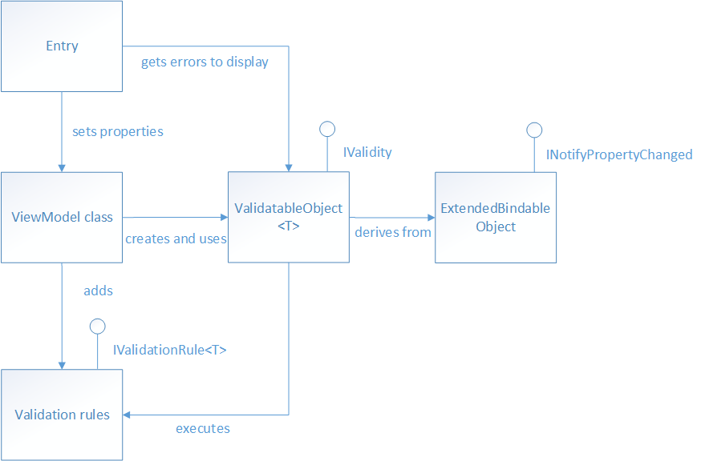
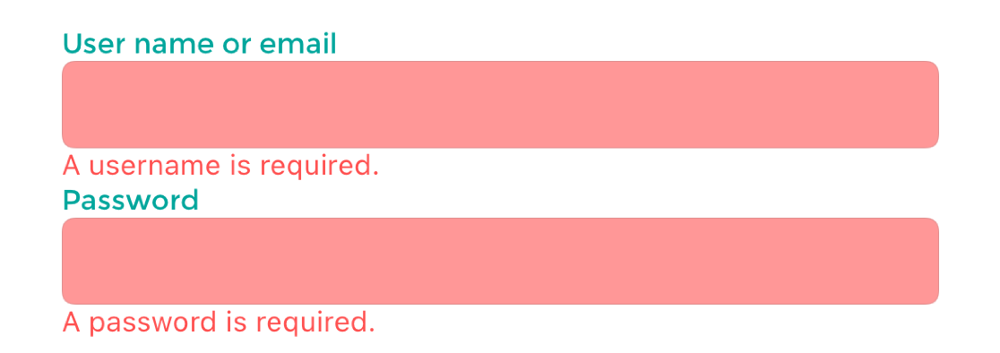

# Validation

[!INCLUDE [download-alert](includes/download-alert.md)]

Any app that accepts input from users should ensure that the input is valid. An app could, for example, check for input that contains only characters in a particular range, is of a certain length, or matches a particular format. Without validation, a user can supply data that causes the app to fail. Proper validation enforces business rules and could help to prevent an attacker from injecting malicious data.

In the context of the Model-View-ViewModel (MVVM) pattern, a view model or model will often be required to perform data validation and signal any validation errors to the view so that the user can correct them. The eShop multi-platform app performs synchronous client-side validation of view model properties and notifies the user of any validation errors by highlighting the control that contains the invalid data, and by displaying error messages that inform the user of why the data is invalid. The image below shows the classes involved in performing validation in the eShop multi-platform app.



View model properties that require validation are of type `ValidatableObject<T>`, and each `ValidatableObject<T>` instance has validation rules added to its `Validations` property. Validation is invoked from the view model by calling the `Validate` method of the `ValidatableObject<T>` instance, which retrieves the validation rules and executes them against the `ValidatableObject<T>.Value` property. Any validation errors are placed into the `Errors` property of the `ValidatableObject<T>` instance, and the `IsValid` property of the `ValidatableObject<T>` instance is updated to indicate whether the validation succeeded or failed. The following code shows the implementation of the `ValidatableObject<T>`:

```csharp
using CommunityToolkit.Mvvm.ComponentModel;
namespace eShop.Validations;
public class ValidatableObject<T> : ObservableObject, IValidity
{
    private IEnumerable<string> _errors;
    private bool _isValid;
    private T _value;
    public List<IValidationRule<T>> Validations { get; } = new();
    public IEnumerable<string> Errors
    {
        get => _errors;
        private set => SetProperty(ref _errors, value);
    }
    public bool IsValid
    {
        get => _isValid;
        private set => SetProperty(ref _isValid, value);
    }
    public T Value
    {
        get => _value;
        set => SetProperty(ref _value, value);
    }
    public ValidatableObject()
    {
        _isValid = true;
        _errors = Enumerable.Empty<string>();
    }
    public bool Validate()
    {
        Errors = Validations
            ?.Where(v => !v.Check(Value))
            ?.Select(v => v.ValidationMessage)
            ?.ToArray()
            ?? Enumerable.Empty<string>();
        IsValid = !Errors.Any();
        return IsValid;
    }
}
```

Property change notification is provided by the `ObservableObject` class, and so an `Entry` control can bind to the `IsValid` property of `ValidatableObject<T>` instance in the view model class to be notified of whether or not the entered data is valid.

## Specifying validation rules

Validation rules are specified by creating a class that derives from the `IValidationRule<T>` interface, which is shown in the following code example:

```csharp
public interface IValidationRule<T>
{
    string ValidationMessage { get; set; }
    bool Check(T value);
}
```

This interface specifies that a validation rule class must provide a boolean `Check` method that is used to perform the required validation, and a `ValidationMessage` property whose value is the validation error message that will be displayed if validation fails.

The following code example shows the `IsNotNullOrEmptyRule<T>` validation rule, which is used to perform validation of the username and password entered by the user on the `LoginView` when using mock services in the eShop multi-platform app:

```csharp
public class IsNotNullOrEmptyRule<T> : IValidationRule<T>
{
    public string ValidationMessage { get; set; }

    public bool Check(T value) =>
        value is string str && !string.IsNullOrWhiteSpace(str);
}
```

The `Check` method returns a boolean indicating whether the value argument is null, empty, or consists only of whitespace characters.

Although not used by the eShop multi-platform app, the following code example shows a validation rule for validating email addresses:

```csharp
public class EmailRule<T> : IValidationRule<T>
{
    private readonly Regex _regex = new(@"^([w.-]+)@([w-]+)((.(w){2,3})+)$");

    public string ValidationMessage { get; set; }

    public bool Check(T value) =>
        value is string str && _regex.IsMatch(str);
}
```

The `Check` method returns a boolean indicating whether or not the value argument is a valid email address. This is achieved by searching the value argument for the first occurrence of the regular expression pattern specified in the `Regex` constructor. Whether the regular expression pattern has been found in the input string can be determined by checking the `value` against <xref:System.Text.RegularExpressions.Regex.IsMatch%2A?displayProperty=nameWithType>.

> [!NOTE]
> Property validation can sometimes involve dependent properties. An example of dependent properties is when the set of valid values for property A depends on the particular value that has been set in property B. To check that the value of property A is one of the allowed values would involve retrieving the value of property B. In addition, when the value of property B changes, property A would need to be revalidated.

## Adding validation rules to a property

In the eShop multi-platform app, view model properties that require validation are declared to be of type `ValidatableObject<T>`, where `T` is the type of the data to be validated. The following code example shows an example of two such properties:

```csharp
public ValidatableObject<string> UserName { get; private set; }
public ValidatableObject<string> Password { get; private set; }
```

For validation to occur, validation rules must be added to the Validations collection of each `ValidatableObject<T>` instance, as demonstrated in the following code example:

```csharp
private void AddValidations()
{
    UserName.Validations.Add(new IsNotNullOrEmptyRule<string> 
    { 
        ValidationMessage = "A username is required." 
    });

    Password.Validations.Add(new IsNotNullOrEmptyRule<string> 
    { 
        ValidationMessage = "A password is required." 
    });
}
```

This method adds the `IsNotNullOrEmptyRule<T>` validation rule to the `Validations` collection of each `ValidatableObject<T>` instance, specifying values for the validation rule's `ValidationMessage` property, which specifies the validation error message that will be displayed if validation fails.

## Triggering validation

The validation approach used in the eShop multi-platform app can manually trigger validation of a property, and automatically trigger validation when a property changes.

### Triggering validation manually

Validation can be triggered manually for a view model property. For example, this occurs in the eShop multi-platform app when the user taps the `Login` button on the `LoginView`, when using mock services. The command delegate calls the `MockSignInAsync` method in the `LoginViewModel`, which invokes validation by executing the `Validate` method, which is shown in the following code example:

```csharp
private bool Validate()
{
    bool isValidUser = ValidateUserName();
    bool isValidPassword = ValidatePassword();
    return isValidUser && isValidPassword;
}

private bool ValidateUserName()
{
    return _userName.Validate();
}

private bool ValidatePassword()
{
    return _password.Validate();
}
```

The `Validate` method performs validation of the username and password entered by the user on the `LoginView`, by invoking the `Validate` method on each `ValidatableObject<T>` instance. The following code example shows the `Validate` method from the `ValidatableObject<T>` class:

```csharp
public bool Validate()
{
    Errors = _validations
        ?.Where(v => !v.Check(Value))
        ?.Select(v => v.ValidationMessage)
        ?.ToArray()
        ?? Enumerable.Empty<string>();

    IsValid = !Errors.Any();

    return IsValid;
}
```

This method retrieves any validation rules that were added to the object's `Validations` collection. The `Check` method for each retrieved validation rule is executed, and the `ValidationMessage` property value for any validation rule that fails to validate the data is added to the `Errors` collection of the `ValidatableObject<T>` instance. Finally, the `IsValid` property is set, and its value is returned to the calling method, indicating whether validation succeeded or failed.

### Triggering validation when properties change

Validation is also automatically triggered whenever a bound property changes. For example, when a two-way binding in the `LoginView` sets the `UserName` or `Password` property, validation is triggered. The following code example demonstrates how this occurs:

```xml
<Entry Text="{Binding UserName.Value, Mode=TwoWay}">
    <Entry.Behaviors>
        <behaviors:EventToCommandBehavior
            EventName="TextChanged"
            Command="{Binding ValidateUserNameCommand}" />
    </Entry.Behaviors>
</Entry>
```

The `Entry` control binds to the `UserName.Value` property of the `ValidatableObject<T>` instance, and the control's `Behaviors` collection has an `EventToCommandBehavior` instance added to it. This behavior executes the `ValidateUserNameCommand` in response to the `TextChanged` event firing on the `Entry`, which is raised when the text in the `Entry` changes. In turn, the `ValidateUserNameCommand` delegate executes the `ValidateUserName` method, which executes the `Validate` method on the `ValidatableObject<T>` instance. Therefore, every time the user enters a character in the `Entry` control for the username, validation of the entered data is performed.

## Displaying validation errors

The eShop multi-platform app notifies the user of any validation errors by highlighting the control that contains the invalid data with a red background, and by displaying an error message that informs the user why the data is invalid below the control containing the invalid data. When the invalid data is corrected, the background changes back to the default state and the error message is removed. The image below shows the `LoginView` in the eShop multi-platform app when validation errors are present.



### Highlighting a control that contains invalid data

.NET MAUI offers a number of ways to present validation information to end-users, but one of the most straight-forward ways is through the use of `Triggers`. `Triggers` provide us a way to change the state of our controls, typically for appearance, based on an event or data change that occurs for a control. For validation, we will be using a `DataTrigger` which will listen to changes raised from a bound property and respond to the changes. The `Entry` controls on the `LoginView` are setup using the following code:

```xml
<Entry Text="{Binding UserName.Value, Mode=TwoWay}">
    <Entry.Style>
        <OnPlatform x:TypeArguments="Style">
            <On Platform="iOS, Android" Value="{StaticResource EntryStyle}" />
            <On Platform="WinUI" Value="{StaticResource WinUIEntryStyle}" />
        </OnPlatform>
    </Entry.Style>
    <Entry.Behaviors>
        <mct:EventToCommandBehavior
            EventName="TextChanged"
            Command="{Binding ValidateCommand}" />
    </Entry.Behaviors>
    <Entry.Triggers>
        <DataTrigger 
            TargetType="Entry"
            Binding="{Binding UserName.IsValid}"
            Value="False">
            <Setter Property="BackgroundColor" Value="{StaticResource ErrorColor}" />
        </DataTrigger>
    </Entry.Triggers>
</Entry>
```

The `DataTrigger` specifies the following properties:

| Property | Description |
|---------|---------|
| `TargetType` | The control type that the trigger belongs to. |
| `Binding` | The data `Binding` markup which will provide change notifications and value for the trigger condition. |
| `Value` | The data value to specify when the trigger's condition has been met. |

For this `Entry`, we will be listening for changes to the `LoginViewModel.UserName.IsValid` property. Each time this property raises a change, the value will be compared against the `Value` property set in the `DataTrigger`. If the values are equal, then the trigger condition will be met and any `Setter` objects provided to the `DataTrigger` will be executed. This control has a single `Setter` object that updates the `BackgroundColor` property to a custom color defined using the `StaticResource` markup. When a `Trigger` condition is no longer met, the control will revert the properties set by the `Setter` object to their previous state. For more information about `Triggers`, see [.NET MAUI Docs: Triggers](/dotnet/maui/fundamentals/triggers).

### Displaying error messages

The UI displays validation error messages in Label controls below each control whose data failed validation. The following code example shows the `Label` that displays a validation error message, if the user has not entered a valid username:

```xml
<Label
    Text="{Binding UserName.Errors, Converter={StaticResource FirstValidationErrorConverter}"
    Style="{StaticResource ValidationErrorLabelStyle}" />
```

Each Label binds to the `Errors` property of the view model object that's being validated. The `Errors` property is provided by the `ValidatableObject<T>` class, and is of type `IEnumerable<string>`. Because the `Errors` property can contain multiple validation errors, the `FirstValidationErrorConverter` instance is used to retrieve the first error from the collection for display.

## Summary

The eShop multi-platform app performs synchronous client-side validation of view model properties and notifies the user of any validation errors by highlighting the control that contains the invalid data, and by displaying error messages that inform the user why the data is invalid.

View model properties that require validation are of type `ValidatableObject<T>`, and each `ValidatableObject<T>` instance has validation rules added to its `Validations` property. Validation is invoked from the view model by calling the `Validate` method of the `ValidatableObject<T>` instance, which retrieves the validation rules and executes them against the `ValidatableObject<T>` Value property. Any validation errors are placed into the `Errors` property of the `ValidatableObject<T>` instance, and the IsValid property of the `ValidatableObject<T>` instance is updated to indicate whether validation succeeded or failed.
