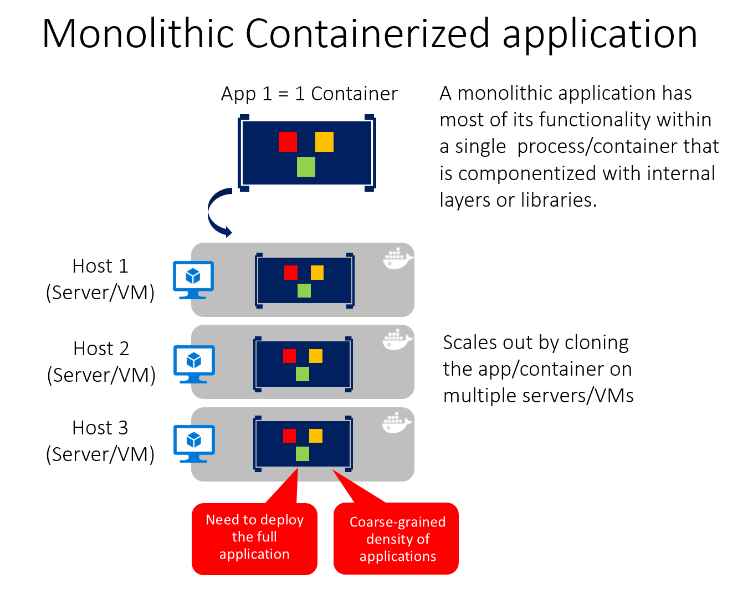
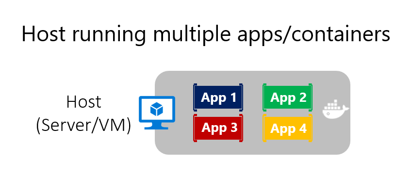
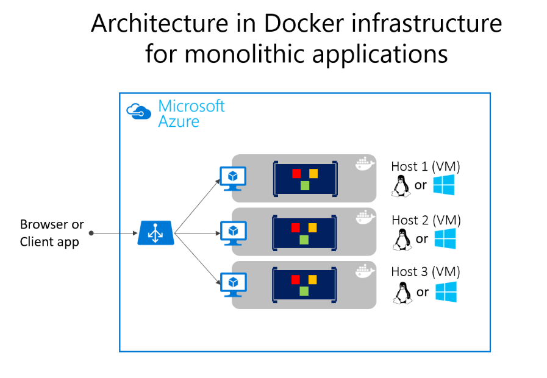
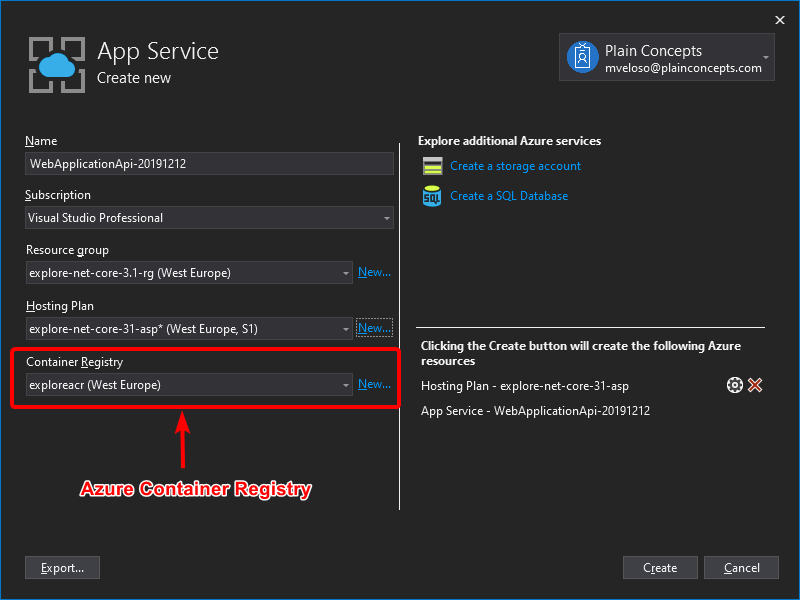

# Containerizing monolithic applications

You might want to build a single, monolithically deployed web application or service and deploy it as a container. The application itself might not be internally monolithic, but structured as several libraries, components, or even layers (application layer, domain layer, data-access layer, etc.). Externally, however, it's a single container—a single process, a single web application, or a single service.

To manage this model, you deploy a single container to represent the application. To increase capacity, you scale out, that is, just add more copies with a load balancer in front. The simplicity comes from managing a single deployment in a single container or VM.

**Figure 4-1**. Example of the architecture of a containerized monolithic application

You can include multiple components, libraries, or internal layers in each container, as illustrated in Figure 4-1. A monolithic containerized application has most of its functionality within a single container, with internal layers or libraries, and scales out by cloning the container on multiple servers/VMs. However, this monolithic pattern might conflict with the container principle "a container does one thing, and does it in one process", but might be ok for some cases.

The downside of this approach becomes evident if the application grows, requiring it to scale. If the entire application can scale, it isn't really a problem. However, in most cases, just a few parts of the application are the choke points that require scaling, while other components are used less.

For example, in a typical e-commerce application, you likely need to scale the product information subsystem, because many more customers browse products than purchase them. More customers use their basket than use the payment pipeline. Fewer customers add comments or view their purchase history. And you might have only a handful of employees that need to manage the content and marketing campaigns. If you scale the monolithic design, all the code for these different tasks is deployed multiple times and scaled at the same grade.

There are multiple ways to scale an application-horizontal duplication, splitting different areas of the application, and partitioning similar business concepts or data. But, in addition to the problem of scaling all components, changes to a single component require complete retesting of the entire application, and a complete redeployment of all the instances.

However, the monolithic approach is common, because the development of the application is initially easier than for microservices approaches. Thus, many organizations develop using this architectural approach. While some organizations have had good enough results, others are hitting limits. Many organizations designed their applications using this model because tools and infrastructure made it too difficult to build service-oriented architectures (SOA) years ago, and they did not see the need-until the application grew.

From an infrastructure perspective, each server can run many applications within the same host and have an acceptable ratio of efficiency in resources usage, as shown in Figure 4-2.

**Figure 4-2**. Monolithic approach: Host running multiple apps, each app running as a container

Monolithic applications in Microsoft Azure can be deployed using dedicated VMs for each instance. Additionally, using [Azure virtual machine scale sets](https://azure.microsoft.com/documentation/services/virtual-machine-scale-sets/), you can easily scale the VMs. [Azure App Service](https://azure.microsoft.com/services/app-service/) can also run monolithic applications and easily scale instances without requiring you to manage the VMs. Since 2016, Azure App Services can run single instances of Docker containers as well, simplifying deployment.

As a QA environment or a limited production environment, you can deploy multiple Docker host VMs and balance them using the Azure balancer, as shown in Figure 4-3. This lets you manage scaling with a coarse-grain approach, because the whole application lives within a single container.

**Figure 4-3**. Example of multiple hosts scaling up a single container application

Deployment to the various hosts can be managed with traditional deployment techniques. Docker hosts can be managed with commands like `docker run` or `docker-compose` performed manually, or through automation such as continuous delivery (CD) pipelines.

## Deploying a monolithic application as a container

There are benefits to using containers to manage monolithic application deployments. Scaling container instances is far faster and easier than deploying additional VMs. Even if you use virtual machine scale sets, VMs take time to start. When deployed as traditional application instances instead of containers, the configuration of the application is managed as part of the VM, which isn't ideal.

Deploying updates as Docker images is far faster and network efficient. Docker images typically start in seconds, which speeds rollouts. Tearing down a Docker image instance is as easy as issuing a `docker stop` command, and typically completes in less than a second.

Because containers are immutable by design, you never need to worry about corrupted VMs. In contrast, update scripts for a VM might forget to account for some specific configuration or file left on disk.

While monolithic applications can benefit from Docker, we're touching only on the benefits. Additional benefits of managing containers come from deploying with container orchestrators, which manage the various instances and lifecycle of each container instance. Breaking up the monolithic application into subsystems that can be scaled, developed, and deployed individually is your entry point into the realm of microservices.

## Publishing a single-container-based application to Azure App Service

Whether you want to get validation of a container deployed to Azure or when an application is simply a single-container application, Azure App Service provides a great way to provide scalable single-container-based services. Using Azure App Service is simple. It provides great integration with Git to make it easy to take your code, build it in Visual Studio, and deploy it directly to Azure.

**Figure 4-4**. Publishing a single-container application to Azure App Service from Visual Studio 2022

Without Docker, if you needed other capabilities, frameworks, or dependencies that aren't supported in Azure App Service, you had to wait until the Azure team updated those dependencies in App Service. Or you had to switch to other services like Azure Cloud Services or VMs, where you had further control and you could install a required component or framework for your application.

Container support in Visual Studio 2017 and later gives you the ability to include whatever you want in your application environment, as shown in Figure 4-4. Since you're running it in a container, if you add a dependency to your application, you can include the dependency in your Dockerfile or Docker image.

As also shown in Figure 4-4, the publish flow pushes an image through a container registry. This can be the Azure Container Registry (a registry close to your deployments in Azure and secured by Azure Active Directory groups and accounts), or any other Docker registry, like Docker Hub or an on-premises registry.

>[!div class="step-by-step"]
>[Previous](index.md)
>[Next](docker-application-state-data.md)
