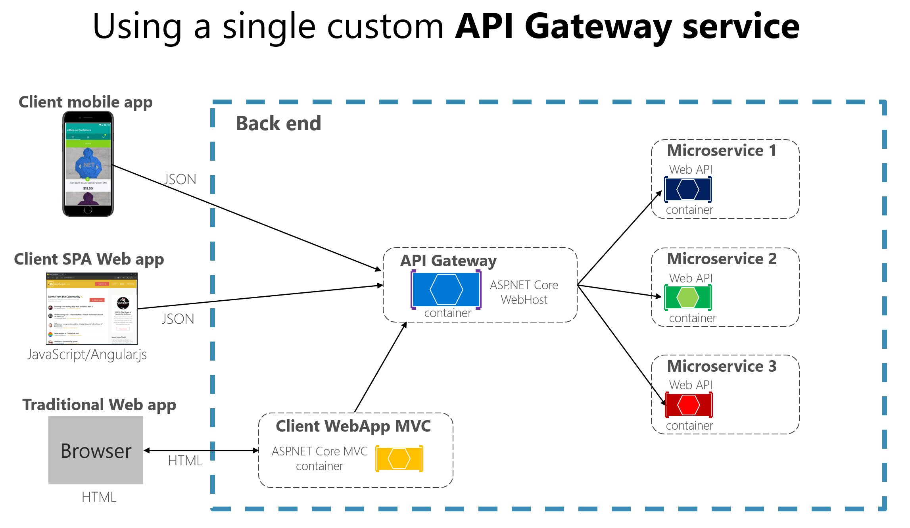
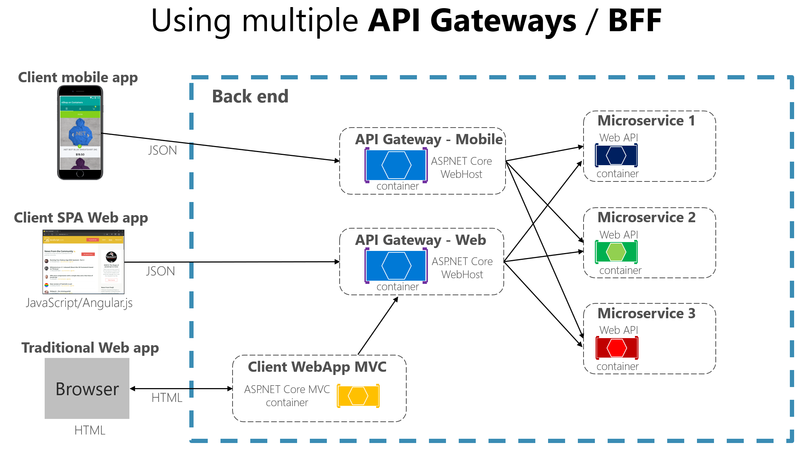
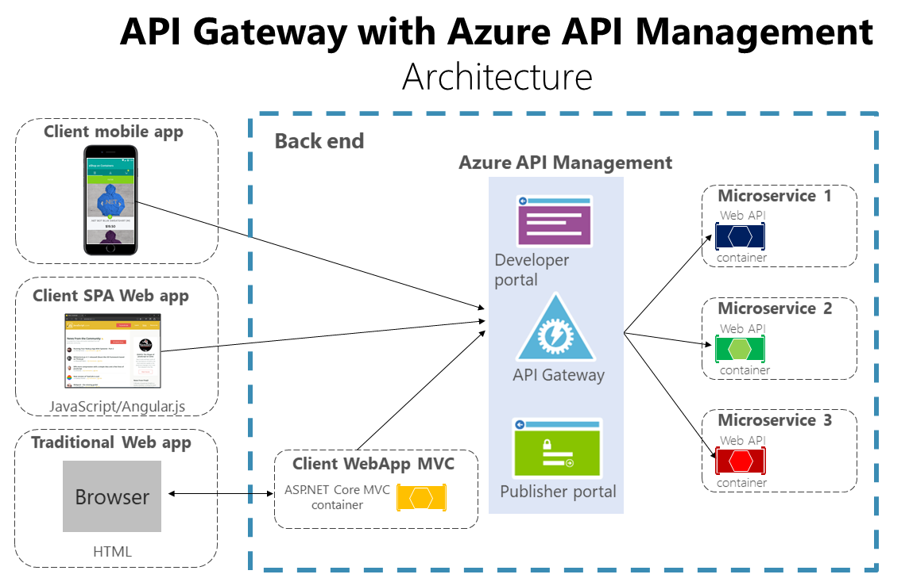

# The API gateway pattern versus the Direct client-to-microservice communication

In a microservices architecture, each microservice exposes a set of (typically) fine-grained endpoints. This fact can impact the client-to-microservice communication, as explained in this section.

## Direct client-to-microservice communication

A possible approach is to use a direct client-to-microservice communication architecture. In this approach, a client app can make requests directly to some of the microservices, as shown in Figure 4-12.

**Figure 4-12**. Using a direct client-to-microservice communication architecture

Each app communicates directly with individual microservices. In this approach, each microservice has a public endpoint, sometimes with a different TCP port for each microservice. An example of a URL for a particular service could be the following URL in Azure:

`http://eshoponcontainers.westus.cloudapp.azure.com:88/`

In a production environment based on a cluster, that URL would map to the load balancer used in the cluster, which in turn distributes the requests across the microservices. In production environments, you could have an Application Delivery Controller (ADC) like [Azure Application Gateway](https://docs.microsoft.com/azure/application-gateway/application-gateway-introduction) between your microservices and the Internet. This acts as a transparent tier that not only performs load balancing, but secures your services by offering SSL termination. This improves the load of your hosts by offloading CPU-intensive SSL termination and other routing duties to the Azure Application Gateway. In any case, a load balancer and ADC are transparent from a logical application architecture point of view.

A direct client-to-microservice communication architecture could be good enough for a small microservice-based application, especially if the client app is a server-side web application like an ASP.NET MVC app. However, when you build large and complex microservice-based applications (for example, when handling dozens of microservice types), and especially when the client apps are remote mobile apps or SPA web applications, that approach faces a few issues.

Consider the following questions when developing a large application based on microservices:

- *How can client apps minimize the number of requests to the back end and reduce chatty communication to multiple microservices?*

Interacting with multiple microservices to build a single UI screen increases the number of round trips across the Internet. This increases latency and complexity on the UI side. Ideally, responses should be efficiently aggregated in the server side. This reduces latency, since multiple pieces of data come back in parallel and some UI can show data as soon as it's ready.

- *How can you handle cross-cutting concerns such as authorization, data transformations, and dynamic request dispatching?*

Implementing security and cross-cutting concerns like security and authorization on every microservice can require significant development effort. A possible approach is to have those services within the Docker host or internal cluster to restrict direct access to them from the outside, and to implement those cross-cutting concerns in a centralized place, like an API Gateway.

- *How can client apps communicate with services that use non-Internet-friendly protocols?*

Protocols used on the server side (like AMQP or binary protocols) are usually not supported in client apps. Therefore, requests must be performed through protocols like HTTP/HTTPS and translated to the other protocols afterwards. A *man-in-the-middle* approach can help in this situation.

- *How can you shape a facade especially made for mobile apps?*

The API of multiple microservices might not be well designed for the needs of different client applications. For instance, the needs of a mobile app might be different than the needs of a web app. For mobile apps, you might need to optimize even further so that data responses can be more efficient. You might do this by aggregating data from multiple microservices and returning a single set of data, and sometimes eliminating any data in the response that isn't needed by the mobile app. And, of course, you might compress that data. Again, a facade or API in between the mobile app and the microservices can be convenient for this scenario.

## Why consider API Gateways instead of direct client-to-microservice communication

In a microservices architecture, the client apps usually need to consume functionality from more than one microservice. If that consumption is performed directly, the client needs to handle multiple calls to microservice endpoints. What happens when the application evolves and new microservices are introduced or existing microservices are updated? If your application has many microservices, handling so many endpoints from the client apps can be a nightmare. Since the client app would be coupled to those internal endpoints, evolving the microservices in the future can cause high impact for the client apps.

Therefore, having an intermediate level or tier of indirection (Gateway) can be very convenient for microservice-based applications. If you don't have API Gateways, the client apps must send requests directly to the microservices and that raises problems, such as the following issues:

- **Coupling**: Without the API Gateway pattern, the client apps are coupled to the internal microservices. The client apps need to know how the multiple areas of the application are decomposed in microservices. When evolving and refactoring the internal microservices, those actions impact maintenance pretty badly because they cause breaking changes to the client apps due to the direct reference to the internal microservices from the client apps. Client apps need to be updated frequently, making the solution harder to evolve.

- **Too many round trips**: A single page/screen in the client app might require several calls to multiple services. That can result in multiple network round trips between the client and the server, adding significant latency. Aggregation handled in an intermediate level could improve the performance and user experience for the client app.

- **Security issues**: Without a gateway, all the microservices must be exposed to the "external world", making the attack surface larger than if you hide internal microservices that aren't directly used by the client apps. The smaller the attack surface is, the more secure your application can be.

- **Cross-cutting concerns**: Each publicly published microservice must handle concerns such as authorization, SSL, etc. In many situations, those concerns could be handled in a single tier so the internal microservices are simplified.

## What is the API Gateway pattern?

When you design and build large or complex microservice-based applications with multiple client apps, a good approach to consider can be an [API Gateway](https://microservices.io/patterns/apigateway.html). This is a service that provides a single-entry point for certain groups of microservices. It's similar to the [Facade pattern](https://en.wikipedia.org/wiki/Facade_pattern) from object-oriented design, but in this case, it's part of a distributed system. The API Gateway pattern is also sometimes known as the "backend for frontend" ([BFF](https://samnewman.io/patterns/architectural/bff/)) because you build it while thinking about the needs of the client app.

Therefore, the API gateway sits between the client apps and the microservices. It acts as a reverse proxy, routing requests from clients to services. It can also provide additional cross-cutting features such as authentication, SSL termination, and cache.

Figure 4-13 shows how a custom API Gateway can fit into a simplified microservice-based architecture with just a few microservices.

**Figure 4-13**. Using an API Gateway implemented as a custom service

Apps connect to a single endpoint, the API Gateway, that's configured to forward requests to individual microservices. In this example, the API Gateway would be implemented as a custom ASP.NET Core WebHost service running as a container.

It's important to highlight that in that diagram, you would be using a single custom API Gateway service facing multiple and different client apps. That fact can be an important risk because your API Gateway service will be growing and evolving based on many different requirements from the client apps. Eventually, it will be bloated because of those different needs and effectively it could be pretty similar to a monolithic application or monolithic service. That's why it's very much recommended to split the API Gateway in multiple services or multiple smaller API Gateways, one per client app form-factor type, for instance.

You need to be careful when implementing the API Gateway pattern. Usually it isn't a good idea to have a single API Gateway aggregating all the internal microservices of your application. If it does, it acts as a monolithic aggregator or orchestrator and violates microservice autonomy by coupling all the microservices.

Therefore, the API Gateways should be segregated based on business boundaries and the client apps and not act as a single aggregator for all the internal microservices.

When splitting the API Gateway tier into multiple API Gateways, if your application has multiple client apps, that can be a primary pivot when identifying the multiple API Gateways types, so that you can have a different facade for the needs of each client app. This case is a pattern named "Backend for Frontend" ([BFF](https://samnewman.io/patterns/architectural/bff/)) where each API Gateway can provide a different API tailored for each client app type, possibly even based on the client form factor by implementing specific adapter code which underneath calls multiple internal microservices, as shown in the following image:

**Figure 4-13.1**. Using multiple custom API Gateways

Figure 4-13.1 shows API Gateways that are segregated by client type; one for mobile clients and one for web clients. A traditional web app connects to an MVC microservice that uses the web API Gateway. The example depicts a simplified architecture with multiple fine-grained API Gateways. In this case, the boundaries identified for each API Gateway are based purely on the "Backend for Frontend" ([BFF](https://samnewman.io/patterns/architectural/bff/)) pattern, hence based just on the API needed per client app. But in larger applications you should also go further and create additional API Gateways based on business boundaries as a second design pivot.

## Main features in the API Gateway pattern

An API Gateway can offer multiple features. Depending on the product it might offer richer or simpler features, however, the most important and foundational features for any API Gateway are the following design patterns:

**Reverse proxy or gateway routing.** The API Gateway offers a reverse proxy to redirect or route requests (layer 7 routing, usually HTTP requests) to the endpoints of the internal microservices. The gateway provides a single endpoint or URL for the client apps and then internally maps the requests to a group of internal microservices. This routing feature helps to decouple the client apps from the microservices but it's also pretty convenient when modernizing a monolithic API by sitting the API Gateway in between the monolithic API and the client apps, then you can add new APIs as new microservices while still using the legacy monolithic API until it's split into many microservices in the future. Because of the API Gateway, the client apps won't notice if the APIs being used are implemented as internal microservices or a monolithic API and more importantly, when evolving and refactoring the monolithic API into microservices, thanks to the API Gateway routing, client apps won't be impacted with any URI change.

For more information, see [Gateway routing pattern](https://docs.microsoft.com/azure/architecture/patterns/gateway-routing).

**Requests aggregation.** As part of the gateway pattern you can aggregate multiple client requests (usually HTTP requests) targeting multiple internal microservices into a single client request. This pattern is especially convenient when a client page/screen needs information from several microservices. With this approach, the client app sends a single request to the API Gateway that dispatches several requests to the internal microservices and then aggregates the results and sends everything back to the client app. The main benefit and goal of this design pattern is to reduce chattiness between the client apps and the backend API, which is especially important for remote apps out of the datacenter where the microservices live, like mobile apps or requests coming from SPA apps that come from Javascript in client remote browsers. For regular web apps performing the requests in the server environment (like an ASP.NET Core MVC web app), this pattern is not so important as the latency is very much smaller than for remote client apps.

Depending on the API Gateway product you use, it might be able to perform this aggregation. However, in many cases it's more flexible to create aggregation microservices under the scope of the API Gateway, so you define the aggregation in code (that is, C# code):

For more information, see [Gateway aggregation pattern](https://docs.microsoft.com/azure/architecture/patterns/gateway-aggregation).

**Cross-cutting concerns or gateway offloading.** Depending on the features offered by each API Gateway product, you can offload functionality from individual microservices to the gateway, which simplifies the implementation of each microservice by consolidating cross-cutting concerns into one tier. This is especially convenient for specialized features that can be complex to implement properly in every internal microservice, such as the following functionality:

- Authentication and authorization
- Service discovery integration
- Response caching
- Retry policies, circuit breaker, and QoS
- Rate limiting and throttling
- Load balancing
- Logging, tracing, correlation
- Headers, query strings, and claims transformation
- IP whitelisting

For more information, see [Gateway offloading pattern](https://docs.microsoft.com/azure/architecture/patterns/gateway-offloading).

## Using products with API Gateway features

There can be many more cross-cutting concerns offered by the API Gateways products depending on each implementation. We'll explore here:

- [Azure API Management](https://azure.microsoft.com/services/api-management/)
- [Ocelot](https://github.com/ThreeMammals/Ocelot)

### Azure API Management

[Azure API Management](https://azure.microsoft.com/services/api-management/) (as shown in Figure 4-14) not only solves your API Gateway needs but provides features like gathering insights from your APIs. If you're using an API management solution, an API Gateway is only a component within that full API management solution.

**Figure 4-14**. Using Azure API Management for your API Gateway

Azure API Management solves both your API Gateway and Management needs like logging, security, metering, etc. In this case, when using a product like Azure API Management, the fact that you might have a single API Gateway is not so risky because these kinds of API Gateways are "thinner", meaning that you don't implement custom C# code that could evolve towards a monolithic component. 

The API Gateway products usually act like a reverse proxy for ingress communication, where you can also filter the APIs from the internal microservices plus apply authorization to the published APIs in this single tier.

The insights available from an API Management system help you get an understanding of how your APIs are being used and how they are performing. They do this by letting you view near real-time analytics reports and identifying trends that might impact your business. Plus, you can have logs about request and response activity for further online and offline analysis.

With Azure API Management, you can secure your APIs using a key, a token, and IP filtering. These features let you enforce flexible and fine-grained quotas and rate limits, modify the shape and behavior of your APIs using policies, and improve performance with response caching.

In this guide and the reference sample application (eShopOnContainers), the architecture is limited to a simpler and custom-made containerized architecture in order to focus on plain containers without using PaaS products like Azure API Management. But for large microservice-based applications that are deployed into Microsoft Azure, we encourage you to evaluate Azure API Management as the base for your API Gateways in production.

### Ocelot

[Ocelot](https://github.com/ThreeMammals/Ocelot) is a lightweight API Gateway, recommended for simpler approaches. Ocelot is an Open Source .NET Core based API Gateway especially made for microservices architecture that need unified points of entry into their system. It's lightweight, fast, scalable and provides routing and authentication among many other features.

The main reason to choose Ocelot for the [eShopOnContainers reference application](https://github.com/dotnet-architecture/eShopOnContainers) is because Ocelot is a .NET Core lightweight API Gateway that you can deploy into the same application deployment environment where you're deploying your microservices/containers, such as a Docker Host, Kubernetes, etc. And since it's based on .NET Core, it's cross-platform allowing you to deploy on Linux or Windows.

The previous diagrams showing custom API Gateways running in containers are precisely how you can also run Ocelot in a container and microservice-based application.

In addition, there are many other products in the market offering API Gateways features, such as Apigee, Kong, MuleSoft, WSO2, and other products like Linkerd and Istio for service mesh ingress controller features.

After the initial architecture and patterns explanation sections, the next sections explain how to implement API Gateways with [Ocelot](https://github.com/ThreeMammals/Ocelot).

## Drawbacks of the API Gateway pattern

- The most important drawback is that when you implement an API Gateway, you're coupling that tier with the internal microservices. Coupling like this might introduce serious difficulties for your application. Clemens Vaster, architect at the Azure Service Bus team, refers to this potential difficulty as "the new ESB" in the "[Messaging and Microservices](https://www.youtube.com/watch?v=rXi5CLjIQ9k)" session at GOTO 2016.

- Using a microservices API Gateway creates an additional possible single point of failure.

- An API Gateway can introduce increased response time due to the additional network call. However, this extra call usually has less impact than having a client interface that's too chatty directly calling the internal microservices.

- If not scaled out properly, the API Gateway can become a bottleneck.

- An API Gateway requires additional development cost and future maintenance if it includes custom logic and data aggregation. Developers must update the API Gateway in order to expose each microservice's endpoints. Moreover, implementation changes in the internal microservices might cause code changes at the API Gateway level. However, if the API Gateway is just applying security, logging, and versioning (as when using Azure API Management), this additional development cost might not apply.

- If the API Gateway is developed by a single team, there can be a development bottleneck. This is another reason why a better approach is to have several fined-grained API Gateways that respond to different client needs. You could also segregate the API Gateway internally into multiple areas or layers that are owned by the different teams working on the internal microservices.

## Additional resources

- **Chris Richardson. Pattern: API Gateway / Backend for Front-End** \
  <https://microservices.io/patterns/apigateway.html>

- **API Gateway pattern** \
  <https://docs.microsoft.com/azure/architecture/microservices/gateway>

- **Aggregation and composition pattern** \
  <https://microservices.io/patterns/data/api-composition.html>

- **Azure API Management** \
  <https://azure.microsoft.com/services/api-management/>

- **Udi Dahan. Service Oriented Composition** \
  <http://udidahan.com/2014/07/30/service-oriented-composition-with-video/>

- **Clemens Vasters. Messaging and Microservices at GOTO 2016 (video)** \
  <https://www.youtube.com/watch?v=rXi5CLjIQ9k>

- **API Gateway in a Nutshell** (ASP.net Core API Gateway Tutorial Series) \
  <https://www.pogsdotnet.com/2018/08/api-gateway-in-nutshell.html>

>[!div class="step-by-step"]
>[Previous](identify-microservice-domain-model-boundaries.md)
>[Next](communication-in-microservice-architecture.md)
