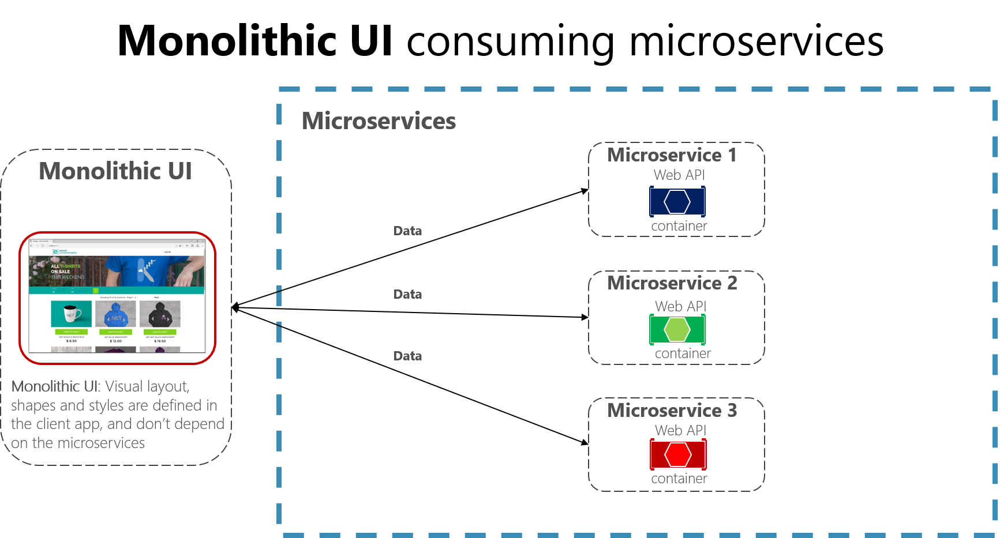
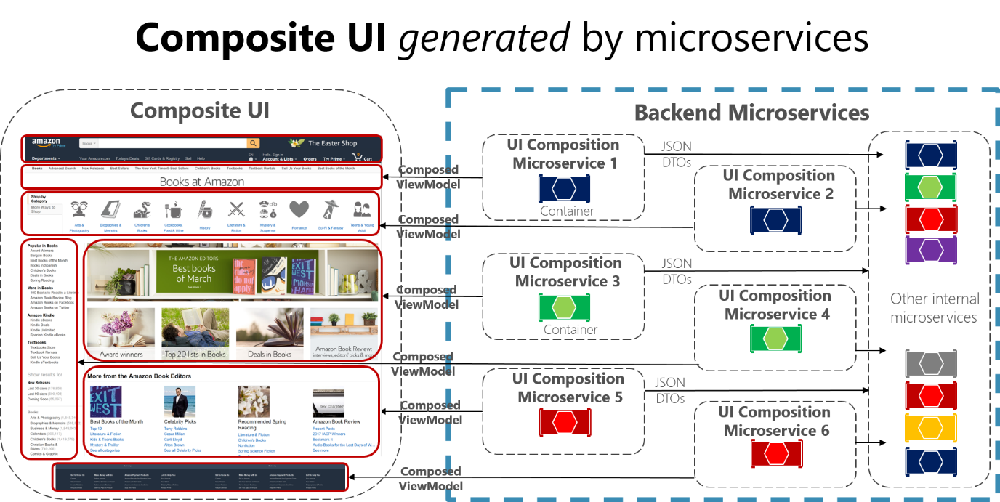

# Creating composite UI based on microservices

Microservices architecture often starts with the server-side handling data and logic but, in many cases, the UI is still handled as a monolith. However, a more advanced approach, called [micro frontends](https://martinfowler.com/articles/micro-frontends.html), is to design your application UI based on microservices as well. That means having a composite UI produced by the microservices, instead of having microservices on the server and just a monolithic client app consuming the microservices. With this approach, the microservices you build can be complete with both logic and visual representation.

Figure 4-20 shows the simpler approach of just consuming microservices from a monolithic client application. Of course, you could have an ASP.NET MVC service in between producing the HTML and JavaScript. The figure is a simplification that highlights that you have a single (monolithic) client UI consuming the microservices, which just focus on logic and data and not on the UI shape (HTML and JavaScript).

**Figure 4-20**. A monolithic UI application consuming back-end microservices

In contrast, a composite UI is precisely generated and composed by the microservices themselves. Some of the microservices drive the visual shape of specific areas of the UI. The key difference is that you have client UI components (TypeScript classes, for example) based on templates, and the data-shaping-UI ViewModel for those templates comes from each microservice.

At client application start-up time, each of the client UI components (TypeScript classes, for example) registers itself with an infrastructure microservice capable of providing ViewModels for a given scenario. If the microservice changes the shape, the UI changes also.

Figure 4-21 shows a version of this composite UI approach. This is simplified because you might have other microservices that are aggregating granular parts that are based on different techniques. It depends on whether you're building a traditional web approach (ASP.NET MVC) or an SPA (Single Page Application).

**Figure 4-21**. Example of a composite UI application shaped by back-end microservices

Each of those UI composition microservices would be similar to a small API Gateway. But in this case, each one is responsible for a small UI area.

A composite UI approach that's driven by microservices can be more challenging or less so, depending on what UI technologies you're using. For instance, you won't use the same techniques for building a traditional web application that you use for building an SPA or for native mobile app (as when developing Xamarin apps, which can be more challenging for this approach).

The [eShopOnContainers](https://aka.ms/MicroservicesArchitecture) sample application uses the monolithic UI approach for multiple reasons. First, it's an introduction to microservices and containers. A composite UI is more advanced but also requires further complexity when designing and developing the UI. Second, eShopOnContainers also provides a native mobile app based on Xamarin, which would make it more complex on the client C\# side.

However, we encourage you to use the following references to learn more about composite UI based on microservices.

## Additional resources

- **Micro Frontends (Martin Fowler's blog)**  
  <https://martinfowler.com/articles/micro-frontends.html>
  
- **Micro Frontends (Michael Geers site & GitHub repo**  
  <https://micro-frontends.org/>
  
- **Composite UI using ASP.NET (Particular's Workshop)**  
  <https://github.com/Particular/Workshop/tree/master/demos/asp-net-core>

- **Ruben Oostinga. The Monolithic Frontend in the Microservices Architecture**  
  <https://xebia.com/blog/the-monolithic-frontend-in-the-microservices-architecture/>

- **Mauro Servienti. The secret of better UI composition**  
  <https://particular.net/blog/secret-of-better-ui-composition>

- **Viktor Farcic. Including Front-End Web Components Into Microservices**  
  <https://technologyconversations.com/2015/08/09/including-front-end-web-components-into-microservices/>

- **Managing Frontend in the Microservices Architecture**  
  <https://allegro.tech/2016/03/Managing-Frontend-in-the-microservices-architecture.html>

>[!div class="step-by-step"]
>[Previous](microservices-addressability-service-registry.md)
>[Next](resilient-high-availability-microservices.md)
