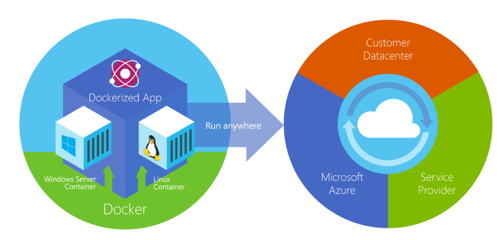
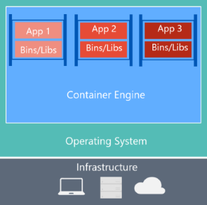

# What is Docker?

[Docker](https://www.docker.com/) is an [open-source project](https://github.com/docker/docker) for automating the deployment of applications as portable, self-sufficient containers that can run on the cloud or on-premises. Docker is also a [company](https://www.docker.com/) that promotes and evolves this technology, working in collaboration with cloud, Linux, and Windows vendors, including Microsoft.

**Figure 2-2**. Docker deploys containers at all layers of the hybrid cloud.

Docker containers can run anywhere, on-premises in the customer datacenter, in an external service provider or in the cloud, on Azure. Docker image containers can run natively on Linux and Windows. However, Windows images can run only on Windows hosts and Linux images can run on Linux hosts and Windows hosts (using a Hyper-V Linux VM, so far), where host means a server or a VM.

Developers can use development environments on Windows, Linux, or macOS. On the development computer, the developer runs a Docker host where Docker images are deployed, including the app and its dependencies. Developers who work on Linux or on macOS use a Docker host that is Linux based, and they can create images only for Linux containers. (Developers working on macOS can edit code or run the Docker CLI from macOS, but as of the time of this writing, containers don't run directly on macOS.) Developers who work on Windows can create images for either Linux or Windows Containers.

To host containers in development environments and provide additional developer tools, Docker ships Docker Desktop for [Windows](https://hub.docker.com/editions/community/docker-ce-desktop-windows) or for [macOS](https://hub.docker.com/editions/community/docker-ce-desktop-mac). These products install the necessary VM (the Docker host) to host the containers.

To run [Windows Containers](/virtualization/windowscontainers/about/), there are two types of runtimes:

- Windows Server Containers provide application isolation through process and namespace isolation technology. A Windows Server Container shares a kernel with the container host and with all containers running on the host.

- Hyper-V Containers expand on the isolation provided by Windows Server Containers by running each container in a highly optimized virtual machine. In this configuration, the kernel of the container host isn't shared with the Hyper-V Containers, providing better isolation.

The images for these containers are created the same way and function the same. The difference is in how the container is created from the image running a Hyper-V Container requires an extra parameter. For details, see [Hyper-V Containers](/virtualization/windowscontainers/manage-containers/hyperv-container).

## Comparing Docker containers with virtual machines

Figure 2-3 shows a comparison between VMs and Docker containers.

| Virtual Machines | Docker Containers |
| -----------------| ------------------|
|||
|Virtual machines include the application, the required libraries or binaries, and a full guest operating system. Full virtualization requires more resources than containerization. | Containers include the application and all its dependencies. However, they share the OS kernel with other containers, running as isolated processes in user space on the host operating system. (Except in Hyper-V containers, where each container runs inside of a special virtual machine per container.) |

**Figure 2-3**. Comparison of traditional virtual machines to Docker containers

For VMs, there are three base layers in the host server, from the bottom-up: infrastructure, Host Operating System and a Hypervisor and on top of all that each VM has its own OS and all necessary libraries. For Docker, the host server only has the infrastructure and the OS and on top of that, the container engine, that keeps container isolated but sharing the base OS services.

Because containers require far fewer resources (for example, they don't need a full OS), they're easy to deploy and they start fast. This allows you to have higher density, meaning that it allows you to run more services on the same hardware unit, thereby reducing costs.

As a side effect of running on the same kernel, you get less isolation than VMs.

The main goal of an image is that it makes the environment (dependencies) the same across different deployments. This means that you can debug it on your machine and then deploy it to another machine with the same environment guaranteed.

A container image is a way to package an app or service and deploy it in a reliable and reproducible way. You could say that Docker isn't only a technology but also a philosophy and a process.

When using Docker, you won't hear developers say, "It works on my machine, why not in production?" They can simply say, "It runs on Docker", because the packaged Docker application can be executed on any supported Docker environment, and it runs the way it was intended to on all deployment targets (such as Dev, QA, staging, and production).

## A simple analogy

Perhaps a simple analogy can help getting the grasp of the core concept of Docker.

Let's go back in time to the 1950s for a moment. There were no word processors, and the photocopiers were used everywhere (kind of).

Imagine you're responsible for quickly issuing batches of letters as required, to mail them to customers, using real paper and envelopes, to be delivered physically to each customer's address (there was no email back then).

At some point, you realize the letters are just a composition of a large set of paragraphs, which are picked and arranged as needed, according to the purpose of the letter, so you devise a system to issue letters quickly, expecting to get a hefty raise.

The system is simple:

1. You begin with a deck of transparent sheets containing one paragraph each.

2. To issue a set of letters, you pick the sheets with the paragraphs you need, then you stack and align them so they look and read fine.

3. Finally, you place the set in the photocopier and press start to produce as many letters as required.

So, simplifying, that's the core idea of Docker.

In Docker, each layer is the resulting set of changes that happen to the filesystem after executing a command, such as, installing a program.

So, when you "look" at the filesystem after the layer has been copied, you see all the files, included the layer when the program was installed.

You can think of an image as an auxiliary read-only hard disk ready to be installed in a "computer" where the operating system is already installed.

Similarly, you can think of a container as the "computer" with the image hard disk installed. The container, just like a computer, can be powered on or off.

>[!div class="step-by-step"]
>[Previous](index.md)
>[Next](docker-terminology.md)
