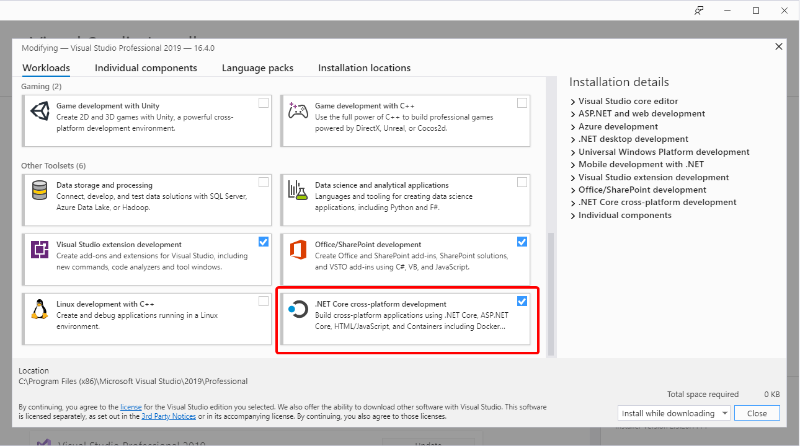
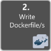
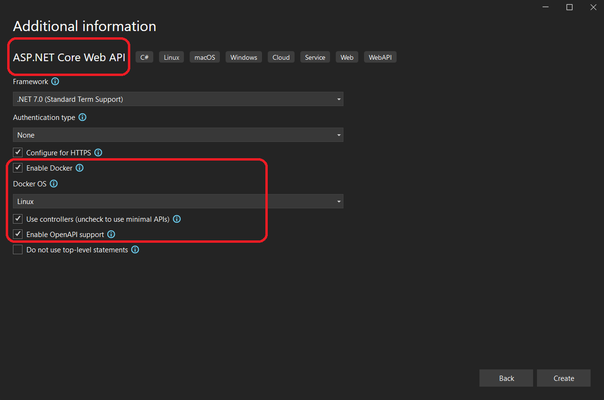
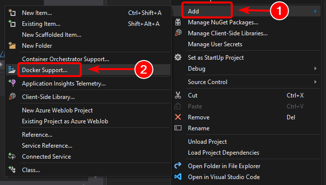

# Development workflow for Docker apps

[!INCLUDE [download-alert](../includes/download-alert.md)]

The application development life cycle starts at your computer, as a developer, where you code the application using your preferred language and test it locally. With this workflow, no matter which language, framework, and platform you choose, you're always developing and testing Docker containers, but doing so locally.

Each container (an instance of a Docker image) includes the following components:

- An operating system selection, for example, a Linux distribution, Windows Nano Server, or Windows Server Core.
- Files added during development, for example, source code and application binaries.
- Configuration information, such as environment settings and dependencies.

## Workflow for developing Docker container-based applications

This section describes the *inner-loop* development workflow for Docker container-based applications. The inner-loop workflow means it's not considering the broader DevOps workflow, which can include up to production deployment, and just focuses on the development work done on the developer's computer. The initial steps to set up the environment aren't included, since those steps are done only once.

An application is composed of your own services plus additional libraries (dependencies). The following are the basic steps you usually take when building a Docker application, as illustrated in Figure 5-1.

:::image type="complex" source="./media/docker-app-development-workflow/life-cycle-containerized-apps-docker-cli.png" alt-text="Diagram showing the seven steps it takes to create a containerized app.":::
The development process for Docker apps: 1 - Code your App, 2 - Write Dockerfile/s, 3 - Create images defined at Dockerfile/s, 4 - (optional) Compose services in the docker-compose.yml file, 5 - Run container or docker-compose app, 6 - Test your app or microservices, 7 - Push to repo and repeat.
:::image-end:::

**Figure 5-1.** Step-by-step workflow for developing Docker containerized apps

In this section, this whole process is detailed and every major step is explained by focusing on a Visual Studio environment.

When you're using an editor/CLI development approach (for example, Visual Studio Code plus Docker CLI on macOS or Windows), you need to know every step, generally in more detail than if you're using Visual Studio. For more information about working in a CLI environment, see the e-book [Containerized Docker Application lifecycle with Microsoft Platforms and Tools](https://aka.ms/dockerlifecycleebook/).

When you're using Visual Studio 2022 or later, many of those steps are handled for you, which dramatically improves your productivity. This is especially true when you're targeting multi-container applications. For instance, with just one mouse click, Visual Studio adds the `Dockerfile` and `docker-compose.yml` file to your projects with the configuration for your application. When you run the application in Visual Studio, it builds the Docker image and runs the multi-container application directly in Docker; it even allows you to debug several containers at once. These features will boost your development speed.

However, just because Visual Studio makes those steps automatic doesn't mean that you don't need to know what's going on underneath with Docker. Therefore, the following guidance details every step.


## Step 1. Start coding and create your initial application or service baseline

Developing a Docker application is similar to the way you develop an application without Docker. The difference is that while developing for Docker, you're deploying and testing your application or services running within Docker containers in your local environment (either a Linux VM setup by Docker or directly Windows if using Windows Containers).

### Set up your local environment with Visual Studio

To begin, make sure you have [Docker Desktop for Windows](https://docs.docker.com/docker-for-windows/) for Windows installed, as explained in the following instructions:

[Get started with Docker Desktop for Windows](https://docs.docker.com/docker-for-windows/)

In addition, you need Visual Studio 2022 or later with the **ASP.NET and web development** workload installed, as shown in Figure 5-2.



**Figure 5-2**. Selecting the **ASP.NET and web development** workload during Visual Studio 2022 setup

You can start coding your application in plain .NET (usually in .NET Core or later if you're planning to use containers) even before enabling Docker in your application and deploying and testing in Docker. However, it is recommended that you start working on Docker as soon as possible, because that will be the real environment and any issues can be discovered as soon as possible. This is encouraged because Visual Studio makes it so easy to work with Docker that it almost feels transparent—the best example when debugging multi-container applications from Visual Studio.

### Additional resources

- **Get started with Docker Desktop for Windows** \
  <https://docs.docker.com/docker-for-windows/>

- **Visual Studio** \
  [https://visualstudio.microsoft.com/downloads/](https://visualstudio.microsoft.com/downloads/)



## Step 2. Create a Dockerfile related to an existing .NET base image

You need a Dockerfile for each custom image you want to build; you also need a Dockerfile for each container to be deployed, whether you deploy automatically from Visual Studio or manually using the Docker CLI (docker run and docker-compose commands). If your application contains a single custom service, you need a single Dockerfile. If your application contains multiple services (as in a microservices architecture), you need one Dockerfile for each service.

The Dockerfile is placed in the root folder of your application or service. It contains the commands that tell Docker how to set up and run your application or service in a container. You can manually create a Dockerfile in code and add it to your project along with your .NET dependencies.

With Visual Studio and its tools for Docker, this task requires only a few mouse clicks. When you create a new project in Visual Studio, there's an option named **Enable Docker Support**, as shown in Figure 5-3.



**Figure 5-3**. Enabling Docker Support when creating a new ASP.NET Core project in Visual Studio 2022

You can also enable Docker support on an existing ASP.NET Core web app project by right-clicking the project in **Solution Explorer** and selecting **Add** > **Docker Support...**, as shown in Figure 5-4.



**Figure 5-4**. Enabling Docker support in an existing Visual Studio 2022 project

This action adds a *Dockerfile* to the project with the required configuration, and is only available on ASP.NET Core projects.

In a similar fashion, Visual Studio can also add a `docker-compose.yml` file for the whole solution with the option **Add > Container Orchestrator Support...**. In step 4, we'll explore this option in greater detail.

### Using an existing official .NET Docker image

You usually build a custom image for your container on top of a base image you get from an official repository like the [Docker Hub](https://hub.docker.com/) registry. That's precisely what happens under the covers when you enable Docker support in Visual Studio. Your Dockerfile will use an existing `dotnet/core/aspnet` image.

Earlier we explained which Docker images and repos you can use, depending on the framework and OS you've chosen. For instance, if you want to use ASP.NET Core (Linux or Windows), the image to use is `mcr.microsoft.com/dotnet/aspnet:8.0`. Therefore, you just need to specify what base Docker image you'll use for your container. You do that by adding `FROM mcr.microsoft.com/dotnet/aspnet:8.0` to your Dockerfile. This is automatically performed by Visual Studio, but if you were to update the version, you update this value.

Using an official .NET image repository from Docker Hub with a version number ensures that the same language features are available on all machines (including development, testing, and production).

The following example shows a sample Dockerfile for an ASP.NET Core container.

```dockerfile
FROM mcr.microsoft.com/dotnet/aspnet:8.0
ARG source
WORKDIR /app
EXPOSE 80
COPY ${source:-obj/Docker/publish} .
ENTRYPOINT ["dotnet", " MySingleContainerWebApp.dll "]
```

In this case, the image is based on version 8.0 of the official ASP.NET Core Docker image (multi-arch for Linux and Windows). This is the setting `FROM mcr.microsoft.com/dotnet/aspnet:8.0`. (For more information about this base image, see the [ASP.NET Core Docker Image](https://hub.docker.com/_/microsoft-dotnet-aspnet/) page.) In the Dockerfile, you also need to instruct Docker to listen on the TCP port you will use at runtime (in this case, port 80, as configured with the EXPOSE setting).

You can specify additional configuration settings in the Dockerfile, depending on the language and framework you're using. For instance, the ENTRYPOINT line with `["dotnet", "MySingleContainerWebApp.dll"]` tells Docker to run a .NET application. If you're using the SDK and the .NET CLI (dotnet CLI) to build and run the .NET application, this setting would be different. The bottom line is that the ENTRYPOINT line and other settings will be different depending on the language and platform you choose for your application.

### Additional resources

- **Building Docker Images for ASP.NET Core Applications** \
  [https://learn.microsoft.com/dotnet/core/docker/building-net-docker-images](/aspnet/core/host-and-deploy/docker/building-net-docker-images)

- **Building container images**. In the official Docker documentation.\
  <https://docs.docker.com/get-started/docker-concepts/building-images/>

- **Staying up-to-date with .NET Container Images** \
  <https://devblogs.microsoft.com/dotnet/staying-up-to-date-with-net-container-images/>

- **Using .NET and Docker Together - DockerCon 2018 Update** \
  <https://devblogs.microsoft.com/dotnet/using-net-and-docker-together-dockercon-2018-update/>

### Using multi-arch image repositories

A single repo can contain platform variants, such as a Linux image and a Windows image. This feature allows vendors like Microsoft (base image creators) to create a single repo to cover multiple platforms (that is, Linux and Windows). For example, the [.NET](https://hub.docker.com/_/microsoft-dotnet/) repository available in the Docker Hub registry provides support for Linux and Windows Nano Server by using the same repo name.

If you specify a tag, targeting a platform that is explicit like in the following cases:

- `mcr.microsoft.com/dotnet/aspnet:8.0-bullseye-slim` \
  Targets: .NET 8 runtime-only on Linux

- `mcr.microsoft.com/dotnet/aspnet:8.0-nanoserver-ltsc2022` \
  Targets: .NET 8 runtime-only on Windows Nano Server

But, if you specify the same image name, even with the same tag, the multi-arch images (like the `aspnet` image) will use the Linux or Windows version depending on the Docker host OS you're deploying, as shown in the following example:

- `mcr.microsoft.com/dotnet/aspnet:8.0` \
  Multi-arch: .NET 8 runtime-only on Linux or Windows Nano Server depending on the Docker host OS

This way, when you pull an image from a Windows host, it will pull the Windows variant, and pulling the same image name from a Linux host will pull the Linux variant.

### Multi-stage builds in Dockerfile

The Dockerfile is similar to a batch script. Similar to what you would do if you had to set up the machine from the command line.

It starts with a base image that sets up the initial context, it's like the startup filesystem, that sits on top of the host OS. It's not an OS, but you can think of it like "the" OS inside the container.

The execution of every command line creates a new layer on the filesystem with the changes from the previous one, so that, when combined, produce the resulting filesystem.

Since every new layer "rests" on top of the previous one and the resulting image size increases with every command, images can get very large if they have to include, for example, the SDK needed to build and publish an application.

This is where multi-stage builds get into the plot (from Docker 17.05 and higher) to do their magic.

The core idea is that you can separate the Dockerfile execution process in stages, where a stage is an initial image followed by one or more commands, and the last stage determines the final image size.

In short, multi-stage builds allow splitting the creation in different "phases" and then assemble the final image taking only the relevant directories from the intermediate stages. The general strategy to use this feature is:

1. Use a base SDK image (doesn't matter how large), with everything needed to build and publish the application to a folder and then

2. Use a base, small, runtime-only image and copy the publishing folder from the previous stage to produce a small final image.

Probably the best way to understand multi-stage is going through a Dockerfile in detail, line by line, so let's begin with the initial Dockerfile created by Visual Studio when adding Docker support to a project and will get into some optimizations later.

The initial Dockerfile might look something like this:

```dockerfile
 1  FROM mcr.microsoft.com/dotnet/aspnet:8.0 AS base
 2  WORKDIR /app
 3  EXPOSE 80
 4
 5  FROM mcr.microsoft.com/dotnet/sdk:8.0 AS build
 6  WORKDIR /src
 7  COPY src/Services/Catalog/Catalog.API/Catalog.API.csproj …
 8  COPY src/BuildingBlocks/HealthChecks/src/Microsoft.AspNetCore.HealthChecks …
 9  COPY src/BuildingBlocks/HealthChecks/src/Microsoft.Extensions.HealthChecks …
10  COPY src/BuildingBlocks/EventBus/IntegrationEventLogEF/ …
11  COPY src/BuildingBlocks/EventBus/EventBus/EventBus.csproj …
12  COPY src/BuildingBlocks/EventBus/EventBusRabbitMQ/EventBusRabbitMQ.csproj …
13  COPY src/BuildingBlocks/EventBus/EventBusServiceBus/EventBusServiceBus.csproj …
14  COPY src/BuildingBlocks/WebHostCustomization/WebHost.Customization …
15  COPY src/BuildingBlocks/HealthChecks/src/Microsoft.Extensions …
16  COPY src/BuildingBlocks/HealthChecks/src/Microsoft.Extensions …
17  RUN dotnet restore src/Services/Catalog/Catalog.API/Catalog.API.csproj
18  COPY . .
19  WORKDIR /src/src/Services/Catalog/Catalog.API
20  RUN dotnet build Catalog.API.csproj -c Release -o /app
21
22  FROM build AS publish
23  RUN dotnet publish Catalog.API.csproj -c Release -o /app
24
25  FROM base AS final
26  WORKDIR /app
27  COPY --from=publish /app .
28  ENTRYPOINT ["dotnet", "Catalog.API.dll"]
```

And these are the details, line by line:

- **Line #1:** Begin a stage with a "small" runtime-only base image, call it **base** for reference.

- **Line #2:** Create the **/app** directory in the image.

- **Line #3:** Expose port **80**.

- **Line #5:** Begin a new stage with the "large" image for building/publishing. Call it **build** for reference.

- **Line #6:** Create directory **/src** in the image.

- **Line #7:** Up to line 16, copy referenced **.csproj** project files to be able to restore packages later.

- **Line #17:** Restore packages for the **Catalog.API** project and the referenced projects.

- **Line #18:** Copy **all directory tree for the solution** (except the files/directories included in the **.dockerignore** file) to the **/src** directory in the image.

- **Line #19:** Change the current folder to the **Catalog.API** project.

- **Line #20:** Build the project (and other project dependencies) and output to the **/app** directory in the image.