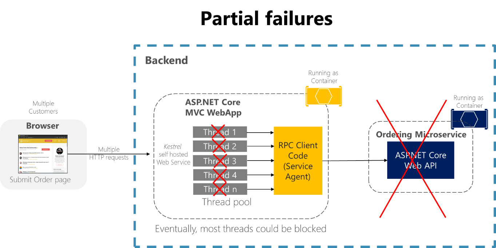

# Handle partial failure

In distributed systems like microservices-based applications, there's an ever-present risk of partial failure. For instance, a single microservice/container can fail or might not be available to respond for a short time, or a single VM or server can crash. Since clients and services are separate processes, a service might not be able to respond in a timely way to a client’s request. The service might be overloaded and responding very slowly to requests or might simply not be accessible for a short time because of network issues.

For example, consider the Order details page from the eShopOnContainers sample application. If the ordering microservice is unresponsive when the user tries to submit an order, a bad implementation of the client process (the MVC web application)—for example, if the client code were to use synchronous RPCs with no timeout—would block threads indefinitely waiting for a response. Besides creating a bad user experience, every unresponsive wait consumes or blocks a thread, and threads are extremely valuable in highly scalable applications. If there are many blocked threads, eventually the application’s runtime can run out of threads. In that case, the application can become globally unresponsive instead of just partially unresponsive, as shown in Figure 8-1.

**Figure 8-1**. Partial failures because of dependencies that impact service thread availability

In a large microservices-based application, any partial failure can be amplified, especially if most of the internal microservices interaction is based on synchronous HTTP calls (which is considered an anti-pattern). Think about a system that receives millions of incoming calls per day. If your system has a bad design that's based on long chains of synchronous HTTP calls, these incoming calls might result in many more millions of outgoing calls (let’s suppose a ratio of 1:4) to dozens of internal microservices as synchronous dependencies. This situation is shown in Figure 8-2, especially dependency \#3.

**Figure 8-2**. The impact of having an incorrect design featuring long chains of HTTP requests

Intermittent failure is guaranteed in a distributed and cloud-based system, even if every dependency itself has excellent availability. It's a fact you need to consider.

If you do not design and implement techniques to ensure fault tolerance, even small downtimes can be amplified. As an example, 50 dependencies each with 99.99% of availability would result in several hours of downtime each month because of this ripple effect. When a microservice dependency fails while handling a high volume of requests, that failure can quickly saturate all available request threads in each service and crash the whole application.

**Figure 8-3**. Partial failure amplified by microservices with long chains of synchronous HTTP calls

To minimize this problem, in the section [Asynchronous microservice integration enforce microservice’s autonomy](../architect-microservice-container-applications/communication-in-microservice-architecture.md#asynchronous-microservice-integration-enforces-microservices-autonomy), this guide encourages you to use asynchronous communication across the internal microservices.

In addition, it's essential that you design your microservices and client applications to handle partial failures—that is, to build resilient microservices and client applications.

>[!div class="step-by-step"]
>[Previous](index.md)
>[Next](partial-failure-strategies.md)
