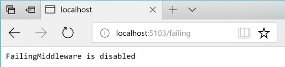
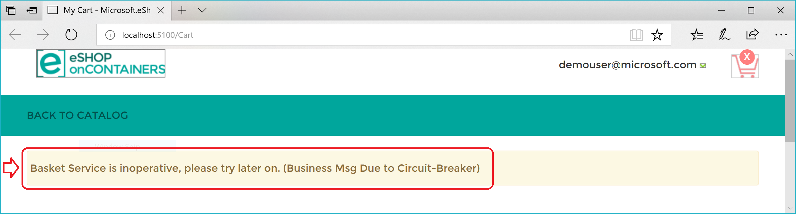

# Implement the Circuit Breaker pattern

As noted earlier, you should handle faults that might take a variable amount of time to recover from, as might happen when you try to connect to a remote service or resource. Handling this type of fault can improve the stability and resiliency of an application.

In a distributed environment, calls to remote resources and services can fail due to transient faults, such as slow network connections and timeouts, or if resources are responding slowly or are temporarily unavailable. These faults typically correct themselves after a short time, and a robust cloud application should be prepared to handle them by using a strategy like the "Retry pattern". 

However, there can also be situations where faults are due to unanticipated events that might take much longer to fix. These faults can range in severity from a partial loss of connectivity to the complete failure of a service. In these situations, it might be pointless for an application to continually retry an operation that's unlikely to succeed. 

Instead, the application should be coded to accept that the operation has failed and handle the failure accordingly.

Using Http retries carelessly could result in creating a Denial of Service ([DoS](https://en.wikipedia.org/wiki/Denial-of-service_attack)) attack within your own software. As a microservice fails or performs slowly, multiple clients might repeatedly retry failed requests. That creates a dangerous risk of exponentially increasing traffic targeted at the failing service.

Therefore, you need some kind of defense barrier so that excessive requests stop when it isn't worth to keep trying. That defense barrier is precisely the circuit breaker.

The Circuit Breaker pattern has a different purpose than the "Retry pattern". The "Retry pattern" enables an application to retry an operation in the expectation that the operation will eventually succeed. The Circuit Breaker pattern prevents an application from performing an operation that's likely to fail. An application can combine these two patterns. However, the retry logic should be sensitive to any exception returned by the circuit breaker, and it should abandon retry attempts if the circuit breaker indicates that a fault is not transient.

## Implement Circuit Breaker pattern with HttpClientFactory and Polly

As when implementing retries, the recommended approach for circuit breakers is to take advantage of proven .NET libraries like Polly and its native integration with HttpClientFactory.

Adding a circuit breaker policy into your HttpClientFactory outgoing middleware pipeline is as simple as adding a single incremental piece of code to what you already have when using HttpClientFactory.

The only addition here to the code used for HTTP call retries is the code where you add the Circuit Breaker policy to the list of policies to use, as shown in the following incremental code, part of the ConfigureServices() method.

```csharp
//ConfigureServices()  - Startup.cs
services.AddHttpClient<IBasketService, BasketService>()
        .SetHandlerLifetime(TimeSpan.FromMinutes(5))  //Sample. Default lifetime is 2 minutes
        .AddHttpMessageHandler<HttpClientAuthorizationDelegatingHandler>()
        .AddPolicyHandler(GetRetryPolicy())
        .AddPolicyHandler(GetCircuitBreakerPolicy());
```

The `AddPolicyHandler()` method is what adds policies to the `HttpClient` objects you'll use. In this case, it's adding a Polly policy for a circuit breaker.

To have a more modular approach, the Circuit Breaker Policy is defined in a separate method called `GetCircuitBreakerPolicy()`, as shown in the following code:

```csharp
static IAsyncPolicy<HttpResponseMessage> GetCircuitBreakerPolicy()
{
    return HttpPolicyExtensions
        .HandleTransientHttpError()
        .CircuitBreakerAsync(5, TimeSpan.FromSeconds(30));
}
```

In the code example above, the circuit breaker policy is configured so it breaks or opens the circuit when there have been five consecutive faults when retrying the Http requests. When that happens, the circuit will break for 30 seconds: in that period, calls will be failed immediately by the circuit-breaker rather than actually be placed.  The policy automatically interprets [relevant exceptions and HTTP status codes](/aspnet/core/fundamentals/http-requests#handle-transient-faults) as faults.  

Circuit breakers should also be used to redirect requests to a fallback infrastructure if you had issues in a particular resource that's deployed in a different environment than the client application or service that's performing the HTTP call. That way, if there's an outage in the datacenter that impacts only your backend microservices but not your client applications, the client applications can redirect to the fallback services. Polly is planning a new policy to automate this [failover policy](https://github.com/App-vNext/Polly/wiki/Polly-Roadmap#failover-policy) scenario. 

All those features are for cases where you're managing the failover from within the .NET code, as opposed to having it managed automatically for you by Azure, with location transparency. 

From a usage point of view, when using HttpClient, there’s no need to add anything new here because the code is the same than when using HttpClient with HttpClientFactory, as shown in previous sections. 

## Test Http retries and circuit breakers in eShopOnContainers

Whenever you start the eShopOnContainers solution in a Docker host, it needs to start multiple containers. Some of the containers are slower to start and initialize, like the SQL Server container. This is especially true the first time you deploy the eShopOnContainers application into Docker because it needs to set up the images and the database. The fact that some containers start slower than others can cause the rest of the services to initially throw HTTP exceptions, even if you set dependencies between containers at the docker-compose level, as explained in previous sections. Those docker-compose dependencies between containers are just at the process level. The container’s entry point process might be started, but SQL Server might not be ready for queries. The result can be a cascade of errors, and the application can get an exception when trying to consume that particular container.

You might also see this type of error on startup when the application is deploying to the cloud. In that case, orchestrators might be moving containers from one node or VM to another (that is, starting new instances) when balancing the number of containers across the cluster’s nodes.

The way 'eShopOnContainers' solves those issues when starting all the containers is by using the Retry pattern illustrated earlier. 

### Test the circuit breaker in eShopOnContainers

There are a few ways you can break/open the circuit and test it with eShopOnContainers.

One option is to lower the allowed number of retries to 1 in the circuit breaker policy and redeploy the whole solution into Docker. With a single retry, there's a good chance that an HTTP request will fail during deployment, the circuit breaker will open, and you get an error.

Another option is to use custom middleware that's implemented in the **Basket** microservice. When this middleware is enabled, it catches all HTTP requests and returns status code 500. You can enable the middleware by making a GET request to the failing URI, like the following:

- `GET http://localhost:5103/failing`\
  This request returns the current state of the middleware. If the middleware is enabled, the request return status code 500. If the middleware is disabled, there's no response.

- `GET http://localhost:5103/failing?enable`\
  This request enables the middleware.

- `GET http://localhost:5103/failing?disable`\
  This request disables the middleware.

For instance, once the application is running, you can enable the middleware by making a request using the following URI in any browser. Note that the ordering microservice uses port 5103.

`http://localhost:5103/failing?enable` 

You can then check the status using the URI `http://localhost:5103/failing`, as shown in Figure 8-5.



**Figure 8-5**. Checking the state of the “Failing” ASP.NET middleware – In this case, disabled.

At this point, the Basket microservice responds with status code 500 whenever you call invoke it.

Once the middleware is running, you can try making an order from the MVC web application. Because the requests fail, the circuit will open. 

In the following example, you can see that the MVC web application has a catch block in the logic for placing an order.  If the code catches an open-circuit exception, it shows the user a friendly message telling them to wait.

```csharp
public class CartController : Controller
{
    //…
    public async Task<IActionResult> Index()
    {
        try
        {
            var user = _appUserParser.Parse(HttpContext.User);
            //Http requests using the Typed Client (Service Agent)
            var vm = await _basketSvc.GetBasket(user);
            return View(vm);
        }
        catch (BrokenCircuitException)
        {
            // Catches error when Basket.api is in circuit-opened mode
            HandleBrokenCircuitException();
        }
        return View();
    }

    private void HandleBrokenCircuitException()
    {
        TempData["BasketInoperativeMsg"] = "Basket Service is inoperative, please try later on. (Business message due to Circuit-Breaker)";
    }
}
```

Here’s a summary. The Retry policy tries several times to make the HTTP request and gets HTTP errors. When the number of retries reaches the maximum number set for the Circuit Breaker policy (in this case, 5), the application throws a BrokenCircuitException. The result is a friendly message, as shown in Figure 8-6.



**Figure 8-6**. Circuit breaker returning an error to the UI

You can implement different logic for when to open/break the circuit. Or you can try an HTTP request against a different back-end microservice if there's a fallback datacenter or redundant back-end system. 

Finally, another possibility for the `CircuitBreakerPolicy` is to use `Isolate` (which forces open and holds open the circuit) and `Reset` (which closes it again). These could be used to build a utility HTTP endpoint that invokes Isolate and Reset directly on the policy.  Such an HTTP endpoint could also be used, suitably secured, in production for temporarily isolating a downstream system, such as when you want to upgrade it. Or it could trip the circuit manually to protect a downstream system you suspect to be faulting.

## Additional resources

- **Circuit Breaker pattern**\
  [https://docs.microsoft.com/azure/architecture/patterns/circuit-breaker](/azure/architecture/patterns/circuit-breaker)

>[!div class="step-by-step"]
>[Previous](implement-http-call-retries-exponential-backoff-polly.md)
>[Next](monitor-app-health.md)
