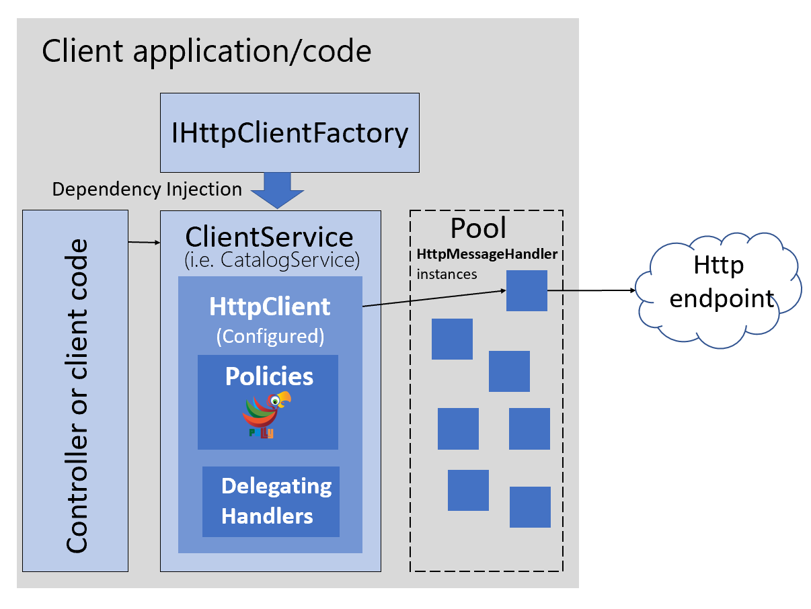

# Use IHttpClientFactory to implement resilient HTTP requests

<xref:System.Net.Http.IHttpClientFactory> is a contract implemented by `DefaultHttpClientFactory`, an opinionated factory, available since .NET Core 2.1, for creating <xref:System.Net.Http.HttpClient> instances to be used in your applications.

## Issues with the original HttpClient class available in .NET

The original and well-known <xref:System.Net.Http.HttpClient> class can be easily used, but in some cases, it isn't being properly used by many developers.

Though this class implements `IDisposable`, declaring and instantiating it within a `using` statement is not preferred because when the `HttpClient` object gets disposed of, the underlying socket is not immediately released, which can lead to a _socket exhaustion_ problem. For more information about this issue, see the blog post [You're using HttpClient wrong and it's destabilizing your software](https://aspnetmonsters.com/2016/08/2016-08-27-httpclientwrong/).

Therefore, `HttpClient` is intended to be instantiated once and reused throughout the life of an application. Instantiating an `HttpClient` class for every request will exhaust the number of sockets available under heavy loads. That issue will result in `SocketException` errors. Possible approaches to solve that problem are based on the creation of the `HttpClient` object as singleton or static, as explained in this [Microsoft article on HttpClient usage](../../../csharp/tutorials/console-webapiclient.md). This can be a good solution for short-lived console apps or similar, that run a few times a day.

Another issue that developers run into is when using a shared instance of `HttpClient` in long-running processes. In a situation where the HttpClient is instantiated as a singleton or a static object, it fails to handle the DNS changes as described in this [issue](https://github.com/dotnet/runtime/issues/18348) of the dotnet/runtime GitHub repository.

However, the issue isn't really with `HttpClient` per se, but with the [default constructor for HttpClient](/dotnet/api/system.net.http.httpclient.-ctor?view=netcore-3.1#System_Net_Http_HttpClient__ctor&preserve-view=false), because it creates a new concrete instance of <xref:System.Net.Http.HttpMessageHandler>, which is the one that has *sockets exhaustion* and DNS changes issues mentioned above.

To address the issues mentioned above and to make `HttpClient` instances manageable, .NET Core 2.1 introduced the <xref:System.Net.Http.IHttpClientFactory> interface which can be used to configure and create `HttpClient` instances in an app through Dependency Injection (DI). It also provides extensions for Polly-based middleware to take advantage of delegating handlers in HttpClient.

[Polly](https://thepollyproject.azurewebsites.net/) is a transient-fault-handling library that helps developers add resiliency to their applications, by using some pre-defined policies in a fluent and thread-safe manner.

## Benefits of using IHttpClientFactory

The current implementation of <xref:System.Net.Http.IHttpClientFactory>, that also implements <xref:System.Net.Http.IHttpMessageHandlerFactory>, offers the following benefits:

- Provides a central location for naming and configuring logical `HttpClient` objects. For example, you may configure a client (Service Agent) that's pre-configured to access a specific microservice.
- Codify the concept of outgoing middleware via delegating handlers in `HttpClient` and implementing Polly-based middleware to take advantage of Polly's policies for resiliency.
- `HttpClient` already has the concept of delegating handlers that could be linked together for outgoing HTTP requests. You can register HTTP clients into the factory and you can use a Polly handler to use Polly policies for Retry, CircuitBreakers, and so on.
- Manage the lifetime of <xref:System.Net.Http.HttpMessageHandler> to avoid the mentioned problems/issues that can occur when managing `HttpClient` lifetimes yourself.

> [!TIP]
> The `HttpClient` instances injected by DI, can be disposed of safely, because the associated `HttpMessageHandler` is managed by the factory. As a matter of fact, injected `HttpClient` instances are *Scoped* from a DI perspective.

> [!NOTE]
> The implementation of `IHttpClientFactory` (`DefaultHttpClientFactory`) is tightly tied to the DI implementation in the `Microsoft.Extensions.DependencyInjection` NuGet package. For more information about using other DI containers, see this [GitHub discussion](https://github.com/dotnet/extensions/issues/1345).

## Multiple ways to use IHttpClientFactory

There are several ways that you can use `IHttpClientFactory` in your application:

- Basic usage
- Use Named Clients
- Use Typed Clients
- Use Generated Clients

For the sake of brevity, this guidance shows the most structured way to use `IHttpClientFactory`, which is to use Typed Clients (Service Agent pattern). However, all options are documented and are currently listed in this [article covering the `IHttpClientFactory` usage](/aspnet/core/fundamentals/http-requests#consumption-patterns).

## How to use Typed Clients with IHttpClientFactory

So, what's a "Typed Client"? It's just an `HttpClient` that's pre-configured for some specific use. This configuration can include specific values such as the base server, HTTP headers or time outs.

The following diagram shows how Typed Clients are used with `IHttpClientFactory`:



**Figure 8-4**. Using `IHttpClientFactory` with Typed Client classes.

In the above image, a `ClientService` (used by a controller or client code) uses an `HttpClient` created by the registered `IHttpClientFactory`. This factory assigns an `HttpMessageHandler` from a pool to the `HttpClient`. The `HttpClient` can be configured with Polly's policies when registering the `IHttpClientFactory` in the DI container with the extension method <xref:Microsoft.Extensions.DependencyInjection.HttpClientFactoryServiceCollectionExtensions.AddHttpClient%2A>.

To configure the above structure, add <xref:System.Net.Http.IHttpClientFactory> in your application by installing the `Microsoft.Extensions.Http` NuGet package that includes the <xref:Microsoft.Extensions.DependencyInjection.HttpClientFactoryServiceCollectionExtensions.AddHttpClient%2A> extension method for <xref:Microsoft.Extensions.DependencyInjection.IServiceCollection>. This extension method registers the internal `DefaultHttpClientFactory` class to be used as a singleton for the interface `IHttpClientFactory`. It defines a transient configuration for the <xref:Microsoft.Extensions.Http.HttpMessageHandlerBuilder>. This message handler (<xref:System.Net.Http.HttpMessageHandler> object), taken from a pool, is used by the `HttpClient` returned from the factory.

In the next code, you can see how `AddHttpClient()` can be used to register Typed Clients (Service Agents) that need to use `HttpClient`.

```csharp
// Startup.cs
//Add http client services at ConfigureServices(IServiceCollection services)
services.AddHttpClient<ICatalogService, CatalogService>();
services.AddHttpClient<IBasketService, BasketService>();
services.AddHttpClient<IOrderingService, OrderingService>();
```

Registering the client services as shown in the previous code, makes the `DefaultClientFactory` create a standard `HttpClient` for each service.

You could also add instance-specific configuration in the registration to, for example, configure the base address, and add some resiliency policies, as shown in the following code:

```csharp
services.AddHttpClient<ICatalogService, CatalogService>(client =>
{
    client.BaseAddress = new Uri(Configuration["BaseUrl"]);
})
    .AddPolicyHandler(GetRetryPolicy())
    .AddPolicyHandler(GetCircuitBreakerPolicy());
```

Just for the example sake, you can see one of the above policies in the next code:

```csharp
static IAsyncPolicy<HttpResponseMessage> GetRetryPolicy()
{
    return HttpPolicyExtensions
        .HandleTransientHttpError()
        .OrResult(msg => msg.StatusCode == System.Net.HttpStatusCode.NotFound)
        .WaitAndRetryAsync(6, retryAttempt => TimeSpan.FromSeconds(Math.Pow(2, retryAttempt)));
}
```

You can find more details about using Polly in the [Next article](implement-http-call-retries-exponential-backoff-polly.md).

### HttpClient lifetimes

Each time you get an `HttpClient` object from the `IHttpClientFactory`, a new instance is returned. But each `HttpClient` uses an `HttpMessageHandler` that's pooled and reused by the `IHttpClientFactory` to reduce resource consumption, as long as the `HttpMessageHandler`'s lifetime hasn't expired.

Pooling of handlers is desirable as each handler typically manages its own underlying HTTP connections; creating more handlers than necessary can result in connection delays. Some handlers also keep connections open indefinitely, which can prevent the handler from reacting to DNS changes.

The `HttpMessageHandler` objects in the pool have a lifetime that's the length of time that an `HttpMessageHandler` instance in the pool can be reused. The default value is two minutes, but it can be overridden per Typed Client. To override it, call `SetHandlerLifetime()` on the <xref:Microsoft.Extensions.DependencyInjection.IHttpClientBuilder> that's returned when creating the client, as shown in the following code:

```csharp
//Set 5 min as the lifetime for the HttpMessageHandler objects in the pool used for the Catalog Typed Client
services.AddHttpClient<ICatalogService, CatalogService>()
    .SetHandlerLifetime(TimeSpan.FromMinutes(5));
```

Each Typed Client can have its own configured handler lifetime value. Set the lifetime to `InfiniteTimeSpan` to disable handler expiry.

### Implement your Typed Client classes that use the injected and configured HttpClient

As a previous step, you need to have your Typed Client classes defined, such as the classes in the sample code, like 'BasketService', 'CatalogService', 'OrderingService', etc. – A Typed Client is a class that accepts an `HttpClient` object (injected through its constructor) and uses it to call some remote HTTP service. For example:

```csharp
public class CatalogService : ICatalogService
{
    private readonly HttpClient _httpClient;
    private readonly string _remoteServiceBaseUrl;

    public CatalogService(HttpClient httpClient)
    {
        _httpClient = httpClient;
    }

    public async Task<Catalog> GetCatalogItems(int page, int take,
                                               int? brand, int? type)
    {
        var uri = API.Catalog.GetAllCatalogItems(_remoteServiceBaseUrl,
                                                 page, take, brand, type);

        var responseString = await _httpClient.GetStringAsync(uri);

        var catalog = JsonConvert.DeserializeObject<Catalog>(responseString);
        return catalog;
    }
}
```

The Typed Client (`CatalogService` in the example) is activated by DI (Dependency Injection), that means it can accept any registered service in its constructor, in addition to `HttpClient`.

A Typed Client is effectively a transient object, that means a new instance is created each time one is needed. It receives a new `HttpClient` instance each time it's constructed. However, the `HttpMessageHandler` objects in the pool are the objects that are reused by multiple `HttpClient` instances.

### Use your Typed Client classes

Finally, once you have your typed classes implemented, you can have them registered and configured with `AddHttpClient()`. After that you can use them wherever have services injected by DI. For example, in a Razor page code or controller of an MVC web app, like in the following code from eShopOnContainers:

```csharp
namespace Microsoft.eShopOnContainers.WebMVC.Controllers
{
    public class CatalogController : Controller
    {
        private ICatalogService _catalogSvc;

        public CatalogController(ICatalogService catalogSvc) =>
                                                           _catalogSvc = catalogSvc;

        public async Task<IActionResult> Index(int? BrandFilterApplied,
                                               int? TypesFilterApplied,
                                               int? page,
                                               [FromQuery]string errorMsg)
        {
            var itemsPage = 10;
            var catalog = await _catalogSvc.GetCatalogItems(page ?? 0,
                                                            itemsPage,
                                                            BrandFilterApplied,
                                                            TypesFilterApplied);
            //… Additional code
        }

        }
}
```

Up to this point, the above code snippet has only shown the example of performing regular HTTP requests. But the 'magic' comes in the following sections where it shows how all the HTTP requests made by `HttpClient`, can have resilient policies such as retries with exponential backoff, circuit breakers, security features using auth tokens, or even any other custom feature. And all of these can be done just by adding policies and delegating handlers to your registered Typed Clients.

## Additional resources

- **Using HttpClientFactory in .NET**  
  [https://docs.microsoft.com/aspnet/core/fundamentals/http-requests](/aspnet/core/fundamentals/http-requests)

- **HttpClientFactory source code in the `dotnet/extensions` GitHub repository**  
  <https://github.com/dotnet/extensions/tree/v3.1.8/src/HttpClientFactory>

- **Polly (.NET resilience and transient-fault-handling library)**  
  <https://thepollyproject.azurewebsites.net/>
  
- **Using IHttpClientFactory without dependency injection (GitHub issue)**  
  <https://github.com/dotnet/extensions/issues/1345>

>[!div class="step-by-step"]
>[Previous](implement-resilient-entity-framework-core-sql-connections.md)
>[Next](implement-http-call-retries-exponential-backoff-polly.md)
