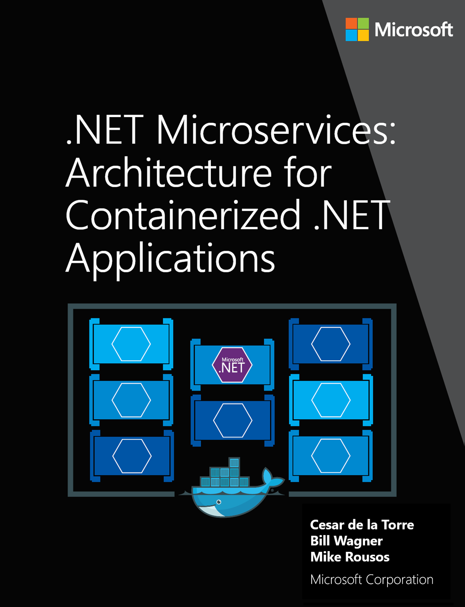

# .NET Microservices: Architecture for Containerized .NET Applications

**EDITION v6.0** - Updated to ASP.NET Core 6.0

Refer [changelog](https://aka.ms/MicroservicesEbookChangelog) for the book updates and community contributions.

This guide is an introduction to developing microservices-based applications and managing them using containers. It discusses architectural design and implementation approaches using .NET and Docker containers.

To make it easier to get started, the guide focuses on a reference containerized and microservice-based application that you can explore. The reference application is available at the [eShopOnContainers](https://github.com/dotnet-architecture/eShopOnContainers) GitHub repo.

## Action links

- This e-book is also available in a PDF format (English version only) [Download](https://aka.ms/microservicesebook)

- Clone/Fork the reference application [eShopOnContainers on GitHub](https://github.com/dotnet-architecture/eShopOnContainers)

- Watch the [introductory video on Channel 9](https://aka.ms/microservices-video)

- Get to know the [Microservices Architecture](https://aka.ms/MicroservicesArchitecture) right away

## Introduction

Enterprises are increasingly realizing cost savings, solving deployment problems, and improving DevOps and production operations by using containers. Microsoft has been releasing container innovations for Windows and Linux by creating products like Azure Kubernetes Service and Azure Service Fabric, and by partnering with industry leaders like Docker, Mesosphere, and Kubernetes. These products deliver container solutions that help companies build and deploy applications at cloud speed and scale, whatever their choice of platform or tools.

Docker is becoming the de facto standard in the container industry, supported by the most significant vendors in the Windows and Linux ecosystems. (Microsoft is one of the main cloud vendors supporting Docker.) In the future, Docker will probably be ubiquitous in any datacenter in the cloud or on-premises.

In addition, the [microservices](https://martinfowler.com/articles/microservices.html) architecture is emerging as an important approach for distributed mission-critical applications. In a microservice-based architecture, the application is built on a collection of services that can be developed, tested, deployed, and versioned independently.

## About this guide

This guide is an introduction to developing microservices-based applications and managing them using containers. It discusses architectural design and implementation approaches using .NET and Docker containers. To make it easier to get started with containers and microservices, the guide focuses on a reference containerized and microservice-based application that you can explore. The sample application is available at the [eShopOnContainers](https://github.com/dotnet-architecture/eShopOnContainers) GitHub repo.

This guide provides foundational development and architectural guidance primarily at a development environment level with a focus on two technologies: Docker and .NET. Our intention is that you read this guide when thinking about your application design without focusing on the infrastructure (cloud or on-premises) of your production environment. You will make decisions about your infrastructure later, when you create your production-ready applications. Therefore, this guide is intended to be infrastructure agnostic and more development-environment-centric.

After you have studied this guide, your next step would be to learn about production-ready microservices on Microsoft Azure.

## Version

This guide has been revised to cover **.NET 6** version along with many additional updates related to the same "wave" of technologies (that is, Azure and additional third-party technologies) coinciding in time with the .NET 6 release. That’s why the book version has also been updated to version **6.0**.

## What this guide does not cover

This guide does not focus on the application lifecycle, DevOps, CI/CD pipelines, or team work. The complementary guide [Containerized Docker Application Lifecycle with Microsoft Platform and Tools](https://aka.ms/dockerlifecycleebook) focuses on that subject. The current guide also does not provide implementation details on Azure infrastructure, such as information on specific orchestrators.

### Additional resources

- **Containerized Docker Application Lifecycle with Microsoft Platform and Tools** (downloadable e-book)  
    <https://aka.ms/dockerlifecycleebook>

## Who should use this guide

We wrote this guide for developers and solution architects who are new to Docker-based application development and to microservices-based architecture. This guide is for you if you want to learn how to architect, design, and implement proof-of-concept applications with Microsoft development technologies (with special focus on .NET) and with Docker containers.

You will also find this guide useful if you are a technical decision maker, such as an enterprise architect, who wants an architecture and technology overview before you decide on what approach to select for new and modern distributed applications.

### How to use this guide

The first part of this guide introduces Docker containers, discusses how to choose between .NET 6 and the .NET Framework as a development framework, and provides an overview of microservices. This content is for architects and technical decision makers who want an overview but don't need to focus on code implementation details.

The second part of the guide starts with the [Development process for Docker based applications](./docker-application-development-process/index.md) section. It focuses on the development and microservice patterns for implementing applications using .NET and Docker. This section will be of most interest to developers and architects who want to focus on code and on patterns and implementation details.

## Related microservice and container-based reference application: eShopOnContainers

The eShopOnContainers application is an open-source reference app for .NET and microservices that is designed to be deployed using Docker containers. The application consists of multiple subsystems, including several e-store UI front-ends (a Web MVC app, a Web SPA, and a native mobile app). It also includes the back-end microservices and containers for all required server-side operations.

The purpose of the application is to showcase architectural patterns. **IT IS NOT A PRODUCTION-READY TEMPLATE** to start real-world applications. In fact, the application is in a permanent beta state, as it's also used to test new potentially interesting technologies as they show up.

## Send us your feedback!

We wrote this guide to help you understand the architecture of containerized applications and microservices in .NET. The guide and related reference application will be evolving, so we welcome your feedback! If you have comments about how this guide can be improved, submit feedback at <https://aka.ms/ebookfeedback>.

## Credits

Co-Authors:

> **Cesar de la Torre**, Sr. PM, .NET product team, Microsoft Corp.
>
> **Bill Wagner**, Sr. Content Developer, C+E, Microsoft Corp.
>
> **Mike Rousos**, Principal Software Engineer, DevDiv CAT team, Microsoft

Editors:

> **Mike Pope**
>
> **Steve Hoag**

Participants and reviewers:

> **Jeffrey Richter**, Partner Software Eng, Azure team, Microsoft
>
> **Jimmy Bogard**, Chief Architect at Headspring
>
> **Udi Dahan**, Founder & CEO, Particular Software
>
> **Jimmy Nilsson**, Co-founder and CEO of Factor10
>
> **Glenn Condron**, Sr. Program Manager, ASP.NET team
>
> **Mark Fussell**, Principal PM Lead, Azure Service Fabric team, Microsoft
>
> **Diego Vega**, PM Lead, Entity Framework team, Microsoft
>
> **Barry Dorrans**, Sr. Security Program Manager
>
> **Rowan Miller**, Sr. Program Manager, Microsoft
>
> **Ankit Asthana**, Principal PM Manager, .NET team, Microsoft
>
> **Scott Hunter**, Partner Director PM, .NET team, Microsoft
>
> **Nish Anil**, Sr. Program Manager, .NET team, Microsoft
>
> **Dylan Reisenberger**, Architect and Dev Lead at Polly
>
> **Steve "ardalis" Smith** - Software Architect and Trainer - [Ardalis.com](https://ardalis.com)
>
> **Ian Cooper**, Coding Architect at Brighter
>
> **Unai Zorrilla**, Architect and Dev Lead at Plain Concepts
>
> **Eduard Tomas**, Dev Lead at Plain Concepts
>
> **Ramon Tomas**, Developer at Plain Concepts
>
> **David Sanz**, Developer at Plain Concepts
>
> **Javier Valero**, Chief Operating Officer at Grupo Solutio
>
> **Pierre Millet**, Sr. Consultant, Microsoft
>
> **Michael Friis**, Product Manager, Docker Inc
>
> **Charles Lowell**, Software Engineer, VS CAT team, Microsoft
>
> **Miguel Veloso**, Software Development Engineer at Plain Concepts
>
> **Sumit Ghosh**, Principal Consultant at Neudesic

## Copyright

PUBLISHED BY

Microsoft Developer Division, .NET and Visual Studio product teams

A division of Microsoft Corporation

One Microsoft Way

Redmond, Washington 98052-6399

Copyright © 2021 by Microsoft Corporation

All rights reserved. No part of the contents of this book may be reproduced or transmitted in any form or by any means without the written permission of the publisher.

This book is provided "as-is" and expresses the author's views and opinions. The views, opinions and information expressed in this book, including URL and other Internet website references, may change without notice.

Some examples depicted herein are provided for illustration only and are fictitious. No real association or connection is intended or should be inferred.

Microsoft and the trademarks listed at <https://www.microsoft.com> on the "Trademarks" webpage are trademarks of the Microsoft group of companies.

Mac and macOS are trademarks of Apple Inc.

The Docker whale logo is a registered trademark of Docker, Inc. Used by permission.

All other marks and logos are property of their respective owners.

>[!div class="step-by-step"]
>[Next](container-docker-introduction/index.md)
