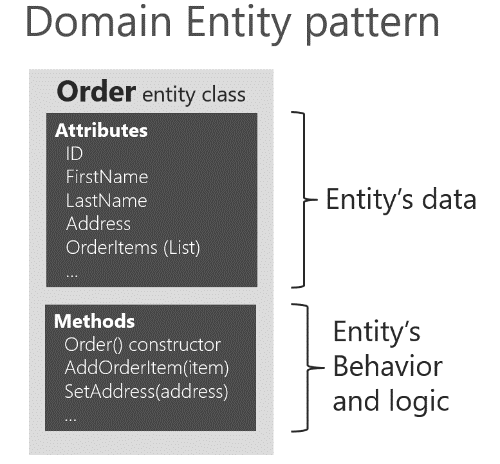
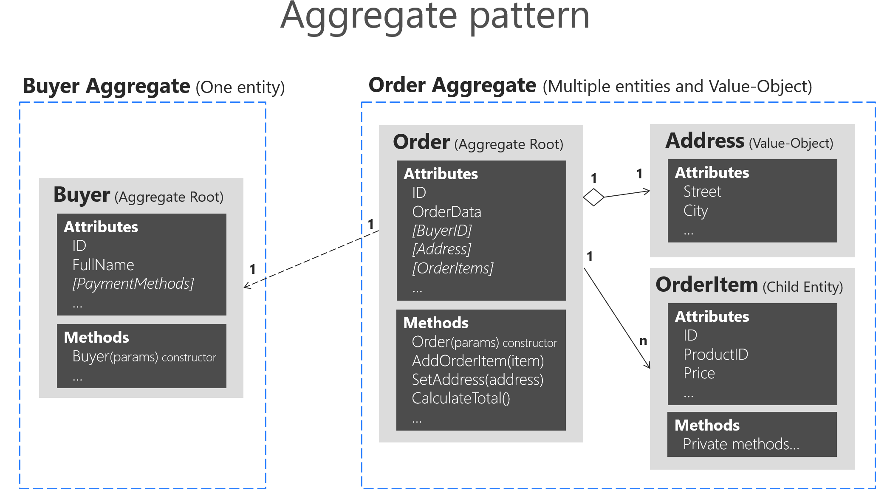

# Design a microservice domain model

*Define one rich domain model for each business microservice or Bounded Context.*

Your goal is to create a single cohesive domain model for each business microservice or Bounded Context (BC). Keep in mind, however, that a BC or business microservice could sometimes be composed of several physical services that share a single domain model. The domain model must capture the rules, behavior, business language, and constraints of the single Bounded Context or business microservice that it represents.

## The Domain Entity pattern

Entities represent domain objects and are primarily defined by their identity, continuity, and persistence over time, and not only by the attributes that comprise them. As Eric Evans says, "an object primarily defined by its identity is called an Entity." Entities are very important in the domain model, since they are the base for a model. Therefore, you should identify and design them carefully.

*An entity's identity can cross multiple microservices or Bounded Contexts.*

The same identity (that is, the same `Id` value, although perhaps not the same domain entity) can be modeled across multiple Bounded Contexts or microservices. However, that does not imply that the same entity, with the same attributes and logic would be implemented in multiple Bounded Contexts. Instead, entities in each Bounded Context limit their attributes and behaviors to those required in that Bounded Context's domain.

For instance, the buyer entity might have most of a person's attributes that are defined in the user entity in the profile or identity microservice, including the identity. But the buyer entity in the ordering microservice might have fewer attributes, because only certain buyer data is related to the order process. The context of each microservice or Bounded Context impacts its domain model.

*Domain entities must implement behavior in addition to implementing data attributes.*

A domain entity in DDD must implement the domain logic or behavior related to the entity data (the object accessed in memory). For example, as part of an order entity class you must have business logic and operations implemented as methods for tasks such as adding an order item, data validation, and total calculation. The entity's methods take care of the invariants and rules of the entity instead of having those rules spread across the application layer.

Figure 7-8 shows a domain entity that implements not only data attributes but operations or methods with related domain logic.



**Figure 7-8**. Example of a domain entity design implementing data plus behavior

A domain model entity implements behaviors through methods, that is, it's not an "anemic" model. Of course, sometimes you can have entities that do not implement any logic as part of the entity class. This can happen in child entities within an aggregate if the child entity does not have any special logic because most of the logic is defined in the aggregate root. If you have a complex microservice that has logic implemented in the service classes instead of in the domain entities, you could be falling into the anemic domain model, explained in the following section.

### Rich domain model versus anemic domain model

In his post [AnemicDomainModel](https://martinfowler.com/bliki/AnemicDomainModel.html), Martin Fowler describes an anemic domain model this way:

The basic symptom of an Anemic Domain Model is that at first blush it looks like the real thing. There are objects, many named after the nouns in the domain space, and these objects are connected with the rich relationships and structure that true domain models have. The catch comes when you look at the behavior, and you realize that there is hardly any behavior on these objects, making them little more than bags of getters and setters.

Of course, when you use an anemic domain model, those data models will be used from a set of service objects (traditionally named the *business layer*) which capture all the domain or business logic. The business layer sits on top of the data model and uses the data model just as data.

The anemic domain model is just a procedural style design. Anemic entity objects are not real objects because they lack behavior (methods). They only hold data properties and thus it is not object-oriented design. By putting all the behavior out into service objects (the business layer), you essentially end up with [spaghetti code](https://en.wikipedia.org/wiki/Spaghetti_code) or [transaction scripts](https://martinfowler.com/eaaCatalog/transactionScript.html), and therefore you lose the advantages that a domain model provides.

Regardless, if your microservice or Bounded Context is very simple (a CRUD service), the anemic domain model in the form of entity objects with just data properties might be good enough, and it might not be worth implementing more complex DDD patterns. In that case, it will be simply a persistence model, because you have intentionally created an entity with only data for CRUD purposes.

That is why microservices architectures are perfect for a multi-architectural approach depending on each Bounded Context. For instance, in eShopOnContainers, the ordering microservice implements DDD patterns, but the catalog microservice, which is a simple CRUD service, does not.

Some people say that the anemic domain model is an anti-pattern. It really depends on what you are implementing. If the microservice you are creating is simple enough (for example, a CRUD service), following the anemic domain model it is not an anti-pattern. However, if you need to tackle the complexity of a microservice's domain that has a lot of ever-changing business rules, the anemic domain model might be an anti-pattern for that microservice or Bounded Context. In that case, designing it as a rich model with entities containing data plus behavior as well as implementing additional DDD patterns (aggregates, value objects, etc.) might have huge benefits for the long-term success of such a microservice.

#### Additional resources

- **DevIQ. Domain Entity** \
  <https://deviq.com/entity/>

- **Martin Fowler. The Domain Model** \
  <https://martinfowler.com/eaaCatalog/domainModel.html>

- **Martin Fowler. The Anemic Domain Model** \
  <https://martinfowler.com/bliki/AnemicDomainModel.html>

### The Value Object pattern

As Eric Evans has noted, "Many objects do not have conceptual identity. These objects describe certain characteristics of a thing."

An entity requires an identity, but there are many objects in a system that do not, like the Value Object pattern. A value object is an object with no conceptual identity that describes a domain aspect. These are objects that you instantiate to represent design elements that only concern you temporarily. You care about *what* they are, not *who* they are. Examples include numbers and strings, but can also be higher-level concepts like groups of attributes.

Something that is an entity in a microservice might not be an entity in another microservice, because in the second case, the Bounded Context might have a different meaning. For example, an address in an e-commerce application might not have an identity at all, since it might only represent a group of attributes of the customer's profile for a person or company. In this case, the address should be classified as a value object. However, in an application for an electric power utility company, the customer address could be important for the business domain. Therefore, the address must have an identity so the billing system can be directly linked to the address. In that case, an address should be classified as a domain entity.

A person with a name and surname is usually an entity because a person has identity, even if the name and surname coincide with another set of values, such as if those names also refer to a different person.

Value objects are hard to manage in relational databases and ORMs like Entity Framework (EF), whereas in document-oriented databases they are easier to implement and use.

EF Core 2.0 and later versions include the [Owned Entities](https://devblogs.microsoft.com/dotnet/announcing-entity-framework-core-2-0/#owned-entities-and-table-splitting) feature that makes it easier to handle value objects, as we'll see in detail later on.

#### Additional resources

- **Martin Fowler. Value Object pattern** \
  <https://martinfowler.com/bliki/ValueObject.html>

- **Value Object** \
  <https://deviq.com/value-object/>

- **Value Objects in Test-Driven Development** \
  [https://leanpub.com/tdd-ebook/read\#leanpub-auto-value-objects](https://leanpub.com/tdd-ebook/read#leanpub-auto-value-objects)

- **Eric Evans. Domain-Driven Design: Tackling Complexity in the Heart of Software.** (Book; includes a discussion of value objects) \
  <https://www.amazon.com/Domain-Driven-Design-Tackling-Complexity-Software/dp/0321125215/>

### The Aggregate pattern

A domain model contains clusters of different data entities and processes that can control a significant area of functionality, such as order fulfillment or inventory. A more fine-grained DDD unit is the aggregate, which describes a cluster or group of entities and behaviors that can be treated as a cohesive unit.

You usually define an aggregate based on the transactions that you need. A classic example is an order that also contains a list of order items. An order item will usually be an entity. But it will be a child entity within the order aggregate, which will also contain the order entity as its root entity, typically called an aggregate root.

Identifying aggregates can be hard. An aggregate is a group of objects that must be consistent together, but you cannot just pick a group of objects and label them an aggregate. You must start with a domain concept and think about the entities that are used in the most common transactions related to that concept. Those entities that need to be transactionally consistent are what forms an aggregate. Thinking about transaction operations is probably the best way to identify aggregates.

### The Aggregate Root or Root Entity pattern

An aggregate is composed of at least one entity: the aggregate root, also called root entity or primary entity. Additionally, it can have multiple child entities and value objects, with all entities and objects working together to implement required behavior and transactions.

The purpose of an aggregate root is to ensure the consistency of the aggregate; it should be the only entry point for updates to the aggregate through methods or operations in the aggregate root class. You should make changes to entities within the aggregate only via the aggregate root. It is the aggregate's consistency guardian, considering all the invariants and consistency rules you might need to comply with in your aggregate. If you change a child entity or value object independently, the aggregate root cannot ensure that the aggregate is in a valid state. It would be like a table with a loose leg. Maintaining consistency is the main purpose of the aggregate root.

In Figure 7-9, you can see sample aggregates like the buyer aggregate, which contains a single entity (the aggregate root Buyer). The order aggregate contains multiple entities and a value object.



**Figure 7-9**. Example of aggregates with multiple or single entities

A DDD domain model is composed from aggregates, an aggregate can have just one entity or more, and can include value objects as well. Note that the Buyer aggregate could have additional child entities, depending on your domain, as it does in the ordering microservice in the eShopOnContainers reference application. Figure 7-9 just illustrates a case in which the buyer has a single entity, as an example of an aggregate that contains only an aggregate root.

In order to maintain separation of aggregates and keep clear boundaries between them, it is a good practice in a DDD domain model to disallow direct navigation between aggregates and only having the foreign key (FK) field, as implemented in the [Ordering microservice domain model](https://github.com/dotnet-architecture/eShopOnContainers/blob/main/src/Services/Ordering/Ordering.Domain/AggregatesModel/OrderAggregate/Order.cs) in eShopOnContainers. The Order entity only has a foreign key field for the buyer, but not an EF Core navigation property, as shown in the following code:

```csharp
public class Order : Entity, IAggregateRoot
{
    private DateTime _orderDate;
    public Address Address { get; private set; }
    private int? _buyerId; // FK pointing to a different aggregate root
    public OrderStatus OrderStatus { get; private set; }
    private readonly List<OrderItem> _orderItems;
    public IReadOnlyCollection<OrderItem> OrderItems => _orderItems;
    // ... Additional code
}
```

Identifying and working with aggregates requires research and experience. For more information, see the following Additional resources list.

#### Additional resources

- **Vaughn Vernon. Effective Aggregate Design - Part I: Modeling a Single Aggregate** (from <https://dddcommunity.org/>) \
  <https://dddcommunity.org/wp-content/uploads/files/pdf_articles/Vernon_2011_1.pdf>

- **Vaughn Vernon. Effective Aggregate Design - Part II: Making Aggregates Work Together** (from <https://dddcommunity.org/>) \
  <https://dddcommunity.org/wp-content/uploads/files/pdf_articles/Vernon_2011_2.pdf>

- **Vaughn Vernon. Effective Aggregate Design - Part III: Gaining Insight Through Discovery** (from <https://dddcommunity.org/>) \
  <https://dddcommunity.org/wp-content/uploads/files/pdf_articles/Vernon_2011_3.pdf>

- **Sergey Grybniak. DDD Tactical Design Patterns** \
  <https://www.codeproject.com/Articles/1164363/Domain-Driven-Design-Tactical-Design-Patterns-Part>

- **Chris Richardson. Developing Transactional Microservices Using Aggregates** \
  <https://www.infoq.com/articles/microservices-aggregates-events-cqrs-part-1-richardson>

- **DevIQ. The Aggregate pattern** \
  <https://deviq.com/aggregate-pattern/>

>[!div class="step-by-step"]
>[Previous](ddd-oriented-microservice.md)
>[Next](net-core-microservice-domain-model.md)
