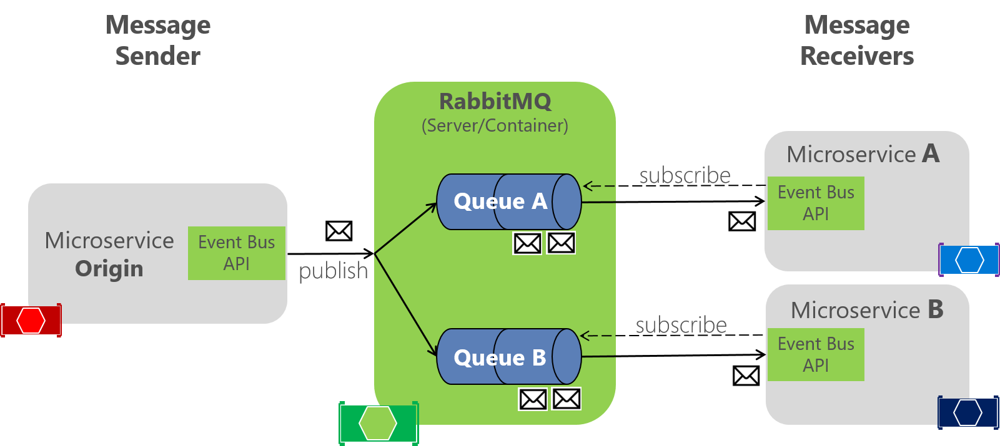

# Implementing an event bus with RabbitMQ for the development or test environment

We should start by saying that if you create your custom event bus based on RabbitMQ running in a container, as the eShopOnContainers application does, it should be used only for your development and test environments. Don't use it for your production environment, unless you are building it as a part of a production-ready service bus. A simple custom event bus might be missing many production-ready critical features that a commercial service bus has.

One of the event bus custom implementations in eShopOnContainers is basically a library using the RabbitMQ API. (There's another implementation based on Azure Service Bus.)

The event bus implementation with RabbitMQ lets microservices subscribe to events, publish events, and receive events, as shown in Figure 6-21.



**Figure 6-21.** RabbitMQ implementation of an event bus

RabbitMQ functions as an intermediary between message publisher and subscribers, to handle distribution. In the code, the EventBusRabbitMQ class implements the generic IEventBus interface. This implementation is based on Dependency Injection so that you can swap from this dev/test version to a production version.

```csharp
public class EventBusRabbitMQ : IEventBus, IDisposable
{
    // Implementation using RabbitMQ API
    //...
}
```

The RabbitMQ implementation of a sample dev/test event bus is boilerplate code. It has to handle the connection to the RabbitMQ server and provide code for publishing a message event to the queues. It also has to implement a dictionary of collections of integration event handlers for each event type; these event types can have a different instantiation and different subscriptions for each receiver microservice, as shown in Figure 6-21.

## Implementing a simple publish method with RabbitMQ

The following code is a ***simplified*** version of an event bus implementation for RabbitMQ, to showcase the whole scenario. You don't really handle the connection this way. To see the full implementation, see the actual code in the [dotnet-architecture/eShopOnContainers](https://github.com/dotnet-architecture/eShopOnContainers/blob/main/src/BuildingBlocks/EventBus/EventBusRabbitMQ/EventBusRabbitMQ.cs) repository.

```csharp
public class EventBusRabbitMQ : IEventBus, IDisposable
{
    // Member objects and other methods ...
    // ...

    public void Publish(IntegrationEvent @event)
    {
        var eventName = @event.GetType().Name;
        var factory = new ConnectionFactory() { HostName = _connectionString };
        using (var connection = factory.CreateConnection())
        using (var channel = connection.CreateModel())
        {
            channel.ExchangeDeclare(exchange: _brokerName,
                type: "direct");
            string message = JsonConvert.SerializeObject(@event);
            var body = Encoding.UTF8.GetBytes(message);
            channel.BasicPublish(exchange: _brokerName,
                routingKey: eventName,
                basicProperties: null,
                body: body);
       }
    }
}
```

The [actual code](https://github.com/dotnet-architecture/eShopOnContainers/blob/main/src/BuildingBlocks/EventBus/EventBusRabbitMQ/EventBusRabbitMQ.cs) of the Publish method in the eShopOnContainers application is improved by using a [Polly](https://github.com/App-vNext/Polly) retry policy, which retries the task some times in case the RabbitMQ container is not ready. This scenario can occur when docker-compose is starting the containers; for example, the RabbitMQ container might start more slowly than the other containers.

As mentioned earlier, there are many possible configurations in RabbitMQ, so this code should be used only for dev/test environments.

## Implementing the subscription code with the RabbitMQ API

As with the publish code, the following code is a simplification of part of the event bus implementation for RabbitMQ. Again, you usually do not need to change it unless you are improving it.

```csharp
public class EventBusRabbitMQ : IEventBus, IDisposable
{
    // Member objects and other methods ...
    // ...

    public void Subscribe<T, TH>()
        where T : IntegrationEvent
        where TH : IIntegrationEventHandler<T>
    {
        var eventName = _subsManager.GetEventKey<T>();

        var containsKey = _subsManager.HasSubscriptionsForEvent(eventName);
        if (!containsKey)
        {
            if (!_persistentConnection.IsConnected)
            {
                _persistentConnection.TryConnect();
            }

            using (var channel = _persistentConnection.CreateModel())
            {
                channel.QueueBind(queue: _queueName,
                                    exchange: BROKER_NAME,
                                    routingKey: eventName);
            }
        }

        _subsManager.AddSubscription<T, TH>();
    }
}
```

Each event type has a related channel to get events from RabbitMQ. You can then have as many event handlers per channel and event type as needed.

The Subscribe method accepts an IIntegrationEventHandler object, which is like a callback method in the current microservice, plus its related IntegrationEvent object. The code then adds that event handler to the list of event handlers that each integration event type can have per client microservice. If the client code has not already been subscribed to the event, the code creates a channel for the event type so it can receive events in a push style from RabbitMQ when that event is published from any other service.

As mentioned above, the event bus implemented in eShopOnContainers has only an educational purpose, since it only handles the main scenarios, so it's not ready for production.

For production scenarios check the additional resources below, specific for RabbitMQ, and the [Implementing event-based communication between microservices](./integration-event-based-microservice-communications.md#additional-resources) section.

## Additional resources

A production-ready solution with support for RabbitMQ.

- **EasyNetQ** - Open Source .NET API client for RabbitMQ \
  <https://easynetq.com/>

- **MassTransit** \
  <https://masstransit-project.com/>
  
- **Rebus** - Open source .NET Service Bus
  <https://github.com/rebus-org/Rebus>

> [!div class="step-by-step"]
> [Previous](integration-event-based-microservice-communications.md)
> [Next](subscribe-events.md)
