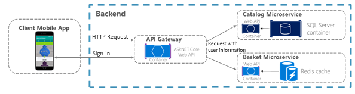
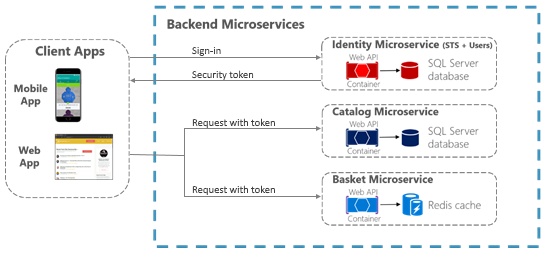
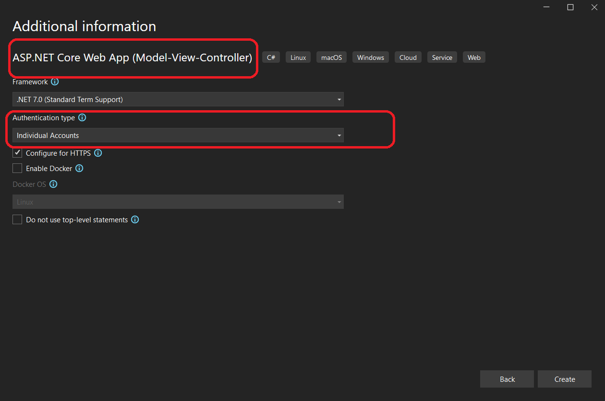

# Make secure .NET Microservices and Web Applications

There are so many aspects about security in microservices and web applications that the topic could easily take several books like this one. So, in this section, we'll focus on authentication, authorization, and application secrets.

## Implement authentication in .NET microservices and web applications

It's often necessary for resources and APIs published by a service to be limited to certain trusted users or clients. The first step to making these sorts of API-level trust decisions is authentication. Authentication is the process of reliably verifying a user's identity.

In microservice scenarios, authentication is typically handled centrally. If you're using an API Gateway, the gateway is a good place to authenticate, as shown in Figure 9-1. If you use this approach, make sure that the individual microservices cannot be reached directly (without the API Gateway) unless additional security is in place to authenticate messages whether they come from the gateway or not.



**Figure 9-1**. Centralized authentication with an API Gateway

When the API Gateway centralizes authentication, it adds user information when forwarding requests to the microservices. If services can be accessed directly, an authentication service like Azure Active Directory or a dedicated authentication microservice acting as a security token service (STS) can be used to authenticate users. Trust decisions are shared between services with security tokens or cookies. (These tokens can be shared between ASP.NET Core applications, if needed, by implementing [cookie sharing](/aspnet/core/security/cookie-sharing).) This pattern is illustrated in Figure 9-2.



**Figure 9-2**. Authentication by identity microservice; trust is shared using an authorization token

When microservices are accessed directly, trust, that includes authentication and authorization, is handled by a security token issued by a dedicated microservice, shared between microservices.

### Authenticate with ASP.NET Core Identity

The primary mechanism in ASP.NET Core for identifying an application's users is the [ASP.NET Core Identity](/aspnet/core/security/authentication/identity) membership system. ASP.NET Core Identity stores user information (including sign-in information, roles, and claims) in a data store configured by the developer. Typically, the ASP.NET Core Identity data store is an Entity Framework store provided in the `Microsoft.AspNetCore.Identity.EntityFrameworkCore` package. However, custom stores or other third-party packages can be used to store identity information in Azure Table Storage, CosmosDB, or other locations.

> [!TIP]
> ASP.NET Core 2.1 and later provides [ASP.NET Core Identity](/aspnet/core/security/authentication/identity) as a [Razor Class Library](/aspnet/core/razor-pages/ui-class), so you won't see much of the necessary code in your project, as was the case for previous versions. For details on how to customize the Identity code to suit your needs, see [Scaffold Identity in ASP.NET Core projects](/aspnet/core/security/authentication/scaffold-identity).

The following code is taken from the ASP.NET Core Web Application MVC 3.1 project template with individual user account authentication selected. It shows how to configure ASP.NET Core Identity using Entity Framework Core in the `Startup.ConfigureServices` method.

```csharp
public void ConfigureServices(IServiceCollection services)
{
    //...
    services.AddDbContext<ApplicationDbContext>(options =>
        options.UseSqlServer(
            Configuration.GetConnectionString("DefaultConnection")));

    services.AddDefaultIdentity<IdentityUser>(options => options.SignIn.RequireConfirmedAccount = true)
        .AddEntityFrameworkStores<ApplicationDbContext>();

    services.AddRazorPages();
    //...
}
```

Once ASP.NET Core Identity is configured, you enable it by adding the `app.UseAuthentication()` and `endpoints.MapRazorPages()` as shown in the following code in the service's `Startup.Configure` method:

```csharp
public void Configure(IApplicationBuilder app, IWebHostEnvironment env)
{
    //...
    app.UseRouting();

    app.UseAuthentication();
    app.UseAuthorization();

    app.UseEndpoints(endpoints =>
    {
        endpoints.MapRazorPages();
    });
    //...
}
```

> [!IMPORTANT]
> The lines in the preceding code **MUST BE IN THE ORDER SHOWN** for Identity to work correctly.

Using ASP.NET Core Identity enables several scenarios:

- Create new user information using the UserManager type (userManager.CreateAsync).

- Authenticate users using the SignInManager type. You can use `signInManager.SignInAsync` to sign in directly, or `signInManager.PasswordSignInAsync` to confirm the user's password is correct and then sign them in.

- Identify a user based on information stored in a cookie (which is read by ASP.NET Core Identity middleware) so that subsequent requests from a browser will include a signed-in user's identity and claims.

ASP.NET Core Identity also supports [two-factor authentication](/aspnet/core/security/authentication/2fa).

For authentication scenarios that make use of a local user data store and that persist identity between requests using cookies (as is typical for MVC web applications), ASP.NET Core Identity is a recommended solution.

### Authenticate with external providers

ASP.NET Core also supports using [external authentication providers](/aspnet/core/security/authentication/social/) to let users sign in via [OAuth 2.0](https://www.digitalocean.com/community/tutorials/an-introduction-to-oauth-2) flows. This means that users can sign in using existing authentication processes from providers like Microsoft, Google, Facebook, or Twitter and associate those identities with an ASP.NET Core identity in your application.

To use external authentication, besides including the authentication middleware as mentioned before, using the `app.UseAuthentication()` method, you also have to register the external provider in `Startup` as shown in the following example:

```csharp
public void ConfigureServices(IServiceCollection services)
{
    //...
    services.AddDefaultIdentity<IdentityUser>(options => options.SignIn.RequireConfirmedAccount = true)
        .AddEntityFrameworkStores<ApplicationDbContext>();

    services.AddAuthentication()
        .AddMicrosoftAccount(microsoftOptions =>
        {
            microsoftOptions.ClientId = Configuration["Authentication:Microsoft:ClientId"];
            microsoftOptions.ClientSecret = Configuration["Authentication:Microsoft:ClientSecret"];
        })
        .AddGoogle(googleOptions => { ... })
        .AddTwitter(twitterOptions => { ... })
        .AddFacebook(facebookOptions => { ... });
    //...
}
```

Popular external authentication providers and their associated NuGet packages are shown in the following table:

| **Provider**  | **Package**                                          |
| ------------- | ---------------------------------------------------- |
| **Microsoft** | **Microsoft.AspNetCore.Authentication.MicrosoftAccount** |
| **Google**    | **Microsoft.AspNetCore.Authentication.Google**           |
| **Facebook**  | **Microsoft.AspNetCore.Authentication.Facebook**         |
| **Twitter**   | **Microsoft.AspNetCore.Authentication.Twitter**          |

In all cases, you must complete an application registration procedure that is vendor dependent and that usually involves:

1. Getting a Client Application ID.
2. Getting a Client Application Secret.
3. Configuring a redirection URL, that's handled by the authorization middleware and the registered provider
4. Optionally, configuring a sign-out URL to properly handle sign out in a Single Sign On (SSO) scenario.

For details on configuring your app for an external provider, see the [External provider authentication in the ASP.NET Core documentation](/aspnet/core/security/authentication/social/)).

> [!TIP]
> All details are handled by the authorization middleware and services previously mentioned. So, you just have to choose the **Individual User Account** authentication option when you create the ASP.NET Core web application project in Visual Studio, as shown in Figure 9-3, besides registering the authentication providers previously mentioned.



**Figure 9-3**. Selecting the Individual User Accounts option, for using external authentication, when creating a web application project in Visual Studio 2019.

In addition to the external authentication providers listed previously, third-party packages are available that provide middleware for using many more external authentication providers. For a list, see the [AspNet.Security.OAuth.Providers](https://github.com/aspnet-contrib/AspNet.Security.OAuth.Providers/tree/dev/src) repository on GitHub.

You can also create your own external authentication middleware to solve some special need.

### Authenticate with bearer tokens

Authenticating with ASP.NET Core Identity (or Identity plus external authentication providers) works well for many web application scenarios in which storing user information in a cookie is appropriate. In other scenarios, though, cookies are not a natural means of persisting and transmitting data.

For example, in an ASP.NET Core Web API that exposes RESTful endpoints that might be accessed by Single Page Applications (SPAs), by native clients, or even by other Web APIs, you typically want to use bearer token authentication instead. These types of applications do not work with cookies, but can easily retrieve a bearer token and include it in the authorization header of subsequent requests. To enable token authentication, ASP.NET Core supports several options for using [OAuth 2.0](https://oauth.net/2/) and [OpenID Connect](https://openid.net/connect/).

### Authenticate with an OpenID Connect or OAuth 2.0 Identity provider

If user information is stored in Azure Active Directory or another identity solution that supports OpenID Connect or OAuth 2.0, you can use the **Microsoft.AspNetCore.Authentication.OpenIdConnect** package to authenticate using the OpenID Connect workflow. For example, to authenticate to the Identity.Api microservice in eShopOnContainers, an ASP.NET Core web application can use middleware from that package as shown in the following simplified example in `Startup.cs`:

```csharp
// Startup.cs

public void Configure(IApplicationBuilder app, IHostingEnvironment env)
{
    //…
    app.UseAuthentication();
    //…
    app.UseEndpoints(endpoints =>
    {
        //...
    });
}

public void ConfigureServices(IServiceCollection services)
{
    var identityUrl = Configuration.GetValue<string>("IdentityUrl");
    var callBackUrl = Configuration.GetValue<string>("CallBackUrl");
    var sessionCookieLifetime = Configuration.GetValue("SessionCookieLifetimeMinutes", 60);

    // Add Authentication services

    services.AddAuthentication(options =>
    {
        options.DefaultScheme = CookieAuthenticationDefaults.AuthenticationScheme;
        options.DefaultChallengeScheme = JwtBearerDefaults.AuthenticationScheme;
    })
    .AddCookie(setup => setup.ExpireTimeSpan = TimeSpan.FromMinutes(sessionCookieLifetime))
    .AddOpenIdConnect(options =>
    {
        options.SignInScheme = CookieAuthenticationDefaults.AuthenticationScheme;
        options.Authority = identityUrl.ToString();
        options.SignedOutRedirectUri = callBackUrl.ToString();
        options.ClientId = useLoadTest ? "mvctest" : "mvc";
        options.ClientSecret = "secret";
        options.ResponseType = useLoadTest ? "code id_token token" : "code id_token";
        options.SaveTokens = true;
        options.GetClaimsFromUserInfoEndpoint = true;
        options.RequireHttpsMetadata = false;
        options.Scope.Add("openid");
        options.Scope.Add("profile");
        options.Scope.Add("orders");
        options.Scope.Add("basket");
        options.Scope.Add("marketing");
        options.Scope.Add("locations");
        options.Scope.Add("webshoppingagg");
        options.Scope.Add("orders.signalrhub");
    });
}
```

When you use this workflow, the ASP.NET Core Identity middleware is not needed, because all user information storage and authentication is handled by the Identity service.

### Issue security tokens from an ASP.NET Core service

If you prefer to issue security tokens for local ASP.NET Core Identity users rather than using an external identity provider, you can take advantage of some good third-party libraries.

[IdentityServer4](https://github.com/IdentityServer/IdentityServer4) and [OpenIddict](https://github.com/openiddict/openiddict-core) are OpenID Connect providers that integrate easily with ASP.NET Core Identity to let you issue security tokens from an ASP.NET Core service. The [IdentityServer4 documentation](https://identityserver4.readthedocs.io/en/latest/) has in-depth instructions for using the library. However, the basic steps to using IdentityServer4 to issue tokens are as follows.

1. You call app.UseIdentityServer in the Startup.Configure method to add IdentityServer4 to the application's HTTP request processing pipeline. This lets the library serve requests to OpenID Connect and OAuth2 endpoints like /connect/token.

2. You configure IdentityServer4 in Startup.ConfigureServices by making a call to services.AddIdentityServer.

3. You configure identity server by setting the following data:

   - The [credentials](https://identityserver4.readthedocs.io/en/latest/topics/crypto.html) to use for signing.

   - The [Identity and API resources](https://identityserver4.readthedocs.io/en/latest/topics/resources.html) that users might request access to:

      - API resources represent protected data or functionality that a user can access with an access token. An example of an API resource would be a web API (or set of APIs) that requires authorization.

      - Identity resources represent information (claims) that are given to a client to identify a user. The claims might include the user name, email address, and so on.

   - The [clients](https://identityserver4.readthedocs.io/en/latest/topics/clients.html) that will be connecting in order to request tokens.

   - The storage mechanism for user information, such as [ASP.NET Core Identity](https://identityserver4.readthedocs.io/en/latest/quickstarts/0_overview.html) or an alternative.

When you specify clients and resources for IdentityServer4 to use, you can pass an <xref:System.Collections.Generic.IEnumerable%601> collection of the appropriate type to methods that take in-memory client or resource stores. Or for more complex scenarios, you can provide client or resource provider types via Dependency Injection.

A sample configuration for IdentityServer4 to use in-memory resources and clients provided by a custom IClientStore type might look like the following example:

```csharp
public IServiceProvider ConfigureServices(IServiceCollection services)
{
    //...
    services.AddSingleton<IClientStore, CustomClientStore>();
    services.AddIdentityServer()
        .AddSigningCredential("CN=sts")
        .AddInMemoryApiResources(MyApiResourceProvider.GetAllResources())
        .AddAspNetIdentity<ApplicationUser>();
    //...
}
```

### Consume security tokens

Authenticating against an OpenID Connect endpoint or issuing your own security tokens covers some scenarios. But what about a service that simply needs to limit access to those users who have valid security tokens that were provided by a different service?

For that scenario, authentication middleware that handles JWT tokens is available in the **Microsoft.AspNetCore.Authentication.JwtBearer** package. JWT stands for "[JSON Web Token](https://tools.ietf.org/html/rfc7519)" and is a common security token format (defined by RFC 7519) for communicating security claims. A simplified example of how to use middleware to consume such tokens might look like this code fragment, taken from the Ordering.Api microservice of eShopOnContainers.

```csharp
// Startup.cs

public void Configure(IApplicationBuilder app, IHostingEnvironment env)
{
    //…
    // Configure the pipeline to use authentication
    app.UseAuthentication();
    //…
    app.UseEndpoints(endpoints =>
    {
        //...
    });
}

public void ConfigureServices(IServiceCollection services)
{
    var identityUrl = Configuration.GetValue<string>("IdentityUrl");

    // Add Authentication services

    services.AddAuthentication(options =>
    {
        options.DefaultAuthenticateScheme = AspNetCore.Authentication.JwtBearer.JwtBearerDefaults.AuthenticationScheme;
        options.DefaultChallengeScheme = AspNetCore.Authentication.JwtBearer.JwtBearerDefaults.AuthenticationScheme;

    }).AddJwtBearer(options =>
    {
        options.Authority = identityUrl;
        options.RequireHttpsMetadata = false;
        options.Audience = "orders";
    });
}
```

The parameters in this usage are:

- `Audience` represents the receiver of the incoming token or the resource that the token grants access to. If the value specified in this parameter does not match the parameter in the token, the token will be rejected.

- `Authority` is the address of the token-issuing authentication server. The JWT bearer authentication middleware uses this URI to get the public key that can be used to validate the token's signature. The middleware also confirms that the `iss` parameter in the token matches this URI.

Another parameter, `RequireHttpsMetadata`, is useful for testing purposes; you set this parameter to false so you can test in environments where you don't have certificates. In real-world deployments, JWT bearer tokens should always be passed only over HTTPS.

With this middleware in place, JWT tokens are automatically extracted from authorization headers. They are then deserialized, validated (using the values in the `Audience` and `Authority` parameters), and stored as user information to be referenced later by MVC actions or authorization filters.

The JWT bearer authentication middleware can also support more advanced scenarios, such as using a local certificate to validate a token if the authority is not available. For this scenario, you can specify a `TokenValidationParameters` object in the `JwtBearerOptions` object.

## Additional resources

- **Sharing cookies between applications** \
  [https://docs.microsoft.com/aspnet/core/security/cookie-sharing](/aspnet/core/security/cookie-sharing)

- **Introduction to Identity** \
  [https://docs.microsoft.com/aspnet/core/security/authentication/identity](/aspnet/core/security/authentication/identity)

- **Rick Anderson. Two-factor authentication with SMS** \
  [https://docs.microsoft.com/aspnet/core/security/authentication/2fa](/aspnet/core/security/authentication/2fa)

- **Enabling authentication using Facebook, Google and other external providers** \
  [https://docs.microsoft.com/aspnet/core/security/authentication/social/](/aspnet/core/security/authentication/social/)

- **Michell Anicas. An Introduction to OAuth 2** \
  <https://www.digitalocean.com/community/tutorials/an-introduction-to-oauth-2>

- **AspNet.Security.OAuth.Providers** (GitHub repo for ASP.NET OAuth providers) \
  <https://github.com/aspnet-contrib/AspNet.Security.OAuth.Providers/tree/dev/src>

- **IdentityServer4. Official documentation** \
  <https://identityserver4.readthedocs.io/en/latest/>

>[!div class="step-by-step"]
>[Previous](../implement-resilient-applications/monitor-app-health.md)
>[Next](authorization-net-microservices-web-applications.md)
