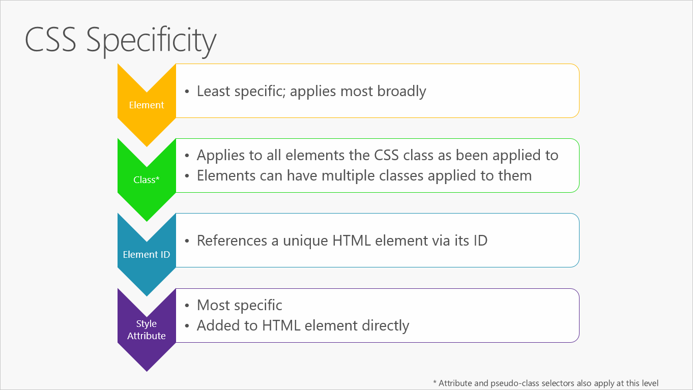

# Common client-side web technologies

> "Websites should look good from the inside and out."
> _- Paul Cookson_

ASP.NET Core applications are web applications and they typically rely on client-side web technologies like HTML, CSS, and JavaScript. By separating the content of the page (the HTML) from its layout and styling (the CSS), and its behavior (via JavaScript), complex web apps can leverage the Separation of Concerns principle. Future changes to the structure, design, or behavior of the application can be made more easily when these concerns are not intertwined.

While HTML and CSS are relatively stable, JavaScript, by means of the application frameworks and utilities developers work with to build web-based applications, is evolving at breakneck speed. This chapter looks at a few ways that JavaScript is used by web developers and provides a high-level overview of the Angular and React client-side libraries.

> [!NOTE]
> Blazor provides an alternative to JavaScript frameworks for building rich, interactive client user interfaces.

## HTML

HTML is the standard markup language used to create web pages and web applications. Its elements form the building blocks of pages, representing formatted text, images, form inputs, and other structures. When a browser makes a request to a URL, whether fetching a page or an application, the first thing that is returned is an HTML document. This HTML document may reference or include additional information about its look and layout in the form of CSS, or behavior in the form of JavaScript.

## CSS

CSS (Cascading Style Sheets) is used to control the look and layout of HTML elements. CSS styles can be applied directly to an HTML element, defined separately on the same page, or defined in a separate file and referenced by the page. Styles cascade based on how they are used to select a given HTML element. For instance, a style might apply to an entire document, but would be overridden by a style that applied to a particular element. Likewise, an element-specific style would be overridden by a style that applied to a CSS class that was applied to the element, which in turn would be overridden by a style targeting a specific instance of that element (via its ID). Figure 6-1



**Figure 6-1.** CSS Specificity rules, in order.

It's best to keep styles in their own separate stylesheet files, and to use selection-based cascading to implement consistent and reusable styles within the application. Placing style rules within HTML should be avoided, and applying styles to specific individual elements (rather than whole classes of elements, or elements that have had a particular CSS class applied to them) should be the exception, not the rule.

### CSS preprocessors

CSS stylesheets lack support for conditional logic, variables, and other programming language features. Thus, large stylesheets often include quite a bit of repetition, as the same color, font, or other setting is applied to many different variations of HTML elements and CSS classes. CSS preprocessors can help your stylesheets follow the [DRY principle](https://deviq.com/don-t-repeat-yourself/) by adding support for variables and logic.

The most popular CSS preprocessors are Sass and LESS. Both extend CSS and are backward compatible with it, meaning that a plain CSS file is a valid Sass or LESS file. Sass is Ruby-based and LESS is JavaScript based, and both typically run as part of your local development process. Both have command-line tools available, as well as built-in support in Visual Studio for running them using Gulp or Grunt tasks.

## JavaScript

JavaScript is a dynamic, interpreted programming language that has been standardized in the ECMAScript language specification. It is the programming language of the web. Like CSS, JavaScript can be defined as attributes within HTML elements, as blocks of script within a page, or in separate files. Just like CSS, it's recommended to organize JavaScript into separate files, keeping it separated as much as possible from the HTML found on individual web pages or application views.

When working with JavaScript in your web application, there are a few tasks that you'll commonly need to perform:

- Selecting an HTML element and retrieving and/or updating its value.

- Querying a Web API for data.

- Sending a command to a Web API (and responding to a callback with its result).

- Performing validation.

You can perform all of these tasks with JavaScript alone, but many libraries exist to make these tasks easier. One of the first and most successful of these libraries are jQuery, which continues to be a popular choice for simplifying these tasks on web pages. For Single Page Applications (SPAs), jQuery doesn't provide many of the desired features that Angular and React offer.

### Legacy web apps with jQuery

Although ancient by JavaScript framework standards, jQuery continues to be a commonly used library for working with HTML/CSS and building applications that make AJAX calls to web APIs. However, jQuery operates at the level of the browser document object model (DOM), and by default offers only an imperative, rather than declarative, model.

For example, imagine that if a textbox's value exceeds 10, an element on the page should be made visible. In jQuery, this functionality would typically be implemented by writing an event handler with code that would inspect the textbox's value and set the visibility of the target element based on that value. This process is an imperative, code-based approach. Another framework might instead use databinding to bind the visibility of the element to the value of the textbox declaratively. This approach would not require writing any code, but instead only requires decorating the elements involved with data binding attributes. As client-side behaviors grow more complex, data binding approaches frequently result in simpler solutions with less code and conditional complexity.

### jQuery vs a SPA Framework

| **Factor** | **jQuery** | **Angular**|
|--------------------------|------------|-------------|
| Abstracts the DOM | **Yes** | **Yes** |
| AJAX Support | **Yes** | **Yes** |
| Declarative Data Binding | **No** | **Yes** |
| MVC-style Routing | **No** | **Yes** |
| Templating | **No** | **Yes** |
| Deep-Link Routing | **No** | **Yes** |

Most of the features jQuery lacks intrinsically can be added with the addition of other libraries. However, a SPA framework like Angular provides these features in a more integrated fashion, since it's been designed with all of them in mind from the start. Also, jQuery is an imperative library, meaning that you need to call jQuery functions in order to do anything with jQuery. Much of the work and functionality that SPA frameworks provide can be done declaratively, requiring no actual code to be written.

Data binding is a great example of this functionality. In jQuery, it usually only takes one line of code to get the value of a DOM element or to set an element's value. However, you have to write this code anytime you need to change the value of the element, and sometimes this will occur in multiple functions on a page. Another common example is element visibility. In jQuery, there might be many different places where you'd write code to control whether certain elements were visible. In each of these cases, when using data binding, no code would need to be written. You'd simply bind the value or visibility of the elements in question to a *viewmodel* on the page, and changes to that viewmodel would automatically be reflected in the bound elements.

### Angular SPAs

Angular remains one of the world's most popular JavaScript frameworks. Since Angular 2, the team rebuilt the framework from the ground up (using [TypeScript](https://www.typescriptlang.org/)) and rebranded from the original AngularJS name to angular. Now several years old, the redesigned Angular continues to be a robust framework for building Single Page Applications.

Angular applications are built from components. Components combine HTML templates with special objects and control a portion of the page. A simple component from Angular's docs is shown here:

```js
import { Component } from '@angular/core';

@Component({
    selector: 'my-app',
    template: `<h1>Hello {{name}}</h1>`
})

export class AppComponent { name = 'Angular'; }
```

Components are defined using the @Component decorator function, which takes in metadata about the component. The selector property identifies the ID of the element on the page where this component will be displayed. The template property is a simple HTML template that includes a placeholder that corresponds to the component's name property, defined on the last line.

By working with components and templates, instead of DOM elements, Angular apps can operate at a higher level of abstraction and with less overall code than apps written using just JavaScript (also called "vanilla JS") or with jQuery. Angular also imposes some order on how you organize your client-side script files. By convention, Angular apps use a common folder structure, with module and component script files located in an app folder. Angular scripts concerned with building, deploying, and testing the app are typically located in a higher-level folder.

You can develop Angular apps by using a CLI. Getting started with Angular development locally (assuming you already have git and npm installed) consists of simply cloning a repo from GitHub and running `npm install` and `npm start`. Beyond this, Angular ships its own CLI, which can create projects, add files, and assist with testing, bundling, and deployment tasks. This CLI friendliness makes Angular especially compatible with ASP.NET Core, which also features great CLI support.

Microsoft has developed a reference application, eShopOnContainers, which includes an Angular SPA implementation. This app includes Angular modules to manage the online store's shopping basket, load and display items from its catalog, and handling order creation. You can view and download the sample application from [GitHub](https://github.com/dotnet-architecture/eShopOnContainers/tree/main/src/Web/WebSPA).

### React

Unlike Angular, which offers a full Model-View-Controller pattern implementation, React is only concerned with views. It's not a framework, just a library, so to build a SPA you'll need to leverage additional libraries. There are a number of libraries that are designed to be used with React to produce rich single page applications.

One of React's most important features is its use of a virtual DOM. The virtual DOM provides React with several advantages, including performance (the virtual DOM can optimize which parts of the actual DOM need to be updated) and testability (no need to have a browser to test React and its interactions with its virtual DOM).

React is also unusual in how it works with HTML. Rather than having a strict separation between code and markup (with references to JavaScript appearing in HTML attributes perhaps), React adds HTML directly within its JavaScript code as JSX. JSX is HTML-like syntax that can compile down to pure JavaScript. For example:

```js
<ul>
{ authors.map(author =>
    <li key={author.id}>{author.name}</li>
)}
</ul>
```

If you already know JavaScript, learning React should be easy. There isn't nearly as much learning curve or special syntax involved as with Angular or other popular libraries.

Because React isn't a full framework, you'll typically want other libraries to handle things like routing, web API calls, and dependency management. The nice thing is, you can pick the best library for each of these, but the disadvantage is that you need to make all of these decisions and verify all of your chosen libraries work well together when you're done. If you want a good starting point, you can use a starter kit like React Slingshot, which prepackages a set of compatible libraries together with React.

### Vue

From its getting started guide, "Vue is a progressive framework for building user interfaces. Unlike other monolithic frameworks, Vue is designed from the ground up to be incrementally adoptable. The core library is focused on the view layer only, and is easy to pick up and integrate with other libraries or existing projects. On the other hand, Vue is perfectly capable of powering sophisticated Single-Page Applications when used in combination with modern tooling and supporting libraries."

Getting started with Vue simply requires including its script within an HTML file:

```html
<!-- development version, includes helpful console warnings -->
<script src="https://cdn.jsdelivr.net/npm/vue/dist/vue.js"></script>
```

With the framework added, you're then able to declaratively render data to the DOM using Vue's straightforward templating syntax:

```html
<div id="app">
  {{ message }}
</div>
```

and then adding the following script:

```js
var app = new Vue({
  el: '#app',
  data: {
    message: 'Hello Vue!'
  }
})
```

This is enough to render "Hello Vue!" on the page. Note, however, that Vue isn't simply rendering the message to the div once. It supports databinding and dynamic updates such that if the value of `message` changes, the value in the `<div>` is immediately updated to reflect it.

Of course, this only scratches the surface of what Vue is capable of. It's gained a great deal of popularity in the last several years and has a large community. There's a [huge and growing list of supporting components and libraries](https://github.com/vuejs/awesome-vue#redux) that work with Vue to extend it as well. If you're looking to add client-side behavior to your web application or considering building a full SPA, Vue is worth investigating.

### Blazor WebAssembly

Unlike other JavaScript frameworks, `Blazor WebAssembly` is a single-page app (SPA) framework for building interactive client-side web apps with .NET. Blazor WebAssembly uses open web standards without plugins or recompiling code into other languages. Blazor WebAssembly works in all modern web browsers, including mobile browsers.

Running .NET code inside web browsers is made possible by WebAssembly (abbreviated `wasm`). WebAssembly is a compact bytecode format optimized for fast download and maximum execution speed. WebAssembly is an open web standard and is supported in web browsers without plugins.

WebAssembly code can access the full functionality of the browser via JavaScript, called JavaScript interoperability, often shortened to JavaScript interop or JS interop. .NET code executed via WebAssembly in the browser runs in the browser's JavaScript sandbox with the protections that the sandbox provides against malicious actions on the client machine.

For more information, see [Introduction to ASP.NET Core Blazor](/aspnet/core/blazor/).

### Choosing a SPA Framework

When considering which option will work best to support your SPA, keep in mind the following considerations:

- Is your team familiar with the framework and its dependencies (including TypeScript in some cases)?

- How opinionated is the framework, and do you agree with its default way of doing things?

- Does it (or a companion library) include all of the features your app requires?

- Is it well documented?

- How active is its community? Are new projects being built with it?

- How active is its core team? Are issues being resolved and new versions shipped regularly?

Frameworks continue to evolve with breakneck speed. Use the considerations listed above to help mitigate the risk of choosing a framework you'll later regret being dependent upon. If you're particularly risk-averse, consider a framework that offers commercial support and/or is being developed by a large enterprise.

> ### References – Client Web Technologies
>
> - **HTML and CSS**  
> <https://www.w3.org/standards/webdesign/htmlcss>
> - **Sass vs. LESS**  
> <https://www.keycdn.com/blog/sass-vs-less/>
> - **Styling ASP.NET Core Apps with LESS, Sass, and Font Awesome**  
> [https://docs.microsoft.com/aspnet/core/client-side/less-sass-fa](/aspnet/core/client-side/less-sass-fa)
> - **Client-Side Development in ASP.NET Core**  
> [https://docs.microsoft.com/aspnet/core/client-side/](/aspnet/core/client-side/)
> - **jQuery**  
> <https://jquery.com/>
> - **jQuery vs AngularJS**  
> <https://www.airpair.com/angularjs/posts/jquery-angularjs-comparison-migration-walkthrough>
> - **Angular**  
> <https://angular.io/>
> - **React**  
> <https://reactjs.org/>
> - **Vue**  
> <https://vuejs.org/>
> - **Angular vs React vs Vue: Which Framework to Choose in 2020**
> <https://www.codeinwp.com/blog/angular-vs-vue-vs-react/>
> - **The Top JavaScript Frameworks for Front-End Development in 2020**  
> <https://www.freecodecamp.org/news/complete-guide-for-front-end-developers-javascript-frameworks-2019/>

>[!div class="step-by-step"]
>[Previous](common-web-application-architectures.md)
>[Next](develop-asp-net-core-mvc-apps.md)
