# Common web application architectures

> "If you think good architecture is expensive, try bad architecture."
> _- Brian Foote and Joseph Yoder_

Most traditional .NET applications are deployed as single units corresponding to an executable or a single web application running within a single IIS appdomain. This approach is the simplest deployment model and serves many internal and smaller public applications very well. However, even given this single unit of deployment, most non-trivial business applications benefit from some logical separation into several layers.

## What is a monolithic application?

A monolithic application is one that is entirely self-contained, in terms of its behavior. It may interact with other services or data stores in the course of performing its operations, but the core of its behavior runs within its own process and the entire application is typically deployed as a single unit. If such an application needs to scale horizontally, typically the entire application is duplicated across multiple servers or virtual machines.

## All-in-one applications

The smallest possible number of projects for an application architecture is one. In this architecture, the entire logic of the application is contained in a single project, compiled to a single assembly, and deployed as a single unit.

A new ASP.NET Core project, whether created in Visual Studio or from the command line, starts out as a simple "all-in-one" monolith. It contains all of the behavior of the application, including presentation, business, and data access logic. Figure 5-1 shows the file structure of a single-project app.

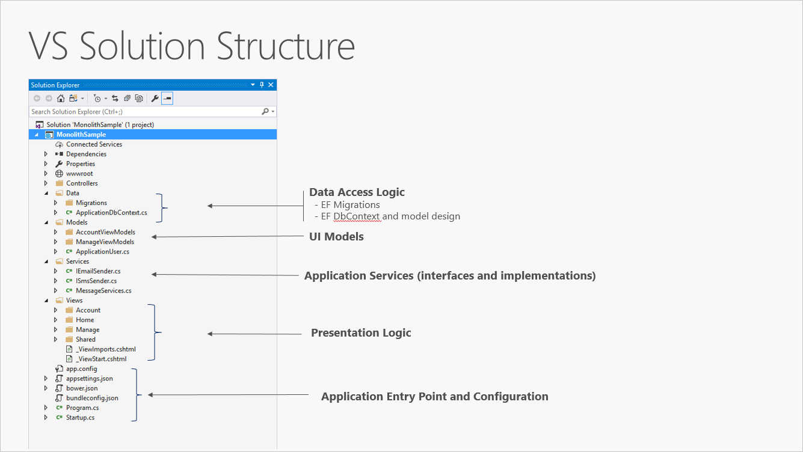

**Figure 5-1.** A single project ASP.NET Core app.

In a single project scenario, separation of concerns is achieved through the use of folders. The default template includes separate folders for MVC pattern responsibilities of Models, Views, and Controllers, as well as additional folders for Data and Services. In this arrangement, presentation details should be limited as much as possible to the Views folder, and data access implementation details should be limited to classes kept in the Data folder. Business logic should reside in services and classes within the Models folder.

Although simple, the single-project monolithic solution has some disadvantages. As the project's size and complexity grows, the number of files and folders will continue to grow as well. User interface (UI) concerns (models, views, controllers) reside in multiple folders, which aren't grouped together alphabetically. This issue only gets worse when additional UI-level constructs, such as Filters or ModelBinders, are added in their own folders. Business logic is scattered between the Models and Services folders, and there's no clear indication of which classes in which folders should depend on which others. This lack of organization at the project level frequently leads to [spaghetti code](https://deviq.com/spaghetti-code/).

To address these issues, applications often evolve into multi-project solutions, where each project is considered to reside in a particular _layer_ of the application.

## What are layers?

As applications grow in complexity, one way to manage that complexity is to break up the application according to its responsibilities or concerns. This approach follows the separation of concerns principle and can help keep a growing codebase organized so that developers can easily find where certain functionality is implemented. Layered architecture offers a number of advantages beyond just code organization, though.

By organizing code into layers, common low-level functionality can be reused throughout the application. This reuse is beneficial because it means less code needs to be written and because it can allow the application to standardize on a single implementation, following the [don't repeat yourself (DRY)](https://en.wikipedia.org/wiki/Don%27t_repeat_yourself) principle.

With a layered architecture, applications can enforce restrictions on which layers can communicate with other layers. This architecture helps to achieve encapsulation. When a layer is changed or replaced, only those layers that work with it should be impacted. By limiting which layers depend on which other layers, the impact of changes can be mitigated so that a single change doesn't impact the entire application.

Layers (and encapsulation) make it much easier to replace functionality within the application. For example, an application might initially use its own SQL Server database for persistence, but later could choose to use a cloud-based persistence strategy, or one behind a web API. If the application has properly encapsulated its persistence implementation within a logical layer, that SQL Server-specific layer could be replaced by a new one implementing the same public interface.

In addition to the potential of swapping out implementations in response to future changes in requirements, application layers can also make it easier to swap out implementations for testing purposes. Instead of having to write tests that operate against the real data layer or UI layer of the application, these layers can be replaced at test time with fake implementations that provide known responses to requests. This approach typically makes tests much easier to write and much faster to run when compared to running tests against the application's real infrastructure.

Logical layering is a common technique for improving the organization of code in enterprise software applications, and there are several ways in which code can be organized into layers.

> [!NOTE]
> _Layers_ represent logical separation within the application. In the event that application logic is physically distributed to separate servers or processes, these separate physical deployment targets are referred to as _tiers_. It's possible, and quite common, to have an N-Layer application that is deployed to a single tier.

## Traditional "N-Layer" architecture applications

The most common organization of application logic into layers is shown in Figure 5-2.

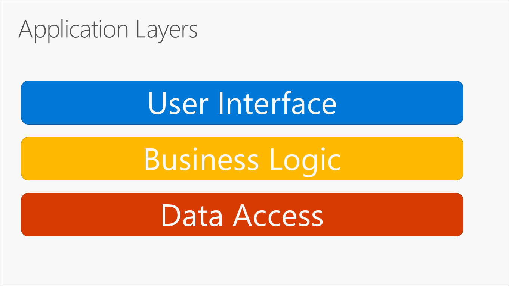

**Figure 5-2.** Typical application layers.

These layers are frequently abbreviated as UI, BLL (Business Logic Layer), and DAL (Data Access Layer). Using this architecture, users make requests through the UI layer, which interacts only with the BLL. The BLL, in turn, can call the DAL for data access requests. The UI layer shouldn't make any requests to the DAL directly, nor should it interact with persistence directly through other means. Likewise, the BLL should only interact with persistence by going through the DAL. In this way, each layer has its own well-known responsibility.

One disadvantage of this traditional layering approach is that compile-time dependencies run from the top to the bottom. That is, the UI layer depends on the BLL, which depends on the DAL. This means that the BLL, which usually holds the most important logic in the application, is dependent on data access implementation details (and often on the existence of a database). Testing business logic in such an architecture is often difficult, requiring a test database. The dependency inversion principle can be used to address this issue, as you'll see in the next section.

Figure 5-3 shows an example solution, breaking the application into three projects by responsibility (or layer).

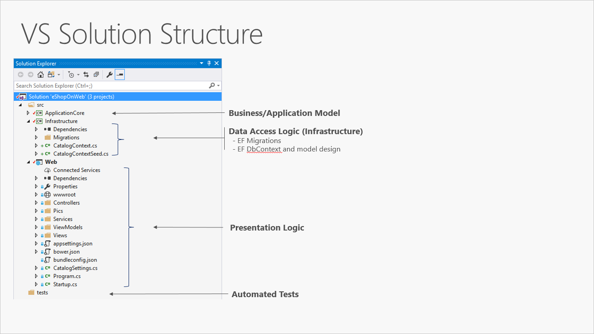

**Figure 5-3.** A simple monolithic application with three projects.

Although this application uses several projects for organizational purposes, it's still deployed as a single unit and its clients will interact with it as a single web app. This allows for very simple deployment process. Figure 5-4 shows how such an app might be hosted using Azure.

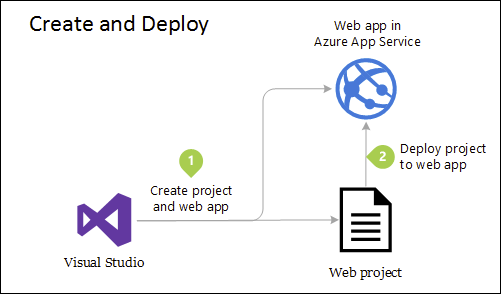

**Figure 5-4.** Simple deployment of Azure Web App

As application needs grow, more complex and robust deployment solutions may be required. Figure 5-5 shows an example of a more complex deployment plan that supports additional capabilities.

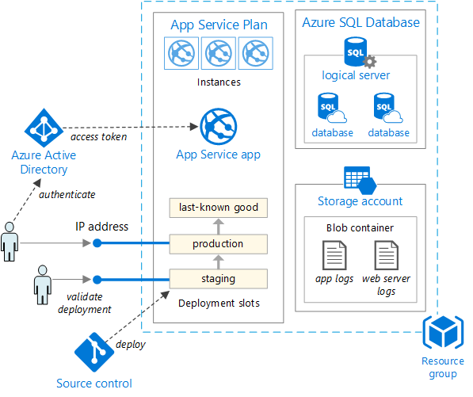

**Figure 5-5.** Deploying a web app to an Azure App Service

Internally, this project's organization into multiple projects based on responsibility improves the maintainability of the application.

This unit can be scaled up or out to take advantage of cloud-based on-demand scalability. Scaling up means adding additional CPU, memory, disk space, or other resources to the server(s) hosting your app. Scaling out means adding additional instances of such servers, whether these are physical servers, virtual machines, or containers. When your app is hosted across multiple instances, a load balancer is used to assign requests to individual app instances.

The simplest approach to scaling a web application in Azure is to configure scaling manually in the application's App Service Plan. Figure 5-6 shows the appropriate Azure dashboard screen to configure how many instances are serving an app.

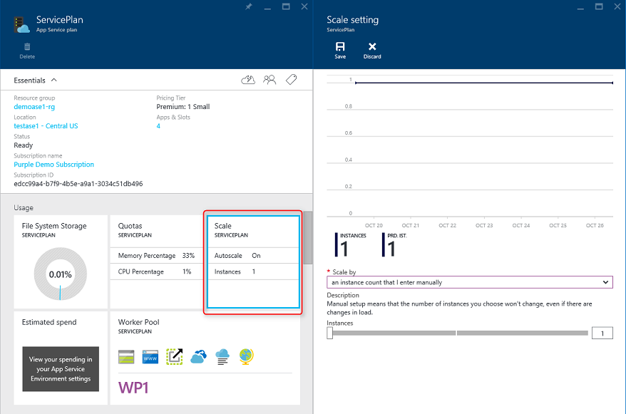

**Figure 5-6.** App Service Plan scaling in Azure.

## Clean architecture

Applications that follow the Dependency Inversion Principle as well as the Domain-Driven Design (DDD) principles tend to arrive at a similar architecture. This architecture has gone by many names over the years. One of the first names was Hexagonal Architecture, followed by Ports-and-Adapters. More recently, it's been cited as the [Onion Architecture](https://jeffreypalermo.com/blog/the-onion-architecture-part-1/) or [Clean Architecture](https://8thlight.com/blog/uncle-bob/2012/08/13/the-clean-architecture.html). The latter name, Clean Architecture, is used as the name for this architecture in this e-book.

The eShopOnWeb reference application uses the Clean Architecture approach in organizing its code into projects. You can find a solution template you can use as a starting point for your own ASP.NET Core solutions in the [ardalis/cleanarchitecture](https://github.com/ardalis/cleanarchitecture) GitHub repository or by [installing the template from NuGet](https://www.nuget.org/packages/Ardalis.CleanArchitecture.Template/).

Clean architecture puts the business logic and application model at the center of the application. Instead of having business logic depend on data access or other infrastructure concerns, this dependency is inverted: infrastructure and implementation details depend on the Application Core. This functionality is achieved by defining abstractions, or interfaces, in the Application Core, which are then implemented by types defined in the Infrastructure layer. A common way of visualizing this architecture is to use a series of concentric circles, similar to an onion. Figure 5-7 shows an example of this style of architectural representation.

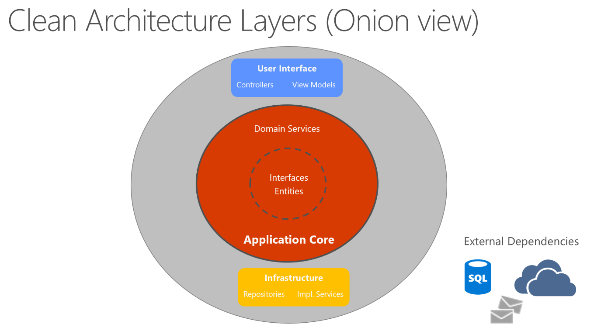

**Figure 5-7.** Clean Architecture; onion view

In this diagram, dependencies flow toward the innermost circle. The Application Core takes its name from its position at the core of this diagram. And you can see on the diagram that the Application Core has no dependencies on other application layers. The application's entities and interfaces are at the very center. Just outside, but still in the Application Core, are domain services, which typically implement interfaces defined in the inner circle. Outside of the Application Core, both the UI and the Infrastructure layers depend on the Application Core, but not on one another (necessarily).

Figure 5-8 shows a more traditional horizontal layer diagram that better reflects the dependency between the UI and other layers.

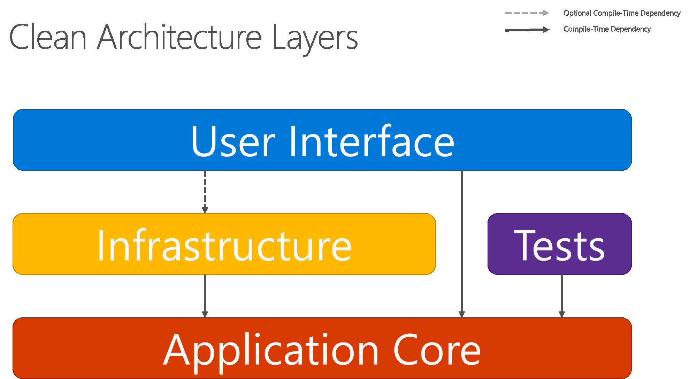

**Figure 5-8.** Clean Architecture; horizontal layer view

Note that the solid arrows represent compile-time dependencies, while the dashed arrow represents a runtime-only dependency. With the clean architecture, the UI layer works with interfaces defined in the Application Core at compile time, and ideally shouldn't know about the implementation types defined in the Infrastructure layer. At run time, however, these implementation types are required for the app to execute, so they need to be present and wired up to the Application Core interfaces via dependency injection.

Figure 5-9 shows a more detailed view of an ASP.NET Core application's architecture when built following these recommendations.

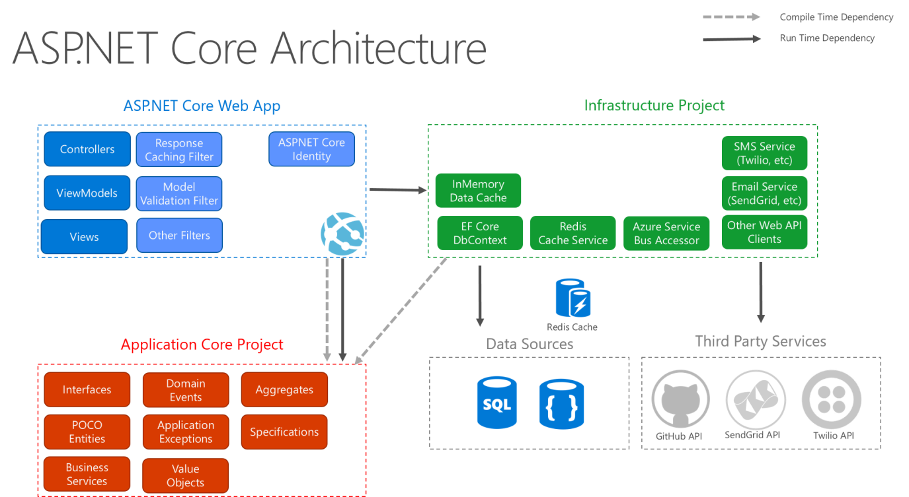

**Figure 5-9.** ASP.NET Core architecture diagram following Clean Architecture.

Because the Application Core doesn't depend on Infrastructure, it's very easy to write automated unit tests for this layer. Figures 5-10 and 5-11 show how tests fit into this architecture.

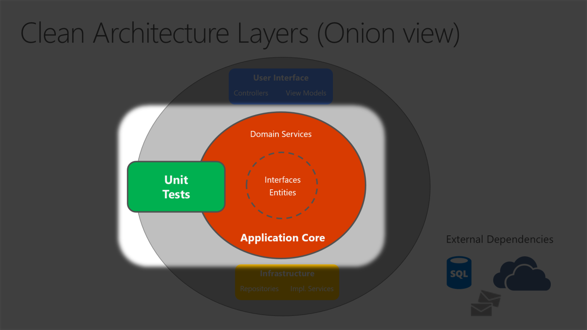

**Figure 5-10.** Unit testing Application Core in isolation.

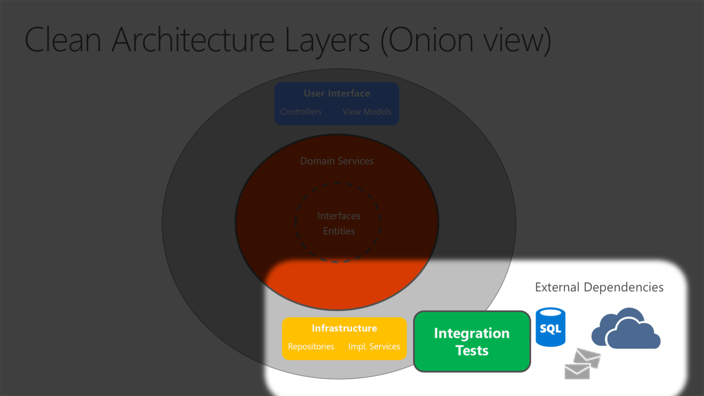

**Figure 5-11.** Integration testing Infrastructure implementations with external dependencies.

Since the UI layer doesn't have any direct dependency on types defined in the Infrastructure project, it's likewise very easy to swap out implementations, either to facilitate testing or in response to changing application requirements. ASP.NET Core's built-in use of and support for dependency injection makes this architecture the most appropriate way to structure non-trivial monolithic applications.

For monolithic applications, the Application Core, Infrastructure, and UI projects are all run as a single application. The runtime application architecture might look something like Figure 5-12.

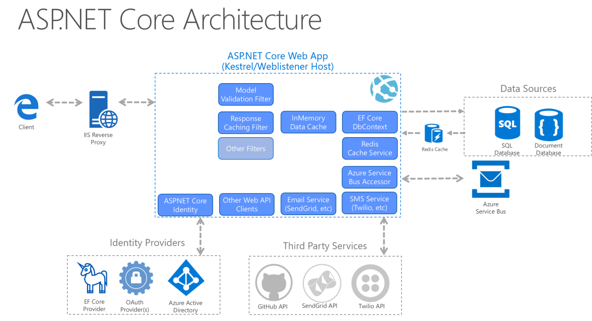

**Figure 5-12.** A sample ASP.NET Core app's runtime architecture.

### Organizing code in Clean Architecture

In a Clean Architecture solution, each project has clear responsibilities. As such, certain types belong in each project and you'll frequently find folders corresponding to these types in the appropriate project.

#### Application Core

The Application Core holds the business model, which includes entities, services, and interfaces. These interfaces include abstractions for operations that will be performed using Infrastructure, such as data access, file system access, network calls, etc. Sometimes services or interfaces defined at this layer will need to work with non-entity types that have no dependencies on UI or Infrastructure. These can be defined as simple Data Transfer Objects (DTOs).

##### Application Core types

- Entities (business model classes that are persisted)
- Aggregates (groups of entities)
- Interfaces
- Domain Services
- Specifications
- Custom Exceptions and Guard Clauses
- Domain Events and Handlers

#### Infrastructure

The Infrastructure project typically includes data access implementations. In a typical ASP.NET Core web application, these implementations include the Entity Framework (EF) DbContext, any EF Core `Migration` objects that have been defined, and data access implementation classes. The most common way to abstract data access implementation code is through the use of the [Repository design pattern](https://deviq.com/repository-pattern/).

In addition to data access implementations, the Infrastructure project should contain implementations of services that must interact with infrastructure concerns. These services should implement interfaces defined in the Application Core, and so Infrastructure should have a reference to the Application Core project.

##### Infrastructure types

- EF Core types (`DbContext`, `Migration`)
- Data access implementation types (Repositories)
- Infrastructure-specific services (for example, `FileLogger` or `SmtpNotifier`)

#### UI Layer

The user interface layer in an ASP.NET Core MVC application is the entry point for the application. This project should reference the Application Core project, and its types should interact with infrastructure strictly through interfaces defined in Application Core. No direct instantiation of or static calls to the Infrastructure layer types should be allowed in the UI layer.

##### UI Layer types

- Controllers
- Custom Filters
- Custom Middleware
- Views
- ViewModels
- Startup

The `Startup` class or _Program.cs_ file is responsible for configuring the application, and for wiring up implementation types to interfaces. The place where this logic is performed is known as the app's *composition root*, and is what allows dependency injection to work properly at run time.

> [!NOTE]
> In order to wire up dependency injection during app startup, the UI layer project may need to reference the Infrastructure project. This dependency can be eliminated, most easily by using a custom DI container that has built-in support for loading types from assemblies. For the purposes of this sample, the simplest approach is to allow the UI project to reference the Infrastructure project (but developers should limit actual references to types in the Infrastructure project to the app's composition root).

## Monolithic applications and containers

You can build a single and monolithic-deployment based Web Application or Service and deploy it as a container. Within the application, it might not be monolithic but organized into several libraries, components, or layers. Externally, it's a single container with a single process, single web application, or single service.

To manage this model, you deploy a single container to represent the application. To scale, just add additional copies with a load balancer in front. The simplicity comes from managing a single deployment in a single container or VM.

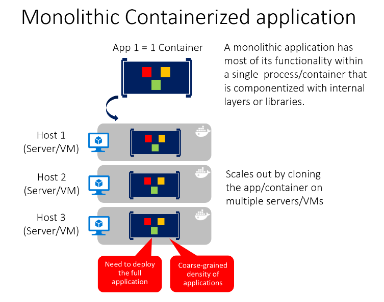

You can include multiple components/libraries or internal layers within each container, as illustrated in Figure 5-13. But, following the container principle of _"a container does one thing, and does it in one process_", the monolithic pattern might be a conflict.

The downside of this approach comes if/when the application grows, requiring it to scale. If the entire application scales, it's not really a problem. However, in most cases, a few parts of the application are the choke points requiring scaling, while other components are used less.

Using the typical eCommerce example, what you likely need to scale is the product information component. Many more customers browse products than purchase them. More customers use their basket than use the payment pipeline. Fewer customers add comments or view their purchase history. And you likely only have a handful of employees, in a single region, that need to manage the content and marketing campaigns. By scaling the monolithic design, all the code is deployed multiple times.

In addition to the "scale everything" problem, changes to a single component require complete retesting of the entire application, and a complete redeployment of all the instances.

The monolithic approach is common, and many organizations are developing with this architectural approach. Many are having good enough results, while others are hitting limits. Many designed their applications in this model, because the tools and infrastructure were too difficult to build service-oriented architectures (SOA), and they didn't see the need until the app grew. If you find you're hitting the limits of the monolithic approach, breaking up the app to enable it to better leverage containers and microservices may be the next logical step.

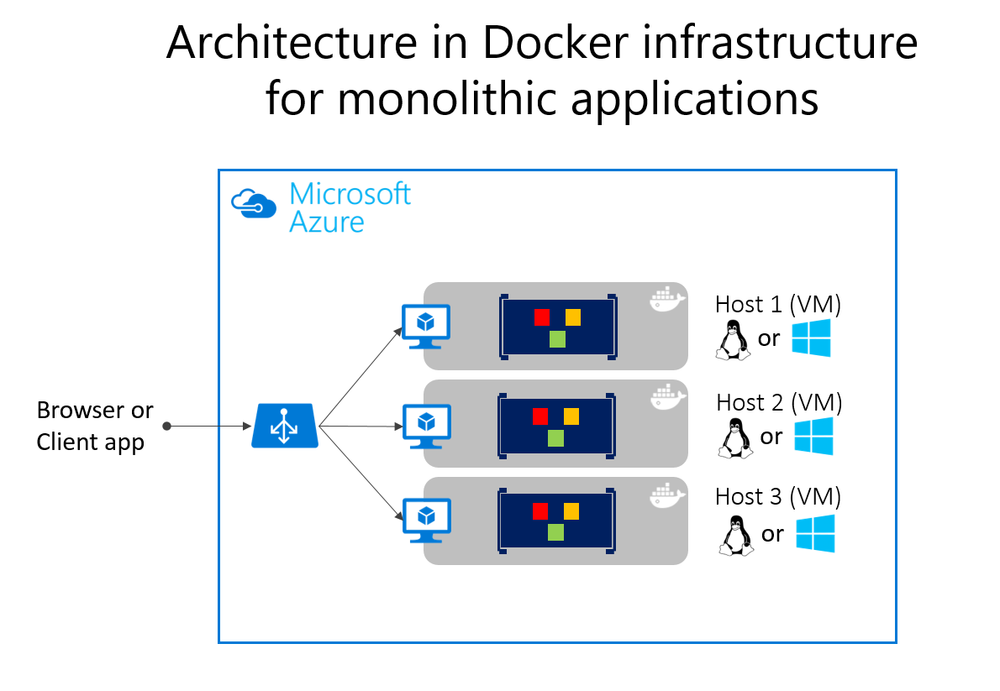

Deploying monolithic applications in Microsoft Azure can be achieved using dedicated VMs for each instance. Using [Azure Virtual Machine Scale Sets](/azure/virtual-machine-scale-sets/), you can easily scale the VMs. [Azure App Services](https://azure.microsoft.com/services/app-service/) can run monolithic applications and easily scale instances without having to manage the VMs. Azure App Services can run single instances of Docker containers as well, simplifying the deployment. Using Docker, you can deploy a single VM as a Docker host, and run multiple instances. Using the Azure balancer, as shown in the Figure 5-14, you can manage scaling.

The deployment to the various hosts can be managed with traditional deployment techniques. The Docker hosts can be managed with commands like **docker run** performed manually, or through automation such as Continuous Delivery (CD) pipelines.

### Monolithic application deployed as a container

There are benefits of using containers to manage monolithic application deployments. Scaling the instances of containers is far faster and easier than deploying additional VMs. Even when using virtual machine scale sets to scale VMs, they take time to create. When deployed as app instances, the configuration of the app is managed as part of the VM.

Deploying updates as Docker images is far faster and network efficient. Docker Images typically start in seconds, speeding rollouts. Tearing down a Docker instance is as easy as issuing a `docker stop` command, typically completing in less than a second.

As containers are inherently immutable by design, you never need to worry about corrupted VMs, whereas update scripts might forget to account for some specific configuration or file left on the disk.

You can use Docker containers for a monolithic deployment of simpler web applications. This approach improves continuous integration and continuous deployment pipelines and helps achieve deployment-to-production success. No more “It works on my machine, why does it not work in production?”

A microservices-based architecture has many benefits, but those benefits come at a cost of increased complexity. In some cases, the costs outweigh the benefits, so a monolithic deployment application running in a single container or in just a few containers is a better option.

A monolithic application might not be easily decomposable into well-separated microservices. Microservices should work independently of each other to provide a more resilient application. If you can't deliver independent feature slices of the application, separating it only adds complexity.

An application might not yet need to scale features independently. Many applications, when they need to scale beyond a single instance, can do so through the relatively simple process of cloning that entire instance. The additional work to separate the application into discrete services provides a minimal benefit when scaling full instances of the application is simple and cost-effective.

Early in the development of an application, you might not have a clear idea where the natural functional boundaries are. As you develop a minimum viable product, the natural separation might not yet have emerged. Some of these conditions might be temporary. You might start by creating a monolithic application, and later separate some features to be developed and deployed as microservices. Other conditions might be essential to the application's problem space, meaning that the application might never be broken into multiple microservices.

Separating an application into many discrete processes also introduces overhead. There's more complexity in separating features into different processes. The communication protocols become more complex. Instead of method calls, you must use asynchronous communications between services. As you move to a microservices architecture, you need to add many of the building blocks implemented in the microservices version of the eShopOnContainers application: event bus handling, message resiliency and retries, eventual consistency, and more.

The much simpler [eShopOnWeb reference application](https://github.com/dotnet-architecture/eShopOnWeb) supports single-container monolithic container usage. The application includes one web application that includes traditional MVC views, web APIs, and Razor Pages. Optionally, you can run the application's Blazor-based admin component, which requires a separate API project to run as well.

The application can be launched from the solution root using the `docker-compose build` and `docker-compose up` commands. This command configures a container for the web instance, using the `Dockerfile` found in the web project's root, and runs the container on a specified port. You can download the source for this application from GitHub and run it locally. Even this monolithic application benefits from being deployed in a container environment.

For one, the containerized deployment means that every instance of the application runs in the same environment. This approach includes the developer environment where early testing and development take place. The development team can run the application in a containerized environment that matches the production environment.

In addition, containerized applications scale out at a lower cost. Using a container environment enables greater resource sharing than traditional VM environments.

Finally, containerizing the application forces a separation between the business logic and the storage server. As the application scales out, the multiple containers will all rely on a single physical storage medium. This storage medium would typically be a high-availability server running a SQL Server database.

## Docker support

The `eShopOnWeb` project runs on .NET. Therefore, it can run in either Linux-based or Windows-based containers. Note that for Docker deployment, you want to use the same host type for SQL Server. Linux-based containers allow a smaller footprint and are preferred.

You can use Visual Studio 2017 or later to add Docker support to an existing application by right-clicking on a project in **Solution Explorer** and choosing **Add** > **Docker Support**. This step adds the files required and modifies the project to use them. The current `eShopOnWeb` sample already has these files in place.

The solution-level `docker-compose.yml` file contains information about what images to build and what containers to launch. The file allows you to use the `docker-compose` command to launch multiple applications at the same time. In this case, it is only launching the Web project. You can also use it to configure dependencies, such as a separate database container.

```yml
version: '3'

services:
  eshopwebmvc:
    image: eshopwebmvc
    build:
      context: .
      dockerfile: src/Web/Dockerfile
    environment:
      - ASPNETCORE_ENVIRONMENT=Development
    ports:
      - "5106:5106"

networks:
  default:
    external:
      name: nat
```

The `docker-compose.yml` file references the `Dockerfile` in the `Web` project. The `Dockerfile` is used to specify which base container will be used and how the application will be configured on it. The `Web`' `Dockerfile`:

```dockerfile
FROM mcr.microsoft.com/dotnet/sdk:6.0 AS build
WORKDIR /app

COPY *.sln .
COPY . .
WORKDIR /app/src/Web
RUN dotnet restore

RUN dotnet publish -c Release -o out

FROM mcr.microsoft.com/dotnet/aspnet:6.0 AS runtime
WORKDIR /app
COPY --from=build /app/src/Web/out ./

ENTRYPOINT ["dotnet", "Web.dll"]
```

### Troubleshooting Docker problems

Once you run the containerized application, it continues to run until you stop it. You can view which containers are running with the `docker ps` command. You can stop a running container by using the `docker stop` command and specifying the container ID.

Note that running Docker containers may be bound to ports you might otherwise try to use in your development environment. If you try to run or debug an application using the same port as a running Docker container, you'll get an error stating that the server can't bind to that port. Once again, stopping the container should resolve the issue.

If you want to add Docker support to your application using Visual Studio, make sure Docker Desktop is running when you do so. The wizard won't run correctly if Docker Desktop isn't running when you start the wizard. In addition, the wizard examines your current container choice to add the correct Docker support. If you want to add, support for Windows Containers, you need to run the wizard while you have Docker Desktop running with Windows Containers configured. If you want to add, support for Linux containers, run the wizard while you have Docker running with Linux containers configured.

### References – Common web architectures

- **The Clean Architecture**  
  <https://8thlight.com/blog/uncle-bob/2012/08/13/the-clean-architecture.html>
- **The Onion Architecture**  
  <https://jeffreypalermo.com/blog/the-onion-architecture-part-1/>
- **The Repository Pattern**  
  <https://deviq.com/repository-pattern/>
- **Clean Architecture Solution Template**  
  <https://github.com/ardalis/cleanarchitecture>
- **Architecting Microservices e-book**  
  <https://aka.ms/MicroservicesEbook>
- **DDD (Domain-Driven Design)**  
  [https://docs.microsoft.com/dotnet/architecture/microservices/microservice-ddd-cqrs-patterns/](../microservices/microservice-ddd-cqrs-patterns/index.md)

>[!div class="step-by-step"]
>[Previous](architectural-principles.md)
>[Next](common-client-side-web-technologies.md)
