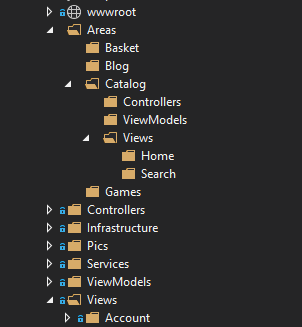
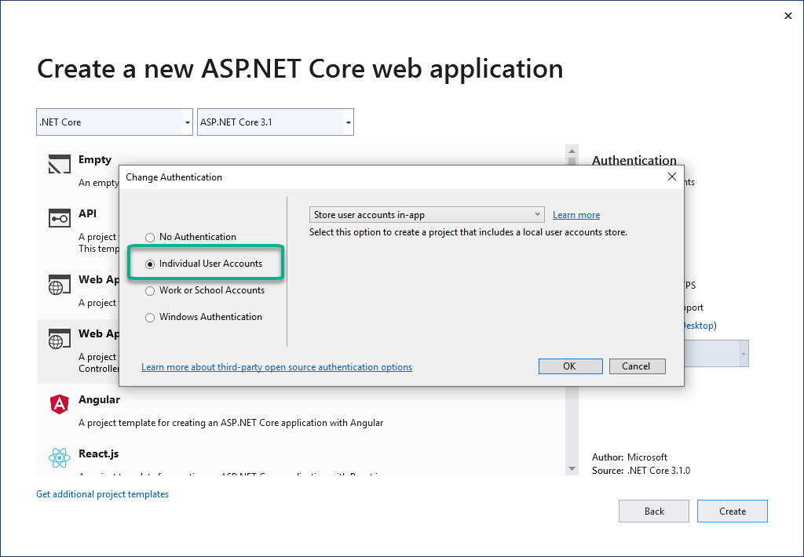
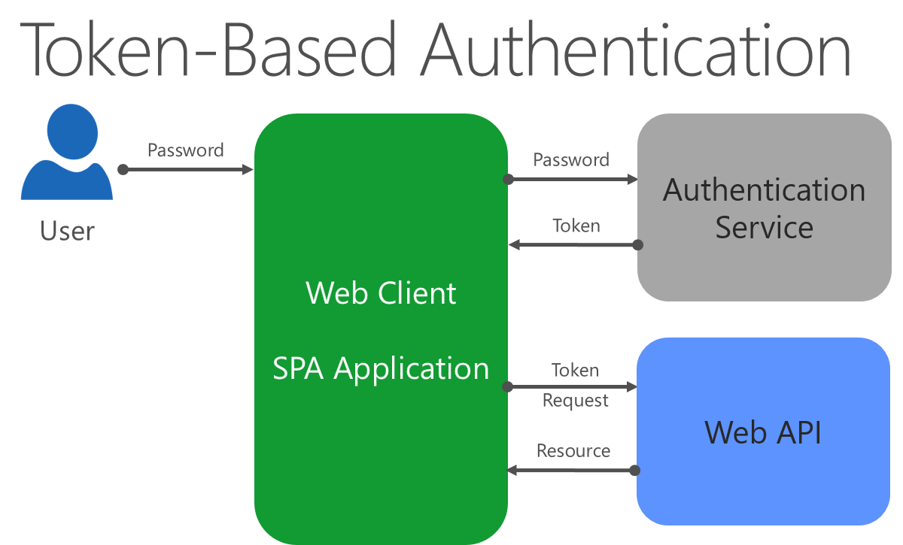
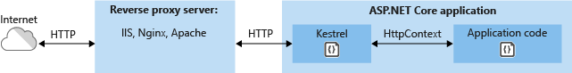
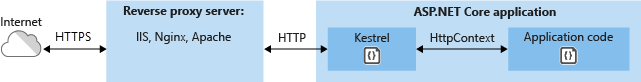

# Develop ASP.NET Core MVC apps

> "It's not important to get it right the first time. It's vitally important to get it right the last time."
> _- Andrew Hunt and David Thomas_

ASP.NET Core is a cross-platform, open-source framework for building modern cloud-optimized web applications. ASP.NET Core apps are lightweight and modular, with built-in support for dependency injection, enabling greater testability and maintainability. Combined with MVC, which supports building modern web APIs in addition to view-based apps, ASP.NET Core is a powerful framework with which to build enterprise web applications.

## MVC and Razor Pages

ASP.NET Core MVC offers many features that are useful for building web-based APIs and apps. The term MVC stands for "Model-View-Controller", a UI pattern that breaks up the responsibilities of responding to user requests into several parts. In addition to following this pattern, you can also implement features in your ASP.NET Core apps as Razor Pages.

Razor Pages are built into ASP.NET Core MVC, and use the same features for routing, model binding, filters, authorization, etc. However, instead of having separate folders and files for Controllers, Models, Views, etc. and using attribute-based routing, Razor Pages are placed in a single folder ("/Pages"), route based on their relative location in this folder, and handle requests with handlers instead of controller actions. As a result, when working with Razor Pages, all of the files and classes you need are typically colocated, not spread throughout the web project.

Learn more about [how MVC, Razor Pages, and related patterns are applied in the eShopOnWeb sample application](https://github.com/dotnet-architecture/eShopOnWeb/wiki/Patterns#mvc).

When you create a new ASP.NET Core App, you should have a plan in mind for the kind of app you want to build. When creating a new project, in your IDE or using the `dotnet new` CLI command, you will choose from several templates. The most common project templates are Empty, Web API, Web App, and Web App (Model-View-Controller). Although you can only make this decision when you first create a project, it's not an irrevocable decision. The Web API project uses standard Model-View-Controller controllers – it just lacks Views by default. Likewise, the default Web App template uses Razor Pages, and so also lacks a Views folder. You can add a Views folder to these projects later to support view-based behavior. Web API and Model-View-Controller projects don't include a Pages folder by default, but you can add one later to support Razor Pages-based behavior. You can think of these three templates as supporting three different kinds of default user interaction: data (web API), page-based, and view-based. However, you can mix and match any or all of these templates within a single project if you wish.

### Why Razor Pages?

Razor Pages is the default approach for new web applications in Visual Studio. Razor Pages offers a simpler way of building page-based application features, such as non-SPA forms. Using controllers and views, it was common for applications to have very large controllers that worked with many different dependencies and view models and returned many different views. This resulted in more complexity and often resulted in controllers that didn't follow the Single Responsibility Principle or Open/Closed Principles effectively. Razor Pages addresses this issue by encapsulating the server-side logic for a given logical "page" in a web application with its Razor markup. A Razor Page that has no server-side logic can only consist of a Razor file (for instance, "Index.cshtml"). However, most non-trivial Razor Pages will have an associated page model class, which by convention is named the same as the Razor file with a ".cs" extension (for example, "Index.cshtml.cs").

A Razor Page's page model combines the responsibilities of an MVC controller and a viewmodel. Instead of handling requests with controller action methods, page model handlers like "OnGet()" are executed, rendering their associated page by default. Razor Pages simplifies the process of building individual pages in an ASP.NET Core app, while still providing all the architectural features of ASP.NET Core MVC. They're a good default choice for new page-based functionality.

### When to use MVC

If you're building web APIs, the MVC pattern makes more sense than trying to use Razor Pages. If your project will only expose web API endpoints, you should ideally start from the Web API project template. Otherwise, it's easy to add controllers and associated API endpoints to any ASP.NET Core app. Use the view-based MVC approach if you're migrating an existing application from ASP.NET MVC 5 or earlier to ASP.NET Core MVC and you want to do so with the least amount of effort. Once you've made the initial migration, you can evaluate whether it makes sense to adopt Razor Pages for new features or even as a wholesale migration. For more information about porting .NET 4.x apps to .NET 6, see [Porting Existing ASP.NET Apps to ASP.NET Core eBook](/dotnet/architecture/porting-existing-aspnet-apps/).

Whether you choose to build your web app using Razor Pages or MVC views, your app will have similar performance and will include support for dependency injection, filters, model binding, validation, and so on.

## Mapping requests to responses

At its heart, ASP.NET Core apps map incoming requests to outgoing responses. At a low level, this mapping is done with middleware, and simple ASP.NET Core apps and microservices may be comprised solely of custom middleware. When using ASP.NET Core MVC, you can work at a somewhat higher level, thinking in terms of _routes_, _controllers_, and _actions_. Each incoming request is compared with the application's routing table, and if a matching route is found, the associated action method (belonging to a controller) is called to handle the request. If no matching route is found, an error handler (in this case, returning a NotFound result) is called.

ASP.NET Core MVC apps can use conventional routes, attribute routes, or both. Conventional routes are defined in code, specifying routing _conventions_ using syntax like in the example below:

```csharp
app.UseEndpoints(endpoints =>
{
    endpoints.MapControllerRoute(name: "default", pattern: "{controller=Home}/{action=Index}/{id?}");
});
```

In this example, a route named "default" has been added to the routing table. It defines a route template with placeholders for `controller`, `action`, and `id`. The `controller` and `action` placeholders have the default specified (`Home` and `Index`, respectively), and the `id` placeholder is optional (by virtue of a "?" applied to it). The convention defined here states that the first part of a request should correspond to the name of the controller, the second part to the action, and then if necessary a third part will represent an ID parameter. Conventional routes are typically defined in one place for the application, such as in *Program.cs* where the request middleware pipeline is configured.

Attribute routes are applied to controllers and actions directly, rather than specified globally. This approach has the advantage of making them much more discoverable when you're looking at a particular method, but does mean that routing information is not kept in one place in the application. With attribute routes, you can easily specify multiple routes for a given action, as well as combine routes between controllers and actions. For example:

```csharp
[Route("Home")]
public class HomeController : Controller
{
    [Route("")] // Combines to define the route template "Home"
    [Route("Index")] // Combines to define route template "Home/Index"
    [Route("/")] // Does not combine, defines the route template ""
    public IActionResult Index() {}
}
```

Routes can be specified on [HttpGet] and similar attributes, avoiding the need to add separate [Route] attributes. Attribute routes can also use tokens to reduce the need to repeat controller or action names, as shown below:

```csharp
[Route("[controller]")]
public class ProductsController : Controller
{
    [Route("")] // Matches 'Products'
    [Route("Index")] // Matches 'Products/Index'
    public IActionResult Index() {}
}
```

Razor Pages doesn't use attribute routing. You can specify additional route template information for a Razor Page as part of its `@page` directive:

```csharp
@page "{id:int}"
```

In the previous example, the page in question would match a route with an integer `id` parameter. For example, the *Products.cshtml* page located in the root of `/Pages` would respond to requests like this one:

```http
/Products/123
```

Once a given request has been matched to a route, but before the action method is called, ASP.NET Core MVC will perform [model binding](/aspnet/core/mvc/models/model-binding) and [model validation](/aspnet/core/mvc/models/validation) on the request. Model binding is responsible for converting incoming HTTP data into the .NET types specified as parameters of the action method to be called. For example, if the action method expects an `int id` parameter, model binding will attempt to provide this parameter from a value provided as part of the request. To do so, model binding looks for values in a posted form, values in the route itself, and query string values. Assuming an `id` value is found, it will be converted to an integer before being passed into the action method.

After binding the model but before calling the action method, model validation occurs. Model validation uses optional attributes on the model type, and can help ensure that the provided model object conforms to certain data requirements. Certain values may be specified as required, or limited to a certain length or numeric range, etc. If validation attributes are specified but the model does not conform to their requirements, the property ModelState.IsValid will be false, and the set of failing validation rules will be available to send to the client making the request.

If you're using model validation, you should be sure to always check that the model is valid before performing any state-altering commands, to ensure your app is not corrupted by invalid data. You can use a [filter](/aspnet/core/mvc/controllers/filters) to avoid the need to add code for this validation in every action. ASP.NET Core MVC filters offer a way of intercepting groups of requests, so that common policies and cross-cutting concerns can be applied on a targeted basis. Filters can be applied to individual actions, whole controllers, or globally for an application.

For web APIs, ASP.NET Core MVC supports [_content negotiation_](/aspnet/core/mvc/models/formatting), allowing requests to specify how responses should be formatted. Based on headers provided in the request, actions returning data will format the response in XML, JSON, or another supported format. This feature enables the same API to be used by multiple clients with different data format requirements.

Web API projects should consider using the `[ApiController]` attribute, which can be applied to individual controllers, to a base controller class, or to the entire assembly. This attribute adds automatic model validation checking and any action with an invalid model will return a BadRequest with the details of the validation errors. The attribute also requires all actions have an attribute route, rather than using a conventional route, and returns more detailed ProblemDetails information in response to errors.

### Keeping controllers under control

For page-based applications, Razor Pages do a great job of keeping controllers from getting too large. Each individual page is given its own files and classes dedicated just to its handler(s). Prior to the introduction of Razor Pages, many view-centric applications would have large controller classes responsible for many different actions and views. These classes would naturally grow to have many responsibilities and dependencies, making them harder to maintain. If you find your view-based controllers are growing too large, consider refactoring them to use Razor Pages, or introducing a pattern like a mediator.

The mediator design pattern is used to reduce coupling between classes while allowing communication between them. In ASP.NET Core MVC applications, this pattern is frequently employed to break up controllers into smaller pieces by using *handlers* to do the work of action methods. The popular [MediatR NuGet package](https://www.nuget.org/packages/MediatR/) is often used to accomplish this. Typically, controllers include many different action methods, each of which may require certain dependencies. The set of all dependencies required by any action must be passed into the controller's constructor. When using MediatR, the only dependency a controller will typically have is an instance of the mediator. Each action then uses the mediator instance to send a message, which is processed by a handler. The handler is specific to a single action and thus only needs the dependencies required by that action. An example of a controller using MediatR is shown here:

```csharp
public class OrderController : Controller
{
    private readonly IMediator _mediator;

    public OrderController(IMediator mediator)
    {
        _mediator = mediator;
    }

    [HttpGet]
    public async Task<IActionResult> MyOrders()
    {
        var viewModel = await _mediator.Send(new GetMyOrders(User.Identity.Name));
        return View(viewModel);
    }
    // other actions implemented similarly
}
```

In the `MyOrders` action, the call to `Send` a `GetMyOrders` message is handled by this class:

```csharp
public class GetMyOrdersHandler : IRequestHandler<GetMyOrders, IEnumerable<OrderViewModel>>
{
    private readonly IOrderRepository _orderRepository;
    public GetMyOrdersHandler(IOrderRepository orderRepository)
    {
        _orderRepository = orderRepository;
    }

  public async Task<IEnumerable<OrderViewModel>> Handle(GetMyOrders request, CancellationToken cancellationToken)
    {
        var specification = new CustomerOrdersWithItemsSpecification(request.UserName);
        var orders = await _orderRepository.ListAsync(specification);
        return orders.Select(o => new OrderViewModel
            {
                OrderDate = o.OrderDate,
                OrderItems = o.OrderItems?.Select(oi => new OrderItemViewModel()
                  {
                    PictureUrl = oi.ItemOrdered.PictureUri,
                    ProductId = oi.ItemOrdered.CatalogItemId,
                    ProductName = oi.ItemOrdered.ProductName,
                    UnitPrice = oi.UnitPrice,
                    Units = oi.Units
                  }).ToList(),
                OrderNumber = o.Id,
                ShippingAddress = o.ShipToAddress,
                Total = o.Total()
        });
    }
}
```

The end result of this approach is for controllers to be much smaller and focused primarily on routing and model binding, while individual handlers are responsible for the specific tasks needed by a given endpoint. This approach can also be achieved without MediatR by using the [ApiEndpoints NuGet package](https://www.nuget.org/packages/Ardalis.ApiEndpoints/), which attempts to bring to API controllers the same benefits Razor Pages brings to view-based controllers.

> ### References – Mapping Requests to Responses
>
> - **Routing to Controller Actions**\
 > [https://docs.microsoft.com/aspnet/core/mvc/controllers/routing](/aspnet/core/mvc/controllers/routing)
> - **Model Binding**\
 > [https://docs.microsoft.com/aspnet/core/mvc/models/model-binding](/aspnet/core/mvc/models/model-binding)
> - **Model Validation**\
 > [https://docs.microsoft.com/aspnet/core/mvc/models/validation](/aspnet/core/mvc/models/validation)
> - **Filters**\
 > [https://docs.microsoft.com/aspnet/core/mvc/controllers/filters](/aspnet/core/mvc/controllers/filters)
> - **ApiController Attribute**\
 > [https://docs.microsoft.com/aspnet/core/web-api/](/aspnet/core/web-api/)

## Working with dependencies

ASP.NET Core has built-in support for and internally makes use of a technique known as [dependency injection](/aspnet/core/fundamentals/dependency-injection). Dependency injection is a technique that enables loose coupling between different parts of an application. Looser coupling is desirable because it makes it easier to isolate parts of the application, allowing for testing or replacement. It also makes it less likely that a change in one part of the application will have an unexpected impact somewhere else in the application. Dependency injection is based on the dependency inversion principle, and is often key to achieving the open/closed principle. When evaluating how your application works with its dependencies, beware of the [static cling](https://deviq.com/static-cling/) code smell, and remember the aphorism "[new is glue](https://ardalis.com/new-is-glue)."

Static cling occurs when your classes make calls to static methods, or access static properties, which have side effects or dependencies on infrastructure. For example, if you have a method that calls a static method, which in turn writes to a database, your method is tightly coupled to the database. Anything that breaks that database call will break your method. Testing such methods is notoriously difficult, since such tests either require commercial mocking libraries to mock the static calls, or can only be tested with a test database in place. Static calls that don't have any dependence on infrastructure, especially those calls that are completely stateless, are fine to call and have no impact on coupling or testability (beyond coupling code to the static call itself).

Many developers understand the risks of static cling and global state, but will still tightly couple their code to specific implementations through direct instantiation. "New is glue" is meant to be a reminder of this coupling, and not a general condemnation of the use of the `new` keyword. Just as with static method calls, new instances of types that have no external dependencies typically do not tightly couple code to implementation details or make testing more difficult. But each time a class is instantiated, take just a brief moment to consider whether it makes sense to hard-code that specific instance in that particular location, or if it would be a better design to request that instance as a dependency.

### Declare your dependencies

ASP.NET Core is built around having methods and classes declare their dependencies, requesting them as arguments. ASP.NET applications are typically set up in _Program.cs_ or in a `Startup` class.

> [!NOTE]
> Configuring apps completely in _Program.cs_ is the default approach for .NET 6 and Visual Studio 2022 apps. Project templates have been updated to help you get started with this new approach. ASP.NET Core projects can still use a `Startup` class, if desired.

#### Configure services in _Program.cs_

For very simple apps, you can wire up dependencies directly in _Program.cs_ file using a `WebApplicationBuilder`. Once all needed services have been added, the builder is used to create the app.

```csharp
var builder = WebApplication.CreateBuilder(args);

// Add services to the container.
builder.Services.AddRazorPages();

var app = builder.Build();
```

#### Configure services in _Startup.cs_

The _Startup.cs_ is itself configured to support dependency injection at several points. If you're using a `Startup` class, you can give it a constructor and it can request dependencies through it, like so:

```csharp
public class Startup
{
    public Startup(IHostingEnvironment env)
    {
        var builder = new ConfigurationBuilder()
            .SetBasePath(env.ContentRootPath)
            .AddJsonFile("appsettings.json", optional: false, reloadOnChange: true)
            .AddJsonFile($"appsettings.{env.EnvironmentName}.json", optional: true);
    }
}
```

The `Startup` class is interesting in that there are no explicit type requirements for it. It doesn't inherit from a special `Startup` base class, nor does it implement any particular interface. You can give it a constructor, or not, and you can specify as many parameters on the constructor as you want. When the web host you've configured for your application starts, it will call the `Startup` class (if you've told it to use one), and will use dependency injection to populate any dependencies the `Startup` class requires. Of course, if you request parameters that aren't configured in the services container used by ASP.NET Core, you'll get an exception, but as long as you stick to dependencies the container knows about, you can request anything you want.

Dependency injection is built into your ASP.NET Core apps right from the start, when you create the Startup instance. It doesn't stop there for the Startup class. You can also request dependencies in the `Configure` method:

```csharp
public void Configure(IApplicationBuilder app,
    IHostingEnvironment env,
    ILoggerFactory loggerFactory)
{

}
```

The ConfigureServices method is the exception to this behavior; it must take just one parameter of type `IServiceCollection`. It doesn't really need to support dependency injection, since on the one hand it is responsible for adding objects to the services container, and on the other it has access to all currently configured services via the IServiceCollection parameter. Thus, you can work with dependencies defined in the ASP.NET Core services collection in every part of the `Startup` class, either by requesting the needed service as a parameter or by working with the `IServiceCollection` in `ConfigureServices`.

> [!NOTE]
> If you need to ensure certain services are available to your `Startup` class, you can configure them using an `IWebHostBuilder` and its `ConfigureServices` method inside the `CreateDefaultBuilder` call.

The Startup class is a model for how you should structure other parts of your ASP.NET Core application, from Controllers to Middleware to Filters to your own Services. In each case, you should follow the [Explicit Dependencies Principle](https://deviq.com/explicit-dependencies-principle/), requesting your dependencies rather than directly creating them, and leveraging dependency injection throughout your application. Be careful of where and how you directly instantiate implementations, especially services and objects that work with infrastructure or have side effects. Prefer working with abstractions defined in your application core and passed in as arguments to hardcoding references to specific implementation types.

## Structuring the application

Monolithic applications typically have a single entry point. In the case of an ASP.NET Core web application, the entry point will be the ASP.NET Core web project. However, that doesn't mean the solution should consist of just a single project. It's useful to break up the application into different layers in order to follow separation of concerns. Once broken up into layers, it's helpful to go beyond folders to separate projects, which can help achieve better encapsulation. The best approach to achieve these goals with an ASP.NET Core application is a variation of the Clean Architecture discussed in chapter 5. Following this approach, the application's solution will comprise separate libraries for the UI, Infrastructure, and ApplicationCore.

In addition to these projects, separate test projects are included as well (Testing is discussed in Chapter 9).

The application's object model and interfaces should be placed in the ApplicationCore project. This project will have as few dependencies as possible (and none on specific infrastructure concerns), and the other projects in the solution will reference it. Business entities that need to be persisted are defined in the ApplicationCore project, as are services that do not directly depend on infrastructure.

Implementation details, such as how persistence is performed or how notifications might be sent to a user, are kept in the Infrastructure project. This project will reference implementation-specific packages such as Entity Framework Core, but should not expose details about these implementations outside of the project. Infrastructure services and repositories should implement interfaces that are defined in the ApplicationCore project, and its persistence implementations are responsible for retrieving and storing entities defined in ApplicationCore.

The ASP.NET Core UI project is responsible for any UI level concerns, but should not include business logic or infrastructure details. In fact, ideally it shouldn't even have a dependency on the Infrastructure project, which will help ensure no dependency between the two projects is introduced accidentally. This can be achieved using a third-party DI container like Autofac, which allows you to define DI rules in Module classes in each project.

Another approach to decoupling the application from implementation details is to have the application call microservices, perhaps deployed in individual Docker containers. This provides even greater separation of concerns and decoupling than leveraging DI between two projects, but has additional complexity.

### Feature organization

By default, ASP.NET Core applications organize their folder structure to include Controllers and Views, and frequently ViewModels. Client-side code to support these server-side structures is typically stored separately in the wwwroot folder. However, large applications may encounter problems with this organization, since working on any given feature often requires jumping between these folders. This gets more and more difficult as the number of files and subfolders in each folder grows, resulting in a great deal of scrolling through Solution Explorer. One solution to this problem is to organize application code by _feature_ instead of by file type. This organizational style is typically referred to as feature folders or [feature slices](/archive/msdn-magazine/2016/september/asp-net-core-feature-slices-for-asp-net-core-mvc) (see also: [Vertical Slices](https://deviq.com/vertical-slices/)).

ASP.NET Core MVC supports Areas for this purpose. Using areas, you can create separate sets of Controllers and Views folders (as well as any associated models) in each Area folder. Figure 7-1 shows an example folder structure, using Areas.



**Figure 7-1**. Sample Area Organization

When using Areas, you must use attributes to decorate your controllers with the name of the area to which they belong:

```csharp
[Area("Catalog")]
public class HomeController
{}
```

You also need to add area support to your routes:

```csharp
app.UseEndpoints(endpoints =>
{
    endpoints.MapControllerRoute(name: "areaRoute", pattern: "{area:exists}/{controller=Home}/{action=Index}/{id?}");
    endpoints.MapControllerRoute(name: "default", pattern: "{controller=Home}/{action=Index}/{id?}");
});
```

In addition to the built-in support for Areas, you can also use your own folder structure, and conventions in place of attributes and custom routes. This would allow you to have feature folders that didn't include separate folders for Views, Controllers, etc., keeping the hierarchy flatter and making it easier to see all related files in a single place for each feature. For APIs, folders can be used to replace controllers, and each folder can contain all of the API Endpoints and their associated DTOs.

ASP.NET Core uses built-in convention types to control its behavior. You can modify or replace these conventions. For example, you can create a convention that will automatically get the feature name for a given controller based on its namespace (which typically correlates to the folder in which the controller is located):

```csharp
public class FeatureConvention : IControllerModelConvention
{
    public void Apply(ControllerModel controller)
    {
        controller.Properties.Add("feature",
        GetFeatureName(controller.ControllerType));
    }

    private string GetFeatureName(TypeInfo controllerType)
    {
        string[] tokens = controllerType.FullName.Split('.');
        if (!tokens.Any(t => t == "Features")) return "";
        string featureName = tokens
            .SkipWhile(t => !t.Equals("features", StringComparison.CurrentCultureIgnoreCase))
            .Skip(1)
            .Take(1)
            .FirstOrDefault();
        return featureName;
    }
}
```

You then specify this convention as an option when you add support for MVC to your application in `ConfigureServices` (or in _Program.cs_):

```csharp
// ConfigureServices
services.AddMvc(o => o.Conventions.Add(new FeatureConvention()));

// Program.cs
builder.Services.AddMvc(o => o.Conventions.Add(new FeatureConvention()));
```

ASP.NET Core MVC also uses a convention to locate views. You can override it with a custom convention so that views will be located in your feature folders (using the feature name provided by the FeatureConvention, above). You can learn more about this approach and download a working sample from the MSDN Magazine article, [Feature Slices for ASP.NET Core MVC](/archive/msdn-magazine/2016/september/asp-net-core-feature-slices-for-asp-net-core-mvc).

### APIs and Blazor applications

If your application includes a set of web APIs, which must be secured, these apis should ideally be configured as a separate project from your View or Razor Pages application. Separating APIs, especially public APIs, from your server-side web application has a number of benefits. These applications often will have unique deployment and load characteristics. They're also very likely to adopt different mechanisms for security, with standard form-based applications leveraging cookie-based authentication and APIs most likely using token-based authentication.

Additionally, Blazor applications, whether using Blazor Server or Blazor WebAssembly, should be built as separate projects. The applications have different runtime characteristics as well as security models. They're likely to share common types with the server-side web application (or API project), and these types should be defined in a common shared project.

The addition of a Blazor WebAssembly admin interface to eShopOnWeb required adding several new projects. The Blazor WebAssembly project itself, `BlazorAdmin`. A new set of public API endpoints, used by `BlazorAdmin` and configured to use token-based authentication, is defined in the `PublicApi` project. And certain shared types used by both of these projects are kept in a new `BlazorShared` project.

One might ask, why add a separate `BlazorShared` project when there is already a common `ApplicationCore` project that could be used to share any types required by both `PublicApi` and `BlazorAdmin`? The answer is that this project includes all of the application's business logic and is thus much larger than necessary and also much more likely to need to be kept secure on the server. Remember that any library referenced by `BlazorAdmin` will be downloaded to users' browsers when they load the Blazor application.

Depending on whether one is using the [Backends-For-Frontends (BFF) pattern](/azure/architecture/patterns/backends-for-frontends), the APIs consumed by the Blazor WebAssembly app may not share their types 100% with Blazor. In particular, a public API that's meant to be consumed by many different clients may define its own request and result types, rather than sharing them in a client-specific shared project. In the eShopOnWeb sample, the assumption is being made that the `PublicApi` project is, in fact, hosting a public API, so not all of its request and response types come from the `BlazorShared` project.

### Cross-cutting concerns

As applications grow, it becomes increasingly important to factor out cross-cutting concerns to eliminate duplication and maintain consistency. Some examples of cross-cutting concerns in ASP.NET Core applications are authentication, model validation rules, output caching, and error handling, though there are many others. ASP.NET Core MVC [filters](/aspnet/core/mvc/controllers/filters) allow you to run code before or after certain steps in the request processing pipeline. For instance, a filter can run before and after model binding, before and after an action, or before and after an action's result. You can also use an authorization filter to control access to the rest of the pipeline. Figures 7-2 shows how request execution flows through filters, if configured.


**Figure 7-2**. Request execution through filters and request pipeline.

Filters are usually implemented as attributes, so you can apply them to controllers or actions (or even globally). When added in this fashion, filters specified at the action level override or build upon filters specified at the controller level, which themselves override global filters. For example, the \[Route\] attribute can be used to build up routes between controllers and actions. Likewise, authorization can be configured at the controller level, and then overridden by individual actions, as the following sample demonstrates:

```csharp
[Authorize]
public class AccountController : Controller
{
    [AllowAnonymous] // overrides the Authorize attribute
    public async Task<IActionResult> Login() {}
    public async Task<IActionResult> ForgotPassword() {}
}
```

The first method, Login, uses the AllowAnonymous filter (attribute) to override the Authorize filter set at the controller level. The ForgotPassword action (and any other action in the class that doesn't have an AllowAnonymous attribute) will require an authenticated request.

Filters can be used to eliminate duplication in the form of common error handling policies for APIs. For example, a typical API policy is to return a NotFound response to requests referencing keys that do not exist, and a BadRequest response if model validation fails. The following example demonstrates these two policies in action:

```csharp
[HttpPut("{id}")]
public async Task<IActionResult> Put(int id, [FromBody]Author author)
{
    if ((await _authorRepository.ListAsync()).All(a => a.Id != id))
    {
        return NotFound(id);
    }
    if (!ModelState.IsValid)
    {
        return BadRequest(ModelState);
    }
    author.Id = id;
    await _authorRepository.UpdateAsync(author);
    return Ok();
}
```

Don't allow your action methods to become cluttered with conditional code like this. Instead, pull the policies into filters that can be applied on an as-needed basis. In this example, the model validation check, which should occur anytime a command is sent to the API, can be replaced by the following attribute:

```csharp
public class ValidateModelAttribute : ActionFilterAttribute
{
    public override void OnActionExecuting(ActionExecutingContext context)
    {
        if (!context.ModelState.IsValid)
        {
            context.Result = new BadRequestObjectResult(context.ModelState);
        }
    }
}
```

You can add the `ValidateModelAttribute` to your project as a NuGet dependency by including the [Ardalis.ValidateModel](https://www.nuget.org/packages/Ardalis.ValidateModel) package. For APIs, you can use the `ApiController` attribute to enforce this behavior without the need for a separate `ValidateModel` filter.

Likewise, a filter can be used to check if a record exists and return a 404 before the action is executed, eliminating the need to perform these checks in the action. Once you've pulled out common conventions and organized your solution to separate infrastructure code and business logic from your UI, your MVC action methods should be extremely thin:

```csharp
[HttpPut("{id}")]
[ValidateAuthorExists]
public async Task<IActionResult> Put(int id, [FromBody]Author author)
{
    await _authorRepository.UpdateAsync(author);
    return Ok();
}
```

You can read more about implementing filters and download a working sample from the MSDN Magazine article, [Real-World ASP.NET Core MVC Filters](/archive/msdn-magazine/2016/august/asp-net-core-real-world-asp-net-core-mvc-filters).

If you find that you have a number of common responses from APIs based on common scenarios like validation errors (Bad Request), resource not found, and server errors, you might consider using a *result* abstraction. The result abstraction would be returned by services consumed by API endpoints, and the controller action or endpoint would use a filter to translate these into IActionResults.

> ### References – Structuring applications
>
> - **Areas**\
>   [https://docs.microsoft.com/aspnet/core/mvc/controllers/areas](/aspnet/core/mvc/controllers/areas)
> - **MSDN Magazine – Feature Slices for ASP.NET Core MVC**\
>   [https://docs.microsoft.com/archive/msdn-magazine/2016/september/asp-net-core-feature-slices-for-asp-net-core-mvc](/archive/msdn-magazine/2016/september/asp-net-core-feature-slices-for-asp-net-core-mvc)
> - **Filters**\
>   [https://docs.microsoft.com/aspnet/core/mvc/controllers/filters](/aspnet/core/mvc/controllers/filters)
> - **MSDN Magazine – Real World ASP.NET Core MVC Filters**\
>   [https://docs.microsoft.com/archive/msdn-magazine/2016/august/asp-net-core-real-world-asp-net-core-mvc-filters](/archive/msdn-magazine/2016/august/asp-net-core-real-world-asp-net-core-mvc-filters)
> - **Result in eShopOnWeb**\
>   [https://github.com/dotnet-architecture/eShopOnWeb/wiki/Patterns#result](https://github.com/dotnet-architecture/eShopOnWeb/wiki/Patterns#result)

## Security

Securing web applications is a large topic, with many considerations. At its most basic level, security involves ensuring you know who a given request is coming from, and then ensuring that the request only has access to resources it should. Authentication is the process of comparing credentials provided with a request to those in a trusted data store, to see if the request should be treated as coming from a known entity. Authorization is the process of restricting access to certain resources based on user identity. A third security concern is protecting requests from eavesdropping by third parties, for which you should at least [ensure that SSL is used by your application](/aspnet/core/security/enforcing-ssl).

### Identity

ASP.NET Core Identity is a membership system you can use to support login functionality for your application. It has support for local user accounts as well as external login provider support from providers like Microsoft Account, Twitter, Facebook, Google, and more. In addition to ASP.NET Core Identity, your application can use windows authentication, or a third-party identity provider like [Identity Server](https://github.com/IdentityServer/IdentityServer4).

ASP.NET Core Identity is included in new project templates if the Individual User Accounts option is selected. This template includes support for registration, login, external logins, forgotten passwords, and additional functionality.



**Figure 7-3**. Select Individual User Accounts to have Identity preconfigured.

Identity support is configured in _Program.cs_ or `Startup`, and includes configuring services as well as middleware.

#### Configure Identity in _Program.cs_

In _Program.cs_, you configure services from the `WebHostBuilder` instance, and then once the app is created, you configure its middleware. The key points to note are the call to `AddDefaultIdentity` for required services and the `UseAuthentication` and `UseAuthorization` calls which add required middleware.

```csharp
var builder = WebApplication.CreateBuilder(args);

// Add services to the container.
var connectionString = builder.Configuration.GetConnectionString("DefaultConnection");
builder.Services.AddDbContext<ApplicationDbContext>(options =>
    options.UseSqlServer(connectionString));
builder.Services.AddDatabaseDeveloperPageExceptionFilter();

builder.Services.AddDefaultIdentity<IdentityUser>(options => options.SignIn.RequireConfirmedAccount = true)
    .AddEntityFrameworkStores<ApplicationDbContext>();
builder.Services.AddRazorPages();

var app = builder.Build();

// Configure the HTTP request pipeline.
if (app.Environment.IsDevelopment())
{
    app.UseMigrationsEndPoint();
}
else
{
  app.UseExceptionHandler("/Error");
  // The default HSTS value is 30 days. You may want to change this for production scenarios, see https://aka.ms/aspnetcore-hsts.
  app.UseHsts();
}

app.UseHttpsRedirection();
app.UseStaticFiles();

app.UseRouting();

app.UseAuthentication();
app.UseAuthorization();

app.MapRazorPages();

app.Run();
```

#### Configuring Identity in app startup

```csharp
// Add framework services.
builder.Services.AddDbContext<ApplicationDbContext>(options =>
    options.UseSqlServer(Configuration.GetConnectionString("DefaultConnection")));
builder.Services.AddIdentity<ApplicationUser, IdentityRole>()
    .AddEntityFrameworkStores<ApplicationDbContext>()
    .AddDefaultTokenProviders();
builder.Services.AddMvc();

var app = builder.Build();

if (app.Environment.IsDevelopment())
{
    app.UseMigrationsEndPoint();
}
else
{
    app.UseExceptionHandler("/Error");
    app.UseHsts();
}

app.UseHttpsRedirection();
app.UseStaticFiles();

app.UseRouting();

app.UseAuthentication();
app.UseAuthorization();

app.MapRazorPages();
```

It's important that `UseAuthentication` and `UseAuthorization` appear before `MapRazorPages`. When configuring Identity services, you'll notice a call to `AddDefaultTokenProviders`. This has nothing to do with tokens that may be used to secure web communications, but instead refers to providers that create prompts that can be sent to users via SMS or email in order for them to confirm their identity.

You can learn more about [configuring two-factor authentication](/aspnet/core/security/authentication/2fa) and [enabling external login providers](/aspnet/core/security/authentication/social/) from the official ASP.NET Core docs.

### Authentication

Authentication is the process of determining who is accessing the system. If you're using ASP.NET Core Identity and the configuration methods shown in the previous section, it will automatically configure some authentication defaults in the application. However, you can also configure these defaults manually, or override the ones set by AddIdentity. If you're using Identity, it configures cookie-based authentication as the default *scheme*.

In web-based authentication, there are typically up to five actions that may be performed in the course of authenticating a client of a system. These are:

- Authenticate. Use the information provided by the client to create an identity for them to use within the application.
- Challenge. This action is used to require the client to identify themselves.
- Forbid. Inform the client they are forbidden from performing an action.
- Sign-in. Persist the existing client in some way.
- Sign-out. Remove the client from persistence.

There are a number of common techniques for performing authentication in web applications. These are referred to as schemes. A given scheme will define actions for some or all of the above options. Some schemes only support a subset of actions, and may require a separate scheme to perform those it does not support. For example, the OpenId-Connect (OIDC) scheme doesn't support Sign-in or Sign-out, but is commonly configured to use Cookie authentication for this persistence.

In your ASP.NET Core application, you can configure a `DefaultAuthenticateScheme` as well as optional specific schemes for each of the actions described above. For example, `DefaultChallengeScheme`, `DefaultForbidScheme`, etc. Calling [`AddIdentity<TUser,TRole>`](https://github.com/dotnet/aspnetcore/blob/release/3.1/src/Identity/Core/src/IdentityServiceCollectionExtensions.cs#L38-L102) configures a number of aspects of the application and adds many required services. It also includes this call to configure the authentication scheme:

```csharp
builder.Services.AddAuthentication(options =>
{
    options.DefaultAuthenticateScheme = IdentityConstants.ApplicationScheme;
    options.DefaultChallengeScheme = IdentityConstants.ApplicationScheme;
    options.DefaultSignInScheme = IdentityConstants.ExternalScheme;
});
```

These schemes use cookies for persistence and redirection to login pages for authentication by default. These schemes are appropriate for web applications that interact with users via web browsers, but not recommended for APIs. Instead, APIs will typically use another form of authentication, such as JWT bearer tokens.

Web APIs are consumed by code, such as `HttpClient` in .NET applications and equivalent types in other frameworks. These clients expect a usable response from an API call, or a status code indicating what, if any, problem has occurred. These clients are not interacting through a browser and do not render or interact with any HTML that an API might return. Thus, it is not appropriate for API endpoints to redirect their clients to login pages if they are not authenticated. Another scheme is more appropriate.

To configure authentication for APIs, you might set up authentication like the following, used by the `PublicApi` project in the eShopOnWeb reference application:

```csharp
builder.Services
    .AddAuthentication(config =>
    {
      config.DefaultScheme = JwtBearerDefaults.AuthenticationScheme;
    })
    .AddJwtBearer(config =>
    {
        config.RequireHttpsMetadata = false;
        config.SaveToken = true;
        config.TokenValidationParameters = new TokenValidationParameters
        {
            ValidateIssuerSigningKey = true,
            IssuerSigningKey = new SymmetricSecurityKey(key),
            ValidateIssuer = false,
            ValidateAudience = false
        };
    });
```

While it is possible to configure multiple different authentication schemes within a single project, it is much simpler to configure a single default scheme. For this reason, among others, the eShopOnWeb reference application separates its APIs into their own project, `PublicApi`, separate from the main `Web` project that includes the application's views and Razor Pages.

#### Authentication in Blazor apps

Blazor Server applications can leverage the same authentication features as any other ASP.NET Core application. Blazor WebAssembly applications cannot use the built-in Identity and Authentication providers, however, since they run in the browser. Blazor WebAssembly applications can store user authentication status locally and can access claims to determine what actions users should be able to perform. However, all authentication and authorization checks should be performed on the server regardless of any logic implemented inside the Blazor WebAssembly app, since users can easily bypass the app and interact with the APIs directly.

> ### References – Authentication
>
> - **Authentication Actions and Defaults**\
>   <https://stackoverflow.com/a/52493428>
> - **Authentication and Authorization for SPAs**\
>   [https://docs.microsoft.com/aspnet/core/security/authentication/identity-api-authorization](/aspnet/core/security/authentication/identity-api-authorization)
> - **ASP.NET Core Blazor Authentication and Authorization**\
>   [https://docs.microsoft.com/aspnet/core/blazor/security/](/aspnet/core/blazor/security/)
> - **Security: Authentication and Authorization in ASP.NET Web Forms and Blazor**\
>   [https://docs.microsoft.com/dotnet/architecture/blazor-for-web-forms-developers/security-authentication-authorization](../blazor-for-web-forms-developers/security-authentication-authorization.md)

### Authorization

The simplest form of authorization involves restricting access to anonymous users. This functionality can be achieved by applying the \[Authorize\] attribute to certain controllers or actions. If roles are being used, the attribute can be further extended to restrict access to users who belong to certain roles, as shown:

```csharp
[Authorize(Roles = "HRManager,Finance")]
public class SalaryController : Controller
{

}
```

In this case, users belonging to either the `HRManager` or `Finance` roles (or both) would have access to the SalaryController. To require that a user belong to multiple roles (not just one of several), you can apply the attribute multiple times, specifying a required role each time.

Specifying certain sets of roles as strings in many different controllers and actions can lead to undesirable repetition. At a minimum, define constants for these string literals and use the constants anywhere you need to specify the string. You can also configure authorization policies, which encapsulate authorization rules, and then specify the policy instead of individual roles when applying the \[Authorize\] attribute:

```csharp
[Authorize(Policy = "CanViewPrivateReport")]
public IActionResult ExecutiveSalaryReport()
{
    return View();
}
```

Using policies in this way, you can separate the kinds of actions being restricted from the specific roles or rules that apply to it. Later, if you create a new role that needs to have access to certain resources, you can just update a policy, rather than updating every list of roles on every \[Authorize\] attribute.

#### Claims

Claims are name value pairs that represent properties of an authenticated user. For example, you might store users' employee number as a claim. Claims can then be used as part of authorization policies. You could create a policy called "EmployeeOnly" that requires the existence of a claim called "EmployeeNumber", as shown in this example:

```csharp
public void ConfigureServices(IServiceCollection services)
{
    services.AddMvc();
    services.AddAuthorization(options =>
    {
        options.AddPolicy("EmployeeOnly", policy => policy.RequireClaim("EmployeeNumber"));
    });
}
```

This policy could then be used with the \[Authorize\] attribute to protect any controller and/or action, as described above.

#### Securing web APIs

Most web APIs should implement a token-based authentication system. Token authentication is stateless and designed to be scalable. In a token-based authentication system, the client must first authenticate with the authentication provider. If successful, the client is issued a token, which is simply a cryptographically meaningful string of characters. The most common format for tokens is JSON Web Token, or JWT (often pronounced "jot"). When the client then needs to issue a request to an API, it adds this token as a header on the request. The server then validates the token found in the request header before completing the request. Figure 7-4 demonstrates this process.



**Figure 7-4.** Token-based authentication for Web APIs.

You can create your own authentication service, integrate with Azure AD and OAuth, or implement a service using an open-source tool like [IdentityServer](https://github.com/IdentityServer).

JWT tokens can embed claims about the user, which can be read on the client or server. You can use a tool like [jwt.io](https://jwt.io/) to view the contents of a JWT token. Do not store sensitive data like passwords or keys in JTW tokens, since their contents are easily read.

When using JWT tokens with SPA or Blazor WebAssembly applications, you must store the token somewhere on the client and then add it to every API call. This activity is typically done as a header, as the following code demonstrates:

```csharp
// AuthService.cs in BlazorAdmin project of eShopOnWeb
private async Task SetAuthorizationHeader()
{
      var token = await GetToken();
      _httpClient.DefaultRequestHeaders.Authorization = new AuthenticationHeaderValue("Bearer", token);
}
```

After calling the above method, requests made with the `_httpClient` will have the token embedded in the request's headers, allowing the server-side API to authenticate and authorize the request.

#### Custom Security

> [!CAUTION]
> As a general rule, avoid implementing your own custom security implementations.

Be especially careful about "rolling your own" implementation of cryptography, user membership, or token generation system. There are many commercial and open-source alternatives available, which will almost certainly have better security than a custom implementation.

> ### References – Security
>
> - **Security Docs Overview**\
>   [https://docs.microsoft.com/aspnet/core/security/](/aspnet/core/security/)
> - **Enforcing SSL in an ASP.NET Core App**\
>   [https://docs.microsoft.com/aspnet/core/security/enforcing-ssl](/aspnet/core/security/enforcing-ssl)
> - **Introduction to Identity**\
>   [https://docs.microsoft.com/aspnet/core/security/authentication/identity](/aspnet/core/security/authentication/identity)
> - **Introduction to Authorization**\
>   [https://docs.microsoft.com/aspnet/core/security/authorization/introduction](/aspnet/core/security/authorization/introduction)
> - **Authentication and Authorization for API Apps in Azure App Service**\
>   [https://docs.microsoft.com/azure/app-service-api/app-service-api-authentication](/azure/app-service-api/app-service-api-authentication)
> - **Identity Server**\
>   <https://github.com/IdentityServer>

## Client communication

In addition to serving pages and responding to requests for data via web APIs, ASP.NET Core apps can communicate directly with connected clients. This outbound communication can use a variety of transport technologies, the most common being WebSockets. ASP.NET Core SignalR is a library that makes it simple to add real-time server-to-client communication functionality to your applications. SignalR supports a variety of transport technologies, including WebSockets, and abstracts away many of the implementation details from the developer.

Real-time client communication, whether using WebSockets directly or other techniques, are useful in a variety of application scenarios. Some examples include:

- Live chat room applications

- Monitoring applications

- Job progress updates

- Notifications

- Interactive forms applications

When building client communication into your applications, there are typically two components:

- Server-side connection manager (SignalR Hub, WebSocketManager WebSocketHandler)

- Client-side library

Clients aren't limited to browsers – mobile apps, console apps, and other native apps can also communicate using SignalR/WebSockets. The following simple program echoes all content sent to a chat application to the console, as part of a WebSocketManager sample application:

```csharp
public class Program
{
    private static Connection _connection;
    public static void Main(string[] args)
    {
        StartConnectionAsync();
        _connection.On("receiveMessage", (arguments) =>
        {
            Console.WriteLine($"{arguments[0]} said: {arguments[1]}");
        });
        Console.ReadLine();
        StopConnectionAsync();
    }

    public static async Task StartConnectionAsync()
    {
        _connection = new Connection();
        await _connection.StartConnectionAsync("ws://localhost:65110/chat");
    }

    public static async Task StopConnectionAsync()
    {
        await _connection.StopConnectionAsync();
    }
}
```

Consider ways in which your applications communicate directly with client applications, and consider whether real-time communication would improve your app's user experience.

> ### References – Client Communication
>
> - **ASP.NET Core SignalR**\
>   <https://github.com/dotnet/aspnetcore/tree/main/src/SignalR>
> - **WebSocket Manager**\
>   <https://github.com/radu-matei/websocket-manager>

## Domain-driven design – Should you apply it?

Domain-Driven Design (DDD) is an agile approach to building software that emphasizes focusing on the _business domain_. It places a heavy emphasis on communication and interaction with business domain expert(s) who can relate to the developers how the real-world system works. For example, if you're building a system that handles stock trades, your domain expert might be an experienced stock broker. DDD is designed to address large, complex business problems, and is often not appropriate for smaller, simpler applications, as the investment in understanding and modeling the domain is not worth it.

When building software following a DDD approach, your team (including non-technical stakeholders and contributors) should develop a _ubiquitous language_ for the problem space. That is, the same terminology should be used for the real-world concept being modeled, the software equivalent, and any structures that might exist to persist the concept (for example, database tables). Thus, the concepts described in the ubiquitous language should form the basis for your _domain model_.

Your domain model comprises objects that interact with one another to represent the behavior of the system. These objects may fall into the following categories:

- [Entities](https://deviq.com/entity/), which represent objects with a thread of identity. Entities are typically stored in persistence with a key by which they can later be retrieved.

- [Aggregates](https://deviq.com/aggregate-pattern/), which represent groups of objects that should be persisted as a unit.

- [Value objects](https://deviq.com/value-object/), which represent concepts that can be compared on the basis of the sum of their property values. For example, DateRange consisting of a start and end date.

- [Domain events](https://martinfowler.com/eaaDev/DomainEvent.html), which represent things happening within the system that are of interest to other parts of the system.

A DDD domain model should encapsulate complex behavior within the model. Entities, in particular, should not merely be collections of properties. When the domain model lacks behavior and merely represents the state of the system, it is said to be an [anemic model](https://deviq.com/anemic-model/), which is undesirable in DDD.

In addition to these model types, DDD typically employs a variety of patterns:

- [Repository](https://deviq.com/repository-pattern/), for abstracting persistence details.

- [Factory](https://en.wikipedia.org/wiki/Factory_method_pattern), for encapsulating complex object creation.

- [Services](http://gorodinski.com/blog/2012/04/14/services-in-domain-driven-design-ddd/), for encapsulating complex behavior and/or infrastructure implementation details.

- [Command](https://en.wikipedia.org/wiki/Command_pattern), for decoupling issuing commands and executing the command itself.

- [Specification](https://deviq.com/specification-pattern/), for encapsulating query details.

DDD also recommends the use of the Clean Architecture discussed previously, allowing for loose coupling, encapsulation, and code that can easily be verified using unit tests.

### When should you apply DDD

DDD is well suited to large applications with significant business (not just technical) complexity. The application should require the knowledge of domain experts. There should be significant behavior in the domain model itself, representing business rules and interactions beyond simply storing and retrieving the current state of various records from data stores.

### When shouldn't you apply DDD

DDD involves investments in modeling, architecture, and communication that may not be warranted for smaller applications or applications that are essentially just CRUD (create/read/update/delete). If you choose to approach your application following DDD, but find that your domain has an anemic model with no behavior, you may need to rethink your approach. Either your application may not need DDD, or you may need assistance refactoring your application to encapsulate business logic in the domain model, rather than in your database or user interface.

A hybrid approach would be to only use DDD for the transactional or more complex areas of the application, but not for simpler CRUD or read-only portions of the application. For instance, you don't need the constraints of an Aggregate if you're querying data to display a report or to visualize data for a dashboard. It's perfectly acceptable to have a separate, simpler read model for such requirements.

> ### References – Domain-Driven Design
>
> - **DDD in Plain English (StackOverflow Answer)**\
>   <https://stackoverflow.com/questions/1222392/can-someone-explain-domain-driven-design-ddd-in-plain-english-please/1222488#1222488>

## Deployment

There are a few steps involved in the process of deploying your ASP.NET Core application, regardless of where it will be hosted. The first step is to publish the application, which can be done using the `dotnet publish` CLI command. This step will compile the application and place all of the files needed to run the application into a designated folder. When you deploy from Visual Studio, this step is performed for you automatically. The publish folder contains .exe and .dll files for the application and its dependencies. A self-contained application will also include a version of the .NET runtime. ASP.NET Core applications will also include configuration files, static client assets, and MVC views.

ASP.NET Core applications are console applications that must be started when the server boots and restarted if the application (or server) crashes. A process manager can be used to automate this process. The most common process managers for ASP.NET Core are Nginx and Apache on Linux and IIS or Windows Service on Windows.

In addition to a process manager, ASP.NET Core applications may use a reverse proxy server. A reverse proxy server receives HTTP requests from the Internet and forwards them to Kestrel after some preliminary handling. Reverse proxy servers provide a layer of security for the application. Kestrel also doesn't support hosting multiple applications on the same port, so techniques like host headers cannot be used with it to enable hosting multiple applications on the same port and IP address.



**Figure 7-5**. ASP.NET hosted in Kestrel behind a reverse proxy server

Another scenario in which a reverse proxy can be helpful is to secure multiple applications using SSL/HTTPS. In this case, only the reverse proxy would need to have SSL configured. Communication between the reverse proxy server and Kestrel could take place over HTTP, as shown in Figure 7-6.



**Figure 7-6**. ASP.NET hosted behind an HTTPS-secured reverse proxy server

An increasingly popular approach is to host your ASP.NET Core application in a Docker container, which then can be hosted locally or deployed to Azure for cloud-based hosting. The Docker container could contain your application code, running on Kestrel, and would be deployed behind a reverse proxy server, as shown above.

If you're hosting your application on Azure, you can use Microsoft Azure Application Gateway as a dedicated virtual appliance to provide several services. In addition to acting as a reverse proxy for individual applications, Application Gateway can also offer the following features:

- HTTP load balancing

- SSL offload (SSL only to Internet)

- End to End SSL

- Multi-site routing (consolidate up to 20 sites on a single Application Gateway)

- Web application firewall

- Websocket support

- Advanced diagnostics

_Learn more about Azure deployment options in [Chapter 10](development-process-for-azure.md)._

> ### References – Deployment
>
> - **Hosting and Deployment Overview**\
>   [https://docs.microsoft.com/aspnet/core/publishing/](/aspnet/core/publishing/)
> - **When to use Kestrel with a reverse proxy**\
>   [https://docs.microsoft.com/aspnet/core/fundamentals/servers/kestrel#when-to-use-kestrel-with-a-reverse-proxy](/aspnet/core/fundamentals/servers/kestrel#when-to-use-kestrel-with-a-reverse-proxy)
> - **Host ASP.NET Core apps in Docker**\
>   [https://docs.microsoft.com/aspnet/core/publishing/docker](/aspnet/core/publishing/docker)
> - **Introducing Azure Application Gateway**\
>   [https://docs.microsoft.com/azure/application-gateway/application-gateway-introduction](/azure/application-gateway/application-gateway-introduction)

>[!div class="step-by-step"]
>[Previous](common-client-side-web-technologies.md)
>[Next](work-with-data-in-asp-net-core-apps.md)
