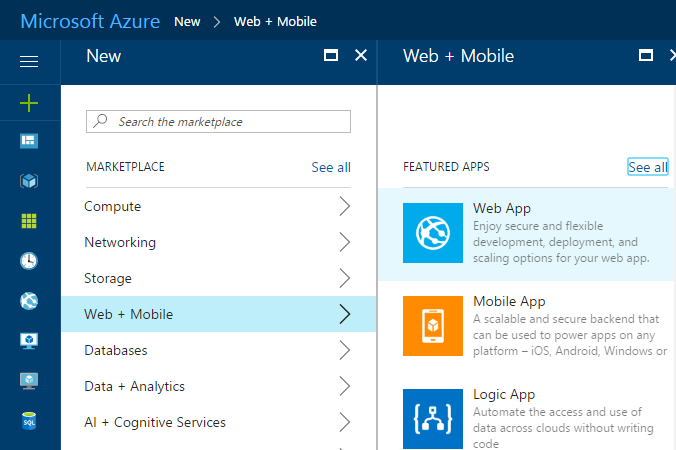
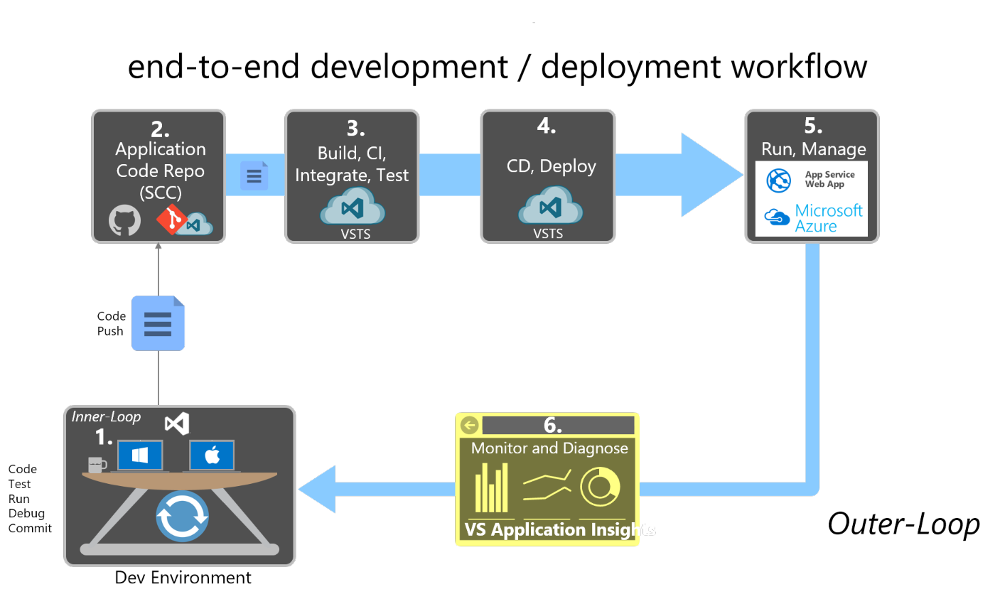

# Development process for Azure

> _"With the cloud, individuals and small businesses can snap their fingers and instantly set up enterprise-class services."_  
> _- Roy Stephan_

## Vision

> *Develop well-designed ASP .NET Core applications the way you like, using Visual Studio or the dotnet CLI and Visual Studio Code or your editor of choice.*

## Development environment for ASP.NET Core apps

### Development tools choices: IDE or editor

Whether you prefer a full and powerful IDE or a lightweight and agile editor, Microsoft has you covered when developing ASP.NET Core applications.

**Visual Studio 2022.** Visual Studio 2022 is the best-in-class IDE for developing applications for ASP.NET Core. It offers a host of features that increase developer productivity. You can use it to develop the application, then analyze its performance and other characteristics. The integrated debugger lets you pause code execution and step back and forth through code on the fly as it's running. Its support for hot reloads allows you to continue working with your app where you left off, even after making code changes, without having to restart the app. The built-in test runner lets you organize your tests and their results and can even perform live unit testing while you're coding. Using Live Share, you can collaborate in real-time with other developers, sharing your code session seamlessly over the network. And when you're ready, Visual Studio includes everything you need to publish your application to Azure or wherever you might host it.

[Download Visual Studio 2022](https://aka.ms/vsdownload?utm_source=mscom&utm_campaign=msdocs)

**Visual Studio Code and dotnet CLI** (Cross-Platform Tools for Mac, Linux, and Windows). If you prefer a lightweight and cross-platform editor supporting any development language, you can use Microsoft Visual Studio Code and the dotnet CLI. These products provide a simple yet robust experience that streamlines the developer workflow. Additionally, Visual Studio Code supports extensions for C\# and web development, providing intellisense and shortcut-tasks within the editor.

[Download the .NET SDK](https://dotnet.microsoft.com/download)

[Download Visual Studio Code](https://code.visualstudio.com/download)

## Development workflow for Azure-hosted ASP.NET Core apps

The application development lifecycle starts from each developer's machine, coding the app using their preferred language and testing it locally. Developers may choose their preferred source control system and can configure Continuous Integration (CI) and/or Continuous Delivery/Deployment (CD) using a build server or based on built-in Azure features.

To get started with developing an ASP.NET Core application using CI/CD, you can use Azure DevOps Services or your organization's own Team Foundation Server (TFS). GitHub Actions provide another option for easily building and deploying apps to Azure, for apps whose code is hosted on GitHub.

### Initial setup

To create a release pipeline for your app, you need to have your application code in source control. Set up a local repository and connect it to a remote repository in a team project. Follow these instructions:

- [Share your code with Git and Visual Studio](/azure/devops/git/share-your-code-in-git-vs) or

- [Share your code with TFVC and Visual Studio](/azure/devops/tfvc/share-your-code-in-tfvc-vs)

Create an Azure App Service where you'll deploy your application. Create a Web App by going to the App Services blade on the Azure portal. Click +Add, select the Web App template, click Create, and provide a name and other details. The web app will be accessible from {name}.azurewebsites.net.

**Figure 10-1.** Creating a new Azure App Service Web App in the Azure Portal.

Your CI build process will perform an automated build whenever new code is committed to the project's source control repository. This process gives you immediate feedback that the code builds (and, ideally, passes automated tests) and can potentially be deployed. This CI build will produce a web deploy package artifact and publish it for consumption by your CD process.

[Define your CI build process](/azure/devops/pipelines/ecosystems/dotnet-core)

Be sure to enable continuous integration so the system will queue a build whenever someone on your team commits new code. Test the build and verify that it is producing a web deploy package as one of its artifacts.

When a build succeeds, your CD process will deploy the results of your CI build to your Azure web app. To configure this step, you create and configure a *Release*, which will deploy to your Azure App Service.

[Deploy an Azure web app](/azure/devops/pipelines/targets/webapp)

Once your CI/CD pipeline is configured, you can easily make updates to your web app and commit them to source control to have them deployed.

### Workflow for developing Azure-hosted ASP.NET Core applications

Once you have configured your Azure account and your CI/CD process, developing Azure-hosted ASP.NET Core applications is simple. The following are the basic steps you usually take when building an ASP.NET Core app, hosted in Azure App Service as a Web App, as illustrated in Figure 10-2.

**Figure 10-2.** Step-by-step workflow for building ASP.NET Core apps and hosting them in Azure

#### Step 1. Local dev environment inner loop

Developing your ASP.NET Core application for deployment to Azure is no different from developing your application otherwise. Use the local development environment you're comfortable with, whether that's Visual Studio 2019 or the dotnet CLI and Visual Studio Code or your preferred editor. You can write code, run and debug your changes, run automated tests, and make local commits to source control until you're ready to push your changes to your shared source control repository.

#### Step 2. Application code repository

Whenever you're ready to share your code with your team, you should push your changes from your local source repository to your team's shared source repository. If you've been working in a custom branch, this step usually involves merging your code into a shared branch (perhaps by means of a [pull request](/azure/devops/git/pull-requests)).

#### Step 3. Build Server: Continuous integration. build, test, package

A new build is triggered on the build server whenever a new commit is made to the shared application code repository. As part of the CI process, this build should fully compile the application and run automated tests to confirm everything is working as expected. The end result of the CI process should be a packaged version of the web app, ready for deployment.

#### Step 4. Build Server: Continuous delivery

Once a build has succeeded, the CD process will pick up the build artifacts produced. This process will include a web deploy package. The build server will deploy this package to Azure App Service, replacing any existing service with the newly created one. Typically this step targets a staging environment, but some applications deploy directly to production through a CD process.

#### Step 5. Azure App Service Web App

Once deployed, the ASP.NET Core application runs within the context of an Azure App Service Web App. This Web App can be monitored and further configured using the Azure Portal.

#### Step 6. Production monitoring and diagnostics

While the Web App is running, you can monitor the health of the application and collect diagnostics and user behavior data. Application Insights is included in Visual Studio, and offers automatic instrumentation for ASP.NET apps. It can provide you with information on usage, exceptions, requests, performance, and logs.

## References

**Build and Deploy Your ASP.NET Core App to Azure**  
[https://docs.microsoft.com/azure/devops/build-release/apps/aspnet/build-aspnet-core](/azure/devops/build-release/apps/aspnet/build-aspnet-core)

>[!div class="step-by-step"]
>[Previous](test-asp-net-core-mvc-apps.md)
>[Next](azure-hosting-recommendations-for-asp-net-web-apps.md)
