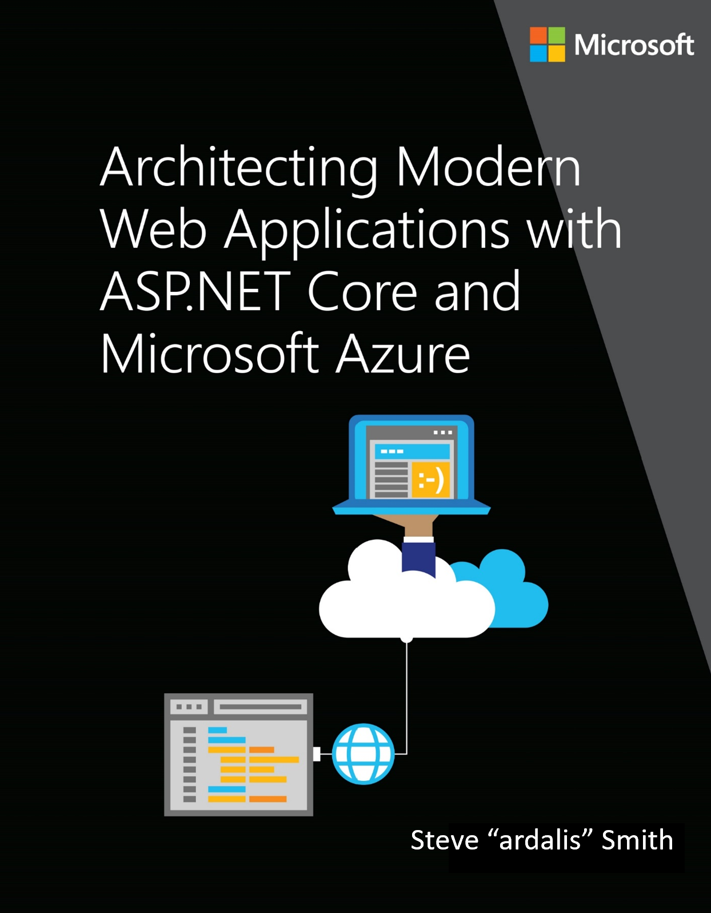

# Architect Modern Web Applications with ASP.NET Core and Azure

**EDITION v6.0** - Updated to ASP.NET Core 6.0

Refer [changelog](https://aka.ms/aspnet-ebook-changelog) for the book updates and community contributions.

PUBLISHED BY

Microsoft Developer Division, .NET, and Visual Studio product teams

A division of Microsoft Corporation

One Microsoft Way

Redmond, Washington 98052-6399

Copyright © 2021 by Microsoft Corporation

All rights reserved. No part of the contents of this book may be reproduced or transmitted in any form or by any means without the written permission of the publisher.

This book is provided "as-is" and expresses the author's views and opinions. The views, opinions, and information expressed in this book, including URL and other Internet website references, may change without notice.

Some examples depicted herein are provided for illustration only and are fictitious. No real association or connection is intended or should be inferred.

Microsoft and the trademarks listed at <https://www.microsoft.com> on the "Trademarks" webpage are trademarks of the Microsoft group of companies.

Mac and macOS are trademarks of Apple Inc.

The Docker whale logo is a registered trademark of Docker, Inc. Used by permission.

All other marks and logos are property of their respective owners.

Author:

> **Steve "ardalis" Smith** - Software Architect and Trainer - [Ardalis.com](https://ardalis.com)

Editors:

> **Maira Wenzel**

## Action links

- This e-book is also available in a PDF format (English version only) [Download](https://aka.ms/webappebook)

- Clone/Fork the reference application [eShopOnWeb on GitHub](https://github.com/dotnet-architecture/eShopOnWeb)

## Introduction

.NET 6 and ASP.NET Core offer several advantages over traditional .NET development. You should use .NET 6 for your server applications if some or all of the following are important to your application's success:

- Cross-platform support.

- Use of microservices.

- Use of Docker containers.

- High performance and scalability requirements.

- Side-by-side versioning of .NET versions by application on the same server.

Traditional .NET 4.x apps can and do support many of these requirements, but ASP.NET Core and .NET 6 have been optimized to offer improved support for the above scenarios.

More and more organizations are choosing to host their web applications in the cloud using services like Microsoft Azure. You should consider hosting your application in the cloud if the following are important to your application or organization:

- Reduced investment in data center costs (hardware, software, space, utilities, server management, etc.)

- Flexible pricing (pay based on usage, not for idle capacity).

- Extreme reliability.

- Improved app mobility; easily change where and how your app is deployed.

- Flexible capacity; scale up or down based on actual needs.

Building web applications with ASP.NET Core, hosted in Azure, offers many competitive advantages over traditional alternatives. ASP.NET Core is optimized for modern web application development practices and cloud hosting scenarios. In this guide, you'll learn how to architect your ASP.NET Core applications to best take advantage of these capabilities.

## Version

This guide has been revised to cover **.NET 6.0** version along with many additional updates related to the same "wave" of technologies (that is, Azure and additional third-party technologies) coinciding in time with the .NET 6.0 release. That's why the book version has also been updated to version **6.0**.

## Purpose

This guide provides end-to-end guidance on building *monolithic* web applications using ASP.NET Core and Azure. In this context, "monolithic" refers to the fact that these applications are deployed as a single unit, not as a collection of interacting services and applications. In some contexts, the term *monolith* may be used as a pejorative, but in the vast majority of situations a single application is much easier to build, deploy, and debug than an app composed of many different services, while still achieving the business requirements.

This guide is complementary to ["_.NET Microservices. Architecture for Containerized .NET Applications_"](../microservices/index.md), which focuses more on Docker, microservices, and deployment of containers to host enterprise applications.

### .NET Microservices. Architecture for Containerized .NET Applications

- **e-book**  
  <https://aka.ms/MicroservicesEbook>
- **Sample Application**  
  <https://aka.ms/microservicesarchitecture>

## Who should use this guide

The audience for this guide is mainly developers, development leads, and architects who are interested in building modern web applications using Microsoft technologies and services in the cloud.

A secondary audience is technical decision makers who are already familiar ASP.NET or Azure and are looking for information on whether it makes sense to upgrade to ASP.NET Core for new or existing projects.

## How you can use this guide

This guide has been condensed into a relatively small document that focuses on building web applications with modern .NET technologies and Azure. As such, it can be read in its entirety to provide a foundation of understanding such applications and their technical considerations. The guide, along with its sample application, can also serve as a starting point or reference. Use the associated sample application as a template for your own applications, or to see how you might organize your application's component parts. Refer back to the guide's principles and coverage of architecture and technology options and decision considerations when you're weighing these choices for your own application.

Feel free to forward this guide to your team to help ensure a common understanding of these considerations and opportunities. Having everybody working from a common set of terminology and underlying principles helps ensure consistent application of architectural patterns and practices.

## References

- **Choosing between .NET 6 and .NET Framework for server apps**  
  [https://docs.microsoft.com/dotnet/standard/choosing-core-framework-server](../../standard/choosing-core-framework-server.md)

>[!div class="step-by-step"]
>[Next](modern-web-applications-characteristics.md)
