# Deploying Modern Desktop Applications

[!INCLUDE [download-alert](includes/download-alert.md)]

When you develop desktop applications, one thing to consider is how your application is going to be packaged and deployed to the users' machines. The problem with packaging, deployment, and installation is that it usually falls under the umbrella of the IT professionals, who care about different things than developers.

These days, we're all familiar with the DevOps concept, where developers and IT Pros work closely to move applications to their production environments. But if you've been in the desktop battle for more than 10 years, you might have seen the following story. A team of developers works together hard to meet the project deadlines. Business people are nervous since they need the system working on many user's machines to run the company. On "D-Day", the project manager checks with every developer that their code is working well and that everything is fine, so they can ship. Then, the package team comes in generating the setup for the app, distribute it to every user machine and a set of test users run the application. Well, they try, because before showing any UI, the application throws an exception that says "Method ~ of object ~ failed". Panic starts flowing through the air and a brief investigation points to a young and tired developer that has introduced a third-party control, that certainly "worked on the dev machine".

Installing desktop applications have traditionally been a nightmare for two main reasons:

- Lack of close collaboration culture between dev and IT teams.
- Lack of a solid packaging and deploying technology we can build upon.

In fact, we've been living with the fact that sometimes you regret that you installed an app because:

- It ends up having some undesired side effects on your machine.
- Some applications that were previously installed stop working.

Additionally, you can't just restore the system to its original state by uninstalling the app. We're so used to live this situation that we've coined terms like "DLL Hell" or "Winrot".

In this chapter, we'll talk about MSIX. MSIX is the brand-new technology from Microsoft that tries to capture the best of previous technologies to provide a solid foundation for the packaging technology of the future.

What does a packaging technology have to do with modernization? Well, it turns out that packaging is fundamental for the enterprise IT with lots of money invested there. Modernization isn't only related to using the latest technologies. It's also related to reducing time to market from the moment a business requirement is defined until your company delivers the feature to your client.

## The modern application lifecycle

Today, developers write and build the code for an app and then pass the generated assets to the IT Pros. Then, the IT Pros reconfigure the app and repackage it, typically in an MSI or more recently in an App-V packaging format. The app is then deployed through different channels and tools. One of the main problems with this approach is commonly known as "packaging paralysis". The problem is that this cycle repeats every time there's an app update or an OS update.

You can see the process reflected on the following picture:

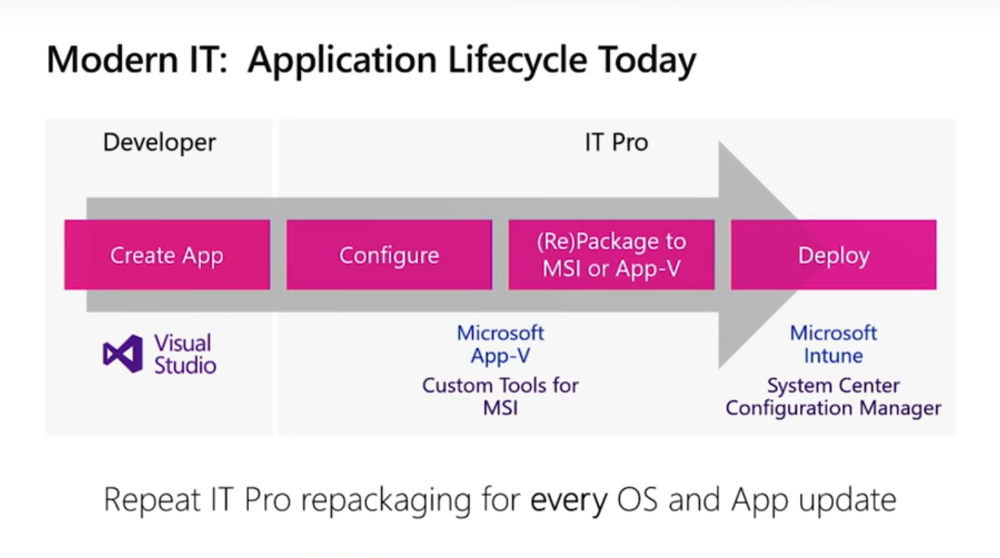

Companies need a way to break this packaging cycle into three independent cycles:

- OS updates
- Application updates
- Customization

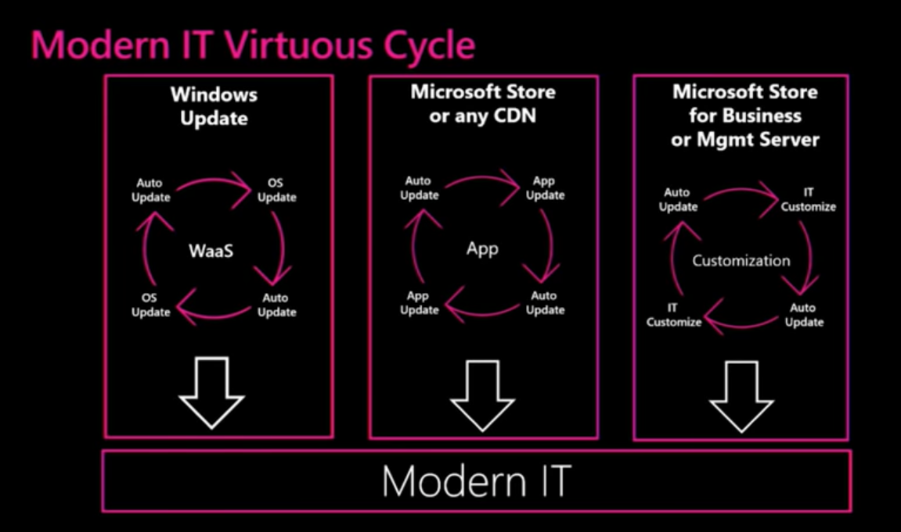

The previous diagram shows that you can:

- Update the underlying OS without having to repackage your apps.
- Enable customizations from IT without the need to repackage the original developer package.

This radical change leads us to the new and modern IT lifecycle as shown in the following picture:

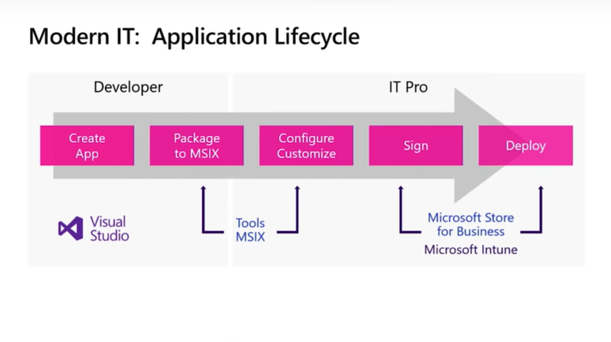

Developers create the app and generate an MSIX package that IT Pros can consume and configure without the need of repackaging. Along with the MSIX technology, Microsoft has created tools to allow IT to customize and configure packages without repackaging.

## MSIX: The next generation of deployment

Before MSIX, there were several packaging technologies available like setup wizards, MSI, ClickOnce, App-V, and scripting. Each of these technologies has their own strengths and Microsoft has decided to pick the best of all to build MSIX. MSIX is built on the foundations of these existing technologies picking the best of each:

- App-V =\> Containerization
- ClickOnce =\> Auto updating
- MSI =\> Easy to distribute

With MSIX, you get one installer technology with all these features.

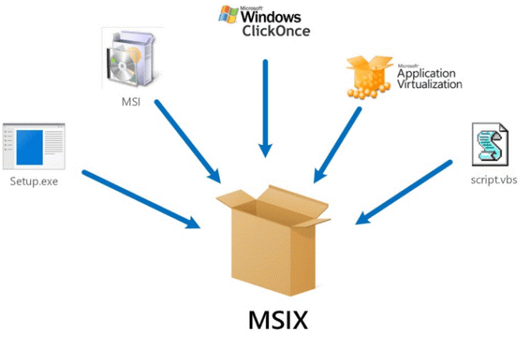

### Benefits of MSIX

#### Never regret installing an app

MSIX provides a predictable, reliable, and safe deployment. The declarative method contained in the package manifest lets the OS keep track of every asset your application needs. It also provides a true clean uninstall with no side effects.

#### Disk space optimization

MSIX is optimized to reduce the footprint that an application has on the user's machine disk space. It creates a single instance storage of your files. That is, if you have two different packages with the same DLL, the DLL isn't installed twice. The platform takes care of that problem because it knows all the files that a particular app installed thanks to its declarative nature. It also allows you to have different versions of a DLL working side by side.

With the use of resource packages, you can easily create multilingual apps and the OS takes care of installing the ones that are used.

#### Network optimization

MSIX detects the differences on the files at the byte block level enabling a feature called differential updates. What this means is that only the updated byte blocks are downloaded on application updates.


With streaming installation, the user can quickly start working on your application while other parts of the app are downloaded on the background. This feature contributes to an engaging experience for your users.

With the optional packages feature, you achieve componentization on your app deployment, so you can download them when needed.

#### Simple packaging and deployment

The AppManifest declares the versioning, device targeting and identify in a standard way for every application. It also provides a way to sign your assets providing a solid security foundation.

#### OS managed

The OS handles all the processes for installing, updating, and removing an application. Applications are installed per user but downloaded only once, minimizing the disk footprint. Microsoft is working on providing the MSIX experience also on Windows 7.

#### Windows provides integrity for the app

With the use of digital signatures, you can guarantee that you don't install an application from untrusted sources. MSIX also prevents tampering because:

- It keeps a record of file hashes.
- It detects if a file has been modified after installation.

#### Works for the entire App Catalog

One of the coolest things about MSIX is that it works for the entire application catalog, Windows Forms, WPF, MFC/ATL, Delphi, even if you want to do xCopy deployment, ClickOnce, or going to the Store, you can use the same MSIX package.

### Tools

#### Windows Application Packaging Project

You can use the **Windows Application Packaging Project** project in Visual Studio to generate a package for your desktop app. Then, you can publish that package to the Microsoft Store or sideload it onto one or more PCs.

#### MSIX Packaging Tool

The MSIX Packaging Tool enables you to repackage your existing Win32 applications to the MSIX format. It offers both an interactive UI and a command line for conversions and gives you the ability to convert an application without having the source code.


#### Package Support Framework

The Package Support Framework is an open-source kit that helps you apply fixes to your existing Win32 application when you don't have access to the source code, so that it can run in an MSIX container. The Package Support Framework helps your application follow the best practices of the modern runtime environment.

#### App Installer

App Installer allows Windows 10 apps to be installed by double-clicking the app package. This means that users don't need to use PowerShell or other developer tools to deploy Windows 10 apps. The App Installer can also install an app from the web, optional packages, and related sets.

## How to create an MSIX package from an existing Win32 desktop application

Let's go through the process to create an MSIX package from an existing Win32 application. In this example, we'll use a Windows Forms app.

To start, add a new project to your solution, select the Windows Application Packaging Project, and give it a name.

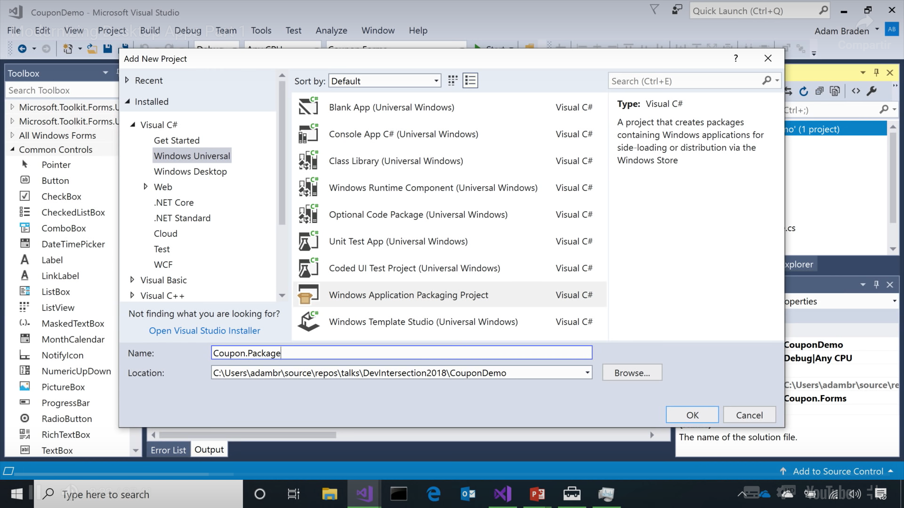

You'll see the structure of the packaging project and note a special folder called *Applications*. Inside this folder, you can specify which applications you want to include in the package. It can be more than one.

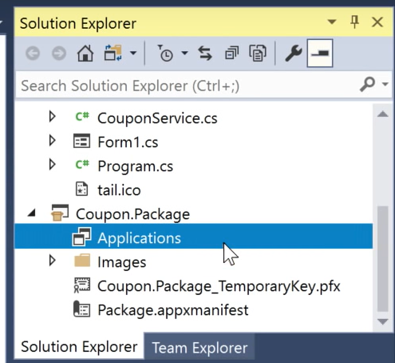

Right-click on the *Applications* folder and select the Windows Forms project you want to package from the Visual Studio solution.

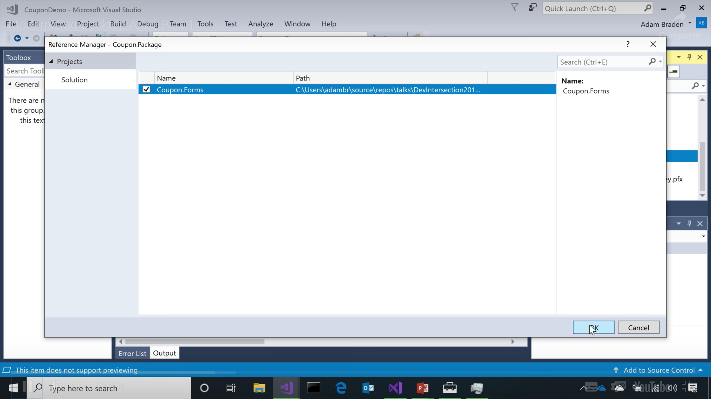

At this point, you can compile and generate the package but let's examine a couple of things. To have a better user experience, Visual Studio can autogenerate all the visual assets a modern application needs to handle icons and tile assets for the tile bar and start menu. Open the *Package.appxmanifest* file to access the Manifest Designer. You can then generate all the visual assets from a given image present on your project just by clicking **Create**.

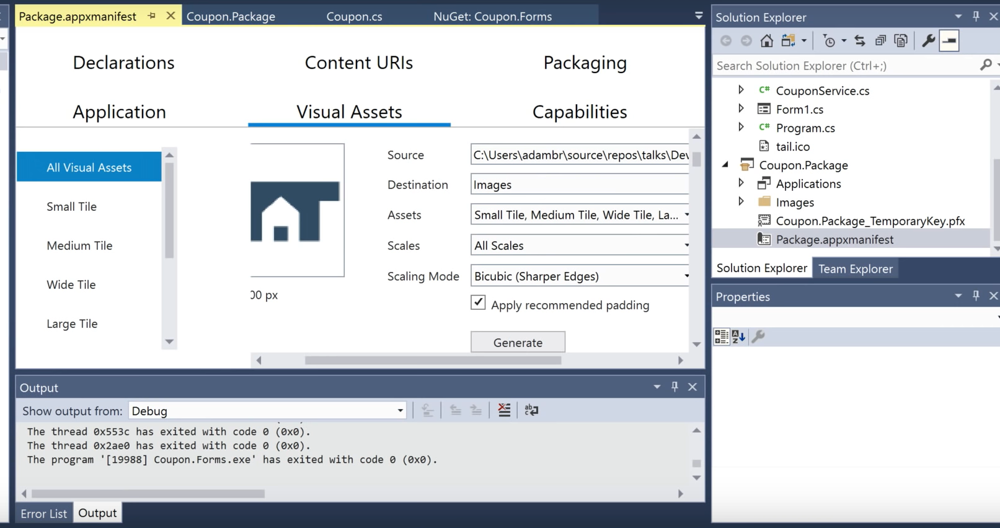

If you open the code for the *Package.appxmanifest* file, you can see a couple of interesting things.

Right under `<Package>`, there's an `<Identity>` node. This is where your packaged application is going to get its identity, which will be managed by the OS.

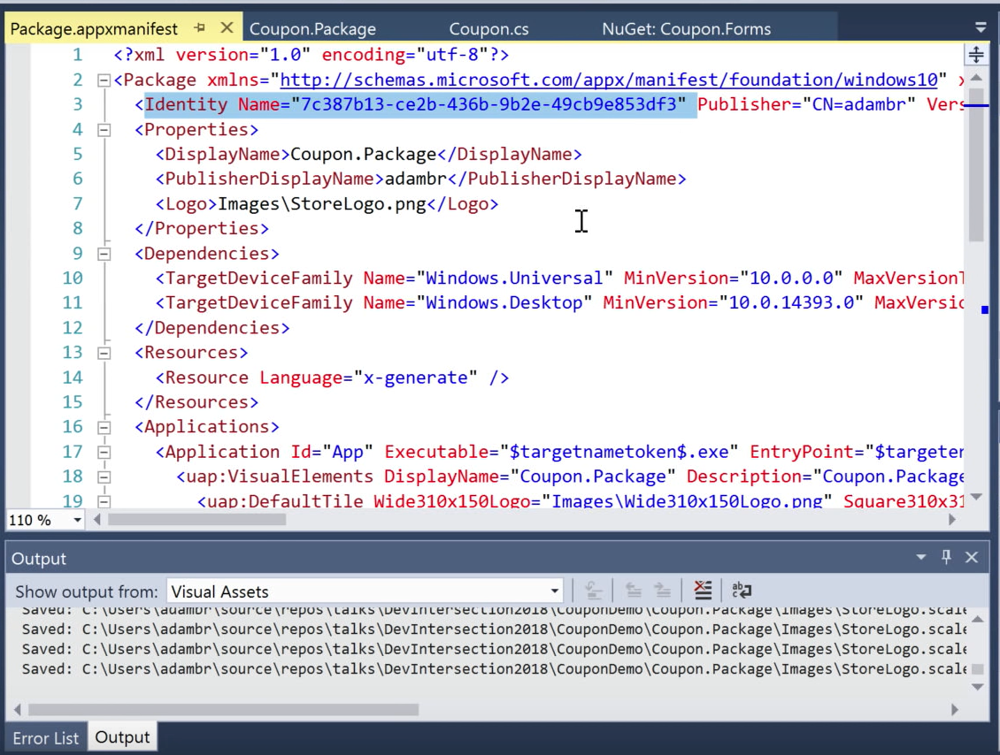

In the `<Capabilities>` node, you can find all the requirements the application needs, paying special attention to the `<rescap:Capability Name="runFullTrust" \>`, which tells the OS to run the app in full trust mode since it's a Win32 application.

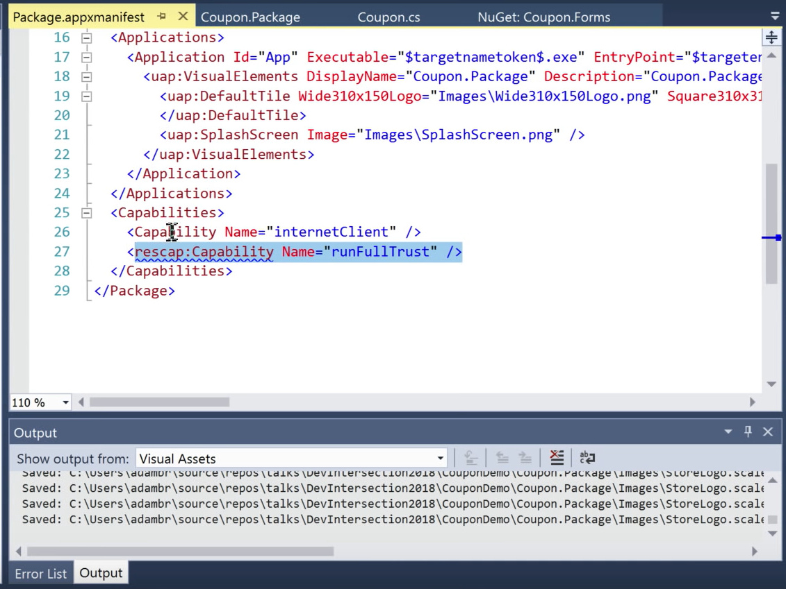

Set the packaging project as the startup project for the solution and select *Run*. This is going to:

- Compile the Windows Forms application.
- Create an MSIX package out of the build results.
- Deploy the packages.
- Install it locally on the development machine.
- Launch the app.

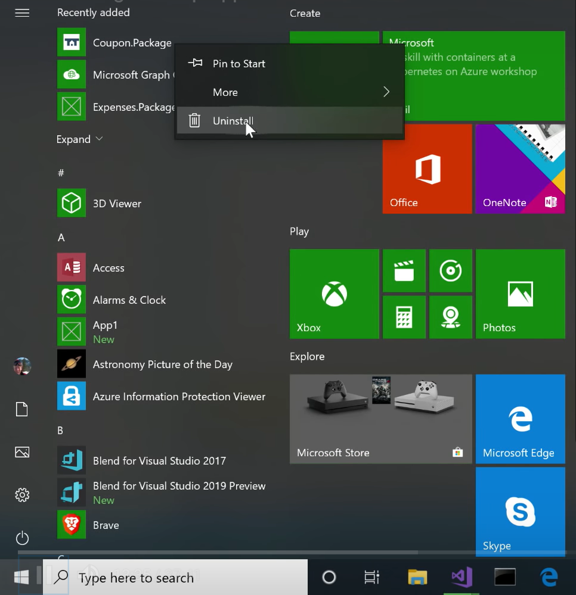

With this, you have the clean install and uninstall experience that MSIX provides fully integrated into Windows 10.

The final stage is about how you deploy the MSIX package to another machine.

Right-click on the packaging project, select the **Store** menu, and then select the **Create App Packages** option.

Then, you can choose between creating a package to upload to the store or creating packages for sideloading. In most modernization scenarios, you'll choose **I want to create packages for sideloading**.

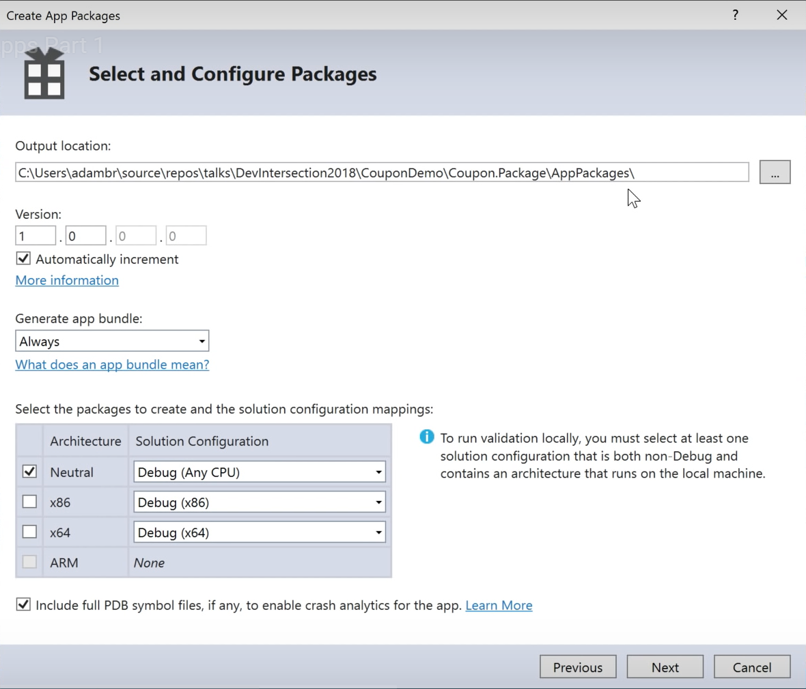

There you can select the different architectures you want to target as you can include as many as you want into the same MSIX package.

The final step is to declare where you want to deploy the final installation assets.

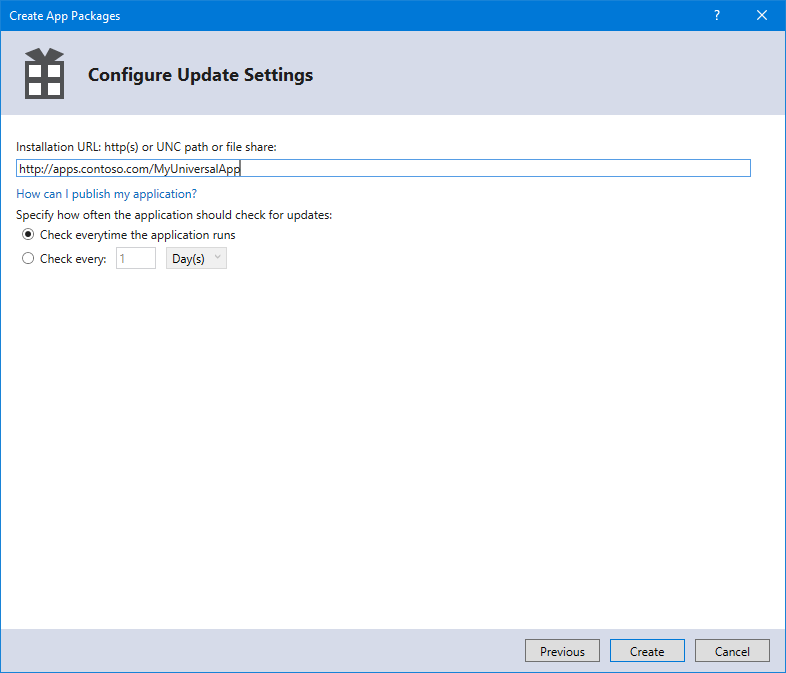

You can choose to use a web server of a shared UNC path on your enterprise file servers. Pay attention to the settings to specify how you want to update your application. We'll cover application updates in the next section.

For a detailed step-by-step guide, see [Package a desktop app from source code using Visual Studio](/windows/msix/desktop/desktop-to-uwp-packaging-dot-net).

## Auto Updates in MSIX

The Windows Store has a great updating mechanism using Windows Update. In most enterprise scenarios, you don't use the Store to distribute your desktop apps. So, you need a similar way to configure updates for your application and pull them to your users.

Using a combination of Windows 10 features and MSIX packages, you can provide a great updating experience for your users. In fact, the user doesn't need to be technical at all but still benefit from a seamless application update experience.

You can configure your updates to interact with the user in two different ways:

- User prompted updates: The OS shows some autogenerated nice UI to notify the user about the application is about to install. It builds this UI based on the properties you specify on your installation files.

- Silent updates in the background. With this option, your users don't need to be aware of the updates.

You can also configure when you want to perform updates, when the application launches or on a regular basis. Thanks to the side-loading features, you can even get these updates while the application is running.

When you use this type of deployment, a special file is created called *.appinstaller*. This simple file contains the following sections:

- The location of the *.appinstaller* file
- The application's main MSIX package properties
- The update behavior

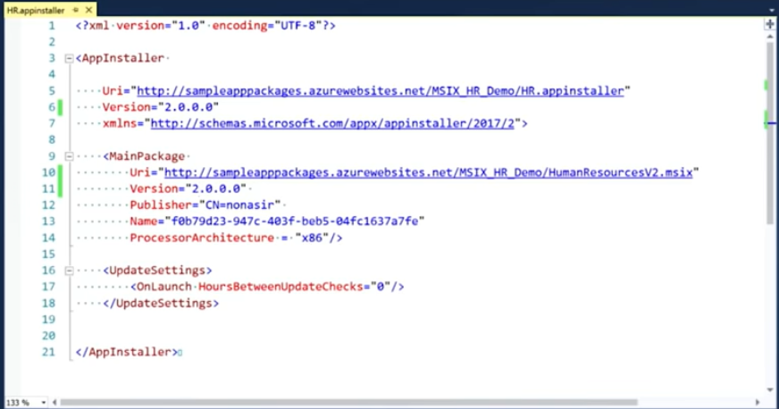

In combination with this file, Microsoft has designed a special URL protocol to launch the installation process from a link:

```xml
<a href="ms-appinstaller:?source=http://mywebservice.azureedge.net/MyApp.msix">Install app package </a>
```

This protocol works on all browsers and launches the installation process with a great user experience on Windows 10. Since the OS manages the installation process, it's aware of the location this application was installed from and tracks all the files affected by the process.

MSIX creates a user interface for installation automatically showing some properties of the package. This allows for a common installation experience for every app.

Once you've generated the new MSIX package and moved it to the deployment server, you just have to edit the *.appinstaller* file to reflect these changes, mainly the version and the path to the new MSIX file. The next time the user launches the application, the system is going to detect the change and download the files for the new version in the background. When this is done, installation will execute on new application launch transparently for your user.

>[!div class="step-by-step"]
>[Previous](example-migration.md)
