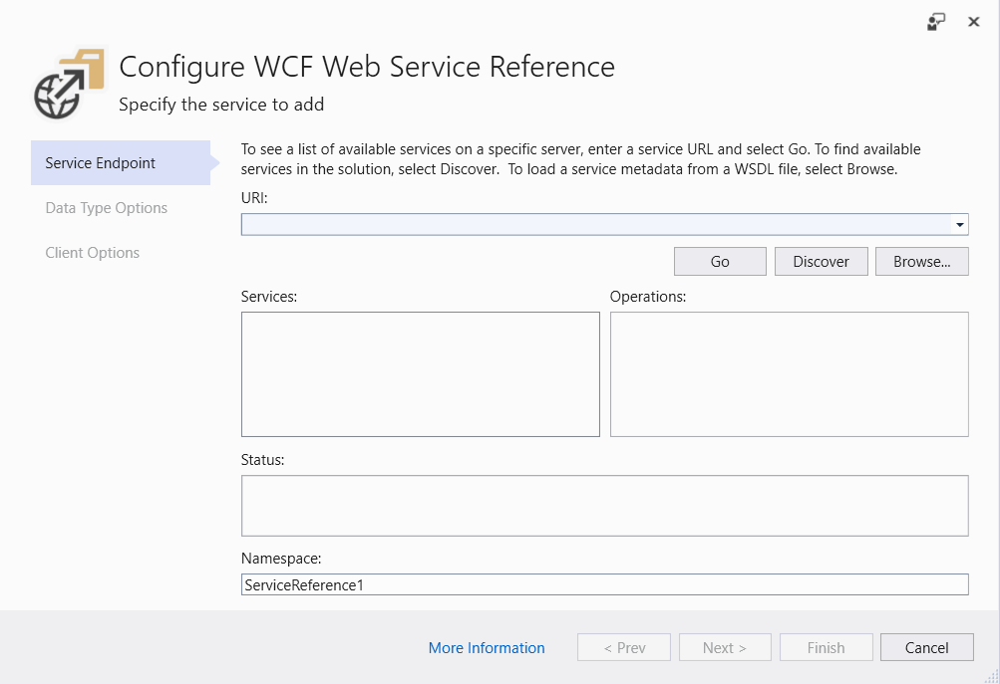

# Example of migrating to .NET Core 3

## Introduction

In this chapter, we present practical guidelines to help you perform a migration
of your existing application from .NET Framework to .NET Core.

We present a well-structured process you can follow and the most important
things to consider on each step.

We then document a step by step migration process for a sample desktop
application, both from WinForms and WPF versions.

## Migration Process Overview

The migration process can be articulated in four sequential steps:

1. **Preparation**: You must understand the dependencies the project has to have
   an idea of what is ahead. In this step, you take the current project into a
   state that simplifies the startup point for the migration.

2. **Migrate Project File:** .NET Core projects use the new SDK style projects.
   You need to create a new project file with this format or update the one you
   have to use the SDK style.

3. **Fix Code and Build:** Get the code building in .NET Core, addressing API
   level differences between .NET Framework and .NET Core or in third party
   packages you use on your app. This is time to regenerate generated code like
   WCF clients.

4. **Run and Test:** Forget about once it builds you are finished. There are
   differences that don’t show up until run time, so you need to be sure
   everything works as expected.

### Preparation

#### Migrate packages.config file

In a .NET Framework application, all references to external packages are
declared in the packages.config file. In .NET Core there is no longer the need
to use the packages.config file. Instead, the new PackageReference format inside
the project file is used to pull in NuGet dependencies.

So, you need to transition from one format to another. You can manually update,
taking the dependencies contained in the packages.config file and migrate them
to the project file with the PackageReference format. Besides, you can leave
Visual Studio do the work for you by right clicking on the packages.config file
and select the “Migrate packages.config to PackageReference” option.

#### Check out every dependency compatibility in .NET Core

Once you have migrated the package references you must check each reference for
compatibility. If you go to nugget.org you can explore the dependencies of each
NuGet package your application is using. If it has .NET Standard dependencies,
then it’s going to work on .NET Core because it depends on .NET Standard. Here
you can see a screenshot showing the dependencies for the Castle.Windsor
Package:


To check out package compatibility, we can use the tool <http://fuget.org> that
offers a more detailed information about versions and dependencies.

Maybe the versions of the packages referenced by the project are older versions
that don’t support .NET Core but you can find newer versions that do support it.
Therefore, updating packages to newer versions is in general a good
recommendation although you must consider that this can introduce some breaking
changes forcing you to update your code to keep it compiling well.

What happens if you don’t find a compatible version? What if you just don’t want
to update the version of a package because of these breaking changes? Don’t
worry because it is possible to depend on .NET Framework packages from a .NET
Core application. You must test this extensively because it can cause runtime
errors if the external package calls an API that is not available on .NET Core.
This is great news when you are using an old package that is not going to be
updated and you just can retarget to work on the .NET Core.

#### Check for API compatibility

Since APIs surfaces in .NET Framework and .NET are similar but not identical,
you must check which of those APIs are available on .NET Core and which are not.
You can use the .NET Portability Analyzer tools to surface APIs used that aren’t
present on .NET Core. It looks at the binary level of your app and extracts all
the APIs that are called showing the ones that aren’t available on your target
framework, .NET Core 3.0 in our case.

You can find this tool at:

<https://docs.microsoft.com/en-us/dotnet/standard/analyzers/portability-analyzer>

The most interesting result from this tool refers to differences in your own
code and not in external packages that you cannot change. Remember you should
have updated most of these packages to make them work with .NET Core.

### Migrate Project File

#### Create the new .NET Core project

In most of the cases you will want to update your existing project to the new
.NET Core format, but be aware that you can also create a new project while
maintaining the old one. The main drawback from updating the old project is that
you lose designer support, which may be important to you. If you want to keep
using the designer, you must create a new .NET Core project in parallel with the
old one and share assets. When it is time to modify UI elements in the designer
you can switch to the old project to do that, and since assets are linked there
will be updated in the .NET Core project.

.NET Core SDK style project are a lot simpler that .NET Framework and apart from
the mentioned PackageReference stuff, you will not need to do much more. SDK
style adds all necessary files underneath project file location like `.cs` and
`.xaml` files without the need to explicitly include them in the `.csproj`.

#### Assembly.info considerations

Attributes are auto generated on .NET Core projects you we don’t need them
anymore. This causes a compilation conflict because they are duplicate
definitions. You can choose to delete the older `AssemblyInfo.cs` file or keep it
and add this entry to the .NET Core project file:

```xml
<GenerateAssemblyInfo>false</GenerateAssemblyInfo>
```

#### Resources

Embedded resources are included automatically but resources are not, so you need
to migrate those to the new .csproj.

#### Packages References

With the “Migrate packages.config to PackageReference” option, you can easily
move your external packages references to the new format as mentioned above.

#### Update package references

Proceed to update the version of the packages you have found to be compatible as
depicted in previous section.

### Fix Code and Build

#### Microsoft.Windows.Compatibility

In case you applications depends on APIs that aren’t available on .NET Core like
Registry, ACLs, WCF you have to include a reference to the
Microsoft.Windows.Compatibility package to add these Windows-specific APIs. They
work on .NET Core but aren’t included as they aren’t cross-platform.

There is a tool called API Analyzer
(<https://docs.microsoft.com/en-us/dotnet/standard/analyzers/api-analyzer>) that
help you identify not compatible APIs as long as you develop your code.

#### Use \#if defines

If you need different execution paths when targeting .NET Framework and .NET
Core, you should use compilation constants and code some \#if statements to keep
the same code base for both targets.

#### Technologies not available on .NET Core

Some technologies aren’t available on .NET Core like:

* AppDomains
* Remoting
* Code Access Security
* WCF Server
* Windows Workflow

Therefore, it is time to look for a replacement for those.

#### Regenerate auto-generated clients

If your application uses some auto-generated code like, for example, a WCF
client, you may need to regenerate this code to target .NET Core. Sometimes you
can find some missing references since it may not be included as default as part
of the basic .Net Core assemblies. Using a tool like <https://apisof.net/> you
can easily locate the assembly the missing reference lives in and add it from
NuGet.

#### Rolling back package versions

As a general rule, we have stated that you better update every single package
version to be compatible with .NET Core. However, you can find that targeting an
updated and compatible version of an assembly just does not pay off. If the cost
of change is not acceptable, you can consider rolling back package versions
keeping the ones you use on .NET Framework. Although they may not be targeting
.NET Core, they should work well unless they call some unsupported APIs.

### Run and Test

Once you have your application building with no errors, you can start the last
step of the migration by testing every functionality.

In this final step, you can find a variety of issues depending on the complexity
of your application and the dependencies and APIs you are using.

For example, in the case you have some usage of configuration files (app.config)
you may find some errors at run time like Configuration Sections not present.
Using Microsoft.Extensions.Configuration should do the fix.

Another reason for errors is the use of BeginInvoke and EndInvoke since these
aren’t supported on .NET Core. The reason they aren’t supported on .NET Core is
they have a dependency on Remoting, which does not exist on .NET Core. To solve
this issue, try to use `await` when available or `Task.Run`.

You can use compatibility analyzers to let you identify APIs and code patterns
in your code that can potentially cause problems at run-time with .NET Core. You
can go to <http://github.com/dotnet/platform-compat> and use the Roselyn
analyzers.

## Migrating a Windows Forms application

To showcase a complete migration process of a Windows Forms application, we’ve
chosen to migrate the eShop sample application.

This application shows a product catalog and allows the user to navigate, filter
and search for products. From an architecture point of view the App relies on an
external WCF service that serves as a façade to a back-end database.

You can see the main application window in the following picture:


If we open the .csproj file we can something like this:


As mentioned before, .NET Core project has a more compact style and we need to
migrate the project structure to the new .NET Core SDK style.

Select the Windows Forms project in the solution explorer and do *right click
-> Unload Project -> Edit*


Now we can update the .csproj file. We will delete all the content and replace
it with:

```xml
<Project Sdk="Microsoft.NET.Sdk.WindowsDesktop">
    <PropertyGroup>
        <OutputType>WinExe</OutputType>
        <TargetFramework>netcoreapp3.0</TargetFramework>
        <UseWindowsForms>true</UseWindowsForms>
        <GenerateAssemblyInfo>false</GenerateAssemblyInfo>
    </PropertyGroup>
</Project>
```

If we save and reload the project, we are done updating the project file. Now
the project is targeting the .NET Core.

If we compile the project at this point, we find some errors related to the WCF
client reference. Since this is auto-generated code we must regenerate it to
target .NET Core.


We can delete the `Reference.cs` file and generate a new Service Client.

Right-click over *Connected Services* and select the “*Add Connected Service*”
option.


This will open the Connected Services window where we select the Microsoft WCF
Web Service option.


If we have the WCF Service in the same solution as we have, we can choose to
select the Discover option instead of specifying a service URL.



Once the service is located the tools reflects the API contract implemented by
the service. We change the name of the Namespace to be eShopServiceReference:


We click on *Finish* and after a while, we will see the generated code.

We can see three generated documents:

1. Getting Started: just a link to GitHub to provide some info on WCF
2. `ConnectedService.json`: configuration parameters to connect to the service.
3. `Reference.cs`: this is the actual WCF client code.


If we compile again, we see many errors coming from `.cs` files inside the Helper
folder. This folder was present in the .NET Framework version but not included
in the old .csproj. But with the new SDK project style every code file present
underneath the project file location is included by default, meaning that the
new .NET Core project tries to compile the files inside the Helper folder. Since
it is not needed, we can safely delete it.

We compile again but when we execute the application, we see no images of
products. The problem is that now the path to the files has changed slightly and
we need to add another level of depth in the path, updating from:

```C#
string image_name = Environment.CurrentDirectory + "\\..\\..\\Assets\\Images\\Catalog\\" + catalogItems.Picturefilename;
```

to

```C#
string image_name = Environment.CurrentDirectory + "\\..\\..\\..\\Assets\\Images\\Catalog\\" + catalogItems.Picturefilename;
```

After this change, we check that the application launches and performs as
expected on .NET Core.

## Migrating a WPF Application

We will use the Shop.ClassicWPF sample application to perform the migration.
Here is a screenshot of the app before migration.


This application uses a local SQLExpress database to hold the product catalog
information. This database is accessed directly from the WPF application.

We must first update the .csproj file to the new SDK style used by the .NET Core
applications. To do this we follow the same steps described in the Windows Forms
migration, we unload the project, open de .csproj file and update its contents
and finally reload the project.

In this case, we delete all the content of the .csproj file and replace it with:

```xml
<Project Sdk="Microsoft.NET.Sdk.WindowsDesktop">
    <PropertyGroup>
        <OutputType>WinExe</OutputType>
        <TargetFramework>netcoreapp3.0</TargetFramework>
        <UseWPF>true</UseWPF>
        <GenerateAssemblyInfo>false</GenerateAssemblyInfo>
    </PropertyGroup>
</Project>
```

If we reload the project and compile, we get the following error:


Since we have deleted all the .csproj contents we have lost a project reference
specification present in the old project. We just need to add this line to
.csproj to include it:

```xml
<ItemGroup>
    <ProjectReference Include=”..\\eShop.SqlProvider\\eShop.SqlProvider.csproj” />
<ItemGroup>
```

Alternatively, we can let Visual Studio help us by clicking on Add Reference
option and select the project from the solution:


Once we do this the application compiles and executes as expected on .NET Core.
