# Example of migrating to .NET

In this chapter, we present practical guidelines to help you perform a migration of your existing application from .NET Framework to .NET.

We present a well-structured process you can follow and the most important things to consider on each step.

We then document a step-by-step migration process for a sample desktop application, both from WinForms and WPF versions.

## Migration process overview

The migration process consists of four sequential steps:

1. **Preparation**: Understand the dependencies the project has to have an idea of what's ahead. In this step, you take the current project into a state that simplifies the startup point for the migration.

2. **Migrate Project File:** .NET projects use the new SDK-style project format. Create a new project file with this format or update the one you have to use the SDK style.

3. **Fix code and build:** Build the code in .NET addressing API-level differences between .NET Framework and .NET. If needed, update third-party packages to the ones that support .NET.

4. **Run and test:** There might be differences that don't show up until run time. So, don't forget to run the application and test that everything works as expected.

### Preparation

#### Migrate packages.config file

In a .NET Framework application, all references to external packages are declared in the *packages.config* file. In .NET, there's no longer the need to use the *packages.config* file. Instead, use the [PackageReference](../../core/project-sdk/msbuild-props.md#packagereference) property inside the project file to specify the NuGet packages for your app.

So, you need to transition from one format to another. You can do the update manually, taking the dependencies contained in the *packages.config* file and migrating them to the project file with the `PackageReference` format. Or, you can let Visual Studio do the work for you: right-click on the *packages.config* file and select the **Migrate packages.config to PackageReference** option.

#### Verify every dependency compatibility in .NET

Once you've migrated the package references, you must check each reference for compatibility. You can explore the dependencies of each NuGet package your application is using on [nuget.org](https://www.nuget.org/). If the package has .NET Standard dependencies, then it's going to work on .NET 5.0 because .NET [supports](../../standard/net-standard.md#net-implementation-support) all versions of .NET Standard. The following image shows the dependencies for the `Castle.Windsor` package:

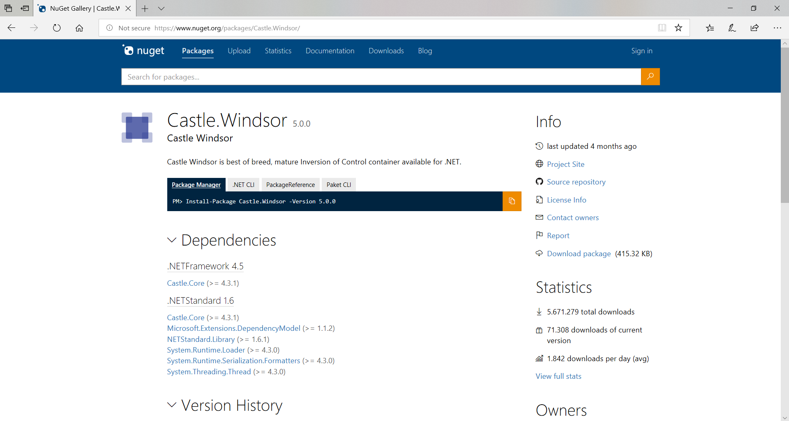

To check the package compatibility, you can use the tool <https://fuget.org> that offers a more detailed information about versions and dependencies.

Maybe the project is referencing older package versions that don't support .NET, but you might find newer versions that do support it. So, updating packages to newer versions is generally a good recommendation. However, you should consider that updating the package version can introduce some breaking changes that would force you to update your code.

What happens if you don't find a compatible version? What if you just don't want to update the version of a package because of these breaking changes? Don't worry because it's possible to depend on .NET Framework packages from a .NET application. Don't forget to test it extensively because it can cause run-time errors if the external package calls an API that isn't available on .NET. This is great for when you're using an old package that isn't going to be updated and you can just retarget to work on the .NET.

#### Check for API compatibility

Since the API surface in .NET Framework and .NET is similar but not identical, you must check which APIs are available on .NET and which aren't. You can use the .NET Portability Analyzer tool to surface APIs used that aren't present on .NET. It looks at the binary level of your app, extracts all the APIs that are called, and then lists which APIs aren't available on your target framework (.NET 5.0 in this case).

You can find more information about this tool at:

<https://docs.microsoft.com/dotnet/standard/analyzers/portability-analyzer>

An interesting aspect of this tool is that it only surfaces the differences from your own code and not code from external packages, which you can't change. Remember you should have updated most of these packages to make them work with .NET.

### Migrate with Try Convert tool

The [Try Convert](https://github.com/dotnet/try-convert/releases) tool is a great way to migrate a project. It's a global tool that attempts to upgrade your project file from the old style to the new SDK style, and retargets applicable projects to .NET 5. Once installed, you can run the following commands:

```dotnetcli
try-convert -p "<path to your project file>"
```

Or:

```dotnetcli
try-convert -w "<path to your solution>"
```

After the tool attempts the conversion, reload your files in Visual Studio to run and test. There's a possibility that Try Convert won't be able to perform the conversion due to the specifics of your project. In that case, you can refer the below steps.

#### Migrate manually

1. Create the new .NET project

In most cases, you'll want to update your existing project to the new .NET format. However, you can also create a new project while maintaining the old one. The main drawback from updating the old project is that you lose designer support, which may be important to you and your development team. If you want to keep using the designer, you must create a new .NET project in parallel with the old one and share assets. If you need to modify UI elements in the designer, you can switch to the old project to do that. And since assets are linked, they'll be updated in the .NET project as well.

The [SDK-style project](../../core/project-sdk/msbuild-props.md) for .NET is a lot simpler than .NET Framework's project format. Apart from the previously mentioned `PackageReference` entries, you won't need to do much more. The new project format [includes files with certain extensions by default](../../core/project-sdk/overview.md#default-includes-and-excludes), such as `.cs` and `.xaml` files, without the need to explicitly include them in the project file.

#### AssemblyInfo considerations

Attributes are autogenerated on .NET projects. If the project contains an *AssemblyInfo.cs* file, the definitions will be duplicated, which will cause compilation conflicts. You can delete the older *AssemblyInfo.cs* file or disable autogeneration by adding the following entry to the .NET project file:

```xml
<Project Sdk="Microsoft.NET.Sdk">
  <PropertyGroup>
    <GenerateAssemblyInfo>false</GenerateAssemblyInfo>
  </PropertyGroup>
</Project>
```

#### Resources

Embedded resources are included automatically but resources aren't, so you need to migrate the resources to the new project file.

#### Package references

With the **Migrate packages.config to PackageReference** option, you can easily move your external package references to the new format as previously mentioned.

#### Update package references

Update the versions of the packages you've found to be compatible, as shown in the previous section.

### Fix the code and build

#### Microsoft.Windows.Compatibility

If your application depends on APIs that aren't available on .NET, such as Registry, ACLs, or WCF, you have to include a reference to the `Microsoft.Windows.Compatibility` package to add these Windows-specific APIs. They work on .NET but aren't included as they aren't cross-platform.

There's a tool called API Analyzer (<https://docs.microsoft.com/dotnet/standard/analyzers/api-analyzer>) that helps you identify APIs that aren't compatible with your code.

#### Use \#if directives

If you need different execution paths when targeting .NET Framework and .NET, you should use compilation constants. Add some \#if directives to your code to keep the same code base for both targets.

#### Technologies not available on .NET

Some technologies aren't available on .NET, such as:

* AppDomains
* Remoting
* Code Access Security
* WCF Server
* Windows Workflow

That's why you need to find a replacement for these technologies if you're using them in your application. For more information, see the [.NET Framework technologies unavailable on .NET Core and .NET 5+](../../core/porting/net-framework-tech-unavailable.md) article.

#### Regenerate autogenerated clients

If your application uses autogenerated code, such as a WCF client, you may need to regenerate this code to target .NET. Sometimes, you can find some missing references since they may not be included as part of the default .NET assemblies set. Using a tool like <https://apisof.net/>, you can easily locate the assembly the missing reference lives in and add it from NuGet.

#### Rolling back package versions

As a general rule, we've previously stated that you better update every single package version to be compatible with .NET. However, you can find that targeting an updated and compatible version of an assembly just doesn't pay off. If the cost of change isn't acceptable, you can consider rolling back package versions keeping the ones you use on .NET Framework. Although they may not be targeting .NET, they should work well unless they call some unsupported APIs.

### Run and test

Once you have your application building with no errors, you can start the last step of the migration by testing every functionality.

In this final step, you can find several different issues depending on the complexity of your application and the dependencies and APIs you're using.

For example, if you use configuration files (*app.config*), you may find some errors at run time like Configuration Sections not present. Using the `Microsoft.Extensions.Configuration` NuGet package should fix that error.

Another reason for errors is the use of the `BeginInvoke` and `EndInvoke` methods because they aren't supported on .NET. They aren't supported on .NET because they have a dependency on Remoting, which doesn't exist on .NET. To solve this issue, try to use the `await` keyword (when available) or the <xref:System.Threading.Tasks.Task.Run%2A?displayProperty=nameWithType> method.

You can use compatibility analyzers to let you identify APIs and code patterns in your code that can potentially cause problems at run time with .NET. Go to <https://github.com/dotnet/platform-compat> and use the .NET API analyzer on your project.

## Migrating a Windows Forms application

To showcase a complete migration process of a Windows Forms application, we've chosen to migrate the eShop sample application available at <https://github.com/dotnet-architecture/eShopModernizing/tree/master/eShopLegacyNTier/src/eShopWinForms>. You can find the complete result of the migration at <https://github.com/dotnet-architecture/eShopModernizing/tree/master/eShopModernizedNTier/src/eShopWinForms>.

This application shows a product catalog and allows the user to navigate, filter, and search for products. From an architecture point of view, the app relies on an external WCF service that serves as a façade to a back-end
database.

You can see the main application window in the following picture:

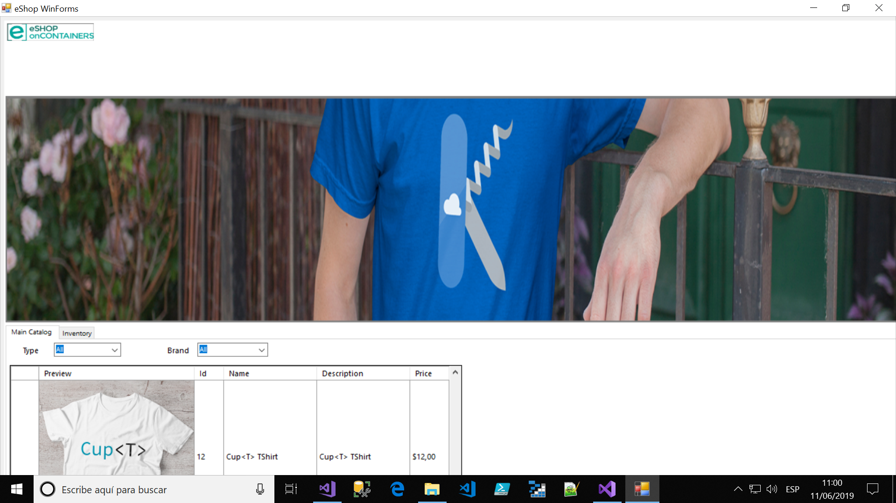

If you open the *.csproj* project file, you can see something like this:

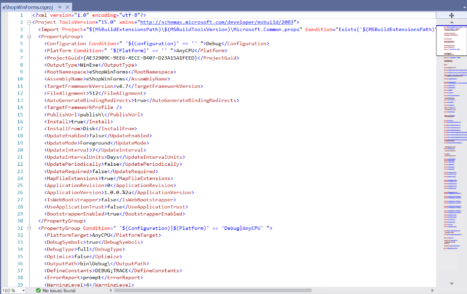

As previously mentioned, .NET project has a more compact style and you need to migrate the project structure to the new .NET SDK style.

In the Solution Explorer, right click on the Windows Forms project and select **Unload Project** > **Edit**.

Now you can update the .csproj file. You'll delete the entire content and replace it with the following code:

```xml
<Project Sdk="Microsoft.NET.Sdk">
  <PropertyGroup>
    <OutputType>WinExe</OutputType>
    <TargetFramework>net5.0-windows</TargetFramework>
    <UseWindowsForms>true</UseWindowsForms>
    <GenerateAssemblyInfo>false</GenerateAssemblyInfo>
  </PropertyGroup>
</Project>
```

Save and reload the project. You're now done updating the project file and the project is targeting the .NET.

If you compile the project at this point, you'll find some errors related to the WCF client reference. Since this code is autogenerated, you must regenerate it to target .NET.

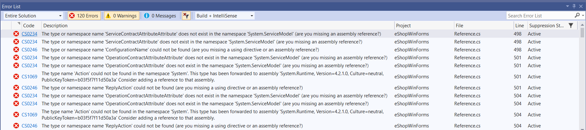

Delete the *Reference.cs* file and generate a new Service Client.

Right-click on **Connected Services** and select the **Add Connected Service** option.

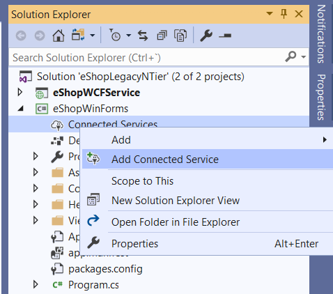

The Connected Services window opens. Select the **Microsoft WCF Web Service** option.

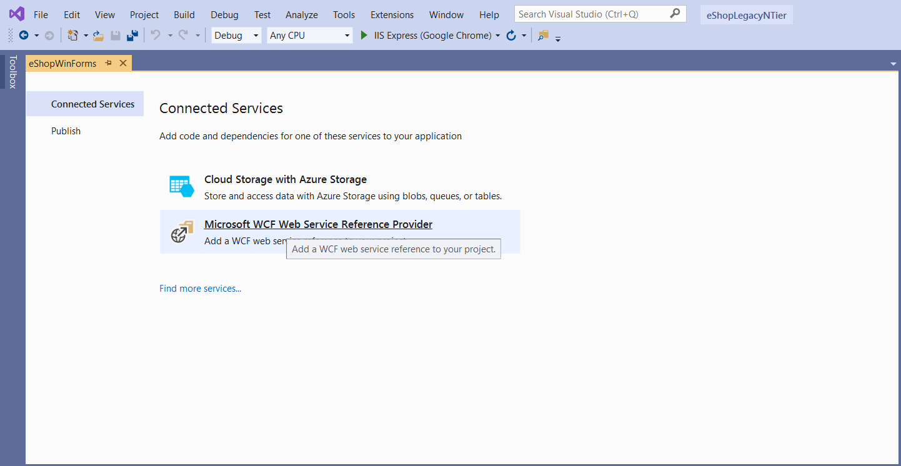

If you have the WCF Service in the same solution as we have in this example, you can select the **Discover** option instead of specifying a service URL.

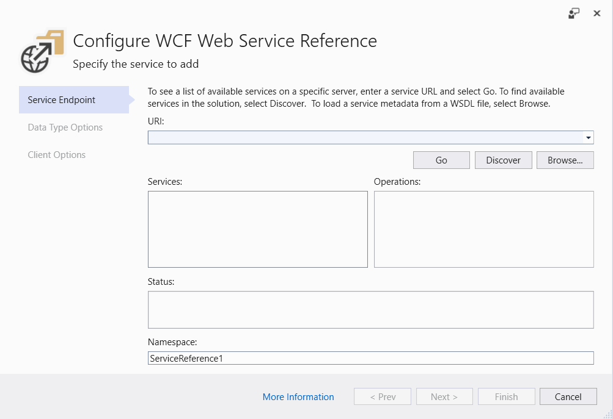

Once the service is located, the tool reflects the API contract implemented by the service. Change the name of the namespace to be `eShopServiceReference` as shown in the following image:

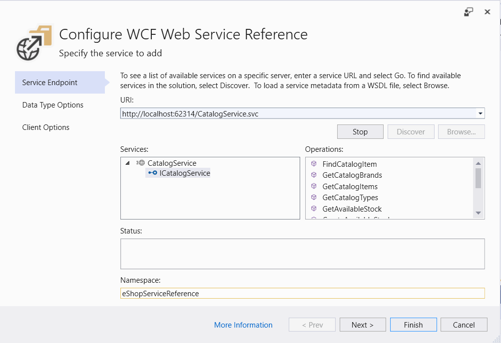

Select the **Finish** button. After a while, you'll see the generated code.

You should see three autogenerated files:

1. *Getting Started*: a link to GitHub to provide some information on WCF.
2. *ConnectedService.json*: configuration parameters to connect to the service.
3. *Reference.cs*: the actual WCF client code.

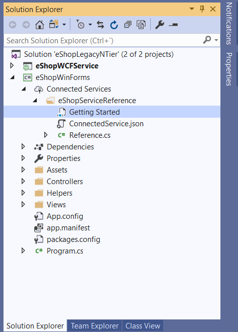

If you compile again, you'll see many errors coming from *.cs* files inside the *Helper* folder. This folder was present in the .NET Framework version but not included in the old *.csproj*. But with the new SDK-style project, every code file present underneath the project file location is included by default. That is, the new .NET Core project tries to compile the files inside the *Helper* folder. Since that folder isn't needed, you can safely delete it.

If you compile the project again and execute it, you won't see the product images. The problem is that now the path to the files has slightly changed. To fix this issue, you need to add another level of depth in the path, updating in the file `CatalogView.cs` the line:

```csharp
string image_name = Environment.CurrentDirectory + "\\..\\..\\Assets\\Images\\Catalog\\" + catalogItems.Picturefilename;
```

to

```csharp
string image_name = Environment.CurrentDirectory + "\\..\\..\\..\\Assets\\Images\\Catalog\\" + catalogItems.Picturefilename;
```

After this change, you can check that the application launches and runs as expected on .NET Core.

## Migrating a WPF application

We'll use the `Shop.ClassicWPF` sample application to perform the migration. The following image shows a screenshot of the app before migration:

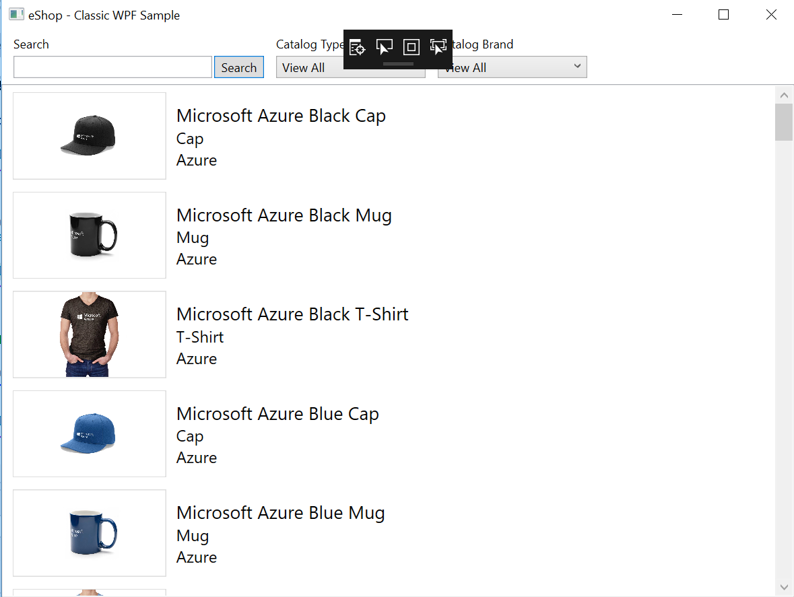

This application uses a local SQL Server Express database to hold the product catalog information. This database is accessed directly from the WPF application.

First, you must update the *.csproj* file to the new SDK style used by .NET Core applications. You'll follow the same steps described in the Windows Forms migration: you'll unload the project, open the *.csproj* file, update its contents, and reload the project.

In this case, delete all the content of the *.csproj* file and replace it with the following code:

```xml
 <Project Sdk="Microsoft.NET.Sdk">
  <PropertyGroup>
    <OutputType>WinExe</OutputType>
    <TargetFramework>net5.0-windows</TargetFramework>
    <UseWpf>true</UseWpf>
    <GenerateAssemblyInfo>false</GenerateAssemblyInfo>
  </PropertyGroup>
</Project>
```

If you reload the project and compile it, you'll get the following error:

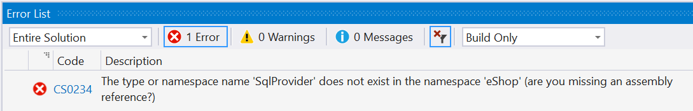

Since you've deleted all the *.csproj* contents, you've lost a project reference specification present in the old project. You just need to add this line to the *.csproj* file to include the project reference back:

```xml
<ItemGroup>
    <ProjectReference Include="..\\eShop.SqlProvider\\eShop.SqlProvider.csproj" />
<ItemGroup>
```

You can also let Visual Studio help you by right-clicking on the **Dependencies** node and selecting **Add Project Reference**. Select the project from the solution and click **OK**:

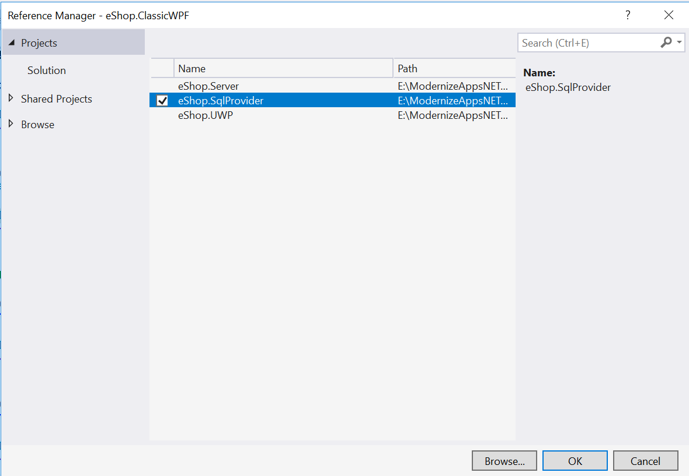

Once you add the missing project reference, the application compiles and runs as expected on .NET.

>[!div class="step-by-step"]
>[Previous](windows-migration.md)
>[Next](deploy-modern-applications.md)
