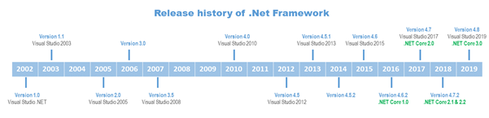
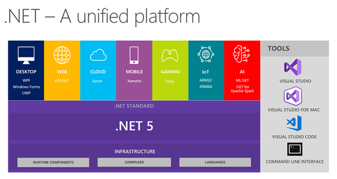
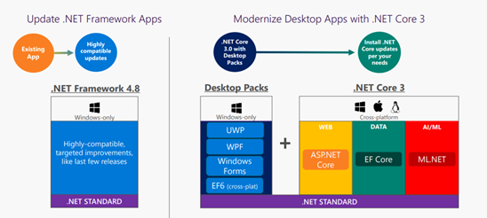

# What's new with .NET for Desktop?

Desktop applications such as Windows Forms and WPF can be built using various .NET platforms: .NET Framework, .NET Core, .NET 5, .NET 6. In this chapter, we'll talk about the history of each platform, explain the differences, and show what new features await desktop developers in .NET 6.

If you have been developing Windows Forms or WPF applications for a long time, you are definitely familiar with .NET Framework. A few years ago, a new .NET Core platform (specifically its 3.0 version) started supporting desktop applications. The next version of .NET Core was rebranded to .NET 5, and now we are releasing its successor, .NET 6. Just as there are different versions of .NET Framework, for example, 4.6, 4.7, and 4.8, there are also different versions of .NET Core: .NET Core 3, .NET 5, and .NET 6. Our recommendation is to stay on the latest version, .NET 6, especially because it is a long-term support version that Microsoft will support for three years.

And now let's look into the history of each platform to understand the differences and benefits of each.

## The motivation behind .NET Core

Since its launch in 2002, .NET Framework has evolved through the years to support many technologies like Windows Forms, ASP.NET, Entity Framework, Windows Store, and many others. All of them are different in nature. Therefore, Microsoft was approaching this evolution by taking parts of the .NET Framework and creating a different application stack for each technology. That way, development capabilities could be customized for the needs of the specific stack, which maximized the potential of every platform. That lead to fragmentation on the versions of the .NET Framework maintained by different independent teams. All these stacks have a common structure, containing an App Model, a Framework, and a Runtime, but they differ in the implementation of each of these parts.

If you're targeting only one of these platforms, you can use this model. However, in many cases you might need more than one target platform in the same solution. For example, your application may have a desktop admin part, a customer-facing web site that shares the back-end logic running on a server, and even a mobile client. In this case, you need a unified coding experience that can span all this .NET verticals.

By the time Windows 8 was released, the concept of Portable Class Libraries (PCLs) was born. Originally, the .NET Framework was designed around the assumption that it would always be deployed as a single unit, so [factoring](https://wikipedia.org/wiki/Decomposition_(computer_science)) wasn't a concern. To face the problem of code sharing between verticals, the driving force was on how to refactor the framework. The idea of contracts is to provide a well-factored API surface area. Contracts are simply assemblies that you compile against and are designed with proper factoring in mind taking care of the dependencies between them.

This leads to reasoning about the API differences between verticals at the assembly level, as opposed to the individual API level that we had before. This aspect enabled a class library experience that can target multiple verticals, also known as portable class libraries.

With PCL, the experience of development is unified across verticals based on the API shape. And the most pressing need to create libraries running on different verticals is also addressed. But there's a great challenge: APIs are only portable when the implementation is moved forward across all the verticals.

A better approach is to unify the implementations across verticals by providing a well-factored implementation instead of a well-factored view. It's a lot simpler to ask each team that owns a specific component to think about how their APIs work across all verticals than trying to retroactively provide a consistent API stack on top. This is where .NET Standard comes in. See details on the next section.

Another large challenge has to do with how the .NET Framework is deployed. The .NET Framework is a machine-wide framework. Any changes made to it affect all applications taking a dependency on it. Although this deployment model has many advantages, such as reducing disk space and centralized access to services, it presents some pitfalls.

To start with, it's difficult for application developers to take a dependency on a recently released framework. They either have to take a dependency on the latest OS or provide an application installer that installs the .NET Framework along with the application. If you are a web developer, you might not even have this option as the IT department establishes the server supported version.

Even if you're willing to go through the trouble of providing an installer to chain in the .NET Framework setup, you may find that upgrading the .NET Framework can break other applications.

Despite the efforts to provide backward compatible versions of the framework, there are compatible changes that can break applications. For example, adding an interface to an existing type can change how this type is serialized and cause breaking problems depending on the existing code. Because the NET Framework installed base is huge, fighting against these breaking scenarios slows down the pace of innovations inside the .NET Framework.

To solve all these issues, Microsoft has developed .NET Core to approach the evolution of the .NET Platform.

## Introduction to .NET Core

The .NET Core is the evolution of Microsoft's .NET technology into a modular, cross-platform, open source, and cloud-ready platform. It runs on Windows, macOS, and Linux with plans to also run on ARM-based architectures like Android and IoT.

The purpose of .NET Core is to provide a unified platform for all types of applications, which includes Windows, cross-platform, and mobile applications. [.NET Standard](../../standard/net-standard.md) enables this by providing shared base APIs, which every application model needs, and excluding any application model-specific API.

This framework gives applications many benefits in terms of efficiency and performance, simplifying the packaging and deployment in the different supported platforms.

The benefits of .NET Core come from these three characteristics:

- **Cross-platform:** It allows application execution on different platforms (Windows, macOS, and Linux).
- **Open source:** .NET Core platform is open source and available through GitHub, fostering transparency and community contributions.
- **Supported:** Microsoft officially supports .NET Core.

Starting with .NET Core 3.0, besides the existing support for web and cloud, there's also support for desktop, IoT, and AI domains. The goal for this framework is impressive: to target every type of .NET development present and future. Microsoft plans to complete this vision with .NET 5 at the end of 2020. The "Core" name was removed to reinforce its uniqueness in the .NET world.

## .NET 5 is .NET Core vNext

.NET 5 is the next step forward with .NET Core. .NET 5 aims to improve .NET in a few key ways:

- Produce a single .NET runtime and framework that can be used everywhere and that has uniform runtime behaviors and developer experiences.
- Expand the capabilities of .NET by taking the best of .NET Core, .NET Framework, Xamarin, and Mono.
- Build that product out of a single code-base that developers (Microsoft and the community) can work on and expand together and that improves all scenarios.

This new release and direction are a game-changer for .NET. With .NET 5, your code and project files will look and feel the same no matter which type of app you're building. You’ll have access to the same runtime, APIs, and language capabilities with each app. This includes new [performance improvements](https://devblogs.microsoft.com/dotnet/performance-improvements-in-net-5/) that get committed to the runtime, practically daily. For more details, see [What's new in .NET 5](../../core/whats-new/dotnet-5.md).

## .NET 6 is the long-term support version

Microsoft switched to a new release cadence where each year in November, a new version of .NET is released.  Every even-numbered version will be a long-term support (LTS) release, meaning that Microsoft will support it for three years.

In .NET 6 we've made numerous improvements in reliability, performance, new APIs, and language features. It is a newer, better, and more stable version for desktop applications and it's going to stick around for a while. So we recommend updating your application to this version, and in the next chapter, you can learn how to do that.

## .NET Framework vs. .NET

So now that you understand the relevance of .NET, you might be wondering what happens with .NET Framework. You could be asking questions like: do you have to abandon it? Is it going to disappear? What are my choices to modernize the applications I have on .NET Framework?

In 2019 the last version of the **.NET Framework - 4.8** was released. It included three major improvements for desktop applications:

- **Modern browser and media controls**: Today, .NET desktop applications use Internet Explorer and Windows Media Player for showing HTML and playing media files. Since these legacy controls don't show the latest HTML or play the latest media files, new controls were added that take advantage of Microsoft Edge and newer media players that support the latest standards.
- **Access to UWP controls**: UWP contains new controls that take advantage of the latest Windows features and touch displays. You don't have to rewrite your applications to use these new features and controls, so you can use these new features in your existing WPF or Windows Forms code.
- **High-DPI improvements**: The resolution of displays is increasing to 4K and 8K resolutions. So, .NET Framework 4.8 adds new HDPI improvements to make sure your existing Windows Forms and WPF applications can look great on these new displays.

Since .NET Framework is installed on millions of machines, Microsoft will continue to support it but won't add new features.

.NET 5 is the open-source, cross-platform, and fast-moving version of .NET family. Because of its side-by-side nature, it can take changes without the fear of breaking any application. This means that .NET will get new APIs and language features over time that .NET Framework won't. Also, **.NET** already has features that were impossible for .NET Framework, such as:

- **Side-by-side versions of .NET supporting Windows Forms and WPF**: This solves the problem of side effects when updating the machine's framework version. Multiple versions of .NET can be installed on the same machine and each application specifies which version of .NET it should use. Even more, now you can develop and run Windows Forms and WPF on top of .NET.
- **Embed .NET directly into an application**: You can deploy .NET as part of your application package. This enables you to take advantage of the latest version, features, and APIs without having to wait for a specific version to be installed on the machine.
- **Take advantage of .NET features**: .NET Core is the fast-moving, open-source version of .NET. Its side-by-side nature enables fast introduction of new innovative APIs and Base Class Libraries (BCL) improvements without the risk of breaking compatibility. Now Windows Forms and WPF applications can take advantage of the latest .NET features, which also includes more fundamental fixes for runtime performance, high-DPI support, and so on.

An essential part of the roadmap for Microsoft was to ease developers to move applications to .NET Core and in later to .NET 5. But if you have existing .NET Framework applications, you shouldn't feel pressured to move to .NET 5. .NET Framework will be fully supported and will always be a part of Windows. However, if you want to use the newest language features and APIs in the future, you'll need to move your applications to .NET.

For your brand-new desktop applications, we recommend starting directly on .NET 5. It's lightweight and cross platform, runs side by side, has high performance, and fits perfectly on containers and microservices architectures.

## .NET Standard vs. PCL

[.NET Standard](../../standard/net-standard.md) is a formal specification of .NET APIs that are intended to be available on all .NET implementations. The motivation behind .NET Standard is establishing greater uniformity in the .NET ecosystem. .NET Standard is a specification of .NET APIs that make up a uniform set of contracts to compile your code against. These contracts are implemented in each .NET flavor, thus enabling portability across different .NET implementations.

.NET Standard enables the following key scenarios:

- Defines uniform set of base class libraries APIs for all .NET implementations to implement, independent of the workload.
- Enables developers to produce portable libraries that are usable across .NET implementations, using this same set of APIs.

.NET Standard is the evolution of PCLs and the following list shows the fundamental differences between .NET Standard and PCLs:

- .NET Standard is a set of curated APIs, picked by Microsoft. PCLs aren't.
- The APIs that a PCL contains are dependent on the platforms that you choose to target when you create it. This makes a PCL only sharable for the specific targets that you choose.
- .NET Standard is platform-agnostic, it can run anywhere, on Windows, macOS, Linux, and so on.
- PCLs can also run cross-platform, but they have a more limited reach. PCLs can only target a limited set of platforms.

## New Desktop features in .NET

### Support for Windows Forms and WPF

Windows Forms and WPF are part of .NET Core since version 3.0. Both presentation frameworks are for Windows only, so they aren't cross platform. You can think of WPF as a rich layer over DirectX and Windows Forms as a thinner layer over GDI+. WPF and Windows Forms do a great job of exposing and exercising much of the desktop application functionality in Windows. So Windows Forms and WPF are available for .NET Core and .NET Framework. Now you can start your new desktop applications targeting .NET Core and migrate your existing ones from .NET Framework to .NET Core.

A new version of .NET Standard, version 2.1, was released at the same time as .NET Core 3.0. As expected, .NET Core 3.x versions support .NET Standard 2.1 and earlier versions.

Also, it's important to notice that both Windows Forms and WPF implementations for .NET Core are open source.

### XAML Islands

[XAML Islands](/windows/apps/desktop/modernize/xaml-islands) is a set of components for developers to use the new Windows 10 controls (UWP XAML controls) in their current WPF, Windows Forms, and native Win32 apps (like MFC). You can have your "islands" of UWP XAML controls wherever you want inside your Win32 apps.

These XAML Islands are possible because Windows 10, version 1903 introduces a set of APIs that allows hosting UWP XAML content in Win32 windows using windows handlers (HWnds). Notice that only apps running on Windows 10 1903 and above can use XAML Islands.

To make it easier to create XAML Islands for Windows Forms and WPF developers, the Windows Community Toolkit introduces a set of .NET wrappers in several NuGet packages. Those wrappers are the wrapped and hosting controls:

- The [WebView](/windows/communitytoolkit/controls/wpf-winforms/webview), [WebViewCompatible](/windows/communitytoolkit/controls/wpf-winforms/webviewcompatible), [InkCanvas](/windows/communitytoolkit/controls/wpf-winforms/inkcanvas), [MediaPlayerElement](/windows/communitytoolkit/controls/wpf-winforms/mediaplayerelement), and [MapControl](/windows/communitytoolkit/controls/wpf-winforms/mapcontrol) wrapped controls wrap some UWP XAML controls into Windows Forms or WPF controls, hiding UWP concepts for those developers.
- The [WindowsXamlHost](/windows/communitytoolkit/controls/wpf-winforms/windowsxamlhost) control for Windows Forms and WPF allows others not-wrapped UWP XAML controls and custom controls can be loaded into a XAML Island.

### Access to all Windows 10 APIs

Windows 10 has a great amount of API available for developers to work with. These APIs give access to a wide variety of functionality like Authentication, Bluetooth, Appointments, and Contacts. Now these APIs are exposed through .NET Core and give Windows developers the chance to create powerful desktops apps using the capabilities present on Windows 10.

### Side-by-side support and self-contained EXEs

The .NET Core deployment model is one of the biggest benefits that Windows desktop developers will experience with .NET Core. The ability to globally install .NET Core provides much of the same central installation and servicing benefits of .NET Framework, while not requiring in-place updates.

When a new .NET Core version is released, you can update each app on a machine as needed without any concern of affecting other applications. New .NET Core versions are installed in their own directories and exist "side-by-side" with each other.

If you need to deploy with isolation, you can deploy .NET Core with your application. .NET Core will bundle your app with the .NET Core runtime as in a single executable.

These deployment options were requested by developers for quite a long time but were difficult to achieve using .NET Framework. The modular architecture used by .NET Core makes these flexible deployment options possible.

### Performance

Since its start, targeting the web and cloud workloads, .NET Core has had performance plugged into its DNA. Server-side code must be performant enough to fulfill high-concurrency scenarios and .NET Core-family platforms including .NET 6 scores today as the best performance web platform in the market.

In .NET 5 and .NET 6 we've refactored old Windows Forms code wich resulted in reducing memory allocations for drawing Forms and Controls, so by simply upgrading from .NET Framework to .NET 6 your applications become much faster. You can take advantage of these performance improvements when you use .NET to build your next generation of desktop applications.

## Benefits of open source

Just a few words about .NET Core being open source. Building a cross-platform stack is something complex that needs the interaction of specialized teams on each of the targeted platforms. This effort needs much collaboration from inside and outside of Microsoft. By making it open source and thus open to public collaboration, you get the ultimate agile development style in place, raising the quality bar since issues are detected by a huge and active community of developers.

This is a key success factor of .NET Core that will continue to speed up the roadmap previously mentioned: To be the single .NET platform that any developer will ever need to build any application.

>[!div class="step-by-step"]
>[Previous](why-modern-applications.md)
>[Next](migrate-modern-applications.md)
