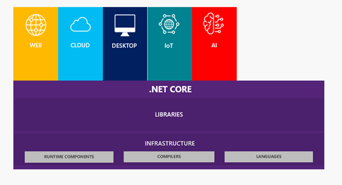

# What&#39;s new with .NET Core 3.0 for Desktop?

## From .NET Framework to .NET Core. The motivation behind .NET **Core**

Since its inception in 2002, .NET Framework has evolved through the years to support many technologies like Windows Forms, ASP.NET, Entity Framework, Windows Store and many others. All of them are very different in nature. Therefore, Microsoft was approaching this evolution by taking parts of the .NET Framework and creating a different application stack for each technology. That way, development capabilities could be customized for the needs of the specific stack, which maximized the potential of every platform. Of course, that lead to fragmentation on the versions of the .NET Framework maintained by different independent teams. All these stacks have a common structure, containing an App Model, a Framework and a Runtime, but they differ in the implementation of each of these parts.

If you are targeting only one of these platforms, you can use this model. However, in many cases you might need more than one target platform in the same solution. For example, your application may have a desktop admin part, a customer-facing web site that shares the backend logic running on a server, and even a mobile client. In this case, you need a unified coding experience that can span all this .NET verticals.

By the time Windows 8 was released, the concept of the Portable Class Libraries (PCL) was born. Originally, the .NET Framework was designed around the assumption that it is always deployed as a single unit, so [factoring](http://en.wikipedia.org/wiki/Decomposition_(computer_science)) was not a concern. To face the problem of code sharing between verticals, the driving force was on how to refactor the framework. The idea of contracts is to provide a well factored API surface area. Contracts are simply assemblies that you compile against and are design with proper factoring in mind taking care of the dependencies between them.

This leads to a reasoning about the API differences between verticals at the assembly level, as opposed to the individual API level that we had before. This aspect enabled a class library experience that can target multiple verticals, also known as portable class libraries.

With PCL the experience of development is unified across verticals base on the API shape and the most pressing need to create libraries running on different verticals is addressed. But there is still a great challenge: APIs are only portable when the implementation is moved forward across all the verticals, and still verticals have independent implementations.

A better approach is to unify the implementations across verticals by providing a well factored implementation instead of a well factored view. It is a lot simpler to ask each team owning a specific component to think about how their APIs work across all verticals than trying to retroactively provide a consistent API stack on top. This is where .NET Standard comes in, see details on next section.

Another big challenge has to do with how the .NET Framework is deployed. The .NET Framework is a machine-wide framework. Any changes made to it affect all applications taking a dependency on it. Although this has many advantages like reducing disk space and centralized access to services, it presents some pitfalls.

To start with, it is difficult for application developers to take a dependency on a recently released framework. You have either to take a dependency on the latest OS or provide an application installer that will install the .NET Framework along with the application. If you are a web developer, you might not even have this option as the IT department establishes the server supported version.

Even if you are willing to go through the trouble of providing an installer in order to chain in the .NET Framework setup, you may find that upgrading the .NET Framework can break other applications.

Despite the efforts to provide backward compatible versions of the framework, there are compatible changes that can break applications. For example, adding an interface to an existing type that can change how this type is serialized and cause breaking problems depending on the existing code. Because NET Framework installed base is huge, fighting against these breaking scenarios slows down the pace of innovations inside the .NET Framework.

To solve all these issues Microsoft has developed .NET Core to approach the evolution of the .NET Platform.

## **Introduction to .NET Core**

The .NET Core is the evolution of Microsoft&#39;s .NET technology into a modular, cross platform, open source and cloud ready platform, which runs on Windows, Mac, and Linux with plans to run also on ARM based architectures like Android and IoT.

The purpose of .NET Core is to provide a unified platform for all types of applications, which includes Windows, cross platform and mobile applications. [.NET Standard library](https://docs.microsoft.com/en-us/dotnet/articles/standard/library) enables this by providing shared base API&#39;s, which every application model needs, and excluding any application model specific API&#39;s.

This framework gives applications many benefits in terms of efficiency and performance, simplifying the packaging and deployment in the different supported platforms.

The benefits of .NET Core come from these three characteristics:

- **Cross-platform:** It allows application execution on different platforms, Windows, macOS and Linux.
- **Open source** : .NET Core platform is open source and available through GitHub, fostering transparency and community contributions.
- **Strongly supported** : Microsoft officially supports .NET Core.

In .NET Core 3.0, there is planned support for developing the following application types:

The goal for this framework is quite impressive: to target every type of .NET development present and future including Desktop, Web, Cloud, Mobile, Gaming, IoT and AI. Microsoft plans to complete this vision with .NET 5 at the end of 2020. Note that the &quot;Core&quot; name was removed to reinforce its uniqueness in the .NET World.

## **.NET Framework vs .NET Core**

Therefore, you now understand the relevance of .NET Core inside the Microsoft strategy for .NET and might be wondering what happens with .NET Framework and asking questions like: do you have to abandon it? Is it going to disappear? What are my choices to modernize the applications I have on .NET Framework?

The good news is Microsoft plans to support both .NET Framework and .NET Core. In fact, the announcement of .NET Core 3.0 was followed by exciting features in .NET Framework regarding modernization, so let&#39;s take a brief look at both paths.

Listening to the .NET Framework developer&#39;s community suggestions Microsoft have addressed three main scenarios for **.NET Core** :

- **Side-by-side versions of .NET supporting Windows Forms and WPF** : This solves the problem of side effects when updating the machine&#39;s framework version. With .NET Core multiple versions can be installed on the same machine and for each application you can specify, which version of .NET Core you&#39;d like it to use. Even more, now you can develop and run Windows Forms and WPF on top of .NET Core.
- **Embed .NET directly into an application** : You can now ship the .NET Core as part of your application package. This enables you to take advantage of the latest version, features, and APIs without having to wait for a specific version to be installed on the machine.
- **Take advantage of .NET Core features** : .NET Core is the fast-moving, open source version of .NET. Its side-by-side nature enables fast introduction of new innovative APIs and BCL (Base Class Libraries) improvements without the risk of breaking compatibility. Now Windows Forms and WPF applications on Windows can take advantage of the latest .NET Core features, which also includes more fundamental fixes for runtime performance, high-DPI support, and so on.

Regarding **.NET Framework 4.8, Microsoft** have addressedthree scenarios:

- **Modern browser and media controls** : Today, .NET desktop applications use Internet Explorer and Windows Media Player for showing HTML and playing media files. Since these legacy controls don&#39;t show the latest HTML or play the latest media files, we are adding new controls that take advantage of Microsoft Edge and newer media players to support the latest standards.
- **Access to UWP Controls** : UWP contains new controls that take advantage of the latest Windows features and touch displays. You will not have to rewrite your applications to use these new features and controls. Now they are available to Windows Forms and WPF so that you can take advantage of these new features in your existing code.
- **High DPI improvements** : The resolution of displays is increasing to 4K and 8K resolutions. We want to make sure your existing Windows Forms and WPF applications can look great on these new displays. That&#39;s why we are adding improvements for HDPI

Since .NET Framework is working on millions of machines, Microsoft will continue to support it but will not be adding new features.

.NET Core is the open source, cross-platform, and fast-moving version of .NET. Because of its side-by-side nature, it can take changes without the fear of breaking any application. This means that .NET Core will get new APIs and language features over time that .NET Framework cannot.

An essential part of this roadmap is to ease developers to move applications to .NET Core. .NET Core 3.0 takes a huge step by adding WPF, Windows Forms and Entity Framework 6 support, and we will keep porting APIs and features to help close the gap and make migration easier for those who chose to do so.

So, if you have existing .NET Framework applications, you should not feel pressured to move to .NET Core. .NET Framework will be fully supported and will always be a part of Windows. However, if in the future you want to use the newest language features and APIs, you&#39;ll need to move your applications to .NET Core.

For your brand-new desktop applications, we recommend starting directly on .NET Core. It is lightweight, runs side by ride, high performance and cross platform and fits perfectly on containers and microservices architectures.

##  .NET Standard versus PCL

The [.NET Standard](https://github.com/dotnet/standard) is a formal specification of .NET APIs that are intended to be available on all .NET implementations. The motivation behind the .NET Standard is establishing greater uniformity in the .NET ecosystem. .NET Standard is a specification of .NET APIs that make up a uniform set of contracts to compile your code against. These contracts are implemented in each .NET flavor, thus enabling portability across different .NET implementations.

The .NET Standard enables the following key scenarios:

- Defines uniform set of base class libraries APIs for all .NET implementations to implement, independent of the workload.
- Enables developers to produce portable libraries that are usable across .NET implementations, using this same set of APIs.
- Reduces or even eliminates conditional compilation of shared source due to .NET APIs, only for OS APIs.

.NET Standard is the evolution of PCLs and here are the main differences between .NET Standard and PCLs:

- .NET Standard is a set of curated APIs, picked by Microsoft, PCLs are not.
- The APIs that a PCL contains is dependent on the platforms that you choose to target when you create a PCL. This makes a PCL only sharable for the specific targets that you choose.
- .NET Standard is platform-agnostic, it can run anywhere, on Windows, Mac, Linux and so on.
- PCLs can also run cross-platform, but they have a more limited reach. PCLs can only target a limited set of platforms.

## **.NET Core 3.0 new Desktop features**

### Support for Windows Forms and WPF

Windows Forms and WPF are part of .NET Core 3.0. Both presentation frameworks are only for the Windows OS and they are not cross-platform. You can think of WPF as a rich layer over DirectX and Windows Forms as a thinner layer over GDI+. WPF and Windows Forms do a great job of exposing and exercising much of the desktop application functionality in Windows. With .NET Core 3.0. Windows Forms and WPF become available for .NET Core as well as for .NET Framework. Now you can start your new desktop applications targeting .NET Core and migrate your existing ones from .NET Framework to .NET Core.

A new version of .NET Standard, version 2.1, was released at the same time. As expected, all new .NET Standard APIs are part of .NET Core 3.0.

You can build desktop applications with C#, F#, and VB with .NET Core 3.0.

Also, important to notice that both Windows Forms and WPF implementations for .NET Core 3 are being open sourced.

### XAML Islands

XAML Islands is a set of components for developers to use the new Windows 10 controls (UWP XAML controls) in their current WPF, Windows Forms, and native Win32 apps (like MFC). You can have your &quot;islands&quot; of UWP XAML controls wherever you want inside your Win32 apps.

These XAML Islands are possible because Windows 10 1903 update introduces a set of APIs that allows hosting UWP XAML content in Win32 windows using windows handlers (HWnds). Notice that only apps running on Windows 10 1903 and above can use XAML Islands.

To facilitate to create XAML Islands for Windows Forms and WPF developers, the Windows Community Toolkit introduces a set of .NET wrappers in several NuGet packages. Those wrappers are the Wrapped Controls and Hosting Controls:

- The WebView, WebViewCompatible, [InkCanvas](https://docs.microsoft.com/windows/communitytoolkit/controls/wpf-winforms/inkcanvas), [MediaPlayerElement](https://docs.microsoft.com/windows/communitytoolkit/controls/wpf-winforms/mediaplayerelement), and [MapControl](https://docs.microsoft.com/en-us/windows/communitytoolkit/controls/wpf-winforms/mapcontrol) wrapped controls wrap some UWP XAML controls into Windows Forms or WPF controls, hiding UWP concepts for those developers.
- The WindowsXamlHost control for Windows Forms and WPF allows others not-wrapped UWP XAML controls and custom controls can be loaded into a XAML Island.

### Access to all Windows 10 APIs

Windows 10 has a great amount of API available for developers to work with. This APIs give access to a wide variety of functionality like Authentication, Bluetooth, Appointments &amp; Contacts. Now these APIs are exposed through .NET Core and give Windows developers the chance to create powerful desktops apps leveraging the capabilities present on Windows 10.

### Side-by-side support and self-contained EXEs

The .NET Core deployment model is one of the biggest benefits that Windows desktop developers will experience with .NET Core 3.0. The ability to globally install .NET Core provides much of the same central installation and servicing benefits of .NET Framework, while not requiring in-place updates.

When a new .NET Core version is released, you can update each app on a machine as needed without any concern of affecting other applications. New .NET Core versions are installed in their own directories and exist &quot;side-by-side&quot; with each other.

If you need to deploy with isolation, you can deploy .NET Core with your application. .NET Core will bundle your app with the .NET Core runtime as in a single executable.

These deployment options were request by developers for quite a long time but were difficult to achieve using .NET Framework. The modular architecture used by .NET Core makes these flexible deployment options possible.

### Performance

Since its inception, targeting the Web and Cloud workloads, .NET Core has had performance plugged into its DNA. Server-side code must be performant enough to fulfill high concurrency scenarios and .NET Core scores today as the best performance web platform in the market.

You can now take advantage of these performance improvements when you use it to build your next generation of desktop applications.

## Benefits of Open Source

Just a few words about .NET Core being open source. Building a cross-platform stack is something very complex that needs the interaction of specialized teams on each of the targeted platforms. This effort needs a lot of collaboration from inside and outside of Microsoft. By making it open source and thus open to public collaboration, you get the ultimate agile development style in place, raising the quality bar since issues are detected by a huge and active community of developers.

This is a key success factor of .NET Core that will continue to speed up the roadmap mentioned above: To be the single .NET platform that any developer will ever need to build any application.
