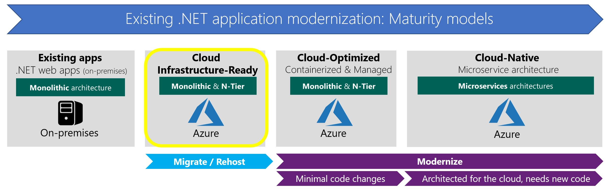
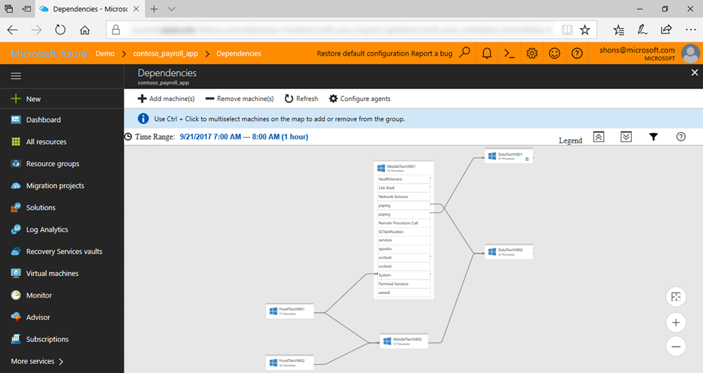
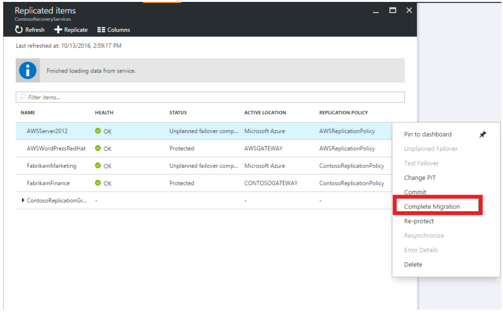

# Lift and shift existing .NET apps to Azure IaaS (Cloud Infrastructure-Ready)

> Vision: As a first step, to reduce your on-premises investment and total cost of hardware and networking maintenance, simply rehost your existing applications in the cloud.

Before getting into *how* to migrate your existing applications to the Azure infrastructure as a service (IaaS) platform, it's important to analyze the reasons *why* you'd want to migrate directly to IaaS in Azure. The scenario at this modernization maturity level essentially is to start using VMs in the cloud, instead of continuing to use your current, on-premises infrastructure.

Another point to analyze is *why* you might want to migrate to pure IaaS cloud instead of just adding more advanced managed services in Azure. Determine what cases might require IaaS in the first place.

Figure 2-1 positions Cloud Infrastructure-Ready applications in the modernization maturity levels:

**Figure 2-1.** Positioning Cloud Infrastructure-Ready applications

## Why migrate existing .NET web applications to Azure IaaS

The main reason to migrate to the cloud, even at an initial IaaS level, is to achieve cost reductions. By using more managed infrastructure services, your organization can lower its investment in hardware maintenance, server or VM provisioning and deployment, and infrastructure management.

After you make the decision to move your apps to the cloud, the main reason why you might choose IaaS instead of more advanced options like PaaS is simply that the IaaS environment will be more familiar. Moving to an environment that's similar to your current, on-premises environment offers a lower learning curve, which makes it the quickest path to the cloud.

However, taking the quickest path to the cloud doesn't mean that you will gain the most benefit from having your applications running in the cloud. Any organization will gain the most significant benefits from a cloud migration at the already introduced Cloud-Optimized and Cloud-Native maturity levels.

It also has become evident that applications are easier to modernize and rearchitect in the future when they are already running in the cloud, even on IaaS. Application data migration has already been achieved. Also, your organization will have gained the skills required for working in the cloud and made the shift to operating in a "cloud culture."

## When to migrate to IaaS instead of to PaaS

The next sections discuss Cloud-Optimized applications that are mostly based on PaaS platforms and services. These apps give you the most benefits from migrating to the cloud.

If your goal is simply to move existing applications to the cloud, first, identify existing applications that would not require substantial modification to run in Azure App Service. These apps should be the first candidates for Cloud-Optimized.

Then, for the apps that still cannot move to Windows Containers and PaaS such as App Service or orchestrators like Azure Kubernetes Service, migrate those apps to simple plain VMs (IaaS).

But, keep in mind that correctly configuring, securing, and maintaining VMs requires much more time and IT expertise compared to using PaaS services in Azure. If you are considering Azure Virtual Machines, make sure that you take into account the ongoing maintenance effort required to patch, update, and manage your VM environment. Azure Virtual Machines is IaaS.

## Use Azure Migrate to analyze and migrate your existing applications to Azure

Migrating to the cloud doesn't have to be difficult. But many organizations struggle to get started - to get deep visibility into the environment and the tight interdependencies between applications, workloads, and data. Without that visibility, it can be difficult to plan the path forward. Without detailed information on what's required for a successful migration, you can't have the right conversations within your organization. You don't know enough about the potential cost benefits, or whether workloads could just lift-and-shift or would require significant rework to migrate successfully. No wonder many organizations hesitate.

[Azure Migrate](https://aka.ms/azuremigrate) is a new service that provides the guidance, insights, and mechanisms needed to assist you in migrating to Azure. Azure Migrate provides:

- Discovery and assessment for on-premises virtual machines

- Inbuilt dependency mapping for high-confidence discovery of multi-tier applications

- Intelligent right sizing to Azure virtual machines

- Compatibility reporting with guidelines for remediating potential issues

- Integration with Azure Database Management Service for database discovery and migration

Azure Migrate gives you confidence that your workloads can migrate with minimal impact to the business and run as expected in Azure. With the right tools and guidance, you can achieve maximum return on investment while assuring that critical performance and reliability needs are met.

Figure 2-2 shows you the built-in dependency mapping for all server and application connections performed by Azure Migrate.

**Figure 2-2.** Positioning Cloud Infrastructure-Ready applications

## Use Azure Site Recovery to migrate your existing VMs to Azure VMs

As part of the end-to-end [Azure Migrate](https://aka.ms/azuremigrate), [Azure Site Recovery](/azure/site-recovery/site-recovery-overview) is a tool that you can use to easily migrate your web apps to VMs in Azure. You can use Site Recovery to replicate on-premises VMs and physical servers to Azure, or to replicate them to a secondary on-premises location. You can even replicate a workload that's running on a supported Azure VM, on an on-premises *Hyper-V* VM, on a *VMware* VM, or on a Windows or Linux physical server. Replication to Azure eliminates the cost and complexity of maintaining a secondary datacenter.

Site Recovery is also made specifically for hybrid environments that are partly on-premises and partly on Azure. Site Recovery helps ensure business continuity by keeping your apps that are running on VMs and on-premises physical servers available if a site goes down. It replicates workloads that are running on VMs and physical servers so that they remain available in a secondary location if the primary site isn't available. It recovers workloads to the primary site when it's up and running again.

Figure 2-3 shows the execution of multiple VM migrations by using Azure Site Recovery.

**Figure 2-3.** Positioning Cloud Infrastructure-Ready applications

### Additional resources

- **Azure Migrate Datasheet**

    <https://aka.ms/azuremigration\_datasheet>

- **Azure Migrate**

    <https://aka.ms/azuremigrate>

- **Azure migration and modernization center**

    <https://azure.microsoft.com/migration/>

- **Migrate to Azure with Site Recovery**

    [https://docs.microsoft.com/azure/site-recovery/site-recovery-migrate-to-azure](/azure/site-recovery/site-recovery-migrate-to-azure)

- **Azure Site Recovery service overview**

    [https://docs.microsoft.com/azure/site-recovery/site-recovery-overview](/azure/site-recovery/site-recovery-overview)

- **Migrating VMs in AWS to Azure VMs**

    [https://docs.microsoft.com/azure/site-recovery/site-recovery-migrate-aws-to-azure](/azure/site-recovery/site-recovery-migrate-aws-to-azure)

>[!div class="step-by-step"]
>[Previous](index.md)
>[Next](migrate-your-relational-databases-to-azure.md) <!-- Next Chapter -->
