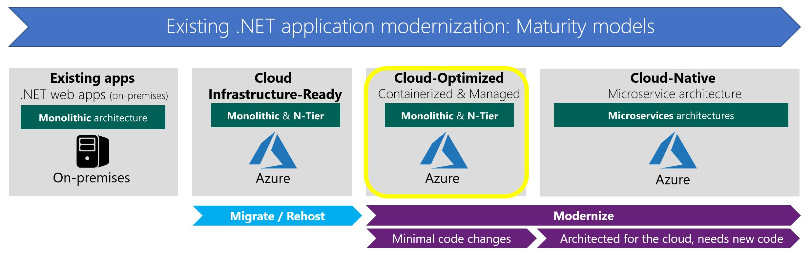

# Modernize existing .NET apps to Cloud-Optimized applications

> Vision: Modernize your existing .NET Framework applications to Cloud-Optimized applications to drastically improve your deployment agility, so you can ship faster and lower application's delivery costs.

To take advantage of the benefits of the cloud and new technologies like containers, you should at least partially modernize your existing .NET applications. Ultimately, modernizing your enterprise applications will lower your total cost of ownership.

Partially modernizing an app doesn't necessarily mean a full migration and rearchitecture. You can initially modernize your existing applications with important but easy to do modernization. You can maintain your current code base, written in existing .NET Framework versions, with any Windows and IIS dependencies. Figure 4-1 highlights how Cloud-Optimized apps are positioned in Azure application modernization maturity models.

**Figure 4-1.** Positioning Cloud-Optimized applications

>[!div class="step-by-step"]
>[Previous](../migrate-your-relational-databases-to-azure.md)
>[Next](reasons-to-modernize-existing-net-apps-to-cloud-optimized-applications.md)
