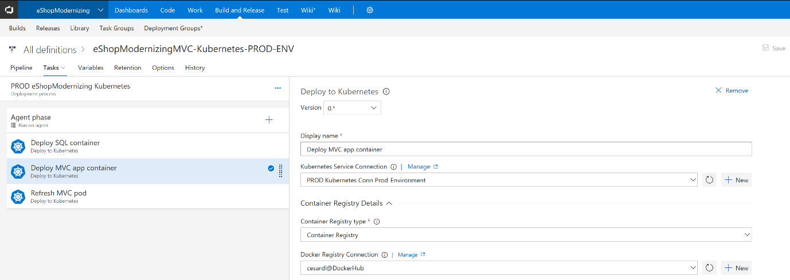

# Modernize your app's lifecycle with CI/CD pipelines and DevOps tools in the cloud

Today's businesses need to innovate at a rapid pace to be competitive in the marketplace. Delivering high-quality, modern applications requires DevOps tools and processes that are critical to implement this constant cycle of innovation. With the right DevOps tools, developers can streamline continuous deployment and get innovative applications into the hands of users more quickly.

Although continuous integration and deployment practices are well established, the introduction of containers introduces new considerations, particularly when you are working with multi-container applications.

Azure DevOps Services supports continuous integration and deployment of multi-container applications to various environments through the official Azure DevOps Services deployment tasks:

- [Deploy to an Azure Web App for Containers](/azure/devops/pipelines/apps/cd/deploy-docker-webapp?tabs=dotnet-core)

- [Deploy to Azure Kubernetes Service](/azure/devops/pipelines/apps/cd/deploy-aks?tabs=dotnet-core)

But you can also deploy to [Docker Swarm](https://blog.jcorioland.io/archives/2016/11/29/full-ci-cd-pipeline-to-deploy-multi-containers-application-on-azure-container-service-docker-swarm-using-visual-studio-team-services.html) or DC/OS by using Azure DevOps Services script-based tasks.

To continue facilitating deployment agility, these tools provide excellent dev-to-test-to-production deployment experiences for container workloads, with a choice of development and CI/CD solutions.

Figure 4-12 shows a continuous deployment pipeline that deploys to a Kubernetes cluster in Azure Container Service.

**Figure 4-12.** Azure DevOps Services continuous deployment pipeline, deploying to a Kubernetes cluster

>[!div class="step-by-step"]
>[Previous](modernize-your-apps-with-monitoring-and-telemetry.md)
>[Next](migrate-to-hybrid-cloud-scenarios.md)
