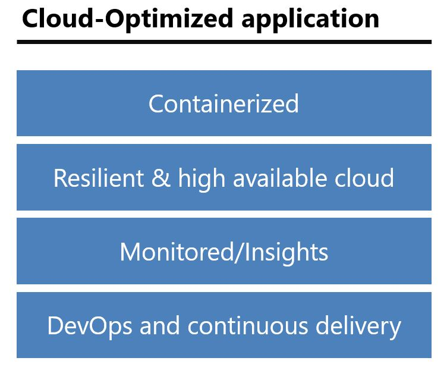

# Reasons to modernize existing .NET apps to Cloud-Optimized applications

With a Cloud-Optimized application, you can rapidly and repeatedly deliver reliable applications to your customers. You gain essential agility and reliability by deferring much of the operational complexity of your app to the platform.

If you can't get your applications to market quickly, by the time you ship your app, the market you were targeting will have evolved. You might be too late, no matter how well the application was architected or engineered. You might be failing or not reaching your full potential because you can't sync app delivery with the needs of the market.

The need for continuous business innovation pushes development and operations teams to the limit. The only way to achieve the agility you need in continuous business innovation is by modernizing your applications with technologies like containers and specific Cloud-Optimized application principles.

The bottom line is that when an organization builds and manages applications that are Cloud-Optimized, it can put solutions in the hands of customers sooner and bring new ideas to market when they are relevant.

## Cloud-Optimized application principles and tenets

Improvements in the cloud are mostly focused on meeting two goals: Reduce costs and improve business growth by improving agility. These goals are achieved by simplifying processes and reducing friction when you release and ship applications.

Your application is Cloud-Optimized if you can-in an agile manner-develop your app autonomously from other on-premises apps, and then release, deploy, autoscale, monitor, and troubleshoot your app in the cloud.

The key is *agility*. You can't ship with agility unless you reduce to an absolute minimum any deployment-to-production issues and dev/test environment issues. Containers (specifically, Docker, as a de facto standard) and managed services were designed specifically for this purpose.

To achieve agility, you also need automated DevOps processes that are based on CI/CD pipelines that release to scalable platforms in the cloud. CI/CD platforms (like Azure DevOps Services or Jenkins) that deploy to a scalable and resilient cloud platform (like Azure App Service or Azure Kubernetes Service) are key technologies for achieving agility in the cloud.

The following list describes the main tenets or practices for Cloud-Optimized applications. Note that you can adopt all or only some of these principles, in a progressive or incremental approach:

- **Containers**. Containers give you the ability to include application dependencies with the application itself. Containerization significantly reduces the number of issues you might encounter when you deploy to production environments or test in staging environments. Ultimately, containers improve the agility of application delivery.

- **Resilient and scalable cloud**. The cloud provides a platform that is managed, elastic, scalable, and resilient. These characteristics are fundamental to gain cost improvements and ship highly available and reliable applications in a continuous delivery. Managed services like managed databases, managed cache as a service (CaaS), and managed storage are fundamental pieces in alleviating the maintenance costs of your application.

- **Monitoring**. You can't have a reliable application without having a good way to detect and diagnose exceptions and application performance issues. You need to get actionable insights through application performance management and instant analytics.

- **DevOps culture and continuous delivery**. Adopting DevOps practices requires a cultural change in which teams no longer work in independent silos. CI/CD pipelines are possible only when there is an increased collaboration between development and IT operations teams, supported by containers and CI/CD tools.

Figure 4-2 shows the main optional pillars of a Cloud-Optimized application. The more pillars you implement, the readier your application will be to succeed in meeting your customers' expectations.

**Figure 4-2.** Main pillars of a Cloud-Optimized application

To summarize, a Cloud-Optimized application is an approach to building and managing applications that takes advantage of the cloud computing model, while using a combination of containers, managed cloud infrastructure, resilient application techniques, monitoring, continuous delivery, and DevOps, all without the need to rearchitect and recode your existing applications.

Your organization can adopt these technologies and approaches gradually. You don't have to embrace all of them, all at once. You can adopt them incrementally, depending on enterprise priorities and user needs.

## Benefits of a Cloud-Optimized application

You can get the following benefits by converting an existing application to a Cloud-Optimized application (without rearchitecting or coding):

- **Lower costs, because the managed infrastructure is handled by the cloud provider**. Cloud-Optimized applications get the benefits of the cloud by using the cloud's out-of-the-box elasticity, autoscale, and high availability. Benefits are related not only to the compute features (VMs and containers), but also depend on the resources in the cloud, like DBaaS, CaaS, and any infrastructure an application might needed.

- **Resilient application and infrastructure**. When you migrate to the cloud, you need to embrace transient failures; failures will occur in the cloud. Also, cloud infrastructure and hardware are "replaceable," which increases opportunities for transient downtime. At the same time, inner cloud capabilities and certain application development techniques that implement resiliency and automate recovery make it much easier to recover from unexpected failures in the cloud.

- **Deeper insights into application performance**. Cloud monitoring tools like Azure Application Insights provide visualization for health management, logging, and notifications. Audit logs make applications easy to debug and audit, fundamental for a reliable cloud application.

- **Application portability, with agile deployments**. Containers (either Linux or Windows containers based on Docker Engine) offer the best solution to avoiding a cloud-locked application. By using containers, Docker hosts, and multi-cloud orchestrators, you can easily move from one environment or cloud to another. Containers eliminate the friction that typically occurs in deployments to any environment (stage/test/production).

All of these benefits ultimately provide key cost reductions for your end-to-end application lifecycle.

In the following sections, these benefits are explained in more detail, and are linked to specific technologies.

>[!div class="step-by-step"]
>[Previous](index.md)
>[Next](microsoft-technologies-in-cloud-optimized-applications.md)
