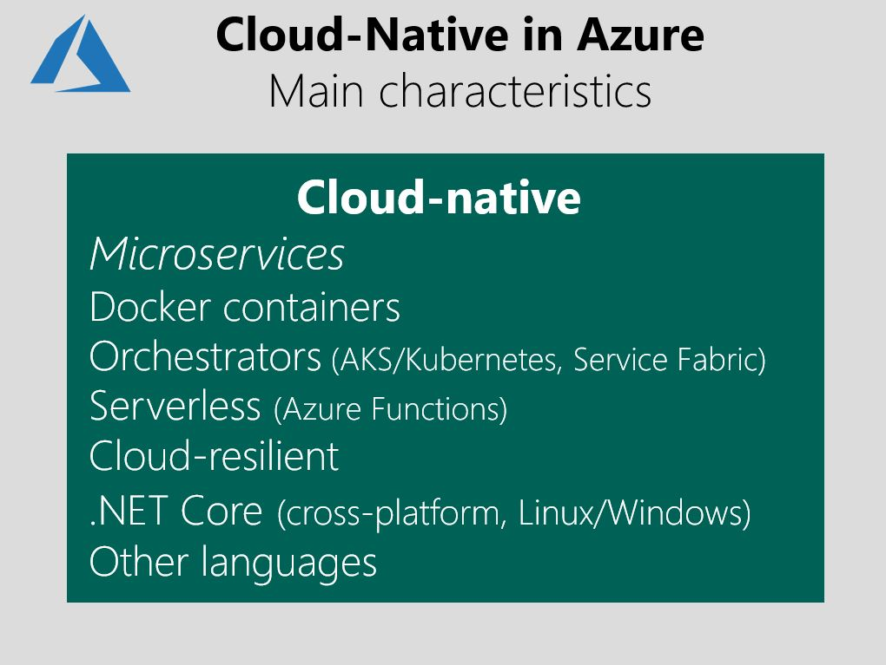

# What about Cloud-Native applications?

Although [Cloud-Native](https://azure.microsoft.com/overview/cloudnative/) applications are not the main focus of this guide, it's helpful to have an understanding of this modernization maturity level, and to distinguish it from Cloud-Optimized applications.

Figure 4-3 positions Cloud-Native apps in the application modernization maturity levels:

**Figure 4-3.** Positioning Cloud-Native applications

The Cloud-Native modernization maturity level usually requires new development investments. Moving to the Cloud-Native level typically is driven by business need to modernize applications as much as possible to drastically improve scale in large applications by creating autonomous subsystems (microservices) that can be deployed and scale independently from other areas of the application while lowering costs in the long term and increase evolution agility of those autonomous app’s parts that provide significant compete advantages.

The main pillars of Cloud-Native applications are based on microservices architecture approaches, which can evolve with agility and scale to limits that would be difficult to achieve in a monolithic architecture, deployed to either on-premises or cloud environment.

Figure 4-4 shows the main characteristics of the Cloud-Native model.

**Figure 4-4.** Cloud-Native characteristics

In addition, you can extend basic modern web apps and cloud-native apps by adding other services, like artificial intelligence (AI), machine learning (ML), and IoT. You might use any of these services to extend any of the possible Cloud-Optimized approaches.

The fundamental difference in applications at the Cloud-Native level is in the application architecture. Cloud-native applications are, by definition, apps that are based on microservices. Cloud-native apps require special architectures, technologies, and platforms, compared to a monolithic web application or traditional N-Tier application.

## Cloud-native applications details

Cloud-Native is a more advanced or mature state for large and mission-critical applications. Cloud-Native applications usually require architecture and design that are created from scratch instead of by modernizing existing applications. The key difference between a Cloud-Native application and a simpler Cloud-Optimized web app is the recommendation to use microservices architectures in a cloud-native approach. Cloud-Optimized apps can also be monolithic web apps or N-Tier apps.

The [Twelve-Factor App](https://12factor.net/) (a collection of patterns that are closely related to microservices approaches) is also considered a requirement for cloud-native application architectures.

The [Cloud Native Computing Foundation (CNCF)](https://www.cncf.io/) is a primary promoter of cloud-native principles. Microsoft is a [member of the CNCF](https://azure.microsoft.com/blog/announcing-cncf/).

For detailed guidance on how to design and develop cloud-native applications, read the following free e-books:

* [Architecting Cloud-Native .NET Applications for Azure](../../cloud-native/introduction.md)
* [.NET Microservices: Architecture for containerized .NET applications](../../microservices/index.md).

The most important factor to consider if you migrate a full application to the cloud-native model is that you must rearchitect to a microservices-based architecture. This approach clearly requires a significant investment in development because of the large refactoring process involved. This option usually is chosen for mission-critical applications that need new levels of scalability and long-term agility. But, you could start moving toward cloud-native by adding microservices for just a few new scenarios, and eventually refactor the application fully as microservices. This step is an incremental approach that is the best option for some scenarios.

## What about microservices?

Understanding microservices and how they work is important when you are considering cloud-native applications for your organization.

The microservices architecture is an advanced approach that you can use for applications that are created from scratch or when you evolve existing applications toward cloud-native applications. You can start by adding a few microservices to existing applications to learn about the new microservices paradigms. But clearly, you need to architect and code, especially for this type of architectural approach.

However, microservices are not mandatory for any new or modern application. Microservices are not a "magic bullet," and they aren't the single, best way to create every application. How and when you use microservices depends on the type of application that you need to build.

The microservices architecture is becoming the preferred approach for distributed and large or complex mission-critical applications that are based on multiple, independent subsystems in the form of autonomous services. In a microservices-based architecture, an application is built as a collection of services that can be independently developed, tested, versioned, deployed, and scaled. This approach can include any related, autonomous database per microservice.

For a detailed look at a microservices architecture that you can implement by using .NET, see the downloadable PDF e-book [.NET microservices: Architecture for containerized .NET applications](https://aka.ms/microservicesebook). The guide also is available [online](../../microservices/index.md).

But even in scenarios in which microservices offer powerful capabilities-independent deployment, strong subsystem boundaries, and technology diversity-they also raise many new challenges. The challenges are related to distributed application development, such as fragmented and independent data models; achieving resilient communication between microservices; the need for eventual consistency; and operational complexity. Microservices introduce a higher level of complexity compared to traditional monolithic applications.

Because of the complexity of a microservices architecture, only specific scenarios and certain application types are suitable for microservice-based applications. These include large and complex applications that have multiple, evolving subsystems. In these cases, it's worth investing in a more complex software architecture, for increased long-term agility and more efficient application maintenance. But for less complex scenarios, it might be better to continue with a monolithic application approach or simpler N-Tier approaches.

As a final note, even at the risk of being repetitive about this concept, you shouldn't look at using microservices in your applications as "all-in or nothing at all." You can extend and evolve existing monolithic applications by adding new, small scenarios based on microservices. You don't need to start from scratch to start working with a microservices architecture approach. In fact, we recommend that you evolve from using an existing monolithic or N-Tier application by adding new scenarios. Eventually, you can break down the application into autonomous components or microservices. You can start evolving your monolithic applications in a microservices direction, step by step.

In any case, the rest of this present guidance focuses most of all on "no microservices-based apps" because this guidance is mainly targeting the modernization of existing apps that usually have monolithic or N-Tier architectures.

> [!div class="step-by-step"]
> [Previous](microsoft-technologies-in-cloud-optimized-applications.md)
> [Next](deploy-existing-net-apps-as-windows-containers.md)
