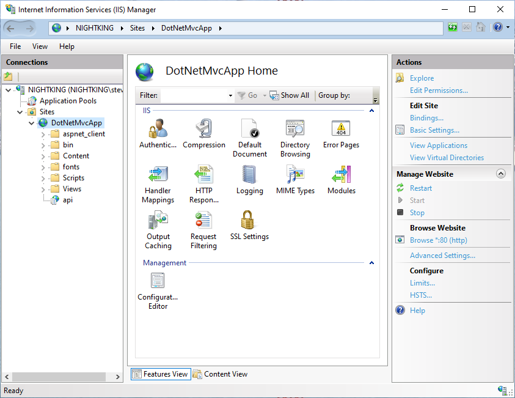
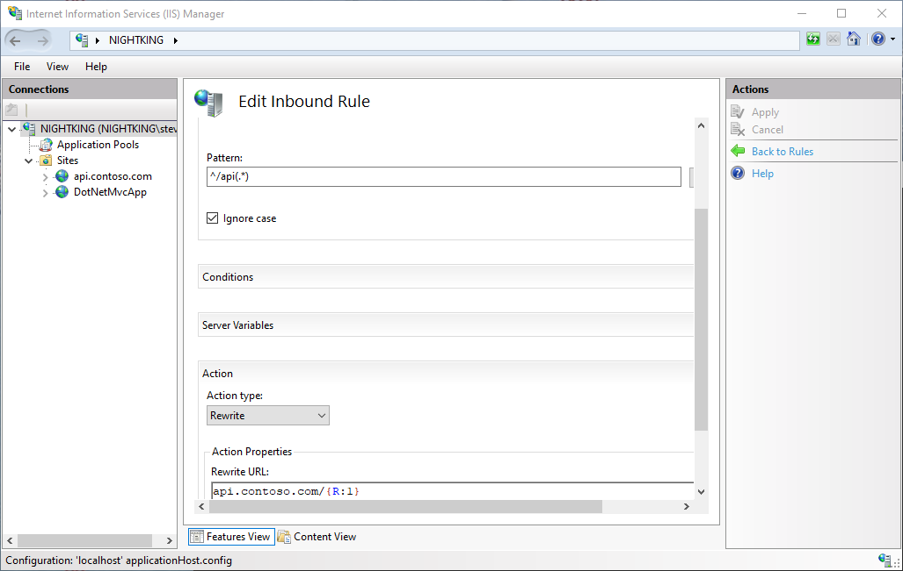

# Deployment scenarios when migrating to ASP.NET Core

Existing ASP.NET MVC and Web API apps run on IIS and Windows. Large apps may require a phased or side-by-side approach when porting to ASP.NET Core. In previous chapters, you learned a number of strategies for migrating large .NET Framework apps to ASP.NET Core in phases. In this chapter, you will see how different deployment scenarios can be achieved when there is a need to maintain the original app in production while migrating portions of it.

## Split a large web app

Consider the common scenario of a large web app that currently is hosted on IIS in a single web site. Within the large app, functionality is segmented into different routes and/or directories. The app is a mix of MVC views and API endpoints. The MVC routes include many different paths based on functionality and all start from the root of the app using the standard `/{controller}/{action}/{id?}` route template. The API endpoints follow a similar pattern, but are all under an `/api` root.

Assuming the task of porting the app is split such that either the MVC functionality or the API functionality is migrated to ASP.NET Core first, how would the original site continue to function seamlessly with the new ASP.NET Core app running somewhere else? Users of the system should continue to see the same URLs they did prior to the migration, unless it's absolutely necessary to change them.

Fortunately, IIS is a feature-rich web server, and two features it has are [URL Rewrite module](/iis/extensions/url-rewrite-module/url-rewrite-module-video-walkthrough) and [Application Request Routing](/iis/extensions/planning-for-arr/application-request-routing-version-2-overview). Using these features, IIS can act as a [reverse proxy](/iis/extensions/url-rewrite-module/reverse-proxy-with-url-rewrite-v2-and-application-request-routing), routing client requests to the appropriate back-end web app. To configure IIS as a reverse proxy, check the **Enable proxy** checkbox in the Application Request Routing feature, then add a URL Rewrite rule like this one:

```xml
<rule name="NetCoreProxy">
  <match url="(.*)> />
  <action type="Rewrite" url="http://servername/{R:1}" />
</rule>
```

As a reverse proxy, IIS can route traffic matching certain patterns to entirely separate apps, potentially on different servers.

Using just the URL Rewrite module (perhaps combined with host headers), IIS can easily support multiple web sites, each potentially running different versions of .NET. A large web app might be deployed as a collection of individual sites, each responding to different IP addresses and/or host headers, or as a single web site with one or more sub-applications in it responding to certain URL paths (which doesn't even require URL Rewrite).

> [!IMPORTANT]
> Subdomains typically refer to the portion of a domain preceding the top two levels. For example, in the domain `api.contoso.com`, `api` is a subdomain of the `contoso.com` domain (which itself is composed of the `contoso` domain name and the `.com` top-level domain or TLD). URL paths refer to portion of the URL that follows the domain name, starting with a `/`. The URL `https://contoso.com/api` has a path of `/api`.

There are pros and cons to using the same or different subdomains (and domains) to host a single app. Features like cookies and intra-app communication using mechanisms like [CORS](/aspnet/core/security/cors) may require more configuration to work properly in distributed apps. However, apps that use different subdomains can more easily use DNS to route requests to entirely different network destinations, and so can more easily be deployed to many different servers (virtual or otherwise) without the need for IIS to act as a reverse proxy.

In the example described above, assume the API endpoints are designated as the first part of the app to be ported to ASP.NET Core. In this case, a new ASP.NET Core app is created and hosted in IIS as a separate web *application* within the existing ASP.NET MVC web *site*. Since it will be added as a child of the original web site and will be named *api*, its default route should no longer begin with `api/`. Keeping this would result in it matching URLs of the form `/api/api/endpoint`.

Figure 5-1 shows how the ASP.NET Core 2.1 *api* app appears in IIS Manager as a part of the existing *DotNetMvcApp* site.



**Figure 5-1**. .NET Framework Site with .NET Core app in IIS.

The *DotNetMvcApp* site is hosted as an MVC 5 app running on .NET Framework 4.7.2. It has its own IIS app pool configured in integrated mode and running .NET CLR version 4.0.30319. The *api* app is an ASP.NET Core app running on .NET Framework 4.6.1 (`net461`). It was added to the *DotNetMvcApp* as a new IIS app and configured to use its own Application Pool. Its Application Pool is also running in integrated mode but is configured with a .NET CLR version of **No Managed Code** since it will be executed using the [ASP.NET Core Module](/aspnet/core/host-and-deploy/aspnet-core-module?preserve-view=true&view=aspnetcore-2.1). The version of the ASP.NET Core app is just an example. It could also be configured to run on .NET Core 3.1 or .NET 5. Though at that point, it would no longer be able to target .NET Framework libraries (see [Choose the Right .NET Core Version](choose-net-core-version.md))

Configured in this manner, the only change that must be made in order for the ASP.NET Core app's APIs to be routed properly is to change its default route template from `[Route("[api/controller]")]` to `[Route("[controller]")]`.

Alternately the ASP.NET Core app can be another top-level web site in IIS. In this case, you can configure the original site to use a rewrite rule (with [URL Rewrite](https://www.iis.net/downloads/microsoft/url-rewrite)) that will redirect to the other app if the path starts with `/api`. The ASP.NET Core app can use a different host header for its route so that it doesn't conflict with the main app but can still respond to requests using root-based routes.

As an example, the same ASP.NET Core app used in Figure 5-1 can be deployed to another folder configured as an IIS web site. The site should use an app pool configured just as before, with **No Managed Code**. Configure its bindings to respond to a unique host name on the server, such as `api.contoso.com`. To configure URL Rewrite to rewrite requests matching `/api` just add a new inbound rule at the IIS server (or individual site) level. Match the pattern `^/api(.*)` and specify an Action type of `Rewrite` and a Rewrite URL of `api.contoso.com/{R:1}`. The combination of using `(.*)` in the matching pattern and `{R:1}` in the rewrite URL will ensure the rest of the path gets used with the new URL. With this in place, separate sites on the same IIS server can coexist running separate versions of .NET, but they can be made to appear to the Internet as one web app. Figure 5-2 shows the rewrite rule as configured in IIS with the separate web site.



**Figure 5-2**. Rewrite rule to rewrite subfolder requests to another web site.

If your app requires single sign-on between different sites or apps within IIS, refer to the documentation on [how to share authentication cookies among ASP.NET apps](/aspnet/core/host-and-deploy/iis/) for detailed instructions on supporting this scenario.

## Summary

A common approach to porting large apps from .NET Framework to ASP.NET Core is to choose individual portions of the app to migrate one by one. As each piece of the app is ported, the entire app remains running and usable, with some parts of it running in its original configuration and other parts running on some version of .NET Core. By following this approach, a large app migration can be performed incrementally. This approach results in limiting risk by providing more rapid feedback and reducing total surface area involved in testing. It also allows for more rapid realization of benefits of .NET Core, such as performance increases. Although ASP.NET Core apps are no longer required to be hosted on IIS, IIS remains a very flexible and powerful web server that can be configured to support a variety of hosting scenarios involving both .NET Framework and ASP.NET Core apps on the same IIS instance or even hosted on different servers.

## References

- [Host ASP.NET Core on Windows with IIS](/aspnet/core/host-and-deploy/iis/)
- [URL Rewrite module and Application Request Routing](/iis/extensions/url-rewrite-module/reverse-proxy-with-url-rewrite-v2-and-application-request-routing)
- [URL Rewrite](https://www.iis.net/downloads/microsoft/url-rewrite)
- [ASP.NET Core Module](/aspnet/core/host-and-deploy/aspnet-core-module?preserve-view=true&view=aspnetcore-2.1)
- [Share authentication cookies among ASP.NET apps](/aspnet/core/host-and-deploy/iis/)
- [Samples used in this section](https://github.com/ardalis/MigrateDotNetWithIIS)

>[!div class="step-by-step"]
>[Previous](more-migration-scenarios.md)
>[Next](summary.md)
