# Example migration of eShop to ASP.NET Core

In this chapter, you'll see how to migrate a .NET Framework app to .NET Core. The chapter examines a sample online store app written for ASP.NET MVC 5. The app will use many of the concepts and tools described earlier in this book. You'll find the starting point app in the [*eShopModernizing* GitHub repository](https://github.com/dotnet-architecture/eShopModernizing). There are several different starting point apps. This chapter focuses on the *eShopLegacyMVCSolution*.

The initial version of the project is shown in Figure 4-1. It's a fairly standard ASP.NET MVC 5 app.

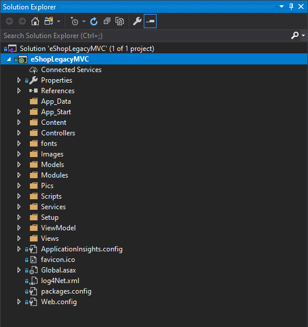

**Figure 4-1.** The *eShopModernizing* MVC sample project structure.

This chapter demonstrates how to perform many of the upgrade steps by hand. Alternatively, you can use the [.NET Upgrade Assistant tool](https://aka.ms/dotnet-upgrade-assistant) to perform many of the initial steps, like converting the project file, changing the target framework, and updating NuGet packages.

## Run *ApiPort* to identify problematic APIs

The first step in preparing to migrate is to run the *ApiPort* tool. The tool identifies how many .NET Framework APIs the app calls and how many of these have .NET Standard or .NET Core equivalents. Focus primarily on your own app's logic, not third-party dependencies, and pay attention to `System.Web` dependencies that will need to be ported. The ApiPort tool was introduced in the last chapter on [understanding and updating dependencies](understand-update-dependencies.md). Note that currently it requires Visual Studio 2019; Visual Studio 2022 support is planned.

After [installing and configuring the *ApiPort* tool](../../standard/analyzers/portability-analyzer.md), run the analysis from within Visual Studio, as shown in Figure 4-2.

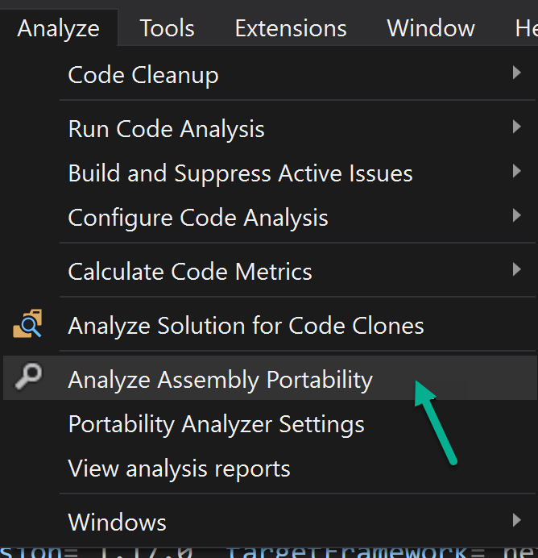

**Figure 4-2.** Analyze assembly portability in Visual Studio.

Choose the web project's assembly from the project's *bin* folder, as shown in Figure 4-3.

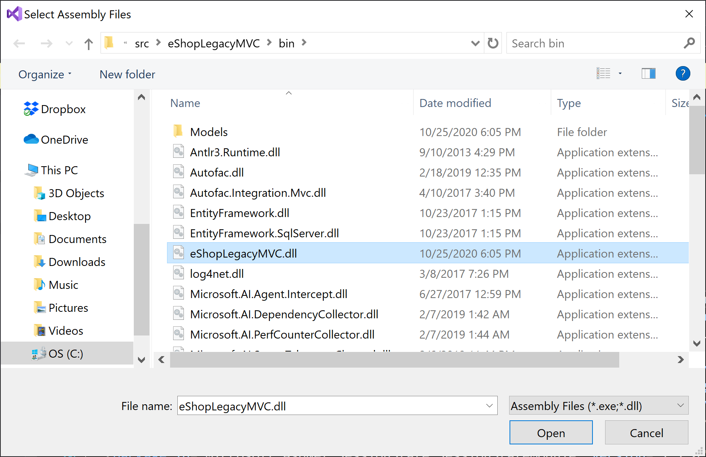

**Figure 4-3.** Choose the project's web assembly.

If your solution includes several projects, you can choose all of them. The *eShop* sample includes just a single MVC project.

Once the report is generated, open the file and review the results. The summary provides a high-level view of what percentage of .NET Framework calls your app is making have compatible versions. Figure 4-4 shows the summary for the *eShop* MVC project.

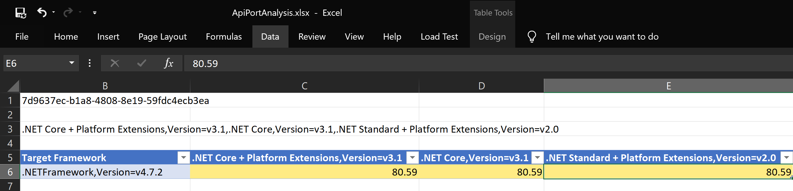

**Figure 4-4.** ApiPort summary.

For this app, about 80 percent of the .NET Framework calls are compatible. 20 percent of the calls need to be addressed during the porting process. Viewing the details reveals that all of the incompatible calls are part of `System.Web`, which is an expected incompatibility. The dependencies on `System.Web` calls will be addressed when the app's controllers and related classes are migrated in a later step. Figure 4-5 lists some of the specific types found by the tool:

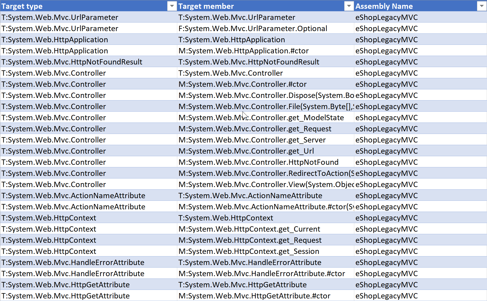

**Figure 4-5.** *ApiPort* incompatible type details.

Most of the incompatible types refer to `Controller` and various related attributes that have equivalents in ASP.NET Core.

## Update project files and NuGet reference syntax

Next, migrate from the older *.csproj* file structure to the newer, simpler structure introduced with .NET Core. In doing so, you'll also migrate from using a *packages.config* file for NuGet references to using `<PackageReference>` elements in the project file. Old-style project files may also use `<PackageReference>` elements, so it usually makes sense to migrate all NuGet package references to this format first, before upgrading to the new project file format.

The original project's *eShopLegacyMVC.csproj* file is 418 lines long. A sample of the project file is shown in Figure 4-6. To offer a sense of its overall size and complexity, the right side of the image contains a miniature view of the entire file.

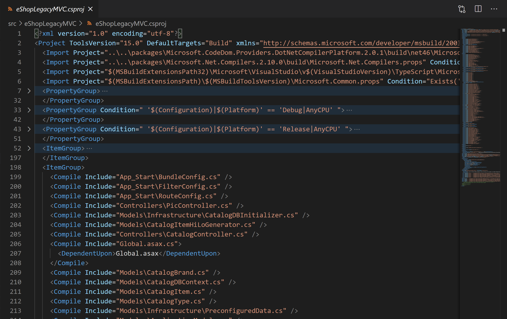

**Figure 4-6.** The *eShopLegacyMVC.csproj* file structure.

A common way to create a new project file for an existing ASP.NET project is to create a new ASP.NET Core app using `dotnet new` or **File** > **New** > **Project** in Visual Studio. Then files can be copied from the old project to the new one to complete the migration.

In addition to the C# project file, NuGet dependencies are stored in a separate 45-line *packages.config* file, as shown in Figure 4-7.

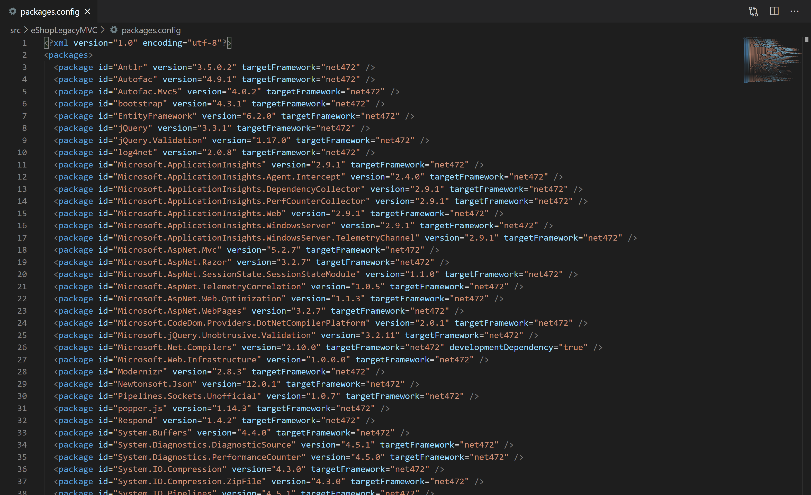

**Figure 4-7.** The *packages.config* file.

You can migrate *packages.config* in class library projects using Visual Studio. This functionality doesn't work with ASP.NET projects, however. [Learn more about migrating *packages.config* to `<PackageReference>` in Visual Studio](/nuget/consume-packages/migrate-packages-config-to-package-reference). If you have a large number of projects to migrate, [this community tool may help](https://github.com/MarkKharitonov/NuGetPCToPRMigrator). If you're using a tool to migrate the project file to the new format, you should do that after you've finished migrating all NuGet references to use `<PackageReverence>`.

## Create new ASP.NET Core project

Add a new ASP.NET Core project to the existing app's solution to make moving files easier, as most of the work can be done from within Visual Studio's **Solution Explorer**. In Visual Studio, right-click on your app's solution and choose **Add New Project**. Choose **ASP.NET Core web application**, and give the new project a name as shown in Figure 4-8.

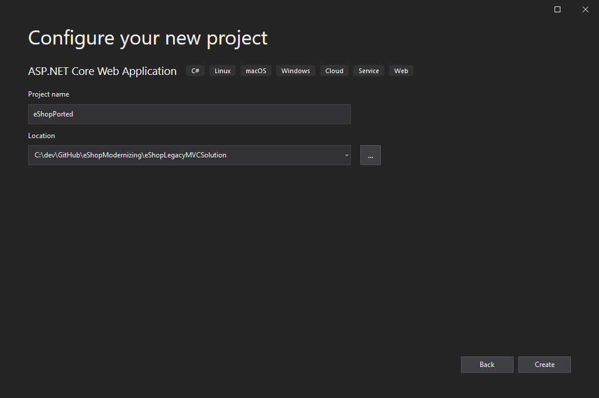

**Figure 4-8.** Add new ASP.NET Core web application.

The next dialog will ask you to choose which template to use. Select the **Empty** template. Be sure to also change the dropdown from **.NET Core** to **.NET Framework**. Select **ASP.NET Core 2.2**, as shown in Figure 4-9.

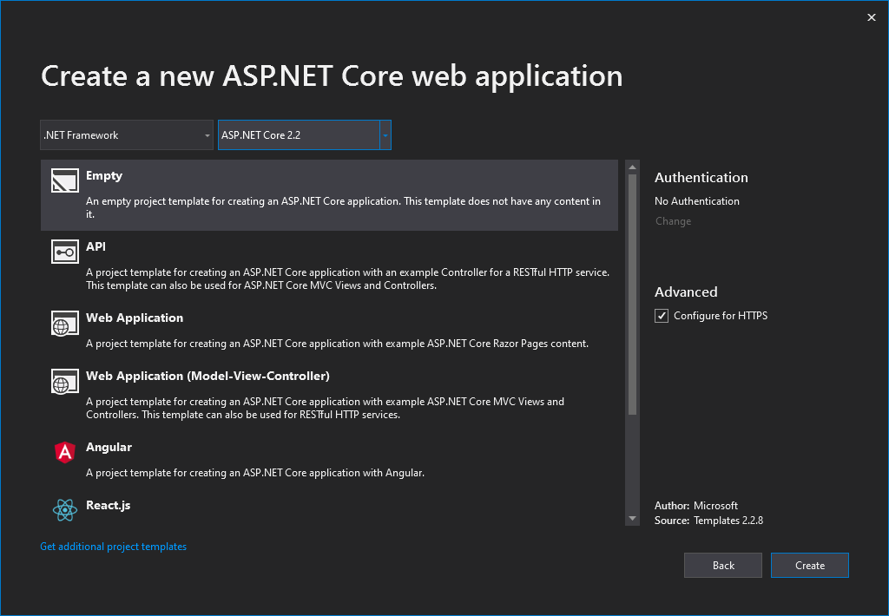

**Figure 4-9.** Choose an Empty project template targeting .NET Framework with ASP.NET Core 2.2.

### Migrating NuGet Packages

Since the built-in migration tool for migrating *packages.config* to `<PackageReference>` doesn't work on ASP.NET projects, you can use a community tool instead, or migrate by hand. A [community tool I've used](https://gist.github.com/tomkuijsten/2d75074d9a3c19c04ee8ea19a6289ddf) uses an XSL file to transform from one format to the other. To use it, first copy the *packages.config* file to the newly created ASP.NET Core project folder. Make a backup of your files, as this script removes the *packages.config* file from all folders under where you run the script. Then run these commands from the project folder (or for the entire solution if you prefer):

```powershell
iwr https://git.io/vdKaV -OutFile Convert-ToPackageReference.ps1
iwr https://git.io/vdKar -OutFile  Convert-ToPackageReference.xsl
./Convert-ToPackageReference.ps1 | Out-Null
```

The first two commands download files so that they exist locally. The last line runs the script. After running it, try to build the new project. You'll most likely get some errors. To resolve them, you'll want to eliminate some references (like most of the `Microsoft.AspNet` and `System` packages), and you may need to remove some `xmlns` attributes.

In most ASP.NET MVC apps, many client-side dependencies like Bootstrap and jQuery were deployed using NuGet packages. In ASP.NET Core, NuGet packages are only used for server-side functionality. Client files should be managed through other means. Review the list of `<PackageReference>` elements added and remove and make note of any that are for client libraries, including:

- Bootstrap
- jQuery
- jQuery.Validation
- Modernizr
- popper.js
- Respond

The static client files installed by NuGet for these packages will be copied over to the new project's *wwwroot* folder and hosted from there. It's worth considering whether these files are still needed by the app, and whether it makes sense to continue hosting them or to use a content delivery network (CDN) instead. These library versions can be managed at build time using tools like [LibMan](/aspnet/core/client-side/libman/) or [npm](https://www.npmjs.com/). Figure 4-10 shows the full *eShopPorted.csproj* file after migrating package references using the conversion tool shown and removing unnecessary packages.

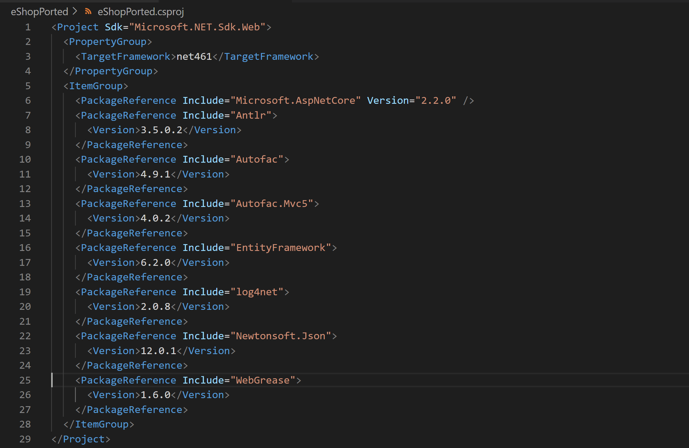

**Figure 4-10.** Package references in the *eShopPorted.csproj* file.

The package references can be further compacted by making the `<Version>1.0.0.0</Version>` element a `Version=1.0.0.0` attribute on `<PackageReference>`.

### Migrate static files

Any static files the app uses, including third-party scripts and frameworks but also custom images and stylesheets, must be copied from the old project to the new one. In ASP.NET MVC apps, files were typically accessed based on their location within the project folder. In ASP.NET Core apps, these static files will be accessed based on their location within the *wwwroot* folder. For the *eShop* project, there are static files in the following folders:

* *Content*
* *fonts*
* *Images*
* *Pics*
* *Scripts*

The **Empty** project template used in the previous step doesn't include this folder by default, or the middleware needed for it to work. You'll need to add them.

Add a *wwwroot* folder to the root of the project.

Add version 2.2.0 of the `Microsoft.AspNetCore.StaticFiles` NuGet package.

In *Startup.cs*, add a call to `app.UseStaticFiles()` in the `Configure` method:

```csharp
public void Configure(IApplicationBuilder app, IHostingEnvironment env)
{
    if (env.IsDevelopment())
    {
        app.UseDeveloperExceptionPage();
    }

    app.UseStaticFiles();

    // ...
}
```

Copy the *Content* folder from the ASP.NET MVC app to the new project's *wwwroot* folder.

Run the app and navigate to its */Content/base.css* folder to verify that the static file is served correctly from its expected path. Continue copying the rest of the folders containing static files to the new project. You'll also want to copy the *favicon.ico* file from the project's root to the *wwwroot* folder. Figure 4-11 shows the results after these files and their folders have all been copied.

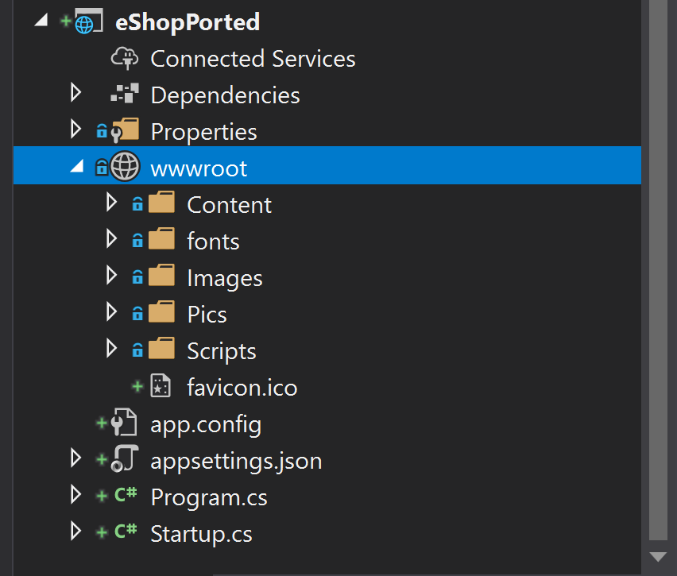

**Figure 4-11.** Static folders copied over to *wwwroot* folder.

### Migrate C# files

Next, copy over the C# files used by the app, including standard MVC folders and their contents like *Controllers*, *Models*, *ViewModel*, and *Services*. There will most likely be some changes needed in these files. It's best to copy one folder (or subfolder) at a time and compile to see what errors need to be addressed as you go.

For the *eShop* sample, the first folder I choose to migrate is the *Models* folder, which includes C# entities and Entity Framework classes. This folder's classes are used by most of the others, so they won't work until these classes have been copied. After copying the folder and building, the compiler revealed errors related to missing namespace `System.Web.Hosting`, related access to `HostingEnvironment`, and a reference to `ConfigurationManager.AppSettings`. The solution to these issues will be to pass in the necessary path data; for now the breaking lines are commented out and a `TODO:` comment is added to each one to track it. After changing five lines, the **Task List** shows five items and the project builds.

Next, the *ViewModel* folder, with its one class, is copied over. It's an easy one, and builds immediately.

The *Services* folder is copied over. This folder's classes depend on Entity Framework classes from the *Models* folder, which is why it needed to be copied after that folder. Fortunately, it too builds without errors.

That leaves the *Controllers* folder and its two `Controller` classes. After copying the folder to the new project and building, there are seven build errors. Four of them are related to `ViewBag` access and report an error of:

> `Missing compiler required member 'Microsoft.CSharp.RuntimeBinder.CSharpArgumentInfo.Create'`

To resolve this error, add a NuGet package reference to C#:

```xml
<PackageReference Include="Microsoft.CSharp" Version="4.7.0" />
```

The remaining three errors specify types that are defined in an assembly that isn't referenced. Specifically these types:

- `HttpServerUtilityBase`
- `RouteValueDictionary`
- `HttpRequestBase`

Let's look at each error one by one. The first error occurs while trying to reference the `Server` property of `Controller`, which no longer exists. The goal of the operation is to get the path to an image file in the app:

```csharp
if (item != null)
{
    var webRoot = Server.MapPath("~/Pics"); // compiler error on this line
    var path = Path.Combine(webRoot, item.PictureFileName);

    string imageFileExtension = Path.GetExtension(item.PictureFileName);
    string mimetype = GetImageMimeTypeFromImageFileExtension(imageFileExtension);

    var buffer = System.IO.File.ReadAllBytes(path);

    return File(buffer, mimetype);
}
```

There are two possible solutions to this problem. The first is to keep the functionality as it is. In this case, rather than using `Server.MapPath`, a fixed path referencing the image files' location in *wwwroot* should be used. Alternately, since the only purpose of this action method is to return a static image file, the references to this action in view files can be updated to reference the static files directly, which improves runtime performance. Since no processing is being done as part of this action, there's no reason not to just serve the files directly. If it's not tenable to update all references to this action, the action could be rewritten to produce a redirect to the static file's location.

The next two errors both occur in the same private method in the same line of code:

```csharp
private void AddUriPlaceHolder(CatalogItem item)
{
    item.PictureUri = this.Url.RouteUrl(PicController.GetPicRouteName, new { catalogItemId = item.Id }, this.Request.Url.Scheme);
}
```

Both `this.Url` and `this.Request` cause compiler errors. Looking at how this code is used, its purpose is to build a link to the `PicController` action that renders image files. The same one we just discovered could probably be replaced with direct links to the static files located in *wwwroot*. For now, it's worth commenting out this code and adding a `TODO:` comment to reference the pics another way.

It's worth noting that the base `Controller` class, used by the `CatalogController` class in which this code appears, is still referring to `System.Web.Mvc.Controller`. There will undoubtedly be more errors to fix once we update this to use ASP.NET Core. First, remove the `using System.Web.Mvc;` line from the list of `using` statements in `CatalogController`. Next, add the NuGet package `Microsoft.AspNetCore.Mvc`. Finally, add a `using Microsoft.AspNetCore.Mvc;` statement, and build the app again.

This time, there are 16 errors:

- `Include` is not a valid named attribute argument (2)
- `HttpStatusCodeResult` not found (3)
- `HttpNotFound` does not exist (3)
- `SelectList` not found (8)

Once more, let's review these errors one by one. First, `SelectList` can be fixed by adding `using Microsoft.AspNetCore.Mvc.Rendering;`, which eliminates half of the errors.

All references to `return HttpNotFound();` should be replaced with `return NotFound();`.

All references to `return new HttpStatusCodeResult(HttpStatusCode.BadRequest);` should be replaced with `return BadRequest();`.

That just leaves the use of `Include` with a `[Bind]` attribute on a couple of action methods that look like this:

```csharp
[HttpPost]
[ValidateAntiForgeryToken]
public ActionResult Create([Bind(Include = "Id,Name,Description,Price,PictureFileName,CatalogTypeId,CatalogBrandId,AvailableStock,RestockThreshold,MaxStockThreshold,OnReorder")] CatalogItem catalogItem)
{
```

The preceding code restricts model binding to the properties listed in the `Include` string. In ASP.NET Core MVC, the `[Bind]` attribute still exists, but no longer needs the `Include =` argument. Pass the list of properties directly to the `[Bind]` attribute:

```csharp
[HttpPost]
[ValidateAntiForgeryToken]
public ActionResult Create([Bind("Id,Name,Description,Price,PictureFileName,CatalogTypeId,CatalogBrandId,AvailableStock,RestockThreshold,MaxStockThreshold,OnReorder")] CatalogItem catalogItem)
{
```

With these changes, the project compiles once more. It's generally a better practice to use separate model types for controller inputs, rather than using model binding directly to your domain model or data model types.

## Migrate views

The two biggest ASP.NET Core MVC features related to views are [Razor Pages](/aspnet/core/razor-pages/) and [Tag Helpers](/aspnet/core/mvc/views/tag-helpers/built-in/). For the initial migration, we won't use either feature. You should, however, keep the features in mind if you continue supporting the app once it's been migrated. The next step is to copy the *Views* folder from the original project into the new one. After building, there are nine errors:

- HttpContext does not exist (2)
- Scripts does not exist (5)
- Styles does not exist (1)
- HtmlString could not be found(1)

Investigating these errors finds that most of them are in the main *_Layout.cshtml*, with several related to rendering script and style tags, or displaying when the server hosting the app was last restarted. The following code listing shows problem areas in the *_Layout.cshtml* file:

```razor
// other lines omitted; only errors shown
@Styles.Render("~/Content/css")
@Scripts.Render("~/bundles/modernizr")

@{ var sessionInfo = new HtmlString($"{HttpContext.Current.Session["MachineName"]}, {HttpContext.Current.Session["SessionStartTime"]}");}

@Scripts.Render("~/bundles/jquery")
@Scripts.Render("~/bundles/bootstrap")
```

The reference to Modernizr can be removed. The references to Bootstrap and jQuery can be replaced with CDN links to the appropriate version.

Replace `@Styles.Render` line with:

```html
<link rel="stylesheet" href="https://stackpath.bootstrapcdn.com/bootstrap/4.3.1/css/bootstrap.min.css" integrity="sha384-ggOyR0iXCbMQv3Xipma34MD+dH/1fQ784/j6cY/iJTQUOhcWr7x9JvoRxT2MZw1T" crossorigin="anonymous">
```

Replace the last two `Scripts.Render` lines with:

```html
<script src="https://code.jquery.com/jquery-3.3.1.slim.min.js" integrity="sha384-q8i/X+965DzO0rT7abK41JStQIAqVgRVzpbzo5smXKp4YfRvH+8abtTE1Pi6jizo" crossorigin="anonymous"></script>
<script src="https://cdnjs.cloudflare.com/ajax/libs/popper.js/1.14.7/umd/popper.min.js" integrity="sha384-UO2eT0CpHqdSJQ6hJty5KVphtPhzWj9WO1clHTMGa3JDZwrnQq4sF86dIHNDz0W1" crossorigin="anonymous"></script>
<script src="https://stackpath.bootstrapcdn.com/bootstrap/4.3.1/js/bootstrap.min.js" integrity="sha384-JjSmVgyd0p3pXB1rRibZUAYoIIy6OrQ6VrjIEaFf/nJGzIxFDsf4x0xIM+B07jRM" crossorigin="anonymous"></script>
```

Finally, after the Bootstrap `<link>`, add additional `<link>` elements for local styles your app uses. For *eShop*, the result is shown here:

```html
<link rel="stylesheet" href="~/Content/custom.css" />
<link rel="stylesheet" href="~/Content/base.css" />
<link rel="stylesheet" href="~/Content/Site.css" />
```

To determine the order in which the `<link>` elements should appear, look at your original app's rendered HTML. Alternatively, review *BundleConfig.cs*, which for the *eShop* sample includes this code indicating the appropriate sequence:

```csharp
bundles.Add(new StyleBundle("~/Content/css").Include(
          "~/Content/bootstrap.css",
          "~/Content/custom.css",
          "~/Content/base.css",
          "~/Content/site.css"));
```

Building again reveals one more error loading jQuery Validation on the *Create* and *Edit* views. Replace it with this script:

```html
<script src="https://cdnjs.cloudflare.com/ajax/libs/jquery-validate/1.17.0/jquery.validate.min.js" integrity="sha512-O/nUTF5mdFkhEoQHFn9N5wmgYyW323JO6v8kr6ltSRKriZyTr/8417taVWeabVS4iONGk2V444QD0P2cwhuTkg==" crossorigin="anonymous"></script>
```

The last thing to fix in the views is the reference to `Session` to display how long the app has been running, and on which machine. We can display this data directly in the site's *_Layout.cshtml* by using `System.Environment.MachineName` and `System.Diagnostics.Process.GetCurrentProcess().StartTime`:

```razor
<section class="col-sm-6">
    
    <br />
<small>@Environment.MachineName - @System.Diagnostics.Process.GetCurrentProcess().StartTime.ToString() UTC</small>
</section>
```

At this point, the app once more builds successfully. However, trying to run it just yields *Hello World!* because the **Empty** ASP.NET Core template is only configured to display that in response to any request. In the next section, I complete the migration by configuring the app to use ASP.NET Core MVC, including dependency injection and configuration. Once that's in place, the app should run. Then it will be time to fix the `TODO:` tasks that were created earlier.

## Migrate app startup components

The last migration step is to take the app startup tasks from *Global.asax*, and the classes it calls, and migrate these to their ASP.NET Core equivalents. These tasks include configuration of MVC itself, setting up dependency injection, and working with the new configuration system. In ASP.NET Core, these tasks are handled in the *Startup.cs* file.

### Configure MVC

The original ASP.NET MVC app has the following code in its `Application_Start` in *Global.asax*, which runs when the app starts up:

```csharp
protected void Application_Start()
{
    container = RegisterContainer();
    AreaRegistration.RegisterAllAreas();
    FilterConfig.RegisterGlobalFilters(GlobalFilters.Filters);
    RouteConfig.RegisterRoutes(RouteTable.Routes);
    BundleConfig.RegisterBundles(BundleTable.Bundles);
    ConfigDataBase();
}
```

Looking at these lines one by one, the `RegisterContainer` method sets up dependency injection, which will be ported below. The next three lines configure different parts of MVC: areas, filters, and routes. Bundles are replaced by static files in the ported app. The last line sets up data access for the app, which will be shown in a later section.

Since this app isn't actually using areas, there's nothing that needs to be done to migrate the area registration call. If your app does need to migrate areas, the [docs specify how to configure areas in ASP.NET Core](/aspnet/core/mvc/controllers/areas).

The call to register global filters invokes a helper on the `FilterConfig` class in the app's *App_Start* folder:

```csharp
public static void RegisterGlobalFilters(GlobalFilterCollection filters)
{
    filters.Add(new HandleErrorAttribute());
}
```

The only attribute added to the app is the ASP.NET MVC filter, `HandleErrorAttribute`. This filter ensures that when an exception occurs as part of a request, a default action and view are displayed, rather than the exception details. In ASP.NET Core, this same functionality is performed by the `UseExceptionHandler` middleware. The detailed error messages aren't enabled by default. They must be configured using the `UseDeveloperExceptionPage` middleware. To configure this behavior to match the original app, the following code must be added to the start of the `Configure` method in *Startup.cs*:

```csharp
public void Configure(IApplicationBuilder app, IWebHostEnvironment env)
{
    if (env.IsDevelopment())
    {
        app.UseDeveloperExceptionPage();
    }
    else
    {
        app.UseExceptionHandler("/Error");
    }
    // ...
}
```

This takes care of the only filter used by the eShop app, and in this case it was done by using built-in middleware. If you have global filters that must be configured in your app, this is done when MVC is added in the `ConfigureServices` method, which is shown later in this chapter.

The last piece of MVC-related logic that needs to be migrated are the app's default routes. The call to `RouteConfig.RegisterRoutes(RouteTable.Routes)` passes the MVC route table to the `RegisterRoutes` helper method, where the following code is executed when the app starts up:

```csharp
public static void RegisterRoutes(RouteCollection routes)
{
    routes.MapMvcAttributeRoutes();
    routes.IgnoreRoute("{resource}.axd/{*pathInfo}");

    routes.MapRoute(
        name: "Default",
        url: "{controller}/{action}/{id}",
        defaults: new { controller = "Catalog", action = "Index", id = UrlParameter.Optional }
    );
}
```

Taking this code line-by-line, the first line sets up support for attribute routes. This is built into ASP.NET Core, so it's unnecessary to configure it separately. Likewise, *{resource}.axd* files aren't used with ASP.NET Core, so there's no need to ignore such routes. The `MapRoute` method configures the default for MVC, which uses the typical `{controller}/{action}/{id}` route template. It also specifies the defaults for this template, such that the `CatalogController` is the default controller used and the `Index` method is the default action. Larger apps will frequently include more calls to `MapRoute` to set up additional routes.

ASP.NET Core MVC supports [conventional routing and attribute routing](/aspnet/core/mvc/controllers/routing?preserve-view=true&view=aspnetcore-2.2). Conventional routing is analogous to how the route table is configured in the `RegisterRoutes` method listed previously. To set up conventional routing with a default route like the one used in the *eShop* app, add the following code to the bottom of the `Configure` method in *Startup.cs*:

```csharp
app.UseMvc(routes =>
{
   routes.MapRoute("default", "{controller=Catalog}/{action=Index}/{id?}");
});
```

> [!NOTE]
> With ASP.NET Core 3.0 and later, this is changed to use endpoints. For the initial port to ASP.NET Core 2.2, this is the proper syntax for mapping conventional routes.

With these changes in place, the `Configure` method is almost done. The original template's `app.Run` method that prints *Hello World!* should be deleted. At this point, the method is as shown here:

```csharp
public void Configure(IApplicationBuilder app, IHostingEnvironment env)
{
    if (env.IsDevelopment())
    {
        app.UseDeveloperExceptionPage();
    }
    else
    {
        app.UseExceptionHandler("/Home/Error");
    }

    app.UseStaticFiles();

    app.UseMvc(routes =>
    {
        routes.MapRoute("default", "{controller=Catalog}/{action=Index}/{id?}");
    });
}
```

Now it's time to configure MVC services, followed by the rest of the app's support for dependency injection (DI). So far, the *eShopPorted* project's `ConfigureServices` method has remained empty. Now it's time to start populating it.

First, to get ASP.NET Core MVC to work properly, it needs to be added:

```csharp
public void ConfigureServices(IServiceCollection services)
{
    services.AddMvc();
}
```

The preceding code is the minimal configuration required to get MVC features working. There are many additional features that can be configured from this call (some of which are detailed later in this chapter), but for now this will suffice to build the app. Running it now routes the default request properly, but since we've not yet configured DI, an error occurs while activating `CatalogController`, because no implementation of type `ICatalogService` has been provided yet. We'll return to configure MVC further in a moment. For now, let's migrate the app's dependency injection.

#### Migrate dependency injection configuration

The original app's *Global.asax* file defines the following method, called when the app starts up:

```csharp
protected IContainer RegisterContainer()
{
  var builder = new ContainerBuilder();

  builder.RegisterControllers(typeof(MvcApplication).Assembly);

  var mockData = bool.Parse(ConfigurationManager.AppSettings["UseMockData"]);
  builder.RegisterModule(new ApplicationModule(mockData));

  var container = builder.Build();
  DependencyResolver.SetResolver(new AutofacDependencyResolver(container));

  return container;
}
```

This code configures an [Autofac](https://autofac.org/) container, reads a config setting to determine whether real or mock data should be used, and passes this setting into an Autofac module (found in the app's */Modules* directory). Fortunately, Autofac supports .NET Core, so the module can be migrated directly. Copy the folder into the new project and updates the class's namespace and it should compile.

ASP.NET Core has built-in support for dependency injection, but you can wire up a third-party container such as Autofac easily if necessary. In this case, since the app is already configured to use Autofac, the simplest solution is to maintain its usage. To do so, the `ConfigureServices` method signature must be modified to return an `IServiceProvider`, and the Autofac container instance must be configured and returned from the method.

**Note:** In .NET Core 3.0 and later, the process for integrating a third-party DI container has changed.

Part of configuring Autofac requires a call to `builder.Populate(services)`. This extension is found in the `Autofac.Extensions.DependencyInjection` NuGet package, which must be installed before the code will compile.

After modifying `ConfigureServices` to configure an Autofac container, the new method is as shown here:

```csharp
public IServiceProvider ConfigureServices(IServiceCollection services)
{
    services.AddMvc();

    // Create Autofac container builder
    var builder = new ContainerBuilder();
    builder.Populate(services);
    bool useMockData = true; // TODO: read from config
    builder.RegisterModule(new ApplicationModule(useMockData));

    ILifetimeScope container = builder.Build();

    return new AutofacServiceProvider(container);
}
```

For now, the setting for `useMockData` is set to `true`. This setting will be read from configuration in a moment. At this point, the app compiles and should load successfully when run, as shown in Figure 4-12.

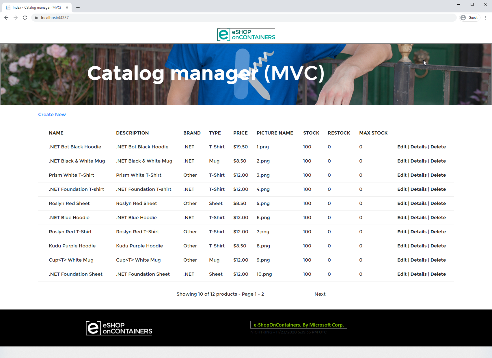

**Figure 4-12.** Ported *eShop* app running locally with mock data.

#### Migrate app settings

ASP.NET Core uses a new [configuration system](/aspnet/core/fundamentals/configuration/?preserve-view=true&view=aspnetcore-2.2), which by default uses an *appsettings.json* file. By using `CreateDefaultBuilder` in *Program.cs*, the default configuration is already set up in the app. To access configuration, classes just need to request it in their constructor. The `Startup` class is no exception. To start accessing configuration in `Startup` and the rest of the app, request an instance of `IConfiguration` from its constructor:

```csharp
public Startup(IConfiguration configuration)
{
    Configuration = configuration;
}

public IConfiguration Configuration { get; }
```

The original app referenced its settings using `ConfigurationManager.AppSettings`. A quick search for all references of this term yields the set of settings the new app needs. There are only two:

- `UseMockData`
- `UseCustomizationData`

If your app has more complex configuration, especially if it's using custom configuration sections, you'll probably want to create and bind objects to different parts of your app's configuration. These types can then be accessed using the [options pattern](../../core/extensions/options.md). However, as noted in the referenced doc, this pattern shouldn't be used in `ConfigureServices`. Instead the ported app will reference the `UseMockData` configuration value directly.

First, modify the ported app's `appsettings.json` file and add the two settings in the root:

```json
{
  "Logging": {
    "LogLevel": {
      "Default": "Warning"
    }
  },
  "AllowedHosts": "*",
  "UseMockData": "true",
  "UseCustomizationData" :  "true"
}
```

Now, modify `ConfigureServices` to access the `UseMockData` setting from the `Configuration` property (where previously we set the value to `true`):

```csharp
  bool useMockData = Configuration.GetValue<bool>("UseMockData");
```

At this point, the setting is pulled from configuration. The other setting, `UseCustomizationData`, is used by the `CatalogDBInitializer` class. When you first ported this class, you commented out the access to `ConfigurationManager.AppSettings["UseCustomizationData"]`. Now it's time to modify it to use ASP.NET Core configuration. Modify the constructor of `CatalogDBInitializer` as follows:

```csharp
  // add using Microsoft.Extensions.Configuration
  public CatalogDBInitializer(CatalogItemHiLoGenerator indexGenerator,
      IConfiguration configuration)
  {
      this.indexGenerator = indexGenerator;
      useCustomizationData = configuration.GetValue<bool>("UseCustomizationData");
  }
```

All access to configuration within the web app should be modified in this manner to use the new `IConfiguration` type. Dependencies that require access to .NET Framework configuration can include such settings in an *app.config* file added to the web project. The dependent projects can work with `ConfigurationManager` to access settings, and shouldn't require any changes if they already use this approach. However, since ASP.NET Core apps run as their own executable, they don't reference *web.config* but rather *app.config*. By migrating settings from the legacy app's *web.config* file to a new *app.config* file in the ASP.NET Core app, components that use `ConfigurationManager` to access their settings will continue to function properly.

The app's migration is nearly complete. The only remaining task is data access configuration.
  
## Data access considerations

ASP.NET Core apps running on .NET Framework can continue to use Entity Framework (EF). If performing an incremental migration, getting the app working with EF 6 before trying to port its data access to use EF Core may be worthwhile. In this way, any problems with the app's migration can be identified and addressed before another block of migration effort is begun.

As it happens, configuring EF 6 in the eShop sample migration doesn't require any special work, since this work was performed in the Autofac `ApplicationModule`. The only problem is that currently the `CatalogDBContext` class tries to read its connection string from *web.config*. To address this, the connection details need to be added to *appsettings.json*. Then the connection string must be passed into `CatalogDBContext` when it's created.

Update the *appsettings.json* to include the connection string. The full file is listed here:

```json
{
  "ConnectionStrings": {
    "DefaultConnection": "Server=(localdb)\\mssqllocaldb;Database=eShopPorted;Trusted_Connection=True;MultipleActiveResultSets=true"
  },
  "Logging": {
    "LogLevel": {
      "Default": "Warning"
    }
  },
  "AllowedHosts": "*",
  "UseMockData": "false",
  "UseCustomizationData": "true"
}
```

The connection string must be passed into the constructor when the `DbContext` is created. Since the instances are created by Autofac, the change needs to be made in `ApplicationModule`. Modify the module to take in a `connectionString` in its constructor and assign it to a field. Then modify the registration for `CatalogDBContext` to add connection string as a parameter:

```csharp
builder.RegisterType<CatalogDBContext>()
  .WithParameter("connectionString", _connectionString)
  .InstancePerLifetimeScope();
```

The parameter must also be added to a new constructor overload in `CatalogDBContext` itself:

```csharp
public CatalogDBContext(string connectionString) : base(connectionString)
{
}
```

Finally, `ConfigureServices` must read the connection string from `Config` and pass it into the `ApplicationModule` when it instantiates it:

```csharp
bool useMockData = Configuration.GetValue<bool>("UseMockData");
string connectionString = Configuration.GetConnectionString("DefaultConnection");
builder.RegisterModule(new ApplicationModule(useMockData, connectionString));
```

With this code in place, the app runs as it did before, connecting to a SQL Server database when `UseMockData` is `false`.

The app can be deployed and run in production at this point, converted to ASP.NET Core but still running on .NET Framework and EF 6. If desired, the app can be migrated to run on .NET Core and Entity Framework Core, which will bring additional advantages described in earlier chapters. Specific to Entity Framework, [this documentation compares EF Core and EF 6](/ef/efcore-and-ef6/) and includes a grid showing which library supports each of dozens of individual features.

### Migrate to Entity Framework Core

Assuming a decision is made to migrate to EF Core, the steps can be fairly straightforward, especially if the original app used a code-based model approach. When [preparing to port from EF 6 to EF Core](/ef/efcore-and-ef6/porting/), review the availability of features in the destination version of EF Core you'll be using. Review the documentation on [porting from and EDMX-based model](/ef/efcore-and-ef6/porting/port-edmx) versus [porting from a code-based model](/ef/efcore-and-ef6/porting/port-code).

To upgrade to EF Core 2.2, the basic steps involved are to add the appropriate NuGet package(s) and update namespaces. Then adjust how the connection string is passed to the `DbContext` type and how they're wired up for dependency injection.

EF Core is added as a package reference to the project:

```xml
<PackageReference Include="Microsoft.EntityFrameworkCore" Version="2.2.6" />
```

The reference to EF 6 is removed:

```xml
<PackageReference Include="EntityFramework" Version="6.2.0" />
```

The compiler will report errors in `CatalogDBContext` and `CatalogDBInitializer`. `CatalogDbContext` needs to have the old namespaces removed and replaced with `Microsoft.EntityFrameworkCore`. Its constructors can be removed. `DbModelBuilder` should be replaced with `ModelBuilder`. The helper methods for configuring types are moved to separate classes implementing `IEntityTypeConfiguration<T>`. Then the `CatalogDBContext` class's `OnModelCreating` method simply becomes:

```csharp
protected override void OnModelCreating(ModelBuilder builder)
{
    builder.ApplyConfigurationsFromAssembly(Assembly.GetExecutingAssembly());

    base.OnModelCreating(builder);
}
```

Other changes involved include:

- `HasDatabaseGeneratedOption(DatabaseGeneratedOption.None)` replaced with `ValueGeneratedNever()`
- `HasRequired<T>` replaced with `HasOne<T>`
- Installed `Microsoft.EntityFrameworkCore.Relational` package
- Add a constructor to `CatalogDBContext` taking `DbContextOptions` and passing it to the base constructor

An example configuration class for `CatalogType` is shown here:

```csharp
using Microsoft.EntityFrameworkCore;
using Microsoft.EntityFrameworkCore.Metadata.Builders;

namespace eShopPorted.Models.Config
{
    public class CatalogTypeConfig : IEntityTypeConfiguration<CatalogType>
    {
        public void Configure(EntityTypeBuilder<CatalogType> builder)
        {
            builder.ToTable(nameof(CatalogType));

            builder.HasKey(ci => ci.Id);

            builder.Property(ci => ci.Id)
               .IsRequired();

            builder.Property(cb => cb.Type)
                .IsRequired()
                .HasMaxLength(100);
        }
    }
}
```

The `CatalogDBInitializer` and its base class, `CreateDatabaseIfNotExists<T>`, are incompatible with EF Core. The purpose of this class is to create and seed the database. Using EF Core will [create and drop the associated database for a `DbContext`](/ef/core/managing-schemas/ensure-created) using these methods:

```csharp
dbContext.Database.EnsureDeleted();
dbContext.Database.EnsureCreated();
```

Seeding data in EF Core can be done with manual scripts, or as part of the type configuration. Along with other entity properties, seed data can be configured in `IEntityTypeConfiguration` classes by using `builder.HasData()`. The original app loaded seed data from CSV files in the *Setup* directory. Given that there are only a handful of items, these data records can instead be added as part of the entity configuration. This approach works well for lookup data in tables that change infrequently. Adding the following to `CatalogTypeConfig`'s `Configure` method ensures the associated rows are present when the database is created:

```csharp
builder.HasData(
    new CatalogType { Id = 1, Type = "Mug" },
    new CatalogType { Id = 2, Type = "T-Shirt" },
    new CatalogType { Id = 3, Type = "Sheet" },
    new CatalogType { Id = 4, Type = "USB Memory Stick" }
);
```

The initial app includes a `PreconfiguredData` class, which includes data for `CatalogBrand` and `CatalogType`, so using this method the `HasData` call reduces to:

```csharp
builder.HasData(
    PreconfiguredData.GetPreconfiguredCatalogBrands()
);
```

The `CatalogItem` data can also be pulled from `PreconfiguredData`, and assuming the associated images are kept in source control, that is the last table needed for the app to function. The `CatalogDBInitializer` class can be removed, along with any references to it. The `CatalogItemHiLoGenerator` class and the SQL files in the `Infrastructure` directory are also removed, along with any references to them (in `CatalogService`, `ApplicationModule`).

With the elimination of the special key generator classes for `CatalogItem`, this code now is removed from `CatalogItemConfig`:

```csharp
builder.Property(ci => ci.Id)
    .ValueGeneratedNever()
    .IsRequired();
```

With these modifications, the ASP.NET Core app builds, but it doesn't yet work with EF Core, which must still be configured for dependency injection. With EF Core, the simplest way to configure it is in `ConfigureServices`:

```csharp
public IServiceProvider ConfigureServices(IServiceCollection services)
{
    services.AddMvc();
    bool useMockData = Configuration.GetValue<bool>("UseMockData");
    if (!useMockData)
    {
        string connectionString = Configuration.GetConnectionString("DefaultConnection");

        services.AddDbContext<CatalogDBContext>(options =>
            options.UseSqlServer(connectionString)
        );
    }

    // Create Autofac container builder
    var builder = new ContainerBuilder();
    builder.Populate(services);
    builder.RegisterModule(new ApplicationModule(useMockData));

    ILifetimeScope container = builder.Build();

    return new AutofacServiceProvider(container);
}
```

The final version of Autofac's `ApplicationModule` only configures one type, depending on whether the app is configured to use mock data:

```csharp
public class ApplicationModule : Module
{
    private bool _useMockData;

    public ApplicationModule(bool useMockData)
    {
        _useMockData = useMockData;
    }

    protected override void Load(ContainerBuilder builder)
    {
        if (_useMockData)
        {
            builder.RegisterType<CatalogServiceMock>()
                .As<ICatalogService>()
                .SingleInstance();
        }
        else
        {
            builder.RegisterType<CatalogService>()
                .As<ICatalogService>()
                .InstancePerLifetimeScope();
        }
    }
}
```

The ported app runs, but doesn't display any data if configured to use non-mock data. The seed data added through `HasData` is only inserted when migrations are applied. The source app didn't use migrations, and if it had, they wouldn't migrate as-is. The best approach is to start with a new migration script. To do this, add a package reference for `Microsoft.EntityFrameworkCore.Design` and open a terminal window in the project root. Then run:

```dotnetcli
dotnet ef migrations add Initial
```

Drop the existing *eShopPorted* database if it exists, then run:

```dotnetcli
dotnet ef database update
```

This creates and seeds the database. It's now ready to run, with a few small updates left to address.

## Fix all TODO tasks

Running the ported app at this point reveals that no pictures are shown on the page. This is because the `PictureUri` property of `CatalogItem` is never set. Looking at the list of `TODO` items we created using Visual Studio's **Task List**, the only one that remains is in `CatalogController`, with a note to "Reference pic from wwwroot." The code in question is:

```csharp
private void AddUriPlaceHolder(CatalogItem item)
{
    //TODO: Reference pic from wwwroot
    //item.PictureUri = this.Url.RouteUrl(PicController.GetPicRouteName, new { catalogItemId = item.Id }, this.Request.Url.Scheme);
}
```

The simplest fix is to reference the public image files in the site's public *wwwroot/Pics* directory. This task can be accomplished by replacing the method with the following code:

```csharp
private void AddUriPlaceHolder(CatalogItem item)
{
    item.PictureUri = $"/Pics/{item.Id}.png";
}
```

With this change, running the app reveals the images work as before.

## Additional MVC customizations

The *eShopLegacyMVC* app is fairly simple, so there isn't much to configure in terms of default MVC behavior. However, if you do need to configure additional MVC components, such as CORS, filters, and route constraints, you generally provide this information in `Startup.ConfigureServices`, where `UseMvc` is called. For example, the following code listing configures [CORS](/aspnet/core/security/cors?preserve-view=true&view=aspnetcore-2.2) and sets up a global action filter:

```csharp
public void ConfigureServices(IServiceCollection services)
{
    services.AddCors(options =>
    {
        options.AddPolicy(MyAllowSpecificOrigins,
            builder =>
                builder.WithOrigins("http://example.com", "http://www.contoso.com")
                    .AllowAnyHeader()
                    .AllowAnyMethod());
    });

    services.AddMvc(options =>
    {
      options.Filters.Add(new SampleGlobalActionFilter());
    }).SetCompatibilityVersion(CompatibilityVersion.Version_2_2);
}
```

> [!Note]
> To finish configuring CORS, you must also call `app.UseCors()` in `Configure`.

Other advanced scenarios, like adding [custom model binders](/aspnet/core/mvc/advanced/custom-model-binding?preserve-view=true&view=aspnetcore-2.2), formatters, and more are covered in the detailed ASP.NET Core docs. Generally these can be applied on an individual controller or action basis, or globally using the same options approach shown in the previous code listing.

## Other dependencies

Dependencies that use .NET Framework features that had a dependency on the legacy configuration model, such as the WCF client type and tracing code, must be modified when ported. Rather than having these types pull in their configuration information directly, they should be configured in code. For example, a connection to a WCF service that was configured in an ASP.NET app's *web.config* to use `basicHttpBinding` could instead be configured programmatically with the following code:

```csharp
var binding = new BasicHttpBinding();
binding.MaxReceivedMessageSize = 2_000_000;

var endpointAddress = new EndpointAddress("http://localhost:9200/ExampleService");

var myClient = new MyServiceClient(binding, endpointAddress);
```

Rather than relying on config files for its settings, WCF clients and other .NET Framework types should have their settings specified in code. Configured in this manner, these types can continue to work in ASP.NET Core 2.2 apps.

## References

- [eShopModernizing GitHub repository](https://github.com/dotnet-architecture/eShopModernizing)
- [.NET Upgrade Assistant tool](https://aka.ms/dotnet-upgrade-assistant)
- [Your API and ViewModels Should Not Reference Domain Models](https://ardalis.com/your-api-and-view-models-should-not-reference-domain-models/)
- [Developer Exception Page Middleware](/aspnet/core/fundamentals/error-handling#developer-exception-page)
- [Deep Dive into EF Core HasData](/archive/msdn-magazine/2018/august/data-points-deep-dive-into-ef-core-hasdata-seeding)

>[!div class="step-by-step"]
>[Previous](strategies-migrating-in-production.md)
>[Next](more-migration-scenarios.md)
