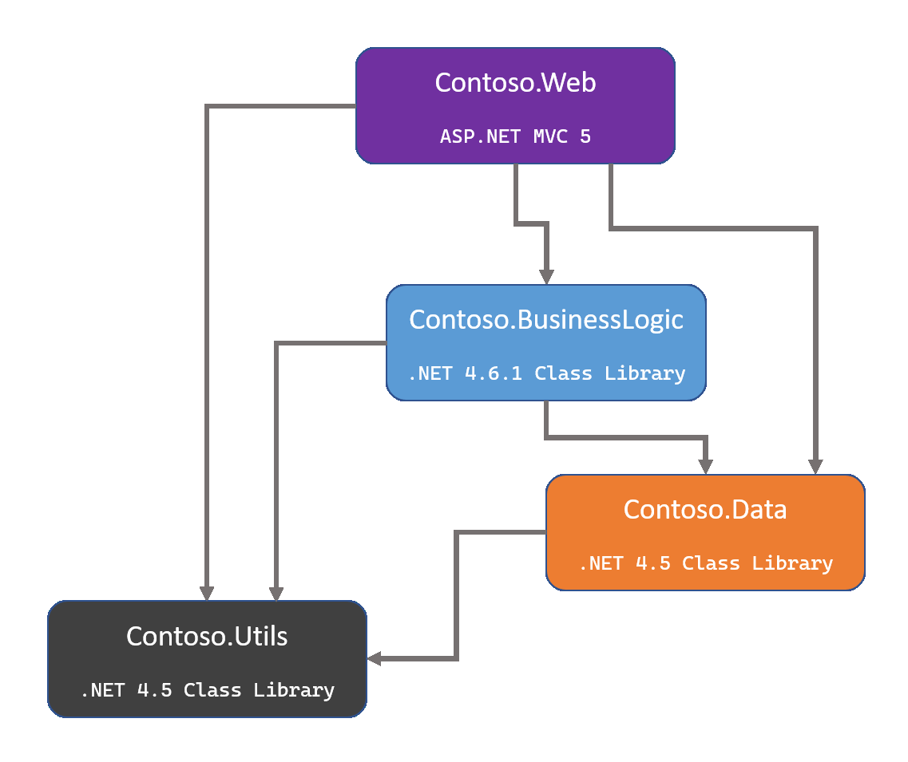
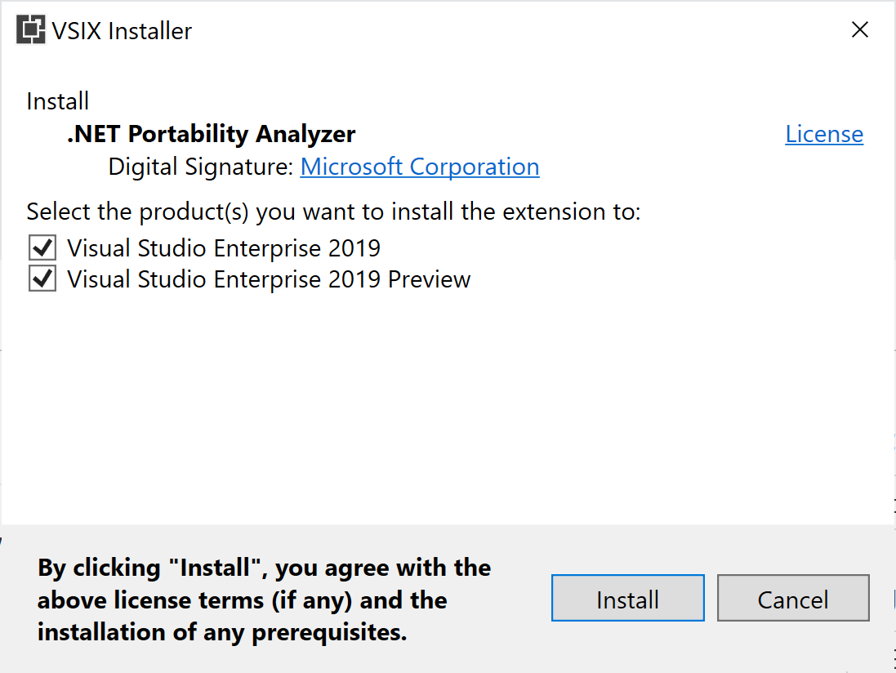
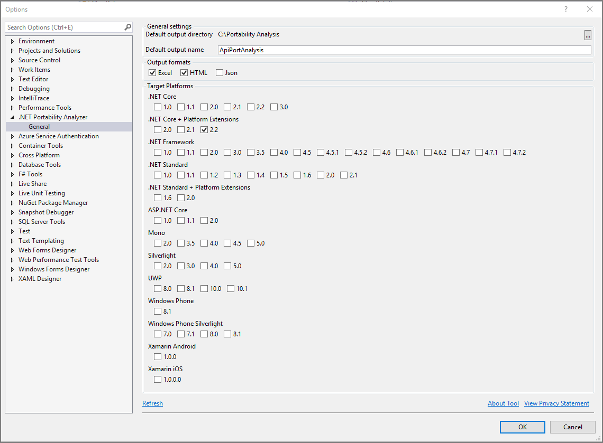

# Identifying sequence of projects to migrate

For solutions that involve multiple front-end apps, it's usually best to migrate these one by one. It may make sense to create a solution that only includes one front-end app and its dependencies so you can easily identify the scope of work involved. Solutions are very lightweight and you can include projects in multiple solutions if needed. So take advantage of solutions as an organizational tool when migrating.

Once you've identified the ASP.NET app you wish to migrate and have its dependent projects located with it (ideally in a solution), the next step is to identify framework and NuGet dependencies. Having identified all dependencies, the simplest migration approach is a "bottom up" approach, in which the lowest level dependencies are migrated first, then the next level of dependencies, until eventually the only thing left is the front-end app. Figure 3-1 shows an example set of projects composing an app, with low-level class libraries at the bottom and the ASP.NET MVC project at the top.



**Figure 3-1. Project dependencies graph.**

Choose a particular front-end application, an ASP.NET MVC 5 / Web API 2 project. Identify its dependencies in the solution, and map out their dependencies until you have a complete list. A diagram like the one shown in Figure 3-1 may be useful when mapping out project dependencies. Visual Studio may be able to produce a [dependency diagram for your solution](https://docs.microsoft.com/visualstudio/modeling/create-layer-diagrams-from-your-code), depending on which edition you're using. [The .NET Portability Analyzer](https://docs.microsoft.com/dotnet/standard/analyzers/portability-analyzer) can also produce dependency diagrams.

Figure 3-2 shows the installer for the [.NET Portability Analyzer Visual Studio extension](https://marketplace.visualstudio.com/items?itemName=ConnieYau.NETPortabilityAnalyzer):



**Figure 3-2. .NET Portability Analyzer installer.**

The extension supports Visual Studio 2017 and later. Once installed, you configure it from the **Analyze > Portability Analyzer Settings** menu, as shown in Figure 3-3.



**Figure 3-3. Configure the .NET Portability Analyzer.**

Running the analyzer will produce a report with details for each assembly describing how compatible they are with a given target, such as .NET Core 3.1 or .NET Standard 2.0. This can help teams assess the effort that will be required to port a particular project to a particular target. The details of this analysis are covered in the next section.

Once you've mapped out the projects and their relationships with one another, you're ready to begin planning the order in which you'll migrate the projects. You typically want to begin with projects that have no dependencies, and then work your way up the tree to the projects that depend on these projects.

In the example shown in Figure 3-1, you would start with the *Contoso.Utils* project, since it doesn't depend on any other projects. Next, *Contoso.Data* since it only depends on "Utils". Then migrate the "BusinessLogic" library, and finally the front-end ASP.NET "Web" project. Following this "bottom up" approach works well for relatively small and well-factored apps that can be migrated as a unit once all of their projects have migrated. Larger apps with more complexity or just more code that will take longer to migrate may need to consider more incremental strategies.

## Unit tests

Missing from the previous diagrams are unit test projects. Hopefully there are tests covering at least some of the existing behavior of the libraries being ported. If you have unit tests, it's best to convert them first so that you can continue testing changes in the product you're working on. Because porting to .NET Core is such a significant change to your codebase, it's highly recommended to port your test projects so that you can run tests as you port your code over. MSTest, xUnit, and NUnit all work on .NET Core. If you don't have any tests for your app currently, consider building some characterization tests that simply verify the system's current behavior, so that once the migration is complete you can confirm this behavior remains unchanged.

## Considerations for migrating many apps

Some organizations will have many different apps to migrate, and migrating each one by hand may require too many resources to be tenable. In these situations, some degree of automation is recommended. The steps followed in this chapter can be automated, so that structural changes like project file differences and updates to common packages are performed by scripts. These scripts can be refined as they are run iteratively on more and more projects, examining whatever manual steps are required for each project and automating them if possible. Using this approach, the organization should grow faster and better at porting their apps over time, with more and better automation support each step of the way.

Watch an overview of how to employ this approach in this [dotNetConf presentation by Lizzy Gallagher of Mastercard](https://www.youtube.com/watch?v=C-2haqb60No). The five phases employed in this presentation included:

- Migrate 3rd party NuGet dependencies
- Migrate apps to use new .csproj file format
- Migrate apps to ASP.NET Core (targeting .NET Framework)
- Update internal NuGet dependencies to .NET Standard
- Update all apps to target .NET Core 3.1

When automating a large suite of apps, it helps significantly if they follow consistent coding guidelines and project organization. Automation efforts rely on this consistency to be effective. In addition to parsing and migrating project files, common code patterns such as differences in how controller actions are declared or how they return results can be migrated automatically.

For example, a migration script could search files matching `**Controller.cs` for lines of code matching one of these patterns:

```csharp
   return new HttpStatusCodeResult(200);
   // or
   return new HttpStatusCodeResult(HttpStatusCode.OK);
```

These can be replaced in ASP.NET Core with:

```csharp
    return Ok();
```

## Summary

The best approach to porting a large .NET app to .NET Core is to identify project dependencies, analyze what's required to port each project, and start from the bottom up. You can use the .NET Portability Analyzer to determine how compatible existing libraries may be with target platforms. Having a suite of automated tests will help ensure no breaking changes creep in as the app is ported, and should be among the first projects ported.

## References

- [Porting from .NET Framework to .NET Core](https://docs.microsoft.com/dotnet/core/porting/)
- [The .NET Portability Analyzer](https://docs.microsoft.com/dotnet/standard/analyzers/portability-analyzer)
- [Channel 9: A Brief Look at the .NET Portability Analyzer (Video)](https://channel9.msdn.com/Blogs/Seth-Juarez/A-Brief-Look-at-the-NET-Portability-Analyzer)
- [2 Years, 200 Apps: A .NET Core Migration at Scale (Video)](https://www.youtube.com/watch?v=C-2haqb60No)

>[!div class="step-by-step"]
>[Previous](migrate-large-solutions.md)
>[Next](understand-update-dependencies.md)
