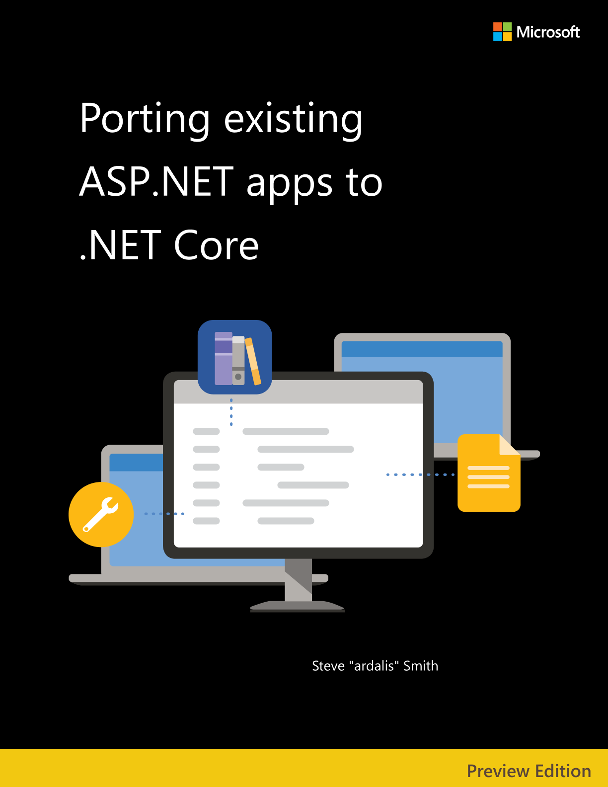

# Porting Existing ASP.NET Apps to .NET Core

PUBLISHED BY

Microsoft Developer Division, .NET, and Visual Studio product teams

A division of Microsoft Corporation

One Microsoft Way

Redmond, Washington 98052-6399

Copyright &copy; 2021 by Microsoft Corporation

All rights reserved. No part of this book's contents may be reproduced or transmitted in any form or by any means without the written permission of the publisher.

This book is provided "as-is" and expresses the author's views and opinions. The views, opinions, and information expressed in this book, including URL and other Internet website references, may change without notice.

Some examples depicted herein are provided for illustration only and are fictitious. No real association or connection is intended or should be inferred.

Microsoft and the trademarks listed at <https://www.microsoft.com> on the "Trademarks" webpage are trademarks of the Microsoft group of companies.

Mac and macOS are trademarks of Apple Inc.

The Docker whale logo is a registered trademark of Docker, Inc. Used by permission.

All other marks and logos are property of their respective owners.

Authors:

> **Steve "ardalis" Smith**, Software Architect and Trainer - [Ardalis.com](https://ardalis.com)

Participants and Reviewers:

> **Nish Anil**, Senior Program Manager, .NET team, Microsoft

> **Mike Rousos**, Principal Software Engineer, .NET team, Microsoft

> **Scott Addie**, Senior Content Developer, .NET team, Microsoft

> **David Pine**, Senior Content Developer, .NET team, Microsoft

## Version

This guide covers **.NET Core 3.1** and updates related to the same technology "wave" (that is, Azure and other third-party technologies) coinciding in time with the .NET Core 3.1 release. Updating from .NET Core 3.1 to .NET 6 (the current LTS version) is relatively straightforward and certainly will require substantially less effort than porting from .NET Framework to .NET Core. Migrating from .NET Framework 4.x to .NET 6 will be similar to migrating to .NET Core 3.1. For more information, see [choosing the right .NET Core version](choose-net-core-version.md).

## Who should use this guide

This guide's audience is developers, development leads, and architects who are interested in migrating their existing apps written for ASP.NET MVC and Web API (.NET Framework 4.x) to .NET Core. ASP.NET Web Forms developers will benefit from this guide but should also read the [Blazor for ASP.NET Web Forms Developers](../blazor-for-web-forms-developers/index.md) e-book.

A secondary audience is technical decision-makers planning when to move their apps to .NET Core.

The target audience for this book is .NET developers with large, existing apps that run on ASP.NET MVC and Web API. Apps built on ASP.NET Web Forms are outside of the focus of this book, though much of the information comparing .NET Framework and .NET Core may still be relevant.

## How you can use this guide

You can read this book straight through, as we expect many readers to do. This book will provide you first with considerations for whether you should port your app at all. That content is followed by architectural differences between .NET Framework and .NET Core. From there, you'll learn strategies for migrating a large solution over time and how to port a real app. Next, the book includes deployment scenarios that address the need to run different apps while appearing as a single app to users. The book concludes with two case studies describing real apps that have migrated from ASP.NET MVC to ASP.NET Core.

Whether or not you choose to start from the first chapter, you can reference any of these chapters to learn about specific concepts:

- [Architectural differences](architectural-differences.md)
- [Migrate large solutions](migrate-large-solutions.md)
- [Sample migration](example-migration-eshop.md)
- [Deployment scenarios](deployment-scenarios.md)

This guide is available both in [PDF form](https://aka.ms/aspnet-porting-ebook) and online. Feel free to forward this document or links to its online version to your team to ensure a common understanding of these concepts.

## Send your feedback

This book and related samples are constantly evolving, so your feedback is welcomed! If you have comments about how this book can be improved, use the feedback section at the bottom of any page built on [GitHub issues](https://github.com/dotnet/docs/issues).

>[!div class="step-by-step"]
>[Next](introduction.md)
