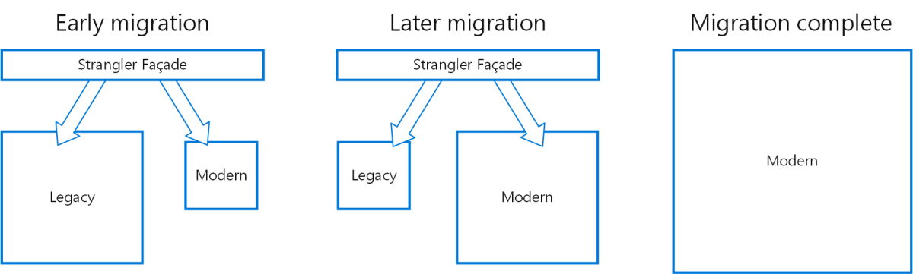

# Strategies for migrating while running in production

Many teams have .NET Framework apps they plan to migrate to .NET Core/.NET 5+, but the app is so large that the migration requires a significant amount of time to complete. The original app needs to live on while the migration is done piece by piece. There needs to be a way for the old and new versions of the app to work together side-by-side, or for the old version to be migrated in-place, at least some of the way, without breaking it. Teams can employ many different strategies to support these goals.

## Refactor the .NET Framework solution

A good place to start if you plan to port a .NET Framework app to .NET Core is to refactor it to work better with .NET Core. This means updating individual class libraries to target .NET Standard and moving as much logic out of your ASP.NET MVC projects and into these class libraries. Any code you have in .NET Standard libraries is immediately usable from both .NET Framework to .NET Core apps, which is why this step is so valuable as part of a migration.

When refactoring, make sure you're following good refactoring fundamentals. For example, create tests that verify what the system does before you start refactoring. Run these tests when you're done to confirm you didn't change the system's behavior. You may need to add characterization tests to the system if you don't already have a good suite of automated tests you can rely on.

## Extract front-end assets to a CDN

If your .NET Framework apps include a lot of static assets, like scripts, CSS files, or images, you may be able to migrate these to a separate CDN. Then, update the existing app to reference the CDN links for these assets. When you port the app to .NET Core, these static files won't be part of the migration, and you'll just continue referencing them from the CDN in the ASP.NET Core app.

## Extract and migrate individual microservices

Large .NET Framework apps may already be comprised of separate front-end systems that can be migrated individually. Or they may be candidates for migration to a microservices architecture, with some pieces of existing ASP.NET MVC apps being pulled out into new ASP.NET Core microservice implementations. You can learn more about microservices in the associated ebook, [.NET Microservices: Architecture for Containerized .NET Applications](https://aka.ms/microservicesebook).

For example, the existing app might have a set of features it uses related to user sign-in and registration. These could be migrated to a separate microservice, which could be built and deployed using ASP.NET Core and then integrated into the legacy .NET Framework app. Next, the app might have a few pages dedicated to tracking the individual user's shopping cart. These pages could also be pulled out into their own separate microservice and again integrated into the existing app. In this way, the original .NET Framework app continues running in production, but with more and more of its features coming from modernized .NET Core microservices.

## Deploy multiple versions of the app side-by-side in IIS

Using a combination of host headers and redirects, an existing ASP.NET MVC app can be configured to run side by side with an ASP.NET Core app on the same IIS server. As pieces of functionality, such as individual controllers, are ported to ASP.NET Core, their routes and URLs are mapped within IIS to target the ASP.NET Core web site or sub-application (IIS virtual directories aren't supported with ASP.NET Core apps). An ASP.NET Core app can be hosted as an IIS sub-application (sub-app). The sub-app's path becomes part of the root app's URL.

## Apply the Strangler pattern

Large ASP.NET MVC apps can be gradually replaced with a new ASP.NET Core app by incrementally migrating pieces of functionality. One approach to this is called the [strangler pattern](/azure/architecture/patterns/strangler), named for strangler vines that strangle and eventually tear down trees. This approach relies on first implementing a facade layer over top of the existing solution. This facade should be built using the new approach to the problem, or an off-the-shelf solution such as an API gateway.

Once the facade is in place, you can route part of it to a new ASP.NET Core app. As you port more of the original .NET Framework app to .NET Core, you continue to update the facade layer accordingly, sending more of the facade's total functionality to the new system. Figure 3-5 shows the strangler pattern progression over time.

**Figure 3-5.** The Strangler pattern over time.

Eventually, the entire facade layer corresponds to the new, modern implementation. At this point, both the legacy system and the face layer can be retired.

## Multi-targeting approaches

Multi-targeting is recommended for large apps that will be migrated over time and for teams applying the Strangler pattern approach. This approach can address `BindingRedirect` and package restoration challenges that surface from mixing [PackageReference](/nuget/consume-packages/package-references-in-project-files) and [packages.config](/nuget/reference/packages-config) restore styles. There are two options available for code that must run in both .NET Framework and .NET Core environments.

* Preprocessor directives ([#if in C#](../../csharp/language-reference/preprocessor-directives.md#conditional-compilation) or [#If in Visual Basic](/dotnet/visual-basic/reference/language-specification/preprocessing-directives#conditional-compilation)) allow you to implement different functionality or use different dependencies when run in .NET Framework versus .NET Core.

* Project files can use conditional [globbing patterns](../../core/project-sdk/overview.md#default-includes-and-excludes), such as `*.core.cs`, to include different sets of files based on which framework is being targeted.

Typically you only follow these recommendations for class libraries. These techniques allow a single common codebase to be maintained while new functionality is added and features of the app are incrementally ported to use .NET Core.

## Summary

Frequently, large ASP.NET MVC and Web API apps won't be ported to ASP.NET Core all at once, but will migrate incrementally over time. This section offers several strategies for performing this incremental migration. Choose the one(s) that will work best for your organization and app.

## References

- [.NET Microservices: Architecture for Containerized .NET Applications](https://aka.ms/microservicesebook)
- [eShopOnContainers Reference Microservices Application](https://github.com/dotnet-architecture/eShopOnContainers)
- [Host ASP.NET Core on Windows with IIS](/aspnet/core/host-and-deploy/iis/)
- [Strangler pattern](/azure/architecture/patterns/strangler)

>[!div class="step-by-step"]
>[Previous](understand-update-dependencies.md)
>[Next](example-migration-eshop.md)
