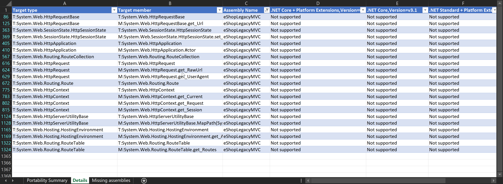

# Understand and update dependencies

After identifying the sequence in which the app's individual projects must be migrated, the next step is to understand each project's dependencies and update them if necessary. For platform dependencies, the best way to start is to run the [.NET Portability Analyzer](../../standard/analyzers/portability-analyzer.md) on the assembly in question, and then look at the detailed results that are generated. You configure the tool to specify one or more target platforms, such as .NET Core 3.1 or .NET Standard 2.0. Results are provided with details for each platform targeted. Figure 3-4 shows an example of the tool's output.



**Figure 3-4.** .NET Portability Analyzer report details.

## Update class library dependencies

Large apps typically involve multiple projects, and most projects other than the ASP.NET MVC web project are likely to be class libraries. Class libraries tend to be the easiest to port between .NET platforms, especially compared to ASP.NET projects, which are among the most difficult (and typically need to be re-created).

Teams can consider the [try-convert tool](https://github.com/dotnet/try-convert) or the [.NET Upgrade Assistant tool](https://aka.ms/dotnet-upgrade-assistant) for migrating class libraries to .NET Core. These tools analyze a .NET Framework project file and attempt to migrate it to the .NET Core project file format, making any modifications it can safely perform in the process. The tools may require some manual assistance to work with ASP.NET projects, but can usually help speed up the process of migrating class libraries.

The try-convert and Upgrade Assistant tools are deployed as .NET Core command line tools. They only run on Windows, since they're designed to work with .NET Framework apps. You can install try-convert by running the following command from a command prompt:

```dotnetcli
dotnet tool install -g try-convert
```

Once you've successfully installed the tool, you can run `try-convert` in the folder where the class library's project file is located.

Install the .NET Upgrade Assistant with the following command (after installing try-convert):

```dotnetcli
dotnet tool install -g upgrade-assistant
```

Run the tool with the command `upgrade-assistant upgrade <project>` in the folder where the project file is located.

## Update NuGet package dependencies

Analyze your use of third-party NuGet packages and determine if any of them don't yet support .NET Standard (or do support it but only with a new version). It can be helpful to [update NuGet packages to use `<PackageReference>` syntax using Visual Studio's converter tool](/nuget/consume-packages/migrate-packages-config-to-package-reference), so that top-level dependencies are visible. Next, check whether the current or later versions of these packages support .NET Core or .NET Standard. This information can be found on [nuget.org] or within Visual Studio for each package.

If support exists using the version of the package the app currently uses, great! If not, see if a more recent version of the package has the support and research what would be involved in upgrading. There may be breaking changes in the package, especially if the major version of the package changes between your currently used version and the one to which you're upgrading.

In some cases, no version of a given package works with .NET Core. In that case, teams have a couple options. They can continue depending on the .NET Framework version, but this has limitations. The app may only run on Windows, and the team may want to run Portability Analyzer on the package's binaries to see if there are any issues likely to be encountered. Certainly the team will want to test thoroughly, since if .NET Framework packages are used that reference APIs not available in .NET Core, a runtime exception will occur. The other option is to find a different package or, if the required package is open source, upgrade it to .NET Standard or .NET Core themselves.

## Migrate ASP.NET MVC projects

The `System.Web` namespace and types don't exist in .NET Core. When you're analyzing dependencies and using tools like `try-convert`, you'll find they don't offer many suggestions for automatic migration of ASP.NET MVC projects and any code in them that references `System.Web`. For these projects, you'll need to start with a new ASP.NET Core web project and manually migrate files to this project.

In general, it's a good practice to minimize how much of an app's business logic lives in its user interface layer. It's also best to keep controllers and views small. Apps that have followed this guidance will be easier to port than those that have a significant amount of their logic in the ASP.NET web project. If you have an app you're considering porting, but haven't begun the process yet, keep this in mind as you maintain it. Any effort you put toward minimizing how much code is in the ASP.NET MVC or Web API project will likely result in less work when the time comes to port the app.

The next chapter digs into details of how to migrate from ASP.NET MVC and Web API projects to ASP.NET Core projects. The previous chapter called out the biggest differences between the apps. Once the basic project structure is in place, migrating individual controllers and views is usually straightforward, especially if they're mainly focused on web responsibilities.

## References

- [.NET Upgrade Assistant tool](https://aka.ms/dotnet-upgrade-assistant)
- [try-convert tool](https://github.com/dotnet/try-convert)
- [apiport tool](https://github.com/microsoft/dotnet-apiport)

>[!div class="step-by-step"]
>[Previous](identify-migration-sequence.md)
>[Next](strategies-migrating-in-production.md)
