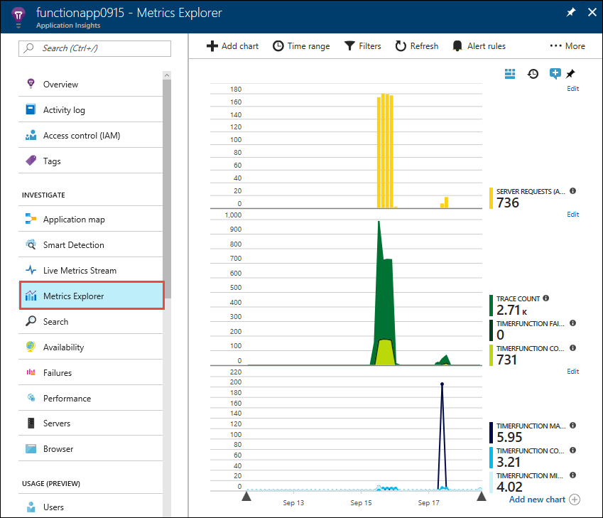
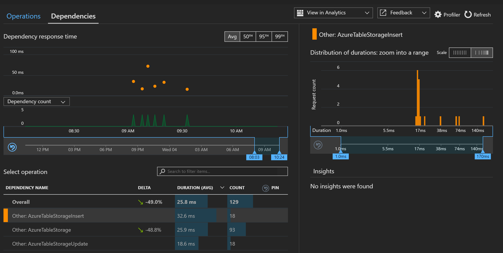

# Telemetry with Application Insights

[Application Insights](https://docs.microsoft.com/azure/application-insights) is a serverless diagnostics platform that enables developers to detect, triage, and diagnose issues in web apps, mobile apps, desktop apps, and microservices. You can turn on Application Insights for function apps simply by flipping a switch in the portal. Application Insights provides all of these capabilities without you having to configure a server or set up your own database. All of Application Insights' capabilities are provided as a service that automatically integrates with your apps.


Adding Application Insights to existing apps is as easy as adding an instrumentation key to your application's settings. With Application Insights you can:

- Create custom charts and alerts based on metrics such as number of function invocations, the time it takes to run a function, and exceptions
- Analyze failures and server exceptions
- Drill into performance by operation and measure the time it takes to call third-party dependencies
- Monitor CPU usage, memory, and rates across all servers that host your function apps
- View a live stream of metrics including request count and latency for your function apps
- Use [Analytics](https://docs.microsoft.com/azure/application-insights/app-insights-analytics) to search, query, and create custom charts over your function data



In addition to built-in telemetry, it's also possible to generate custom telemetry. The following code snippet creates a custom telemetry client using the instrumentation key set for the function app:

```csharp
public static TelemetryClient telemetry = new TelemetryClient()
{
    InstrumentationKey = Environment.GetEnvironmentVariable("APPINSIGHTS_INSTRUMENTATIONKEY")
};
```

The following code measures how long it takes to insert a new row into an [Azure Table Storage](https://docs.microsoft.com/azure/cosmos-db/table-storage-overview) instance:

```csharp
var operation = TableOperation.Insert(entry);
var startTime = DateTime.UtcNow;
var timer = System.Diagnostics.Stopwatch.StartNew();
await table.ExecuteAsync(operation);
telemetry.TrackDependency("AzureTableStorageInsert", "Insert", startTime, timer.Elapsed, true);
```

The resulting performance graph is shown:



The custom telemetry reveals the average time to insert a new row is 32.6 milliseconds.

Application Insights provides a powerful, convenient way to log detailed telemetry about your serverless applications. You have full control over the level of tracing and logging that is provided. You can track custom statistics such as events, dependencies, and page view. Finally, the powerful analytics enable you to write queries that ask important questions and generate charts and advanced insights.

For more information, see [Monitor Azure Functions](https://docs.microsoft.com/azure/azure-functions/functions-monitoring).

>[!div class="step-by-step"]
>[Previous](azure-functions.md)
>[Next](logic-apps.md)
