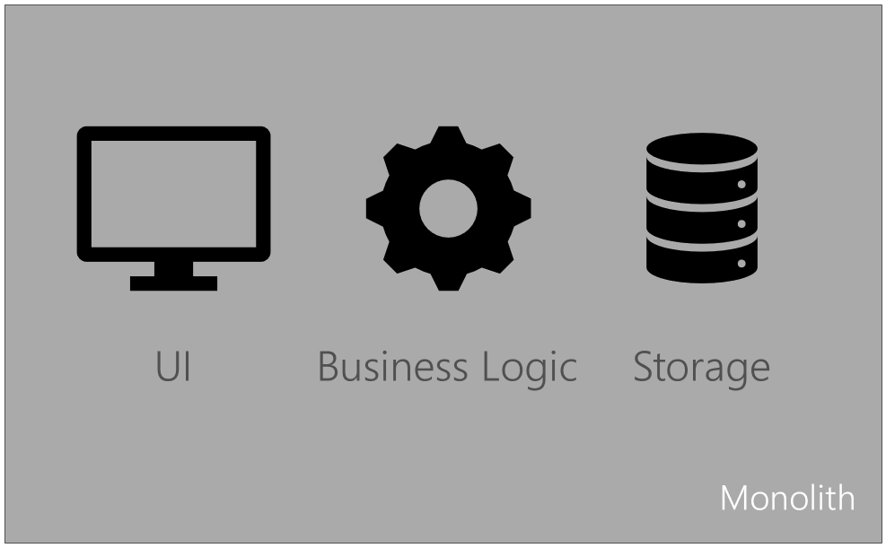
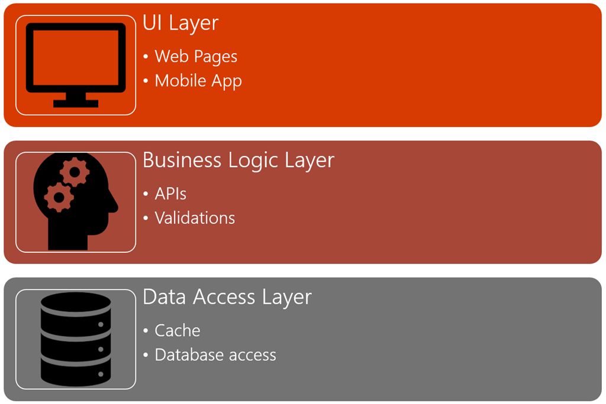
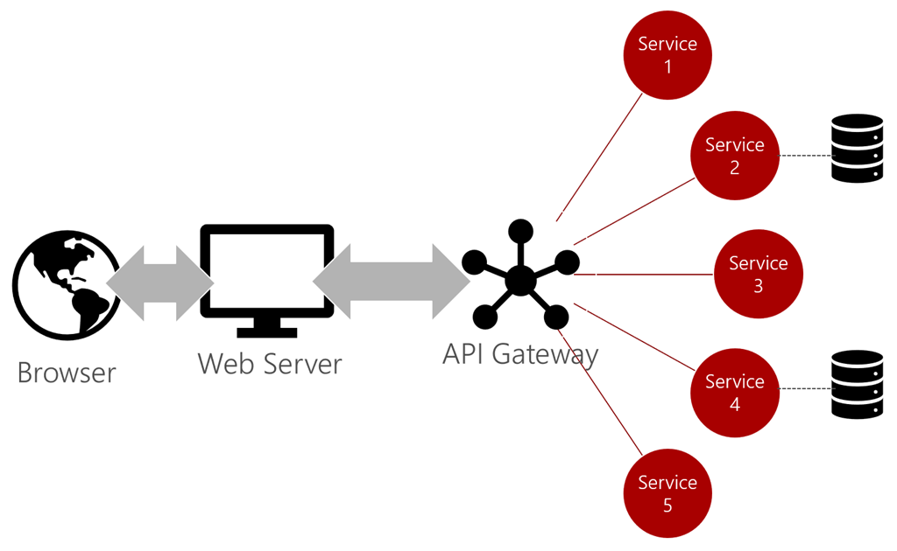

# Architecture approaches

Understanding existing approaches to architecting enterprise apps helps clarify the role played by serverless. There are many approaches and patterns that evolved over decades of software development, and all have their own pros and cons. In many cases, the ultimate solution may not involve deciding on a single approach but may integrate several approaches. Migration scenarios often involve shifting from one architecture approach to another through a hybrid approach.

This chapter provides an overview of both logical and physical architecture patterns for enterprise applications.

## Architecture patterns

Modern business applications follow a variety of architecture patterns. This section represents a survey of common patterns. The patterns listed here aren't necessarily all best practices, but illustrate different approaches.

For more information, see [Azure application architecture guide](https://docs.microsoft.com/azure/architecture/guide/).

## Monoliths

Many business applications follow a monolith pattern. Legacy applications are often implemented as monoliths. In the monolith pattern, all application concerns are contained in a single deployment. Everything from user interface to database calls is included in the same codebase.

There are several advantages to the monolith approach. It's often easy to pull down a single code base and start working. Ramp up time may be less, and creating test environments is as simple as providing a new copy. The monolith may be designed to include multiple components and applications.

Unfortunately, the monolith pattern tends to break down at scale. Major disadvantages of the monolith approach include:

- Difficult to work in parallel in the same code base.
- Any change, no matter how trivial, requires deploying a new version of the entire application.
- Refactoring potentially impacts the entire application.
- Often the only solution to scale is to create multiple, resource-intensive copies of the monolith.
- As systems expand or other systems are acquired, integration can be difficult.
- It may be difficult to test due to the need to configure the entire monolith.
- Code reuse is challenging and often other apps end up having their own copies of code.

Many businesses look to the cloud as an opportunity to migrate monolith applications and at the same time refactor them to more usable patterns. It's common to break out the individual applications and components to allow them to be maintained, deployed, and scaled separately.

## N-Layer applications

N-layer application partition application logic into specific layers. The most common layers include:

- User interface
- Business logic
- Data access

Other layers may include middleware, batch processing, and API. It's important to note the layers are logical. Although they're developed in isolation, they may all be deployed to the same target platform.

There are several advantages to the N-Layer approach, including:

- Refactoring is isolated to a layer.
- Teams can independently build, test, deploy, and maintain separate layers.
- Layers can be swapped out, for example the data layer may access multiple databases without requiring changes to the UI layer.

Serverless may be used to implement one or more layers.

## Microservices

**[Microservices](https://docs.microsoft.com/azure/architecture/guide/architecture-styles/microservices)** architectures contain common characteristics that include:

- Applications are composed of several small services.
- Each service runs in its own process.
- Services are aligned around business domains.
- Services communicate over lightweight APIs, typically using HTTP as the transport.
- Services can be deployed and upgraded independently.
- Services aren't dependent on a single data store.
- The system is designed with failure in mind, and the app may still run even when certain services fail.

Microservices don't have to be mutually exclusive to other architecture approaches. For example, an N-Tier architecture may use microservices for the middle tier. It's also possible to implement microservices in a variety of ways, from virtual directories on IIS hosts to containers. The characteristics of microservices make them especially ideal for serverless implementations.

The pros of microservices architectures include:

- Refactoring is often isolated to a single service.
- Services can be upgraded independently of each other.
- Resiliency and elasticity can be tuned to the demands of individual services.
- Development can happen in parallel across disparate teams and platforms.
- It's easier to write comprehensive tests for isolated services.

Microservices come with their own challenges, including:

- Determining what services are available and how to call them.
- Managing the lifecycle of services.
- Understanding how services fit together in the overall application.
- Full system testing of calls made across disparate services.

Ultimately there are solutions to address all of these challenges, including tapping into the benefits of serverless that are discussed later.

>[!div class="step-by-step"]
>[Previous](index.md)
>[Next](architecture-deployment-approaches.md)
