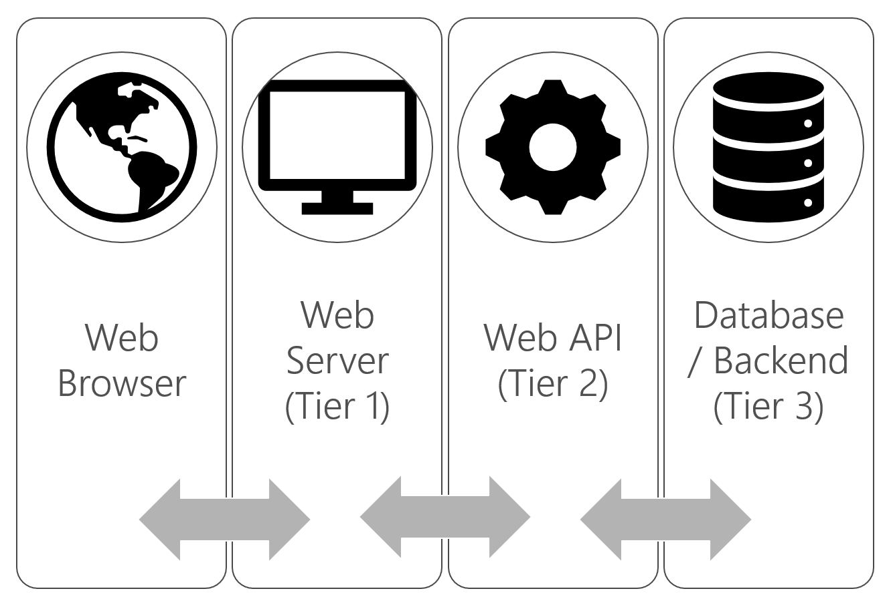
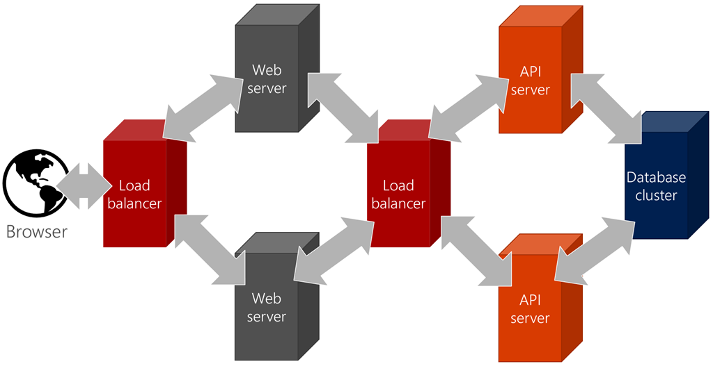
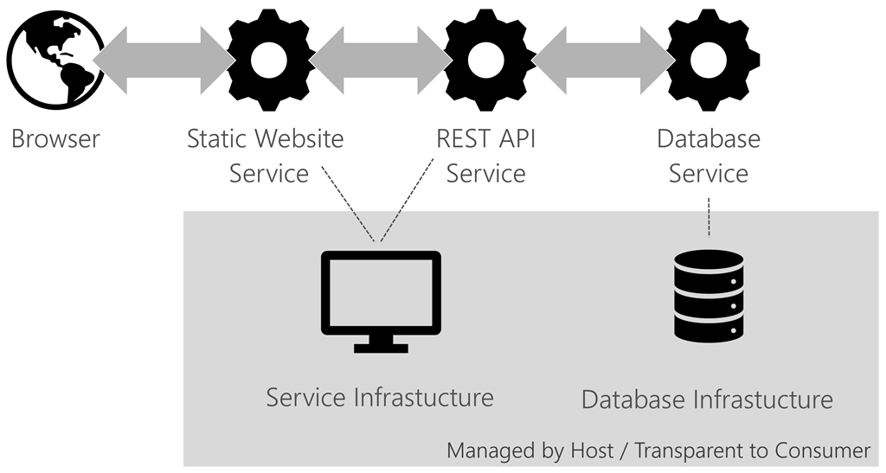
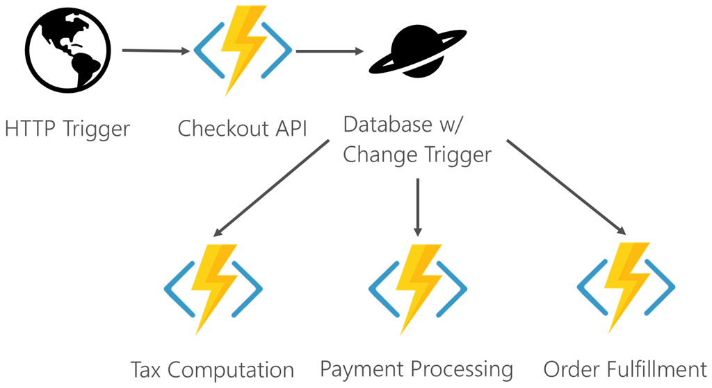

# Architecture deployment approaches

Regardless of the architecture approach used to design a business application, the implementation, or deployment of those applications may vary. Businesses host applications on everything from physical hardware to serverless functions.

## N-Tier applications

The [N-Tier architecture pattern](https://docs.microsoft.com/azure/architecture/guide/architecture-styles/n-tier) is a mature architecture and simply refers to applications that separate various logical layers into separate physical tiers. N-Tier architecture is a physical implementation of N-Layer architecture. The most common implementation of this architecture includes:

* A presentation tier, for example a web app.
* An API or data access tier, such as a REST API.
* A data tier, such as a SQL database.

N-tier solutions have the following characteristics:

* Projects are typically aligned with tiers.
* Testing may be approached differently by tier.
* Tiers provide layers of abstraction, for example the presentation tier is typically ignorant of the implementation details of the data tier.
* Typically, layers only interact with adjacent layers.
* Releases are often managed at the project, and therefore tier, level. A simple API change may require a new release of an entire middle tier.

This approach provides several benefits, including:

* Isolation of the database (often the front end doesn't have direct access to the database back end).
* Reuse of the API (for example, mobile, desktop, and web app clients can all reuse the same APIs).
* Ability to scale out tiers independent of each other.
* Refactoring isolation: one tier may be refactored without impacting other tiers.

## On-premises and Infrastructure as a Service (IaaS)

The traditional approach to hosting applications requires buying hardware and managing all of the software installations, including the operating system. Originally this involved expensive data centers and physical hardware. The challenges that come with operating physical hardware are many, including:

* The need to buy excess for "just in case" or peak demand scenarios.
* Securing physical access to the hardware.
* Responsibility for hardware failure (such as disk failure).
* Cooling.
* Configuring routers and load balancers.
* Power redundancy.
* Securing software access.

Virtualization of hardware, via "virtual machines" enables Infrastructure as a Service (IaaS). Host machines are effectively partitioned to provide resources to instances with allocations for their own memory, CPU, and storage. The team provisions the necessary VMs and configures the associated networks and access to storage.

For more information, see [virtual machine N-tier reference architecture](https://docs.microsoft.com/azure/architecture/reference-architectures/virtual-machines-windows/n-tier).

Although virtualization and Infrastructure as a Service (IaaS) address many concerns, it still leaves much responsibility in the hands of the infrastructure team. The team maintains operating system versions, applies security patches, and installs third-party dependencies on the target machines. Apps often behave differently on production machines compared to the test environment. Issues arise due to different dependency versions and/or OS SKU levels. Although many organizations deploy N-Tier applications to these targets, many companies benefit from deploying to a more cloud native model such as [Platform as a Service](#platform-as-a-service-paas). Architectures with microservices are more challenging because of the requirements to scale out for elasticity and resiliency.

For more information, see [virtual machines](https://docs.microsoft.com/azure/virtual-machines/).

## Platform as a Service (PaaS)

Platform as a Service (PaaS) offers configured solutions that developers can plug into directly. PaaS is another term for managed hosting. It eliminates the need to manage the base operating system, security patches and in many cases any third-party dependencies. Examples of platforms include web applications, databases, and mobile back ends.

PaaS addresses the challenges common to IaaS. PaaS allows the developer to focus on the code or database schema rather than how it gets deployed. Benefits of PaaS include:

* Pay for use models that eliminate the overhead of investing in idle machines.
* Direct deployment and improved DevOps, continuous integration (CI), and continuous delivery (CD) pipelines.
* Automatic upgrades, updates, and security patches.
* Push-button scale out and scale up (elastic scale).

The main disadvantage of PaaS traditionally has been vendor lock-in. For example, some PaaS providers only support ASP.NET, Node.js, or other specific languages and platforms. Products like Azure App Service have evolved to address multiple platforms and support a variety of languages and frameworks for hosting web apps.

## Software as a Service (SaaS)

Software as a Service or SaaS is centrally hosted and available without local installation or provisioning. SaaS often is hosted on top of PaaS as a platform for deploying software. SaaS provides services to run and connect with existing software. SaaS is often industry and vertical specific. SaaS is often licensed and typically provides a client/server model. Most modern SaaS offerings use web-based apps for the client. Companies typically consider SaaS as a business solution to license offerings. It isn't often implemented as architecture consideration for scalability and maintainability of an application. Indeed, most SaaS solutions are built on IaaS, PaaS, and/or serverless back ends.

Learn more about SaaS through a [sample application](https://docs.microsoft.com/azure/sql-database/saas-tenancy-welcome-wingtip-tickets-app).

## Containers and Functions as a Service (FaaS)

Containers are an interesting solution that enables PaaS-like benefits without the IaaS overhead. A container is essentially a runtime that contains the bare essentials needed to run a unique application. The kernel or core part of the host operating system and services such as storage are shared across a host. The shared kernel enables containers to be lightweight (some are mere megabytes in size, compared to the gigabyte size of typical virtual machines). With hosts already running, containers can be started quickly, facilitating high availability. The ability to spin up containers quickly also provides extra layers of resiliency. Docker is one of the more popular implementations of containers.

Benefits of containers include:

* Lightweight and portable
* Self-contained so no need to install dependencies
* Provide a consistent environment regardless of the host (runs exactly same on a laptop as on a cloud server)
* Can be provisioned quickly for scale-out
* Can be restarted quickly to recover from failure

A container runs on a container host (that in turn may run on a bare metal machine or a virtual machine). Multiple containers or instances of the same containers may run on a single host. For true failover and resiliency, containers must be scaled across hosts.

For more information about Docker containers, see [What is Docker](../microservices/container-docker-introduction/docker-defined.md).

Managing containers across hosts typically requires an orchestration tool such as Kubernetes. Configuring and managing orchestration solutions may add additional overhead and complexity to projects. Fortunately, many cloud providers provide orchestration services through PaaS solutions to simplify the management of containers.

The following image illustrates an example Kubernetes installation. Nodes in the installation address scale out and failover. They run Docker container instances that are managed by the master server. The *kubelet* is the client that relays commands from Kubernetes to Docker.

For more information about orchestration, see [Kubernetes on Azure](https://docs.microsoft.com/azure/aks/intro-kubernetes).

Functions as a Service (FaaS) is a specialized container service that is similar to serverless. A specific implementation of FaaS, called [OpenFaaS](https://github.com/openfaas/faas), sits on top of containers to provide serverless capabilities. OpenFaaS provides templates that package all of the container dependencies necessary to run a piece of code. Using templates simplifies the process of deploying code as a functional unit. OpenFaaS targets architectures that already include containers and orchestrators because it can use the existing infrastructure. Although it provides serverless functionality, it specifically requires you to use Docker and an orchestrator.

## Serverless

A serverless architecture provides a clear separation between the code and its hosting environment. You implement code in a *function* that is invoked by a *trigger*. After that function exits, all its needed resources may be freed. The trigger might be manual, a timed process, an HTTP request, or a file upload. The result of the trigger is the execution of code. Although serverless platforms vary, most provide access to pre-defined APIs and bindings to streamline tasks such as writing to a database or queueing results.

Serverless is an architecture that relies heavily on abstracting away the host environment to focus on code. It can be thought of as *less server*.

Container solutions provide developers existing build scripts to publish code to serverless-ready images. Other implementations use existing PaaS solutions to provide a scalable architecture.

The abstraction means the DevOps team doesn't have to provision or manage servers, nor specific containers. The serverless platform hosts code, either as script or packaged executables built with a related SDK, and allocates the necessary resources for the code to scale.

The following illustration diagrams four serverless components. An HTTP request causes the Checkout API code to run. The Checkout API inserts code into a database, and the insert triggers several other functions to run to perform tasks like computing tasks and fulfilling the order.

The advantages of serverless include:

* **High density.** Many instances of the same serverless code can run on the same host compared to containers or virtual machines. The instances scale across multiple hosts scale out and resiliency.
* **Micro-billing**. Most serverless providers bill based on serverless executions, enabling massive cost savings in certain scenarios.
* **Instant scale**. Serverless can scale to match workloads automatically and quickly.
* **Faster time to market** Developers focus on code and deploy directly to the serverless platform. Components can be released independently of each other.

Serverless is most often discussed in the context of compute, but can also apply to data. For example, [Azure SQL](https://docs.microsoft.com/azure/sql-database) and [Cosmos DB](https://docs.microsoft.com/azure/cosmos-db) both provide cloud databases that don't require you to configure host machines or clusters. This book focuses on serverless compute.

## Summary

There's a broad spectrum of available choices for architecture, including a hybrid approach. Serverless simplifies the approach, management, and cost of application features at the expense of control and portability. However, many serverless platforms do expose configuration to help fine-tune the solution. Good programming practices can also lead to more portable code and less serverless platform lock-in. The following table illustrates the architecture approaches side by side. Choose serverless based on your scale needs, whether or not you want to manage the runtime, and how well you can break your workloads into small components. You'll learn about potential challenges with serverless and other decision points in the next chapter.

|         |IaaS     |PaaS     |Container|Serverless|
|---------|---------|---------|---------|----------|
|**Scale**|VM       |Instance |App      |Function  |
|**Abstracts**|Hardware|Platform|OS Host|Runtime   |
|**Unit** |VM       |Project  |Image    |Code      |
|**Lifetime**|Months|Days to Months|Minutes to Days|Milliseconds to Minutes|
|**Responsibility**|Applications, dependencies, runtime, and operating system|Applications and dependencies|Applications, dependencies, and runtime|Function

* **Scale** refers to the unit that is used to scale the application
* **Abstracts** refers to the layer that is abstracted by the implementation
* **Unit** refers to the scope of what is deployed
* **Lifetime** refers to the typical runtime of a specific instance
* **Responsibility** refers to the overhead to build, deploy, and maintain the application

The next chapter will focus on serverless architecture, use cases, and design patterns.

## Recommended resources

* [Azure application architecture guide](https://docs.microsoft.com/azure/architecture/guide/)
* [Azure Cosmos DB](https://docs.microsoft.com/azure/cosmos-db)
* [Azure SQL](https://docs.microsoft.com/azure/sql-database)
* [N-Tier architecture pattern](https://docs.microsoft.com/azure/architecture/guide/architecture-styles/n-tier)
* [Kubernetes on Azure](https://docs.microsoft.com/azure/aks/intro-kubernetes)
* [Microservices](https://docs.microsoft.com/azure/architecture/guide/architecture-styles/microservices)
* [Virtual machine N-tier reference architecture](https://docs.microsoft.com/azure/architecture/reference-architectures/virtual-machines-windows/n-tier)
* [Virtual machines](https://docs.microsoft.com/azure/virtual-machines/)
* [What is Docker?](../microservices/container-docker-introduction/docker-defined.md)
* [Wingtip Tickets SaaS application](https://docs.microsoft.com/azure/sql-database/saas-tenancy-welcome-wingtip-tickets-app)

>[!div class="step-by-step"]
>[Previous](architecture-approaches.md)
>[Next](serverless-architecture.md)
